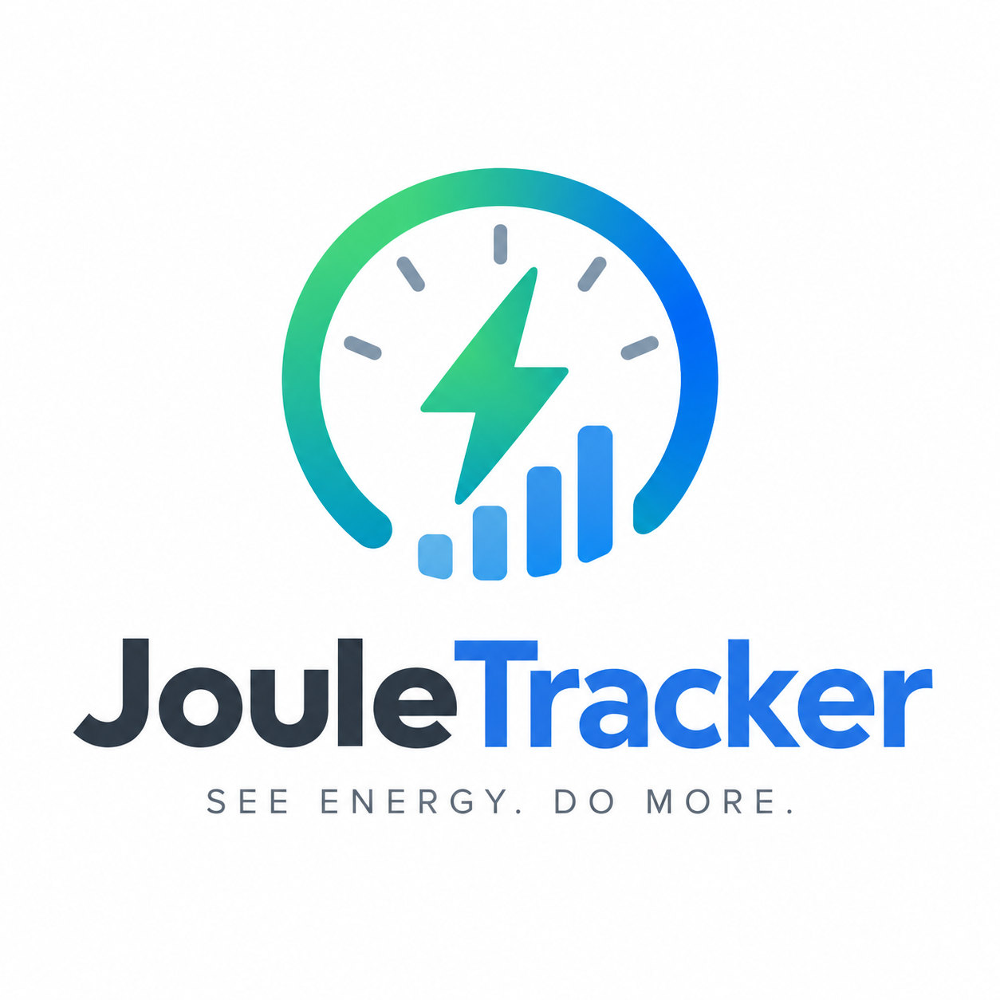
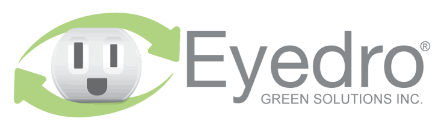
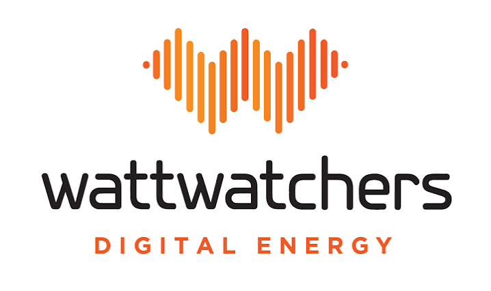
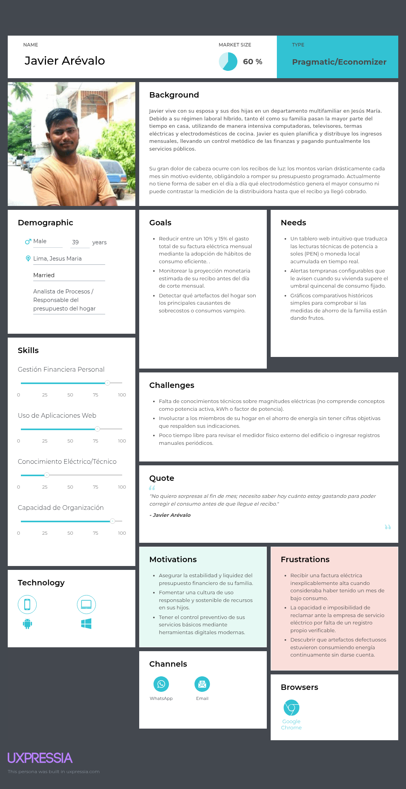
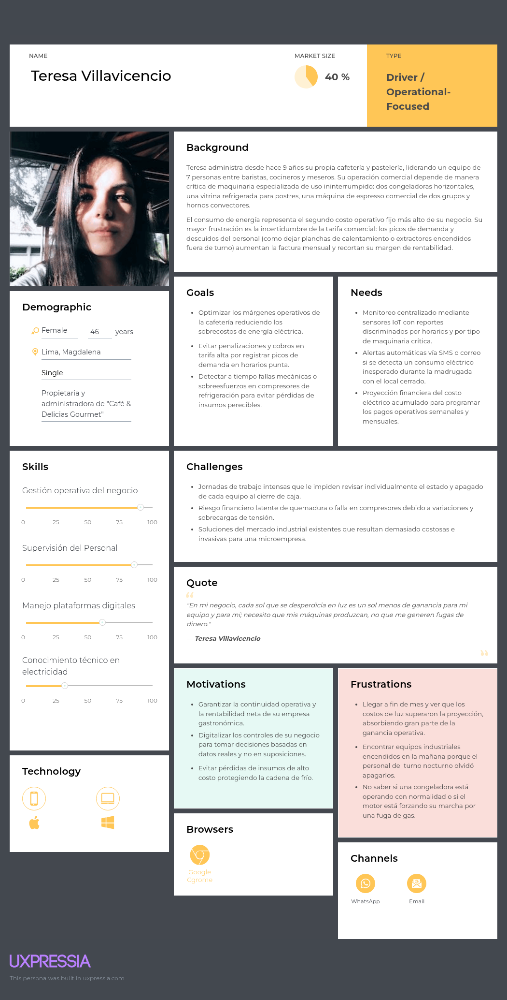
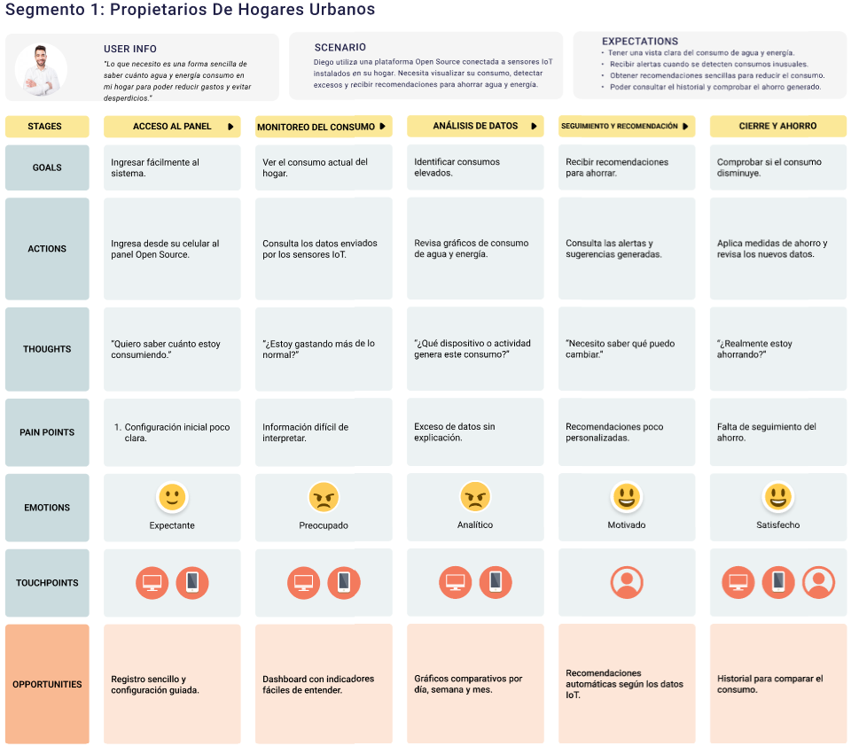
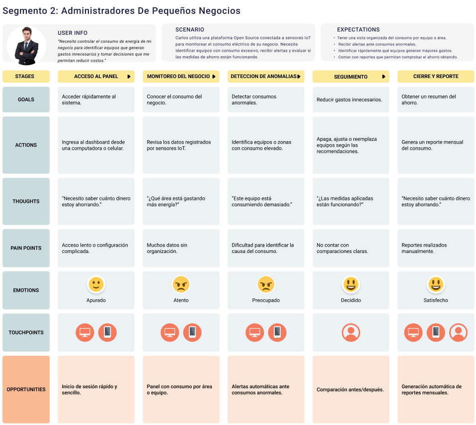
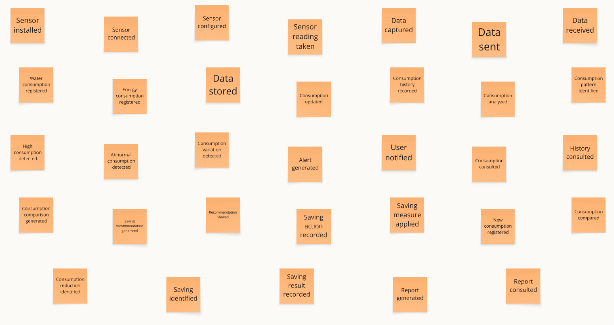
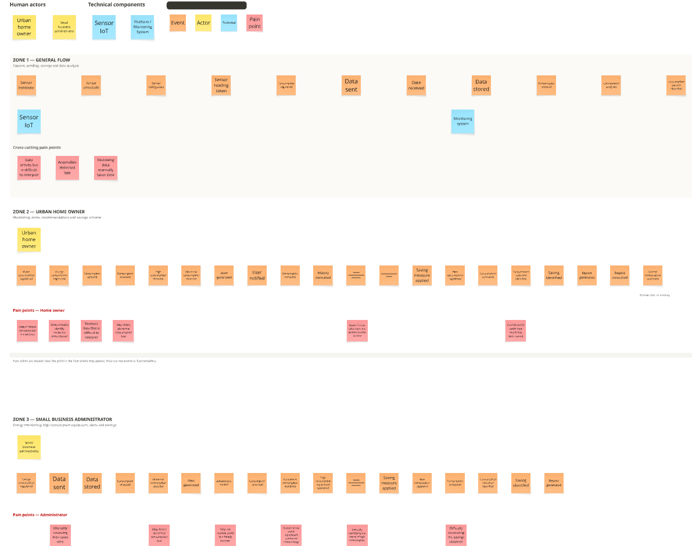
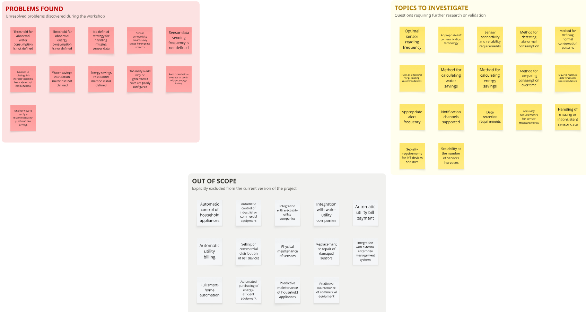

# Capítulo II: Requirements Elicitation & Analysis.

### 2.1.1. Análisis competitivo.

<table border="1" cellspacing="0" cellpadding="7" style="border-collapse: collapse; width: 100%; border: 2px solid black;">
<tr>
<th colspan="6" align="left">Competitive Analysis Landscape</th>
</tr>

<tr>
<td colspan="2" rowspan="2"><b>¿Por qué llevar a cabo este análisis?</b></td>
<td colspan="4"><b>Identificar las características, fortalezas y debilidades de las principales empresas que ofrecen soluciones de monitoreo del consumo eléctrico mediante dispositivos inteligentes y plataformas digitales, con el propósito de reconocer oportunidades de diferenciación y establecer una propuesta de valor competitiva para JouleTracker.</b></td>
</tr>

<tr>
<td colspan="4">&nbsp;  </td>
</tr>

<tr>
<td colspan="2"><b>Competidores</b></td>

<th align="center">
 
<b>JouleTracker</b>
</th>

<th align="center">
 
<b>Emporia Energy</b>
</th>

<th align="center">
 
<b>Eyedro Green Solutions</b>
</th>

<th align="center">
 
<b>Wattwatchers</b>
</th>
</tr>

<tr>
<td rowspan="2" align="center"><b>Perfil</b></td>
<td><b>Overview</b></td>

<td>
JouleTracker es una startup orientada al monitoreo y control del consumo eléctrico en hogares y pequeños negocios. Mediante sensores IoT recopila información del consumo energético y la presenta en una plataforma digital con datos en tiempo real, históricos, gráficos y alertas configurables.
</td>

<td>
Emporia Energy es una empresa especializada en soluciones inteligentes para la gestión energética. Su sistema Vue Energy Monitor permite medir el consumo eléctrico total y el consumo correspondiente a diferentes circuitos mediante sensores instalados en el panel eléctrico.
</td>

<td>
Eyedro Green Solutions desarrolla soluciones de hardware y software para el monitoreo del consumo eléctrico. Sus dispositivos recopilan información energética y la envían a la plataforma MyEyedro, desde donde los usuarios pueden visualizar y analizar sus datos.
</td>

<td>
Wattwatchers es una empresa especializada en tecnología para el monitoreo y gestión de energía. Sus dispositivos permiten recopilar información de distintos circuitos eléctricos y visualizarla mediante plataformas digitales dirigidas a hogares y pequeños negocios.
</td>
</tr>

<tr>
<td><b>Ventaja competitiva ¿Qué valor ofrece a los clientes?</b></td>

<td>
Ofrece una plataforma sencilla y accesible que permite conocer el consumo eléctrico en tiempo real, revisar información histórica y recibir alertas cuando se superan determinados límites, facilitando el control de los gastos energéticos.
</td>

<td>
Permite supervisar el consumo general y diferentes circuitos eléctricos de forma independiente, facilitando la identificación de equipos o áreas que generan un mayor consumo.
</td>

<td>
Combina dispositivos de medición eléctrica con una plataforma cloud que permite consultar consumo, costos, históricos, gráficos y reportes desde distintos dispositivos.
</td>

<td>
Ofrece monitoreo energético detallado mediante dispositivos capaces de supervisar varios circuitos, complementados con herramientas digitales para visualizar y analizar la información obtenida.
</td>
</tr>

<tr>
<td align="center"><b>Perfil de Marketing</b></td>
<td><b>Mercado objetivo</b></td>

<td>
Hogares y pequeños negocios interesados en conocer, controlar y reducir su consumo eléctrico mediante una solución sencilla y accesible.
</td>

<td>
Hogares y pequeñas instalaciones comerciales que desean monitorear el consumo eléctrico general y por circuitos.
</td>

<td>
Hogares, pequeños negocios y organizaciones interesadas en conocer detalladamente su consumo energético y administrar mejor sus costos eléctricos.
</td>

<td>
Hogares y pequeños negocios que requieren monitoreo energético en tiempo real y análisis de diferentes circuitos eléctricos.
</td>
</tr>

<tr>
<td>&nbsp;</td>
<td><b>Estrategias de marketing</b></td>

<td>
Redes sociales, contenido educativo sobre ahorro energético, demostraciones de la plataforma, pruebas piloto y futuras alianzas con pequeños negocios, electricistas y proveedores tecnológicos.
</td>

<td>
Marketing digital, comercialización de dispositivos, contenido relacionado con eficiencia energética y promoción de productos inteligentes para la gestión del consumo.
</td>

<td>
Promoción de soluciones de monitoreo energético, contenido relacionado con eficiencia energética, demostraciones de MyEyedro y comercialización de diferentes equipos de medición.
</td>

<td>
Promoción de soluciones de gestión energética, alianzas empresariales y difusión de sus dispositivos, aplicaciones y herramientas tecnológicas.
</td>
</tr>

<tr>
<td rowspan="3" align="center"><b>Perfil del Producto</b></td>
<td><b>Productos &amp; Servicios</b></td>

<td>
Sensores IoT, monitoreo eléctrico en tiempo real, dashboard web, históricos, gráficos, estadísticas, configuración de límites y alertas ante consumos elevados.
</td>

<td>
Vue Energy Monitor, sensores para circuitos eléctricos, aplicación móvil y web, información en tiempo real, históricos y monitoreo individual de circuitos.
</td>

<td>
Medidores eléctricos, sensores de corriente, plataforma MyEyedro, visualización en tiempo real, históricos, análisis de costos y reportes energéticos.
</td>

<td>
Dispositivos de monitoreo energético, supervisión de múltiples circuitos, plataforma web, aplicación móvil, históricos y herramientas para el análisis del consumo.
</td>
</tr>

<tr>
<td><b>Precios &amp; Costos</b></td>

<td>
Se plantea utilizar sensores IoT de costo accesible. Los principales costos corresponden al hardware, desarrollo y mantenimiento de la plataforma, infraestructura cloud, almacenamiento y soporte.
</td>

<td>
Su modelo requiere la compra del dispositivo de monitoreo y de los sensores necesarios dependiendo de la cantidad de circuitos que el usuario quiera supervisar.
</td>

<td>
Su modelo se basa principalmente en la comercialización de medidores y sensores. El costo depende del dispositivo, cantidad de sensores y características de la instalación.
</td>

<td>
Los costos dependen del tipo de dispositivo utilizado, cantidad de circuitos monitoreados y servicios tecnológicos requeridos.
</td>
</tr>

<tr>
<td><b>Canales de distribución (Web y/o Móvil)</b></td>

<td>
Plataforma web responsive, dashboard digital y futura aplicación móvil.
</td>

<td>
Página web, aplicación móvil, plataforma digital y comercialización online de dispositivos.
</td>

<td>
Página web, plataforma cloud MyEyedro y acceso mediante computadoras, tablets y dispositivos móviles.
</td>

<td>
Página web, dashboard web, aplicación móvil y herramientas digitales de administración y monitoreo.
</td>
</tr>

<tr>
<td rowspan="5" align="center"><b>Análisis SWOT</b></td>
<td colspan="5"><b>Realice esto para su startup y sus competidores. Sus fortalezas deberían apoyar sus oportunidades y contribuir a lo que ustedes definen como su posible ventaja competitiva.</b></td>
</tr>

<tr>
<td><b>Fortalezas</b></td>

<td>
Plataforma sencilla, monitoreo en tiempo real, históricos, gráficos, alertas configurables, uso de sensores IoT y enfoque específico en hogares y pequeños negocios.
</td>

<td>
Experiencia en monitoreo energético, medición de diferentes circuitos, plataforma digital consolidada y variedad de dispositivos relacionados con gestión energética.
</td>

<td>
Experiencia en hardware y software de monitoreo, plataforma cloud propia, soluciones para hogares y negocios y herramientas de análisis del consumo.
</td>

<td>
Experiencia en tecnología energética, monitoreo de múltiples circuitos, plataformas digitales y soluciones dirigidas a hogares y pequeños negocios.
</td>
</tr>

<tr>
<td><b>Debilidades</b></td>

<td>
Marca nueva, recursos iniciales limitados, dependencia de sensores IoT y menor cantidad de funcionalidades durante las primeras versiones.
</td>

<td>
Requiere la instalación de hardware dentro del panel eléctrico y sensores adicionales para obtener información detallada de múltiples circuitos.
</td>

<td>
Requiere hardware especializado y puede presentar mayor complejidad para usuarios que únicamente necesitan conocer información básica de su consumo.
</td>

<td>
Su ecosistema tecnológico puede resultar más complejo para usuarios que solamente necesitan herramientas básicas de monitoreo energético.
</td>
</tr>

<tr>
<td><b>Oportunidades</b></td>

<td>
Crecimiento del interés por reducir gastos eléctricos, mayor disponibilidad de sensores IoT económicos, digitalización de hogares y pequeños negocios y mayor preocupación por la eficiencia energética.
</td>

<td>
Crecimiento de hogares inteligentes, sistemas solares y mayor interés de los usuarios por conocer detalladamente su consumo energético.
</td>

<td>
Mayor interés de hogares y negocios por reducir sus costos eléctricos y crecimiento de las soluciones digitales relacionadas con eficiencia energética.
</td>

<td>
Crecimiento de las tecnologías de energía inteligente y mayor necesidad de analizar y administrar información relacionada con el consumo eléctrico.
</td>
</tr>

<tr>
<td><b>Amenazas</b></td>

<td>
Presencia de competidores internacionales, aparición de dispositivos IoT más económicos, posibles fallas de hardware y rápida evolución tecnológica.
</td>

<td>
Aparición de nuevas soluciones de monitoreo energético de menor costo y dispositivos inteligentes con funcionalidades similares.
</td>

<td>
Incremento de competidores en el mercado de monitoreo energético y aparición de alternativas más económicas.
</td>

<td>
Nuevos competidores, evolución acelerada de las tecnologías IoT y aparición de sistemas de monitoreo integrados directamente en otros dispositivos eléctricos.
</td>
</tr>

<tr>
<td>&nbsp;</td>
<td>&nbsp;</td>
<td>&nbsp;</td>
<td>&nbsp;</td>
<td>&nbsp;</td>
<td>&nbsp;</td>
</tr>

</table>

### 2.1.2 Estrategias y tácticas frente a competidores

Se plantean estrategias y tácticas preliminares que permitan a **JouleTracker** afrontar las fortalezas de sus competidores, aprovechar sus debilidades y responder a las oportunidades y amenazas presentes en el mercado de monitoreo y gestión del consumo eléctrico.

| **Aspecto** | **JouleTracker** | **Emporia Energy** | **Eyedro Green Solutions** | **Wattwatchers** | **Acciones de JouleTracker** |
|---|---|---|---|---|---|
| **Fortalezas a afrontar** | Plataforma sencilla enfocada en hogares y pequeños negocios, con monitoreo en tiempo real, gráficos, históricos y alertas. | Cuenta con experiencia en monitoreo energético, medición individual de circuitos y una plataforma digital consolidada. | Combina hardware especializado con una plataforma cloud y ofrece soluciones tanto para hogares como para negocios. | Posee dispositivos de monitoreo energético, plataformas digitales y capacidad para gestionar múltiples circuitos. | JouleTracker buscará diferenciarse mediante facilidad de uso, accesibilidad, menor complejidad y adaptación a las necesidades de hogares y pequeños negocios. |
| **Debilidades a aprovechar** | Al ser una startup nueva puede adaptar rápidamente sus funcionalidades según las necesidades de los usuarios. | Requiere instalación dentro del panel eléctrico y sensores adicionales para obtener mayor nivel de detalle. | Requiere hardware especializado y puede resultar más complejo para usuarios que solo desean funciones básicas. | Su ecosistema puede ser más complejo para usuarios que únicamente necesitan controlar su consumo cotidiano. | Utilizar sensores IoT accesibles y desarrollar una plataforma sencilla que muestre principalmente la información necesaria para comprender el consumo. |
| **Oportunidades** | Mayor interés por reducir gastos eléctricos, crecimiento del IoT y digitalización de hogares y pequeños negocios. | La existencia de sus productos demuestra el interés de los usuarios por conocer detalladamente su consumo eléctrico. | Su presencia en hogares y negocios demuestra que existe demanda por plataformas capaces de convertir datos eléctricos en información útil. | Su enfoque en hogares y pequeños negocios demuestra el crecimiento del mercado de soluciones digitales para gestionar la energía. | Realizar pruebas piloto, generar contenido educativo, establecer alianzas con electricistas y pequeños negocios y adaptar progresivamente la plataforma a las necesidades del mercado. |
| **Amenazas** | Competidores internacionales, dispositivos de menor costo, fallas de sensores y evolución acelerada de tecnologías IoT. | Puede incorporar nuevas funcionalidades, reducir costos y ampliar su ecosistema de productos. | Puede ampliar su oferta de soluciones y aumentar su presencia en nuevos mercados. | Puede aprovechar su experiencia tecnológica para incorporar nuevas funcionalidades dirigidas a pequeños consumidores. | Mantener una arquitectura modular, utilizar sensores accesibles, realizar pruebas periódicas y actualizar progresivamente el hardware y software. |
| **Estrategia competitiva** | Ofrecer una solución digital sencilla y accesible para controlar el consumo eléctrico cotidiano. | Competir mediante una experiencia más sencilla para usuarios que no requieren configuraciones avanzadas. | Diferenciarse mediante una solución simple y adaptada específicamente al segmento objetivo. | Diferenciarse evitando funcionalidades empresariales innecesariamente complejas. | Posicionar a JouleTracker como una alternativa práctica y accesible para hogares y pequeños negocios que desean comprender y controlar su consumo eléctrico. |
| **Tácticas preliminares** | Dashboard web, sensores IoT, monitoreo en tiempo real, históricos, gráficos, estadísticas, límites y alertas. | Simplificar la visualización de datos y mantener un costo inicial accesible. | Centralizar las principales funciones de monitoreo dentro de una interfaz sencilla. | Priorizar las herramientas esenciales de monitoreo antes de incorporar funcionalidades avanzadas. | Redes sociales, contenido educativo, pruebas piloto, alertas personalizadas, recopilación de feedback, mejora continua y futuras alianzas estratégicas. |

## Estrategia general

La estrategia competitiva de **JouleTracker** estará basada en ofrecer una solución de monitoreo del consumo eléctrico **digital, sencilla, accesible y fácil de comprender**, orientada principalmente a hogares y pequeños negocios.

La startup buscará diferenciarse de **Emporia Energy, Eyedro Green Solutions y Wattwatchers** mediante una menor complejidad de uso, una interfaz enfocada en las necesidades principales del usuario y la utilización de sensores IoT accesibles.

JouleTracker priorizará inicialmente las herramientas esenciales para comprender y controlar el consumo eléctrico: monitoreo en tiempo real, información histórica, gráficos, estadísticas y alertas.

## Principales tácticas

- Implementar un dashboard web sencillo y responsive.
- Mostrar el consumo eléctrico en tiempo real.
- Permitir consultar información histórica.
- Generar gráficos comparativos por periodos.
- Mostrar estadísticas fáciles de interpretar.
- Permitir establecer límites personalizados de consumo.
- Generar alertas cuando se superen determinados límites.
- Utilizar sensores IoT de costo accesible.
- Simplificar la configuración del sistema.
- Realizar pruebas piloto con hogares y pequeños negocios.
- Recopilar feedback de los usuarios.
- Crear contenido relacionado con ahorro y eficiencia energética.
- Establecer alianzas con electricistas y pequeños negocios.
- Mejorar progresivamente la plataforma.
  
## 2.2. Entrevistas

### 2.2.1. Diseño de entrevistas
Para comprender mejor a nuestros usuarios y construir arquetipos representativos, diseñamos preguntas para las entrevistas de los dos segmentos objetivos identificados.

**Segmento 1: Propietarios de hogares urbanos con consumo eléctrico medio-alto**

*Objetivo de la entrevista:* Identificar cómo gestionan actualmente el consumo eléctrico de su hogar, qué dificultades enfrentan para monitorearlo y controlarlo, y reconocer sus principales frustraciones, necesidades y disposición para adoptar una plataforma digital con sensores IoT que les ayude a reducir costos y prevenir sobrecostos.

**Preguntas:**
1. ¿Cuál es su nombre, edad y distrito donde vive?
2. ¿Cuántas personas viven en su hogar y qué tipo de vivienda es (departamento, casa, etc.)?
3. ¿Quién suele encargarse de pagar y revisar el recibo de luz en casa?
4. ¿Qué electrodomésticos considera que consumen más energía en su hogar?
5. ¿Cómo se entera actualmente de cuánto está gastando en electricidad antes de que llegue el recibo?
6. ¿Ha tenido alguna vez un recibo de luz inesperadamente alto? ¿Supo identificar la causa?
7. ¿Qué tan seguido revisa o compara su consumo eléctrico mes a mes?
8. ¿Cómo coordina o decide cuándo usar ciertos aparatos para ahorrar energía?
9. ¿Qué información considera más útil para entender y controlar su gasto eléctrico?
10. ¿Qué tan importante sería para usted recibir alertas cuando su consumo esté por encima de lo normal?
11. ¿Le sería útil visualizar en tiempo real cuánto está gastando en electricidad?
12. ¿Qué tan dispuesto estaría a instalar un dispositivo/sensor en su hogar conectado a una app para monitorear su consumo?
13. ¿Cuál de las siguientes funcionalidades considera más importante en una herramienta de este tipo? (Monitoreo en tiempo real, alertas de consumo alto, proyección de recibo mensual, recomendaciones de ahorro)
14. ¿Qué le fastidia de la manera actual de controlar el gasto eléctrico en su hogar?
15. ¿Qué tan seguido cree que usaría una plataforma como esta: diario, semanal o solo cuando reciba el recibo?

**Preguntas complementarias:**
- ¿Qué herramientas digitales usa actualmente para gestionar gastos del hogar?
- ¿Qué dispositivos tecnológicos utiliza con más frecuencia (celular, laptop, smart TV, asistentes de voz)?
- ¿Qué redes sociales usa con mayor frecuencia?
- ¿Ha usado alguna vez dispositivos smart home (enchufes inteligentes, termostatos, etc.)?
- ¿Qué tan cómodo se siente usando aplicaciones móviles nuevas?

---

**Segmento 2: Administradores de pequeños negocios (PYMEs)**

*Objetivo de la entrevista:* Comprender cómo gestionan actualmente el consumo eléctrico de su negocio, qué dificultades enfrentan para controlar costos operativos y detectar anomalías, y qué información les sería útil para tomar decisiones que reduzcan su gasto energético a través de una plataforma digital con servicios IoT.

**Preguntas:**
1. ¿Cuál es su nombre, edad y tipo de negocio que administra?
2. ¿Cuál es su cargo o rol dentro del negocio?
3. ¿Hace cuánto tiempo administra o trabaja en este negocio?
4. ¿Qué equipos o maquinaria consumen más energía en su operación diaria?
5. ¿Cómo controlan actualmente el gasto eléctrico del negocio?
6. ¿Qué dificultades enfrenta al momento de prever o explicar variaciones en el costo de electricidad?
7. ¿Con qué frecuencia identifica picos de consumo inesperados o fallas en equipos por sobrecarga eléctrica?
8. ¿Cómo se entera si algún equipo está consumiendo más de lo normal?
9. ¿Qué información considera más útil para tomar decisiones sobre el uso de energía en su negocio?
10. ¿Qué tan importante sería para usted recibir alertas automáticas sobre consumo anómalo o riesgo de sobrecosto?
11. ¿Le sería útil visualizar proyecciones de su próximo recibo antes de que llegue?
12. ¿Qué tan dispuesto estaría a usar una plataforma web/IoT para monitorear el consumo eléctrico de su negocio en tiempo real?
13. ¿Cuál de las siguientes funcionalidades considera más importante en una herramienta de este tipo? (Monitoreo en tiempo real, alertas de consumo anómalo, proyección de costos, detección de fallas en equipos)
14. ¿Qué le fastidia de la manera actual de gestionar el consumo eléctrico del negocio?
15. ¿Qué tan seguido cree que usaría una plataforma como esta: diario, semanal o solo cuando tenga problemas?

**Preguntas complementarias:**
- ¿Qué herramientas digitales usa actualmente para gestionar el negocio?
- ¿Qué dispositivos tecnológicos utiliza con más frecuencia en su trabajo diario (celular, laptop, tablet, POS u otros)?
- ¿Qué redes sociales usa con mayor frecuencia?
- ¿Ha usado sensores o sistemas de monitoreo eléctrico en su negocio?
- ¿Qué tan cómodo se siente usando smartphones o aplicaciones móviles?

---

**Preguntas transversales para ambos segmentos**
- ¿Qué problemas considera más urgentes respecto a su consumo eléctrico actual?
- ¿Qué beneficios esperaría obtener de una plataforma como VoltLab?
- ¿Qué tan importante sería para usted que la información esté centralizada en un solo lugar?
- ¿Qué tipo de reportes o indicadores le ayudarían más en su día a día?
- ¿Qué tan útil le parecería una solución que combine monitoreo en tiempo real, alertas y proyección de costos?
- ¿Qué preocupaciones tendría al usar una nueva plataforma digital para gestionar su consumo eléctrico?

### 2.2.2. Registro de entrevistas.

**Entrevista 1: Diana**

**Segmento:** 2

**Edad:** 40 años

**Distrito:** San Juan de Lurigancho

**Duracion:** 5:33

**Screenshot del video:**

**Resumen descriptivo de la entrevista:**

Diana tiene 40 años y es propietaria de una bodega en San Juan de Lurigancho, negocio que administra desde hace más de 10 años junto con su esposo. Ella se encarga principalmente de atender el negocio y ocasionalmente recibe apoyo de su hija. Actualmente no lleva un control específico del consumo eléctrico y solo revisa el monto total cuando recibe el recibo. Identifica al congelador de bebidas y helados y a las refrigeradoras como los equipos de mayor consumo.

La entrevistada señala que en algunas ocasiones el recibo aumenta sin una causa clara, lo que le genera preocupación porque no sabe si existe algún equipo malogrado. También menciona que ha tenido problemas con equipos eléctricos, como enchufes que se han quemado, y que normalmente identifica estos problemas cuando ya presentan señales físicas como calentamiento, ruidos extraños u olores.

Considera muy importante recibir alertas sobre consumos anómalos, ya que podría actuar antes de que un equipo se malogre. También considera útil conocer el consumo individual de cada refrigeradora y visualizar una proyección del próximo recibo para poder planificar el dinero destinado al pago de electricidad. Está bastante dispuesta a utilizar una plataforma de este tipo siempre que sea fácil de usar.

En cuanto a tecnología, utiliza principalmente su celular y ocasionalmente una laptop. Usa WhatsApp y Facebook con frecuencia y actualmente utiliza una libreta para registrar ventas y, ocasionalmente, Excel desde el celular. Nunca ha utilizado sensores o sistemas de monitoreo eléctrico, pero se siente cómoda utilizando smartphones y aplicaciones móviles.

**Características objetivas:**

- **Rol:** Propietaria y administradora de una bodega.
- **Edad:** 40 años.
- **Distrito:** San Juan de Lurigancho.
- **Antigüedad del negocio:** 11 años aproximadamente.
- **Equipos de mayor consumo:** Congelador de bebidas y helados y dos refrigeradoras.
- **Control actual del consumo:** No realiza un control específico; revisa el recibo cuando llega.
- **Herramientas digitales:** Libreta, Excel en el celular.
- **Dispositivos utilizados:** Celular y laptop.
- **Redes y canales de interacción:** WhatsApp y Facebook.
- **Experiencia con sensores eléctricos:** Ninguna.
- **Uso de aplicaciones móviles:** Frecuente.

**Características subjetivas:**

- **Personalidad:** Práctica y orientada a resolver problemas, con disposición a utilizar nuevas tecnologías siempre que sean sencillas.
- **Principal frustración:** Enterarse de los problemas eléctricos cuando ya ocurrieron.
- **Necesidades:** Conocer el consumo individual de sus equipos, recibir alertas y anticipar el costo de la electricidad.
- **Motivaciones:** Evitar daños en los equipos y reducir pérdidas económicas.
- **Preocupaciones:** Sobrecostos inesperados y posibles fallas de los equipos.
- **Funcionalidad de mayor interés:** Alertas de consumo anómalo.
- **Disposición a adoptar tecnología:** Alta, siempre que la plataforma sea fácil de utilizar.
- **Frecuencia esperada de uso:** Diaria, principalmente antes de abrir la tienda.

**Entrevista 2: Jesús**

**Segmento:** 1

**Edad:** 34 años

**Distrito:** Los Olivos

**Tipo de vivienda:** Departamento de 3 pisos

**Cantidad de personas en el hogar:** 3

**Duración:** 4:29

Screenshot del video: -

**Resumen descriptivo de la entrevista:**

Jesús tiene 34 años y vive en Los Olivos junto con su esposa y su hijo de 5 años, en un departamento de 3 pisos. Él es quien se encarga de revisar y pagar el recibo de luz, principalmente mediante la aplicación de su banco. Considera que los equipos que más consumen energía son el aire acondicionado y la lavadora. Actualmente no puede conocer cuánto está gastando antes de recibir el recibo, por lo que recién identifica el monto a fin de mes. Ha tenido un recibo elevado durante el verano y supuso que se debía al uso del aire acondicionado, aunque no pudo confirmarlo. Le interesa conocer qué aparato consume más para poder controlar su uso y cambiar hábitos. Considera muy importantes las alertas de consumo elevado y también le gustaría visualizar el gasto en tiempo real mediante un dashboard en su celular. Está dispuesto a instalar un sensor siempre que la instalación sea sencilla y considera que la proyección del recibo mensual sería la funcionalidad más importante.

- **Características objetivas:**
- **Rol:** Responsable de pagar y revisar el recibo de electricidad del hogar.
- **Herramientas de trabajo:** Aplicación del banco y Excel compartido con su esposa.
- **Canal de comunicación:** WhatsApp.
- **Tecnología usada:** Celular y laptop.
- **Flujo de trabajo:** Revisa el recibo cuando llega y compara el consumo principalmente cuando nota un aumento importante.
- **Control actual de electricidad:** No realiza un seguimiento previo del consumo; revisa el monto al final del mes.
- **Electrodomésticos de mayor consumo:** Aire acondicionado y lavadora.
- **Frecuencia de revisión esperada de VoltLab:** Semanal.

  **Características subjetivas:**
  
- **Personalidad:** Cómodo con la tecnología y con interés en utilizar herramientas digitales sencillas.
- **Influencias:** Su esposa participa junto con él en el control de los gastos del hogar.
- **Necesidades:** Saber qué aparato consume más, conocer el gasto en tiempo real y anticipar el monto del próximo recibo.
- **Principal frustración:** Solo conoce el consumo al final del mes, cuando ya no puede reducir el gasto de ese período.
- **Disposición a adoptar tecnología:** Alta, siempre que la instalación del sensor no sea complicada.
- **Funcionalidad de mayor interés:** Proyección del recibo mensual.

**Entrevista 3: Miguel**

**Segmento:** 1

**Edad:** 26 años

**Distrito:** Surco

**Tipo de vivienda:** Departamento pequeño de un dormitorio

**Cantidad de personas en el hogar:** 1

**Duración:** 5:37

Screenshot del video: -

**Resumen descriptivo de la entrevista:**

Fabrizio tiene 26 años, vive solo en un departamento pequeño de un dormitorio en Surco y se encarga personalmente de pagar y revisar su recibo de luz. Los equipos que considera de mayor consumo son el refrigerador y su laptop gaming, que permanece encendida durante bastante tiempo. Actualmente no tiene información sobre cuánto consume durante el mes y recién conoce el gasto cuando llega el recibo. Ha experimentado un aumento del recibo durante un período en el que trabajó remotamente y supuso que se debió al mayor uso de la laptop y el aire acondicionado. No suele comparar su consumo mensualmente y tampoco cuenta con una estrategia específica de ahorro. Le interesa conocer en qué momentos del día consume más para modificar sus horarios de uso. Considera interesante el monitoreo en tiempo real y está bastante dispuesto a probar sensores debido a su interés por la tecnología. También indicó que utilizaría la plataforma diariamente si tiene un buen diseño.

**Características objetivas:**

- **Rol:** Responsable de pagar y revisar el recibo de electricidad de su hogar.
- **Herramientas de trabajo:** Notion ocasionalmente para registrar gastos.
- **Canal de comunicación:** Whatsapp.
- **Tecnología usada:** Celular, laptop y consola de videojuegos.
- **Flujo de trabajo:** Revisa principalmente el consumo cuando recibe el recibo y no realiza un seguimiento constante durante el mes.
- **Control actual de electricidad:** No cuenta con un sistema específico para controlar el consumo.
- **Electrodomésticos/equipos de mayor consumo:** Refrigerador y laptop gaming.
- **Frecuencia de revisión esperada de VoltLab:** Diaria.

**Características subjetivas:**

- **Personalidad:** Interesado en la tecnología y en herramientas visuales con datos.
- **Influencias:** Su interés por los videojuegos hace que valore los dashboards y la visualización de datos.
- **Necesidades:** Conocer los momentos del día en los que consume más y visualizar el consumo mientras utiliza sus equipos.
- **Principal frustración:** No puede saber cuánto está gastando hasta que llega el recibo, lo que convierte el gasto mensual en una sorpresa.
- **Disposición a adoptar tecnología:** Alta; le gusta probar tecnología nueva.
- **Funcionalidad de mayor interés:** Monitoreo en tiempo real.

**Entrevista 4: Eduardo**

**Segmento:** 2

**Edad:** 38 años

**Distrito:** Comas

**Tipo de negocio:** Taller mecánico

**Tiempo en el negocio:** 7 años

**Duración:** 4:49

Screenshot del video: —

**Resumen descriptivo de la entrevista:**

Eduardo tiene 38 años, es dueño de un taller mecánico en Comas y también trabaja como mecánico principal. Lleva 7 años con el negocio, comenzó solo y actualmente cuenta con dos ayudantes. Las máquinas que más energía consumen son el compresor de aire y las máquinas de soldar. Actualmente no realiza un control específico del gasto eléctrico y solo paga el recibo mensual, cuyo monto algunas veces lo sorprende. Una de sus principales dificultades es identificar qué máquina consume más y explicar por qué aumenta el recibo. Aproximadamente una vez al mes se dispara el térmico y debe revisar manualmente la causa. Considera muy importante recibir alertas para evitar daños en los equipos o cortes de luz durante un trabajo. También considera útil proyectar el próximo recibo para planificar los gastos del taller. Está dispuesto a utilizar una plataforma web/IoT si le ayuda a prevenir problemas con las máquinas y considera que la detección de fallas sería la funcionalidad más importante.

**Características objetivas:**

- **Rol:** Dueño y mecánico principal del taller.
- **Herramientas de trabajo:** WhatsApp Business para coordinar con clientes.
- **Canal de comunicación:** WhatsApp Business.
- **Tecnología usada:** Celular.
- **Flujo de trabajo:** Coordina trabajos con clientes y utiliza diariamente las máquinas del taller.
- **Control actual de electricidad:** Solo paga el recibo mensual y no realiza un seguimiento específico del consumo.
- **Equipos de mayor consumo:** Compresor de aire y máquinas de soldar.
- **Frecuencia de revisión esperada de VoltLab:** Diaria, principalmente por las mañanas antes de encender las máquinas.

**Características subjetivas:**

- **Personalidad:** Prefiere herramientas simples y directas.
- **Influencias:** La necesidad de evitar problemas con sus máquinas y cortes de luz influye en su interés por la plataforma.
- **Necesidades:** Conocer el consumo de cada máquina, detectar fallas y prevenir daños o cortes de electricidad.
- **Principal frustración:** Siempre termina reaccionando después de que ocurre el problema, cuando ya se malogró algo o se disparó el térmico.
- **Disposición a adoptar tecnología:** Alta, siempre que le ayude a evitar problemas con las máquinas.
- **Funcionalidad de mayor interés:** Detección de fallas en equipos.

**Entrevista 5: Renzo**

**Segmento:** 2

**Edad:** 42 años

**Distrito:** Carabayllo

**Tipo de negocio:** Minimarket

**Tiempo en el negocio:** 5 años

**Duración:** 5:32

Screenshot del video: —

**Resumen descriptivo de la entrevista:**

Renzo tiene 42 años y administra un minimarket en Carabayllo. Es administrador y dueño del negocio junto con su esposa, y llevan 5 años con el establecimiento. Los equipos que más energía consumen son las cámaras de frío y los congeladores de helados, varios de los cuales permanecen encendidos las 24 horas. Actualmente no cuentan con un control específico del consumo eléctrico y solo revisan el total del recibo. Durante el verano el recibo suele aumentar considerablemente, pero no puede determinar si el incremento se debe a las cámaras de frío o a otro factor. Además, aproximadamente un par de veces al año alguna cámara de frío presenta fallas y esto ocasiona pérdidas importantes de mercadería. Le interesa poder detectar si una cámara está funcionando mal antes de que falle por completo. Considera muy importantes las alertas y también encuentra útil la proyección del recibo, especialmente durante el verano. Está bastante dispuesto a utilizar una plataforma web/IoT y considera que la detección de fallas en equipos sería la funcionalidad más importante.

**Características objetivas:**

- **Rol:** Administrador y dueño del minimarket.
- **Herramientas de trabajo:** Sistema básico de punto de venta.
- **Canal de comunicación:** Whastapp.
- **Tecnología usada:** Celular y tablet.
- **Flujo de trabajo:** Administra el minimarket junto con su esposa y utiliza dispositivos tecnológicos para las actividades del negocio.
- **Control actual de electricidad:** Solo revisa el total del recibo y no cuenta con un control específico.
- **Equipos de mayor consumo:** Cámaras de frío y congeladores de helados.
- **Frecuencia de revisión esperada de VoltLab:** Diaria, especialmente para revisar el estado de las cámaras de frío.

**Características subjetivas:**

- **Personalidad:** Orientado a prevenir pérdidas económicas y problemas con los equipos.
- **Influencias:** Las pérdidas de mercadería ocasionadas por fallas en las cámaras de frío aumentan su interés por prevenir estos problemas.
- **Necesidades:** Detectar fallas en las cámaras antes de que ocurran daños mayores y evitar pérdidas de mercadería.
- **Principal frustración:** Se entera de los problemas cuando ya es demasiado tarde y la mercadería ya se ha perdido.
- **Disposición a adoptar tecnología:** Alta, especialmente si ayuda a evitar pérdidas.
- **Funcionalidad de mayor interés:** Detección de fallas en equipos.

**Entrevista 6: Carlos**

**Segmento:** 1

**Edad:** 45 años

**Distrito:** Comas

**Ocupación:** Empleado administrativo

**Tipo de vivienda:** Casa propia

**Cantidad de personas en el hogar:** 4

**Duración:** 5:58

Screenshot del video: —

**Resumen descriptivo de la entrevista:**

Carlos tiene 45 años, trabaja en administración y vive con su esposa y sus dos hijos en una casa propia en Comas. Se encarga de pagar los servicios básicos y de revisar que todo funcione correctamente en la vivienda, incluyendo las instalaciones eléctricas. Lleva aproximadamente 10 años viviendo en la casa y se encarga de organizar los pagos mensuales de la familia. Los equipos que considera de mayor consumo son la refrigeradora, la therma eléctrica y la computadora de escritorio que utiliza para teletrabajo. Actualmente no lleva un control estricto del consumo eléctrico y espera a que llegue el recibo para conocer el gasto. Ha experimentado variaciones inesperadas en el recibo y tuvo un problema con la therma que provocaba que saltara la luz debido a un falso contacto. Considera útil conocer qué artefacto consume más y considera muy importantes las alertas para prevenir cortocircuitos o detectar equipos que hayan quedado encendidos. También valora la proyección del recibo para anticipar el gasto familiar. Está dispuesto a utilizar una aplicación si es práctica y envía notificaciones claras al celular.

**Características objetivas:**

- **Rol:** Responsable de pagar los servicios básicos y revisar el funcionamiento de la casa.
- **Herramientas de trabajo:** WhatsApp y un archivo básico de Excel.
- **Canal de comunicación:** WhatsApp.
- **Tecnología usada:** Smartphone y laptop.
- **Flujo de trabajo:** Organiza los pagos mensuales de la familia y revisa el consumo principalmente cuando recibe el recibo.
- **Control actual de electricidad:** No lleva un control estricto; revisa el consumo cuando llega el recibo.
- **Electrodomésticos de mayor consumo:** Refrigeradora, therma eléctrica y computadora de escritorio.
- **Frecuencia de revisión esperada de VoltLab:** Un par de veces por semana, especialmente los fines de semana o a mitad de mes.

**Características subjetivas:**

- **Personalidad:** Responsable de la organización de los gastos familiares y orientado a prevenir problemas en el hogar.
- **Influencias:** Las necesidades del presupuesto familiar y la seguridad de las instalaciones eléctricas influyen en su interés por controlar el consumo.
- **Necesidades:** Identificar qué artefactos consumen más, prevenir problemas eléctricos y anticipar el costo del próximo recibo.
- **Principal frustración:** Permanece sin información durante el mes y solo descubre los problemas cuando llega un recibo elevado.
- **Disposición a adoptar tecnología:** Alta, siempre que la aplicación sea práctica y las notificaciones sean claras.
- **Funcionalidad de mayor interés:** Alertas de consumo anómalo y proyección de costos.

### 2.2.3 Análisis de entrevistas.

---

## 2.3. Needfinding.

### 2.3.1. User Personas.

- **Segmento objetivo 1: Segmento Residencial (Hogares)**

*Ilustración. User Persona padre de familia administrador del hogar*

- **Segmento objetivo 2: Segmento Comercial (Pequeños Negocios / MYPE)**

*Ilustración. User Persona dueños de pequeño negocio*

### 2.3.2. User Task Matrix.

- **Segmento objetivo 1: Propietarios de hogares urbanos**

| User Task                                                                  | Frecuencia | Importancia |
|----------------------------------------------------------------------------|------------|-------------|
| Revisar el importe del recibo de luz emitido por la distribuidora            | Mensual    | Crítica     |
| Verificar el medidor eléctrico físico del inmueble                       | Esporádica       | Baja        |
| Calcular y provisionar el presupuesto para servicios básicos              | Mensual       | Alta        |
| Inspeccionar el apagado de artefactos y luces fuera de horario              | Diaria       | Media       |
| Supervisar el estado operativo y calentamiento de maquinaria o electrodomésticos                        | Esporádica      | Media       |
| Identificar variaciones o incrementos no explicados en el cobro del servicio  | Mensual       | Alta        |
| Ajustar hábitos de uso de equipos de alta demanda (hornos, termas, calentadores)           | Semanal      | Alta        |
| Consultar tarifas y horarios de consumo con el proveedor eléctrico                        | Esporádica      | Baja        |
| Establecer acuerdos o normas de uso de energía con el entorno (familia o personal)                     | Mensual      | Media       |
| Gestionar reclamos ante la distribuidora por cobros desmedidos o fallas de suministro | Esporádica       | Alta        |

*Tabla. User Task para el segmento de propietarios de hogares urbanos*

- **Segmento objetivo 2: Administradores de pequeños negocios**

| User Task                                                                  | Frecuencia | Importancia |
|----------------------------------------------------------------------------|------------|-------------|
| Revisar el importe del recibo de luz emitido por la distribuidora            | Mensual    | Crítica     |
| Verificar el medidor eléctrico físico del inmueble                       | Esporádica | Media       |
| Calcular y provisionar el presupuesto para servicios básicos              | Semanal    | Crítica     |
| Inspeccionar el apagado de artefactos y luces fuera de horario              | Diaria     | Crítica     |
| Supervisar el estado operativo y calentamiento de maquinaria o electrodomésticos                        | Diaria     | Crítica     |
| Identificar variaciones o incrementos no explicados en el cobro del servicio  | Mensual    | Crítica     |
| Ajustar hábitos de uso de equipos de alta demanda (hornos, termas, calentadores)           | Diaria     | Alta        |
| Consultar tarifas y horarios de consumo con el proveedor eléctrico                        | Mensual    | Media       |
| Establecer acuerdos o normas de uso de energía con el entorno (familia o personal)                     | Semanal    | Alta        |
| Gestionar reclamos ante la distribuidora por cobros desmedidos o fallas de suministro | Esporádica | Crítica     |

*Tabla. User Task para el segmento de administradores de pequeños negocios*

## 2.3.3 User Journey Mapping

Estos gráficos fueron desarrollados en Figma y se pueden visualizar mediante el enlace: https://www.figma.com/design/edK8BubeLxHBk7XgWAAwqs/Journey-Map-Template--Community-?node-id=0-1&p=f&t=hFmkmXytS2RPTiam-0

User Journey Mapping Propietarios de hogares urbanos:

User Journey Mapping Administradores de pequeños negocios:

### 2.3.4. Empathy Mapping.

---

# 2.4. BIG PICTURE EVENT STORMING

El Big Picture Event Storming permite comprender de manera general el funcionamiento del sistema, identificando eventos de dominio, actores, puntos de dolor y aspectos pendientes de análisis.

---

## 2.4.1. OPEN

**Objetivo:** Identificar todos los eventos de dominio relacionados con el sistema.

---

## 2.4.2. EXPLORE

**Objetivo:** Identificar actores, puntos de dolor y establecer una secuencia entre los eventos.

---

## 2.4.3. CLOSE

**Objetivo:** Identificar problemas encontrados, temas que requieren investigación y elementos fuera del alcance actual.

---

## 2.5. Ubiquitous Language.
