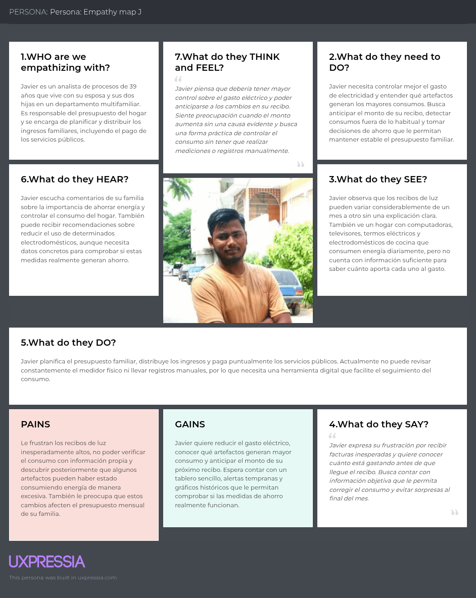

# Capítulo II: Requirements Elicitation & Analysis.
## 2.1. Competidores
### 2.1.1. Análisis competitivo.

**Competitive Analysis Landscape**

**¿Por qué llevar a cabo este análisis?**
Identificar las características, fortalezas y debilidades de las principales empresas que ofrecen soluciones de monitoreo del consumo eléctrico mediante dispositivos inteligentes y plataformas digitales, con el propósito de reconocer oportunidades de diferenciación y establecer una propuesta de valor competitiva para JouleTracker.

| Categoría               | Aspecto                                                 | JouleTracker                                                                                                                                                                                                                                                                                         | Emporia Energy                                                                                                                                                                                                                                                                    | Eyedro Green Solutions                                                                                                                                                                                                                                                | Wattwatchers                                                                                                                                                                                                                                                             |
|-------------------------|---------------------------------------------------------|------------------------------------------------------------------------------------------------------------------------------------------------------------------------------------------------------------------------------------------------------------------------------------------------------|-----------------------------------------------------------------------------------------------------------------------------------------------------------------------------------------------------------------------------------------------------------------------------------|-----------------------------------------------------------------------------------------------------------------------------------------------------------------------------------------------------------------------------------------------------------------------|--------------------------------------------------------------------------------------------------------------------------------------------------------------------------------------------------------------------------------------------------------------------------|
|                         |                                                         |                                                                                                                                                                                                                                               |                                                                                                                                                                                                                               |                                                                                                                                                                                                            |                                                                                                                                                                                                                   |
| **Perfil**              | Overview                                                | JouleTracker es una startup orientada al monitoreo y control del consumo eléctrico en hogares y pequeños negocios. Mediante sensores IoT recopila información del consumo energético y la presenta en una plataforma digital con datos en tiempo real, históricos, gráficos y alertas configurables. | Emporia Energy es una empresa especializada en soluciones inteligentes para la gestión energética. Su sistema Vue Energy Monitor permite medir el consumo eléctrico total y el consumo correspondiente a diferentes circuitos mediante sensores instalados en el panel eléctrico. | Eyedro Green Solutions desarrolla soluciones de hardware y software para el monitoreo del consumo eléctrico. Sus dispositivos recopilan información energética y la envían a la plataforma MyEyedro, desde donde los usuarios pueden visualizar y analizar sus datos. | Wattwatchers es una empresa especializada en tecnología para el monitoreo y gestión de energía. Sus dispositivos permiten recopilar información de distintos circuitos eléctricos y visualizarla mediante plataformas digitales dirigidas a hogares y pequeños negocios. |
| **Perfil**              | Ventaja competitiva — ¿Qué valor ofrece a los clientes? | Ofrece una plataforma sencilla y accesible que permite conocer el consumo eléctrico en tiempo real, revisar información histórica y recibir alertas cuando se superan determinados límites, facilitando el control de los gastos energéticos.                                                        | Permite supervisar el consumo general y diferentes circuitos eléctricos de forma independiente, facilitando la identificación de equipos o áreas que generan un mayor consumo.                                                                                                    | Combina dispositivos de medición eléctrica con una plataforma cloud que permite consultar consumo, costos, históricos, gráficos y reportes desde distintos dispositivos.                                                                                              | Ofrece monitoreo energético detallado mediante dispositivos capaces de supervisar varios circuitos, complementados con herramientas digitales para visualizar y analizar la información obtenida.                                                                        |
| **Perfil de Marketing** | Mercado objetivo                                        | Hogares y pequeños negocios interesados en conocer, controlar y reducir su consumo eléctrico mediante una solución sencilla y accesible.                                                                                                                                                             | Hogares y pequeñas instalaciones comerciales que desean monitorear el consumo eléctrico general y por circuitos.                                                                                                                                                                  | Hogares, pequeños negocios y organizaciones interesadas en conocer detalladamente su consumo energético y administrar mejor sus costos eléctricos.                                                                                                                    | Hogares y pequeños negocios que requieren monitoreo energético en tiempo real y análisis de diferentes circuitos eléctricos.                                                                                                                                             |
| **Perfil de Marketing** | Estrategias de marketing                                | Redes sociales, contenido educativo sobre ahorro energético, demostraciones de la plataforma, pruebas piloto y futuras alianzas con pequeños negocios, electricistas y proveedores tecnológicos.                                                                                                     | Marketing digital, comercialización de dispositivos, contenido relacionado con eficiencia energética y promoción de productos inteligentes para la gestión del consumo.                                                                                                           | Promoción de soluciones de monitoreo energético, contenido relacionado con eficiencia energética, demostraciones de MyEyedro y comercialización de diferentes equipos de medición.                                                                                    | Promoción de soluciones de gestión energética, alianzas empresariales y difusión de sus dispositivos, aplicaciones y herramientas tecnológicas.                                                                                                                          |
| **Perfil del Producto** | Productos & Servicios                                   | Sensores IoT, monitoreo eléctrico en tiempo real, dashboard web, históricos, gráficos, estadísticas, configuración de límites y alertas ante consumos elevados.                                                                                                                                      | Vue Energy Monitor, sensores para circuitos eléctricos, aplicación móvil y web, información en tiempo real, históricos y monitoreo individual de circuitos.                                                                                                                       | Medidores eléctricos, sensores de corriente, plataforma MyEyedro, visualización en tiempo real, históricos, análisis de costos y reportes energéticos.                                                                                                                | Dispositivos de monitoreo energético, supervisión de múltiples circuitos, plataforma web, aplicación móvil, históricos y herramientas para el análisis del consumo.                                                                                                      |
| **Perfil del Producto** | Precios & Costos                                        | Se plantea utilizar sensores IoT de costo accesible. Los principales costos corresponden al hardware, desarrollo y mantenimiento de la plataforma, infraestructura cloud, almacenamiento y soporte.                                                                                                  | Su modelo requiere la compra del dispositivo de monitoreo y de los sensores necesarios dependiendo de la cantidad de circuitos que el usuario quiera supervisar.                                                                                                                  | Su modelo se basa principalmente en la comercialización de medidores y sensores. El costo depende del dispositivo, cantidad de sensores y características de la instalación.                                                                                          | Los costos dependen del tipo de dispositivo utilizado, cantidad de circuitos monitoreados y servicios tecnológicos requeridos.                                                                                                                                           |
| **Perfil del Producto** | Canales de distribución (Web y/o Móvil)                 | Plataforma web responsive, dashboard digital y futura aplicación móvil.                                                                                                                                                                                                                              | Página web, aplicación móvil, plataforma digital y comercialización online de dispositivos.                                                                                                                                                                                       | Página web, plataforma cloud MyEyedro y acceso mediante computadoras, tablets y dispositivos móviles.                                                                                                                                                                 | Página web, dashboard web, aplicación móvil y herramientas digitales de administración y monitoreo.                                                                                                                                                                      |
| **Análisis SWOT**       | Fortalezas                                              | Plataforma sencilla, monitoreo en tiempo real, históricos, gráficos, alertas configurables, uso de sensores IoT y enfoque específico en hogares y pequeños negocios.                                                                                                                                 | Experiencia en monitoreo energético, medición de diferentes circuitos, plataforma digital consolidada y variedad de dispositivos relacionados con gestión energética.                                                                                                             | Experiencia en hardware y software de monitoreo, plataforma cloud propia, soluciones para hogares y negocios y herramientas de análisis del consumo.                                                                                                                  | Experiencia en tecnología energética, monitoreo de múltiples circuitos, plataformas digitales y soluciones dirigidas a hogares y pequeños negocios.                                                                                                                      |
| **Análisis SWOT**       | Debilidades                                             | Marca nueva, recursos iniciales limitados, dependencia de sensores IoT y menor cantidad de funcionalidades durante las primeras versiones.                                                                                                                                                           | Requiere la instalación de hardware dentro del panel eléctrico y sensores adicionales para obtener información detallada de múltiples circuitos.                                                                                                                                  | Requiere hardware especializado y puede presentar mayor complejidad para usuarios que únicamente necesitan conocer información básica de su consumo.                                                                                                                  | Su ecosistema tecnológico puede resultar más complejo para usuarios que solamente necesitan herramientas básicas de monitoreo energético.                                                                                                                                |
| **Análisis SWOT**       | Oportunidades                                           | Crecimiento del interés por reducir gastos eléctricos, mayor disponibilidad de sensores IoT económicos, digitalización de hogares y pequeños negocios y mayor preocupación por la eficiencia energética.                                                                                             | Crecimiento de hogares inteligentes, sistemas solares y mayor interés de los usuarios por conocer detalladamente su consumo energético.                                                                                                                                           | Mayor interés de hogares y negocios por reducir sus costos eléctricos y crecimiento de las soluciones digitales relacionadas con eficiencia energética.                                                                                                               | Crecimiento de las tecnologías de energía inteligente y mayor necesidad de analizar y administrar información relacionada con el consumo eléctrico.                                                                                                                      |
| **Análisis SWOT**       | Amenazas                                                | Presencia de competidores internacionales, aparición de dispositivos IoT más económicos, posibles fallas de hardware y rápida evolución tecnológica.                                                                                                                                                 | Aparición de nuevas soluciones de monitoreo energético de menor costo y dispositivos inteligentes con funcionalidades similares.                                                                                                                                                  | Incremento de competidores en el mercado de monitoreo energético y aparición de alternativas más económicas.                                                                                                                                                          | Nuevos competidores, evolución acelerada de las tecnologías IoT y aparición de sistemas de monitoreo integrados directamente en otros dispositivos eléctricos.                                                                                                           |

### 2.1.2 Estrategias y tácticas frente a competidores

Se plantean estrategias y tácticas preliminares que permitan a **JouleTracker** afrontar las fortalezas de sus competidores, aprovechar sus debilidades y responder a las oportunidades y amenazas presentes en el mercado de monitoreo y gestión del consumo eléctrico.

| **Aspecto**                  | **JouleTracker**                                                                                                           | **Emporia Energy**                                                                                                     | **Eyedro Green Solutions**                                                                                                                 | **Wattwatchers**                                                                                                                  | **Acciones de JouleTracker**                                                                                                                                                           |
|------------------------------|----------------------------------------------------------------------------------------------------------------------------|------------------------------------------------------------------------------------------------------------------------|--------------------------------------------------------------------------------------------------------------------------------------------|-----------------------------------------------------------------------------------------------------------------------------------|----------------------------------------------------------------------------------------------------------------------------------------------------------------------------------------|
| **Fortalezas a afrontar**    | Plataforma sencilla enfocada en hogares y pequeños negocios, con monitoreo en tiempo real, gráficos, históricos y alertas. | Cuenta con experiencia en monitoreo energético, medición individual de circuitos y una plataforma digital consolidada. | Combina hardware especializado con una plataforma cloud y ofrece soluciones tanto para hogares como para negocios.                         | Posee dispositivos de monitoreo energético, plataformas digitales y capacidad para gestionar múltiples circuitos.                 | JouleTracker buscará diferenciarse mediante facilidad de uso, accesibilidad, menor complejidad y adaptación a las necesidades de hogares y pequeños negocios.                          |
| **Debilidades a aprovechar** | Al ser una startup nueva puede adaptar rápidamente sus funcionalidades según las necesidades de los usuarios.              | Requiere instalación dentro del panel eléctrico y sensores adicionales para obtener mayor nivel de detalle.            | Requiere hardware especializado y puede resultar más complejo para usuarios que solo desean funciones básicas.                             | Su ecosistema puede ser más complejo para usuarios que únicamente necesitan controlar su consumo cotidiano.                       | Utilizar sensores IoT accesibles y desarrollar una plataforma sencilla que muestre principalmente la información necesaria para comprender el consumo.                                 |
| **Oportunidades**            | Mayor interés por reducir gastos eléctricos, crecimiento del IoT y digitalización de hogares y pequeños negocios.          | La existencia de sus productos demuestra el interés de los usuarios por conocer detalladamente su consumo eléctrico.   | Su presencia en hogares y negocios demuestra que existe demanda por plataformas capaces de convertir datos eléctricos en información útil. | Su enfoque en hogares y pequeños negocios demuestra el crecimiento del mercado de soluciones digitales para gestionar la energía. | Realizar pruebas piloto, generar contenido educativo, establecer alianzas con electricistas y pequeños negocios y adaptar progresivamente la plataforma a las necesidades del mercado. |
| **Amenazas**                 | Competidores internacionales, dispositivos de menor costo, fallas de sensores y evolución acelerada de tecnologías IoT.    | Puede incorporar nuevas funcionalidades, reducir costos y ampliar su ecosistema de productos.                          | Puede ampliar su oferta de soluciones y aumentar su presencia en nuevos mercados.                                                          | Puede aprovechar su experiencia tecnológica para incorporar nuevas funcionalidades dirigidas a pequeños consumidores.             | Mantener una arquitectura modular, utilizar sensores accesibles, realizar pruebas periódicas y actualizar progresivamente el hardware y software.                                      |
| **Estrategia competitiva**   | Ofrecer una solución digital sencilla y accesible para controlar el consumo eléctrico cotidiano.                           | Competir mediante una experiencia más sencilla para usuarios que no requieren configuraciones avanzadas.               | Diferenciarse mediante una solución simple y adaptada específicamente al segmento objetivo.                                                | Diferenciarse evitando funcionalidades empresariales innecesariamente complejas.                                                  | Posicionar a JouleTracker como una alternativa práctica y accesible para hogares y pequeños negocios que desean comprender y controlar su consumo eléctrico.                           |
| **Tácticas preliminares**    | Dashboard web, sensores IoT, monitoreo en tiempo real, históricos, gráficos, estadísticas, límites y alertas.              | Simplificar la visualización de datos y mantener un costo inicial accesible.                                           | Centralizar las principales funciones de monitoreo dentro de una interfaz sencilla.                                                        | Priorizar las herramientas esenciales de monitoreo antes de incorporar funcionalidades avanzadas.                                 | Redes sociales, contenido educativo, pruebas piloto, alertas personalizadas, recopilación de feedback, mejora continua y futuras alianzas estratégicas.                                |

## Estrategia general

La estrategia competitiva de **JouleTracker** estará basada en ofrecer una solución de monitoreo del consumo eléctrico **digital, sencilla, accesible y fácil de comprender**, orientada principalmente a hogares y pequeños negocios.

La startup buscará diferenciarse de **Emporia Energy, Eyedro Green Solutions y Wattwatchers** mediante una menor complejidad de uso, una interfaz enfocada en las necesidades principales del usuario y la utilización de sensores IoT accesibles.

JouleTracker priorizará inicialmente las herramientas esenciales para comprender y controlar el consumo eléctrico: monitoreo en tiempo real, información histórica, gráficos, estadísticas y alertas.

## Principales tácticas

- Implementar un dashboard web sencillo y responsive.
- Mostrar el consumo eléctrico en tiempo real.
- Permitir consultar información histórica.
- Generar gráficos comparativos por periodos.
- Mostrar estadísticas fáciles de interpretar.
- Permitir establecer límites personalizados de consumo.
- Generar alertas cuando se superen determinados límites.
- Utilizar sensores IoT de costo accesible.
- Simplificar la configuración del sistema.
- Realizar pruebas piloto con hogares y pequeños negocios.
- Recopilar feedback de los usuarios.
- Crear contenido relacionado con ahorro y eficiencia energética.
- Establecer alianzas con electricistas y pequeños negocios.
- Mejorar progresivamente la plataforma.
  
## 2.2. Entrevistas

### 2.2.1. Diseño de entrevistas
Para comprender mejor a nuestros usuarios y construir arquetipos representativos, diseñamos preguntas para las entrevistas de los dos segmentos objetivos identificados.

**Segmento 1: Propietarios de hogares urbanos con consumo eléctrico medio-alto**

*Objetivo de la entrevista:* Identificar cómo gestionan actualmente el consumo eléctrico de su hogar, qué dificultades enfrentan para monitorearlo y controlarlo, y reconocer sus principales frustraciones, necesidades y disposición para adoptar una plataforma digital con sensores IoT que les ayude a reducir costos y prevenir sobrecostos.

**Preguntas:**
1. ¿Cuál es su nombre, edad y distrito donde vive?
2. ¿Cuántas personas viven en su hogar y qué tipo de vivienda es (departamento, casa, etc.)?
3. ¿Quién suele encargarse de pagar y revisar el recibo de luz en casa?
4. ¿Qué electrodomésticos considera que consumen más energía en su hogar?
5. ¿Cómo se entera actualmente de cuánto está gastando en electricidad antes de que llegue el recibo?
6. ¿Ha tenido alguna vez un recibo de luz inesperadamente alto? ¿Supo identificar la causa?
7. ¿Qué tan seguido revisa o compara su consumo eléctrico mes a mes?
8. ¿Cómo coordina o decide cuándo usar ciertos aparatos para ahorrar energía?
9. ¿Qué información considera más útil para entender y controlar su gasto eléctrico?
10. ¿Qué tan importante sería para usted recibir alertas cuando su consumo esté por encima de lo normal?
11. ¿Le sería útil visualizar en tiempo real cuánto está gastando en electricidad?
12. ¿Qué tan dispuesto estaría a instalar un dispositivo/sensor en su hogar conectado a una app para monitorear su consumo?
13. ¿Cuál de las siguientes funcionalidades considera más importante en una herramienta de este tipo? (Monitoreo en tiempo real, alertas de consumo alto, proyección de recibo mensual, recomendaciones de ahorro)
14. ¿Qué le fastidia de la manera actual de controlar el gasto eléctrico en su hogar?
15. ¿Qué tan seguido cree que usaría una plataforma como esta: diario, semanal o solo cuando reciba el recibo?

**Preguntas complementarias:**
- ¿Qué herramientas digitales usa actualmente para gestionar gastos del hogar?
- ¿Qué dispositivos tecnológicos utiliza con más frecuencia (celular, laptop, smart TV, asistentes de voz)?
- ¿Qué redes sociales usa con mayor frecuencia?
- ¿Ha usado alguna vez dispositivos smart home (enchufes inteligentes, termostatos, etc.)?
- ¿Qué tan cómodo se siente usando aplicaciones móviles nuevas?

---

**Segmento 2: Administradores de pequeños negocios (PYMEs)**

*Objetivo de la entrevista:* Comprender cómo gestionan actualmente el consumo eléctrico de su negocio, qué dificultades enfrentan para controlar costos operativos y detectar anomalías, y qué información les sería útil para tomar decisiones que reduzcan su gasto energético a través de una plataforma digital con servicios IoT.

**Preguntas:**
1. ¿Cuál es su nombre, edad y tipo de negocio que administra?
2. ¿Cuál es su cargo o rol dentro del negocio?
3. ¿Hace cuánto tiempo administra o trabaja en este negocio?
4. ¿Qué equipos o maquinaria consumen más energía en su operación diaria?
5. ¿Cómo controlan actualmente el gasto eléctrico del negocio?
6. ¿Qué dificultades enfrenta al momento de prever o explicar variaciones en el costo de electricidad?
7. ¿Con qué frecuencia identifica picos de consumo inesperados o fallas en equipos por sobrecarga eléctrica?
8. ¿Cómo se entera si algún equipo está consumiendo más de lo normal?
9. ¿Qué información considera más útil para tomar decisiones sobre el uso de energía en su negocio?
10. ¿Qué tan importante sería para usted recibir alertas automáticas sobre consumo anómalo o riesgo de sobrecosto?
11. ¿Le sería útil visualizar proyecciones de su próximo recibo antes de que llegue?
12. ¿Qué tan dispuesto estaría a usar una plataforma web/IoT para monitorear el consumo eléctrico de su negocio en tiempo real?
13. ¿Cuál de las siguientes funcionalidades considera más importante en una herramienta de este tipo? (Monitoreo en tiempo real, alertas de consumo anómalo, proyección de costos, detección de fallas en equipos)
14. ¿Qué le fastidia de la manera actual de gestionar el consumo eléctrico del negocio?
15. ¿Qué tan seguido cree que usaría una plataforma como esta: diario, semanal o solo cuando tenga problemas?

**Preguntas complementarias:**
- ¿Qué herramientas digitales usa actualmente para gestionar el negocio?
- ¿Qué dispositivos tecnológicos utiliza con más frecuencia en su trabajo diario (celular, laptop, tablet, POS u otros)?
- ¿Qué redes sociales usa con mayor frecuencia?
- ¿Ha usado sensores o sistemas de monitoreo eléctrico en su negocio?
- ¿Qué tan cómodo se siente usando smartphones o aplicaciones móviles?

---

**Preguntas transversales para ambos segmentos**
- ¿Qué problemas considera más urgentes respecto a su consumo eléctrico actual?
- ¿Qué beneficios esperaría obtener de una plataforma como VoltLab?
- ¿Qué tan importante sería para usted que la información esté centralizada en un solo lugar?
- ¿Qué tipo de reportes o indicadores le ayudarían más en su día a día?
- ¿Qué tan útil le parecería una solución que combine monitoreo en tiempo real, alertas y proyección de costos?
- ¿Qué preocupaciones tendría al usar una nueva plataforma digital para gestionar su consumo eléctrico?

### 2.2.2. Registro de entrevistas.

#### Segmento #1: Usuarios residenciales (hogares)

- **Entrevista #2**

**Resumen de entrevista:**

Jesús tiene 34 años y vive en Los Olivos junto con su esposa y su hijo de 5 años, en un departamento de 3 pisos. Él es quien revisa y paga el recibo de luz mediante la app de su banco. Considera que el aire acondicionado y la lavadora son los equipos que más consumen. No puede conocer su gasto hasta que llega el recibo a fin de mes. Le interesaría un dashboard en tiempo real y considera que la proyección del recibo mensual sería la funcionalidad más importante.

| Detalle | Información |
|---|---|
| Entrevistado | Jesús |
| Edad | 34 años |
| Distrito | Los Olivos |
| Tipo de vivienda | Departamento de 3 pisos |
| Personas en el hogar | 3 |
| Equipos de mayor consumo | Aire acondicionado y lavadora |
| Duración / Empieza en | 4:29 / 5:30 |
| Enlace | [Ver entrevista](https://upcedupe-my.sharepoint.com/:v:/g/personal/u202314186_upc_edu_pe/IQDB16irH02WS5laTL__j-iKAfsOETJD9oBPkazEy9YJjR4?e=NPJO2C&nav=eyJyZWZlcnJhbEluZm8iOnsicmVmZXJyYWxBcHAiOiJTdHJlYW1XZWJBcHAiLCJyZWZlcnJhbFZpZXciOiJTaGFyZURpYWxvZy1MaW5rIiwicmVmZXJyYWxBcHBQbGF0Zm9ybSI6IldlYiIsInJlZmVycmFsTW9kZSI6InZpZXcifSwicGxheWJhY2tPcHRpb25zIjp7InN0YXJ0VGltZUluU2Vjb25kcyI6MzMwLjUyfX0%3D) |

---

- **Entrevista #3**

**Resumen de entrevista:**

Fabrizio tiene 26 años, vive solo en un departamento pequeño de un dormitorio en Surco y se encarga de pagar y revisar su recibo de luz. Los equipos de mayor consumo son el refrigerador y su laptop gaming. No tiene información de su gasto hasta que llega el recibo. Le interesa conocer en qué momentos del día consume más y está muy dispuesto a probar sensores por su interés en la tecnología.

| Detalle | Información |
|---|---|
| Entrevistado | Fabrizio |
| Edad | 26 años |
| Distrito | Surco |
| Tipo de vivienda | Departamento pequeño de un dormitorio |
| Personas en el hogar | 1 |
| Equipos de mayor consumo | Refrigerador y laptop gaming |
| Duración | 5:36 / 9:52 |
| Enlace | [Ver entrevista](https://upcedupe-my.sharepoint.com/:v:/g/personal/u202314186_upc_edu_pe/IQDB16irH02WS5laTL__j-iKAfsOETJD9oBPkazEy9YJjR4?e=zT9AE1&nav=eyJyZWZlcnJhbEluZm8iOnsicmVmZXJyYWxBcHAiOiJTdHJlYW1XZWJBcHAiLCJyZWZlcnJhbFZpZXciOiJTaGFyZURpYWxvZy1MaW5rIiwicmVmZXJyYWxBcHBQbGF0Zm9ybSI6IldlYiIsInJlZmVycmFsTW9kZSI6InZpZXcifSwicGxheWJhY2tPcHRpb25zIjp7InN0YXJ0VGltZUluU2Vjb25kcyI6NTkyLjUzfX0%3D) |

---

- **Entrevista #6**

**Resumen de entrevista:**

Fabrizio tiene 45 años, trabaja en administración y vive con su esposa y sus dos hijos en una casa propia en Comas. Se encarga de pagar los servicios básicos y revisar el funcionamiento eléctrico de la vivienda. Los equipos de mayor consumo son la refrigeradora, la therma eléctrica y la computadora de escritorio. Ha tenido problemas con la therma por falso contacto. Considera muy importantes las alertas para prevenir cortocircuitos y la proyección del recibo.

| Detalle | Información |
|---|---|
| Entrevistado | Fabrizio |
| Edad | 45 años |
| Distrito | Comas |
| Ocupación | Empleado administrativo |
| Tipo de vivienda | Casa propia |
| Personas en el hogar | 4 |
| Equipos de mayor consumo | Refrigeradora, therma eléctrica y PC de escritorio |
| Duración / Empeiza en | 5:58 / 31:49 |
| Enlace | [Ver entrevista](https://upcedupe-my.sharepoint.com/:v:/g/personal/u202314186_upc_edu_pe/IQDB16irH02WS5laTL__j-iKAfsOETJD9oBPkazEy9YJjR4?e=qIzO0l&nav=eyJyZWZlcnJhbEluZm8iOnsicmVmZXJyYWxBcHAiOiJTdHJlYW1XZWJBcHAiLCJyZWZlcnJhbFZpZXciOiJTaGFyZURpYWxvZy1MaW5rIiwicmVmZXJyYWxBcHBQbGF0Zm9ybSI6IldlYiIsInJlZmVycmFsTW9kZSI6InZpZXcifSwicGxheWJhY2tPcHRpb25zIjp7InN0YXJ0VGltZUluU2Vjb25kcyI6MTU1MC44Mn19) |

#### Segmento #2: Dueños y administradores de pequeños negocios

- **Entrevista #1**

**Resumen de entrevista:**

Diana tiene 40 años y es propietaria de una bodega en San Juan de Lurigancho, negocio que administra hace más de 10 años junto con su esposo. No lleva un control específico del consumo eléctrico y solo revisa el recibo cuando llega. Identifica al congelador de bebidas y helados y a las refrigeradoras como los equipos de mayor consumo. Considera muy importante recibir alertas sobre consumos anómalos y conocer el consumo individual de cada refrigeradora.

| Detalle | Información |
|---|---|
| Entrevistado | Diana |
| Edad | 40 años |
| Distrito | San Juan de Lurigancho |
| Tipo de negocio | Bodega |
| Antigüedad del negocio | 11 años |
| Equipos de mayor consumo | Congelador de bebidas/helados y 2 refrigeradoras |
| Duración / Empieza | 5:32 / 00:00 |
| Enlace | [Ver entrevista](https://upcedupe-my.sharepoint.com/:v:/g/personal/u202314186_upc_edu_pe/IQDB16irH02WS5laTL__j-iKAfsOETJD9oBPkazEy9YJjR4?e=chqLWL&nav=eyJyZWZlcnJhbEluZm8iOnsicmVmZXJyYWxBcHAiOiJTdHJlYW1XZWJBcHAiLCJyZWZlcnJhbFZpZXciOiJTaGFyZURpYWxvZy1MaW5rIiwicmVmZXJyYWxBcHBQbGF0Zm9ybSI6IldlYiIsInJlZmVycmFsTW9kZSI6InZpZXcifSwicGxheWJhY2tPcHRpb25zIjp7fX0%3D) |

---

- **Entrevista #4**

**Resumen de entrevista:**

Eduardo tiene 38 años, es dueño de un taller mecánico en Comas y trabaja como mecánico principal. Lleva 7 años en el negocio con dos ayudantes. El compresor de aire y las máquinas de soldar son los equipos que más consumen. No realiza control específico del gasto eléctrico y aproximadamente una vez al mes se dispara el térmico. Considera muy importante recibir alertas y la detección de fallas sería la funcionalidad más importante.

| Detalle | Información |
|---|---|
| Entrevistado | Eduardo |
| Edad | 38 años |
| Distrito | Comas |
| Tipo de negocio | Taller mecánico |
| Antigüedad del negocio | 7 años |
| Equipos de mayor consumo | Compresor de aire y máquinas de soldar |
| Duración / Empieza en | 4:48 / 15:33  |
| Enlace | [Ver entrevista](https://upcedupe-my.sharepoint.com/:v:/g/personal/u202314186_upc_edu_pe/IQDB16irH02WS5laTL__j-iKAfsOETJD9oBPkazEy9YJjR4?e=UCZGwb&nav=eyJyZWZlcnJhbEluZm8iOnsicmVmZXJyYWxBcHAiOiJTdHJlYW1XZWJBcHAiLCJyZWZlcnJhbFZpZXciOiJTaGFyZURpYWxvZy1MaW5rIiwicmVmZXJyYWxBcHBQbGF0Zm9ybSI6IldlYiIsInJlZmVycmFsTW9kZSI6InZpZXcifSwicGxheWJhY2tPcHRpb25zIjp7InN0YXJ0VGltZUluU2Vjb25kcyI6OTI5LjIyfX0%3D) |

---

- **Entrevista #5**

**Resumen de entrevista:**

Renzo tiene 42 años y administra un minimarket en Carabayllo junto con su esposa, con 5 años en el negocio. Las cámaras de frío y los congeladores de helados son los equipos de mayor consumo, varios encendidos 24 horas. No cuenta con control específico del consumo. Un par de veces al año alguna cámara de frío falla, ocasionando pérdidas de mercadería. Considera la detección de fallas como la funcionalidad más importante.

| Detalle | Información |
|---|---|
| Entrevistado | Renzo |
| Edad | 42 años |
| Distrito | Carabayllo |
| Tipo de negocio | Minimarket |
| Antigüedad del negocio | 5 años |
| Equipos de mayor consumo | Cámaras de frío y congeladores de helados |
| Duración / Empieza | 5:32 : 31:49 |
| Enlace | [Ver entrevista](https://upcedupe-my.sharepoint.com/:v:/g/personal/u202314186_upc_edu_pe/IQDB16irH02WS5laTL__j-iKAfsOETJD9oBPkazEy9YJjR4?e=we5RKt&nav=eyJyZWZlcnJhbEluZm8iOnsicmVmZXJyYWxBcHAiOiJTdHJlYW1XZWJBcHAiLCJyZWZlcnJhbFZpZXciOiJTaGFyZURpYWxvZy1MaW5rIiwicmVmZXJyYWxBcHBQbGF0Zm9ybSI6IldlYiIsInJlZmVycmFsTW9kZSI6InZpZXcifSwicGxheWJhY2tPcHRpb25zIjp7InN0YXJ0VGltZUluU2Vjb25kcyI6MTIxOC40M319) |

### 2.2.3 Análisis de entrevistas.

El análisis de las entrevistas realizadas permite identificar patrones comunes en los dos segmentos objetivo de VoltLab: Hogares y PYMEs. A partir de las seis entrevistas realizadas, tres corresponden al segmento de Hogares y tres al segmento de PYMEs. Se identificaron características objetivas y subjetivas relacionadas con la forma en que los usuarios gestionan actualmente su consumo eléctrico, los problemas que enfrentan y las funcionalidades que consideran más importantes para una solución de monitoreo energético.

**Segmento 1: Hogares**

Este segmento está compuesto por tres entrevistados: Jesús, Miguel y Carlos. Los tres se encargan directamente de revisar o gestionar los gastos relacionados con la electricidad de sus hogares.

**Control del consumo eléctrico**

El 100% de los entrevistados indicó que actualmente no cuenta con un sistema de monitoreo que permita conocer cuánto consume durante el mes antes de recibir el recibo. Los tres usuarios dependen principalmente del monto final de la factura para conocer su consumo.

**Dificultad para explicar aumentos en el recibo**

El 100% manifestó haber experimentado situaciones en las que el recibo aumentó sin poder identificar con certeza qué aparato ocasionó el incremento. Jesús relacionó un aumento con el uso del aire acondicionado, Fabrizio con el uso prolongado de la laptop y el aire acondicionado, mientras que Carlos señaló que no podía determinar qué artefacto generaba los incrementos.

**Falta de estrategias de ahorro**

El 67% de los entrevistados no cuenta con una estrategia estructurada para controlar su consumo eléctrico. Jesús únicamente procura no dejar luces encendidas y Fabrizio utiliza los equipos según sus necesidades. Carlos, aunque lleva un control general de sus gastos familiares, no realiza un seguimiento específico del consumo eléctrico.

**Interés en conocer el consumo por dispositivo**

El 67% mostró interés específico en conocer qué artefactos representan un mayor consumo. Jesús quiere identificar qué aparato gasta más para controlar sus hábitos, mientras que Carlos busca comparar el consumo de diferentes artefactos para tomar decisiones sobre su uso o reemplazo. Fabrizio, por su parte, mostró mayor interés en conocer los momentos del día con mayor consumo.

**Importancia de las alertas**

El 100% considera importantes las alertas relacionadas con consumos elevados o anómalos. Jesús y Carlos las relacionan con la posibilidad de reaccionar antes de recibir un recibo elevado, mientras que Fabrizio también las considera importantes, aunque señala que deberían ser suficientemente notorias para captar su atención.

**Interés en monitoreo y proyección de costos**

Las funcionalidades de monitoreo y proyección de costos presentan un interés elevado, aunque las prioridades varían entre usuarios. Jesús considera más importante la proyección del recibo mensual, Fabrizio prioriza el monitoreo en tiempo real, mientras que Carlos considera importantes tanto las alertas como la proyección de costos.

**Adopción tecnológica**

El 100% presenta una disposición positiva hacia el uso de aplicaciones para monitorear el consumo eléctrico. Sin embargo, Jesús y Carlos condicionan esta disposición a que la instalación y el uso sean sencillos, mientras que Fabrizio muestra una mayor afinidad hacia la experimentación con nuevas tecnologías.

**Segmento 2: PYMEs**

Este segmento está compuesto por Diana, propietaria de una bodega; Eduardo, dueño de un taller mecánico; y Renzo, administrador y copropietario de un minimarket. Los tres dependen directamente del funcionamiento de equipos eléctricos para desarrollar sus actividades comerciales.

**Falta de control del consumo eléctrico**

El 100% de las PYMEs entrevistadas indicó que no lleva un control específico del consumo eléctrico. Diana, Eduardo y Renzo únicamente revisan o pagan el recibo mensual sin disponer de información sobre el consumo individual de sus equipos.

**Dependencia de equipos de alto consumo**

El 100% identifica equipos que permanecen funcionando durante largos periodos y que representan una parte importante de su consumo. Diana destaca congeladores y refrigeradoras, Eduardo el compresor y las máquinas de soldar, y Renzo las cámaras de frío y congeladores que funcionan durante las 24 horas.

**Detección tardía de fallas**

El 100% manifestó que normalmente identifica los problemas eléctricos o de los equipos después de que aparecen señales evidentes de falla. Diana detecta problemas mediante calentamiento, ruidos o incluso olor a quemado; Eduardo cuando se dispara el térmico o una máquina se calienta; y Renzo cuando una cámara empieza a fallar o la mercadería comienza a deteriorarse.

**Importancia de la prevención**

El 100% considera muy importante recibir alertas antes de que ocurra una falla grave. Diana busca evitar daños en sus equipos, Eduardo quiere prevenir daños y cortes durante sus trabajos, y Renzo busca evitar pérdidas de mercadería.

**Interés en detección de fallas**

El 67% de los entrevistados considera la detección de fallas en equipos como la funcionalidad más importante. Eduardo y Renzo la seleccionaron directamente como su principal necesidad, mientras que Diana priorizó las alertas de consumo anómalo debido a su preocupación por fallas en sus equipos.

**Utilidad de la proyección del recibo**

El 100% considera útil conocer una proyección del próximo recibo. Diana la relaciona con la planificación de sus gastos, Eduardo con la organización de los gastos del taller y Renzo principalmente con la planificación durante los meses de verano, cuando aumenta su consumo.

**Adopción tecnológica**

El 100% presenta una disposición positiva para utilizar una plataforma de monitoreo eléctrico, siempre que esta aporte un beneficio claro. Diana y Eduardo resaltan la necesidad de que sea sencilla, mientras que Renzo estaría dispuesto a utilizarla principalmente para evitar pérdidas económicas relacionadas con fallas en sus equipos.

---

## 2.3. Needfinding.

### 2.3.1. User Personas.

- **Segmento objetivo 1: Segmento Residencial (Hogares)**

*Ilustración. User Persona padre de familia administrador del hogar*

- **Segmento objetivo 2: Segmento Comercial (Pequeños Negocios / MYPE)**

*Ilustración. User Persona dueños de pequeño negocio*

### 2.3.2. User Task Matrix.

- **Segmento objetivo 1: Propietarios de hogares urbanos**

| User Task                                                                             | Frecuencia | Importancia |
|---------------------------------------------------------------------------------------|------------|-------------|
| Revisar el importe del recibo de luz emitido por la distribuidora                     | Mensual    | Crítica     |
| Verificar el medidor eléctrico físico del inmueble                                    | Esporádica | Baja        |
| Calcular y provisionar el presupuesto para servicios básicos                          | Mensual    | Alta        |
| Inspeccionar el apagado de artefactos y luces fuera de horario                        | Diaria     | Media       |
| Supervisar el estado operativo y calentamiento de maquinaria o electrodomésticos      | Esporádica | Media       |
| Identificar variaciones o incrementos no explicados en el cobro del servicio          | Mensual    | Alta        |
| Ajustar hábitos de uso de equipos de alta demanda (hornos, termas, calentadores)      | Semanal    | Alta        |
| Consultar tarifas y horarios de consumo con el proveedor eléctrico                    | Esporádica | Baja        |
| Establecer acuerdos o normas de uso de energía con el entorno (familia o personal)    | Mensual    | Media       |
| Gestionar reclamos ante la distribuidora por cobros desmedidos o fallas de suministro | Esporádica | Alta        |

*Tabla. User Task para el segmento de propietarios de hogares urbanos*

- **Segmento objetivo 2: Administradores de pequeños negocios**

| User Task                                                                             | Frecuencia | Importancia |
|---------------------------------------------------------------------------------------|------------|-------------|
| Revisar el importe del recibo de luz emitido por la distribuidora                     | Mensual    | Crítica     |
| Verificar el medidor eléctrico físico del inmueble                                    | Esporádica | Media       |
| Calcular y provisionar el presupuesto para servicios básicos                          | Semanal    | Crítica     |
| Inspeccionar el apagado de artefactos y luces fuera de horario                        | Diaria     | Crítica     |
| Supervisar el estado operativo y calentamiento de maquinaria o electrodomésticos      | Diaria     | Crítica     |
| Identificar variaciones o incrementos no explicados en el cobro del servicio          | Mensual    | Crítica     |
| Ajustar hábitos de uso de equipos de alta demanda (hornos, termas, calentadores)      | Diaria     | Alta        |
| Consultar tarifas y horarios de consumo con el proveedor eléctrico                    | Mensual    | Media       |
| Establecer acuerdos o normas de uso de energía con el entorno (familia o personal)    | Semanal    | Alta        |
| Gestionar reclamos ante la distribuidora por cobros desmedidos o fallas de suministro | Esporádica | Crítica     |

*Tabla. User Task para el segmento de administradores de pequeños negocios*

## 2.3.3 User Journey Mapping

Estos gráficos fueron desarrollados en Figma y se pueden visualizar mediante el enlace: https://www.figma.com/design/edK8BubeLxHBk7XgWAAwqs/Journey-Map-Template--Community-?node-id=0-1&p=f&t=hFmkmXytS2RPTiam-0

User Journey Mapping Propietarios de hogares urbanos:

User Journey Mapping Administradores de pequeños negocios:

### 2.3.4. Empathy Mapping.
**Empathy Map Segmento 1**

**Empathy Map Segmento 2**

---

# 2.4. BIG PICTURE EVENT STORMING

El Big Picture Event Storming permite comprender de manera general el funcionamiento del sistema, identificando eventos de dominio, actores, puntos de dolor y aspectos pendientes de análisis.

---

## 2.4.1. OPEN

**Objetivo:** Identificar todos los eventos de dominio relacionados con el sistema.

---

## 2.4.2. EXPLORE

**Objetivo:** Identificar actores, puntos de dolor y establecer una secuencia entre los eventos.

---

## 2.4.3. CLOSE

**Objetivo:** Identificar problemas encontrados, temas que requieren investigación y elementos fuera del alcance actual.

---

## 2.5. Ubiquitous Language.

Para VoltLab se establece un lenguaje común basado en los conceptos que
forman parte del problema y de la solución propuesta. La finalidad es
mantener un significado claro para los principales elementos relacionados
con el consumo eléctrico, su monitoreo y el control de los costos.

### Términos generales

| Término | Definición | Contexto |
|---|---|---|
| Usuario | Persona que utiliza VoltLab para consultar información sobre su consumo eléctrico y tomar decisiones sobre su uso de energía. | General |
| Hogar | Vivienda en la que se registra y analiza el consumo eléctrico. | Hogar |
| Negocio | Establecimiento en el que se registra y analiza el consumo eléctrico generado por sus actividades. | Negocio |
| Consumo eléctrico | Cantidad de energía utilizada por un hogar o negocio durante un período determinado. | Consumo |
| Uso de energía | Manera en que se distribuye y utiliza la energía eléctrica en un hogar o negocio. | Consumo |
| Recibo de luz | Documento que muestra el consumo registrado y el monto que debe pagarse por la electricidad utilizada. | Facturación |
| Costo de energía | Monto correspondiente a la energía eléctrica consumida durante un período. | Facturación |

### Términos de monitoreo

| Término | Definición | Contexto |
|---|---|---|
| Sensor | Dispositivo encargado de medir el consumo eléctrico y enviar los datos registrados a la plataforma. | Sensores |
| Lectura | Dato obtenido por un sensor que representa el consumo eléctrico registrado en un momento determinado. | Sensores |
| Monitoreo en tiempo real | Consulta del consumo eléctrico a medida que se generan nuevas lecturas. | Monitoreo |
| Historial de consumo | Conjunto de lecturas y registros de consumo correspondientes a períodos anteriores. | Monitoreo |
| Pico de consumo | Aumento considerable del consumo eléctrico en un período corto respecto al comportamiento habitual. | Monitoreo |
| Límite de consumo | Valor establecido para identificar cuándo el consumo supera un nivel determinado. | Monitoreo |
| Consumo anómalo | Comportamiento del consumo que se diferencia de los valores habituales registrados. | Monitoreo |

### Términos de alertas y ahorro

| Término | Definición | Contexto |
|---|---|---|
| Alerta | Aviso que informa al usuario sobre una situación relevante relacionada con su consumo eléctrico. | Alertas |
| Alerta de consumo alto | Aviso generado cuando el consumo supera el límite establecido o el nivel esperado. | Alertas |
| Alerta de consumo anómalo | Aviso generado cuando se identifica un comportamiento inusual en el consumo eléctrico. | Alertas |
| Recomendación de ahorro | Sugerencia orientada a reducir el consumo eléctrico o el costo del servicio. | Ahorro |
| Ahorro de energía | Reducción del consumo eléctrico mediante un uso más eficiente de los equipos y recursos disponibles. | Ahorro |

### Términos de proyección

| Término | Definición | Contexto |
|---|---|---|
| Proyección de consumo | Estimación de la cantidad de energía que se podría consumir al finalizar un período. | Proyección |
| Proyección de costo | Estimación del monto que podría pagarse en el próximo recibo según el consumo registrado. | Proyección |
| Consumo esperado | Cantidad de energía que se estima utilizar tomando como referencia el comportamiento registrado anteriormente. | Proyección |
