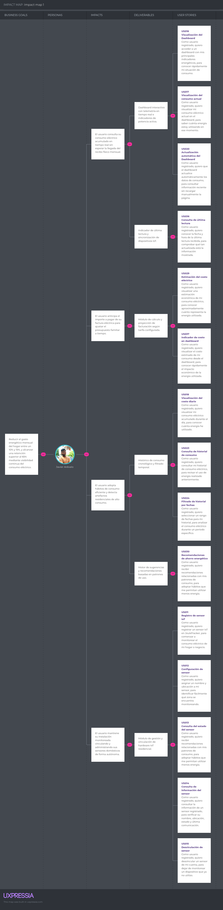
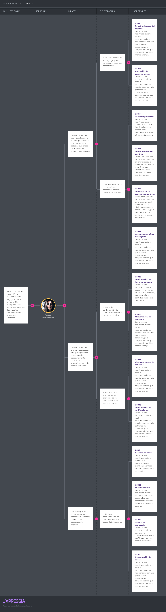

# Capítulo III: Requirements Specification
## 3.1. User Stories

| Epic / Story ID | Título                                                  | Descripción                                                                                                                                                                                   | Criterios de Aceptación                                                                                                                                                                                                                                                                                                                                                                                                                                                                                                                                                                                                                                                                                                                                                                                                                                                                                                                                                                                                                            | Relacionado con (Epic ID) |
|-----------------|---------------------------------------------------------|-----------------------------------------------------------------------------------------------------------------------------------------------------------------------------------------------|----------------------------------------------------------------------------------------------------------------------------------------------------------------------------------------------------------------------------------------------------------------------------------------------------------------------------------------------------------------------------------------------------------------------------------------------------------------------------------------------------------------------------------------------------------------------------------------------------------------------------------------------------------------------------------------------------------------------------------------------------------------------------------------------------------------------------------------------------------------------------------------------------------------------------------------------------------------------------------------------------------------------------------------------------|---------------------------|
| **EP-01**       | **Gestión de cuentas y autenticación**                  | Agrupa las funcionalidades relacionadas con el registro, inicio de sesión, verificación, recuperación de contraseña y seguridad de acceso de los usuarios en JouleTracker.                    |                                                                                                                                                                                                                                                                                                                                                                                                                                                                                                                                                                                                                                                                                                                                                                                                                                                                                                                                                                                                                                                    |                           |
| **EP-02**       | **Landing Page y presentación de JouleTracker**         | Incluye las funcionalidades públicas que permiten presentar JouleTracker, explicar sus beneficios, mostrar cómo funciona la solución y facilitar el acceso de los visitantes a la plataforma. |                                                                                                                                                                                                                                                                                                                                                                                                                                                                                                                                                                                                                                                                                                                                                                                                                                                                                                                                                                                                                                                    |                           |
| **EP-03**       | **Gestión de sensores IoT**                             | Reúne las funcionalidades necesarias para registrar, configurar, consultar y desvincular sensores IoT, así como recibir las lecturas eléctricas enviadas por los dispositivos.                |                                                                                                                                                                                                                                                                                                                                                                                                                                                                                                                                                                                                                                                                                                                                                                                                                                                                                                                                                                                                                                                    |                           |
| **EP-04**       | **Dashboard y monitoreo de consumo**                    | Comprende la visualización del consumo eléctrico actual, consumo diario, información por sensor, última lectura, costo estimado y actualización automática del dashboard.                     |                                                                                                                                                                                                                                                                                                                                                                                                                                                                                                                                                                                                                                                                                                                                                                                                                                                                                                                                                                                                                                                    |                           |
| **EP-05**       | **Perfil, historial y gestión personal**                | Agrupa las funcionalidades que permiten al usuario consultar y actualizar su perfil, revisar su historial de consumo, filtrar registros, cambiar su contraseña y desactivar su cuenta.        |                                                                                                                                                                                                                                                                                                                                                                                                                                                                                                                                                                                                                                                                                                                                                                                                                                                                                                                                                                                                                                                    |                           |
| **EP-06**       | **Alertas, metas y optimización energética**            | Incluye la configuración de límites y metas, alertas por exceso de consumo, estimaciones económicas, recomendaciones de ahorro y preferencias de notificación.                                |                                                                                                                                                                                                                                                                                                                                                                                                                                                                                                                                                                                                                                                                                                                                                                                                                                                                                                                                                                                                                                                    |                           |
| **EP-07**       | **Gestión energética para pequeños negocios**           | Reúne las funcionalidades orientadas a organizar áreas de un establecimiento, asociar sensores, comparar consumos y consultar métricas energéticas para apoyar la gestión del negocio.        |                                                                                                                                                                                                                                                                                                                                                                                                                                                                                                                                                                                                                                                                                                                                                                                                                                                                                                                                                                                                                                                    |                           |
| US-01           | Registro de usuario                                     | **Como visitante**, quiero registrarme en JouleTracker proporcionando mis datos personales y credenciales, para poder acceder a las funcionalidades de monitoreo de consumo eléctrico.        | **Escenario 1: Registro exitoso**  <b>Dado</b> que el visitante no posee una cuenta registrada <b>Cuando</b> completa todos los campos obligatorios con información válida <b>Entonces</b> el sistema crea la cuenta correctamente <b>Y</b> permite al usuario continuar con el proceso de acceso a JouleTracker.  <b>Escenario 2: Correo electrónico ya registrado</b>  <b>Dado</b> que existe una cuenta asociada al correo proporcionado <b>Cuando</b> el visitante intenta registrarse utilizando dicho correo <b>Entonces</b> el sistema rechaza el registro <b>Y</b> informa que el correo ya se encuentra registrado.  <b>Escenario 3: Datos obligatorios incompletos</b>  <b>Dado</b> que el visitante se encuentra en el formulario de registro <b>Cuando</b> intenta registrarse sin completar todos los campos obligatorios <b>Entonces</b> el sistema no crea la cuenta <b>Y</b> indica qué información debe completar.                                                       | EP-01                     |
| US-02           | Inicio de sesión                                        | **Como usuario registrado**, quiero iniciar sesión con mis credenciales, para acceder de forma segura a las funcionalidades de JouleTracker.                                                  | **Escenario 1: Inicio de sesión exitoso**  <b>Dado</b> que el usuario posee una cuenta activa <b>Cuando</b> ingresa un correo electrónico y una contraseña válidos <b>Entonces</b> el sistema autentica al usuario <b>Y</b> permite acceder al dashboard principal.  <b>Escenario 2: Contraseña incorrecta</b>  <b>Dado</b> que el correo pertenece a una cuenta registrada <b>Cuando</b> el usuario proporciona una contraseña incorrecta <b>Entonces</b> el sistema rechaza el acceso <b>Y</b> informa que las credenciales son incorrectas.  <b>Escenario 3: Cuenta inexistente</b>  <b>Dado</b> que el usuario se encuentra en la pantalla de inicio de sesión <b>Cuando</b> proporciona un correo no registrado <b>Entonces</b> el sistema no inicia sesión <b>Y</b> informa que no existe una cuenta asociada al correo.                                                                                                                                                            | EP-01                     |
| US-03           | Recuperación de contraseña                              | **Como usuario registrado**, quiero recuperar el acceso a mi cuenta cuando olvide mi contraseña, para poder continuar utilizando JouleTracker.                                                | **Escenario 1: Solicitud válida**  <b>Dado</b> que el usuario posee una cuenta registrada <b>Cuando</b> solicita recuperar su contraseña utilizando su correo <b>Entonces</b> el sistema inicia el proceso de recuperación <b>Y</b> envía las instrucciones correspondientes.  <b>Escenario 2: Correo no registrado</b>  <b>Dado</b> que el usuario se encuentra en la opción de recuperación de contraseña <b>Cuando</b> ingresa un correo no asociado a ninguna cuenta <b>Entonces</b> el sistema no inicia el proceso <b>Y</b> informa que el correo no está registrado.  <b>Escenario 3: Nueva contraseña válida</b>  <b>Dado</b> que el usuario accedió correctamente al proceso de recuperación <b>Cuando</b> establece una nueva contraseña que cumple los requisitos <b>Entonces</b> el sistema actualiza sus credenciales <b>Y</b> permite iniciar sesión con la nueva contraseña.                                                                                               | EP-01                     |
| US-04           | Verificación de cuenta                                  | **Como usuario recién registrado**, quiero verificar mi cuenta, para confirmar mis datos y habilitar el acceso completo a JouleTracker.                                                       | **Escenario 1: Verificación exitosa**  <b>Dado</b> que el usuario posee una cuenta pendiente de verificación <b>Cuando</b> realiza correctamente el proceso de validación <b>Entonces</b> el sistema marca la cuenta como verificada <b>Y</b> habilita las funcionalidades correspondientes.  <b>Escenario 2: Verificación inválida</b>  <b>Dado</b> que el usuario intenta validar su cuenta <b>Cuando</b> utiliza información o un código de verificación inválido <b>Entonces</b> el sistema rechaza la verificación <b>Y</b> solicita realizar nuevamente el proceso.  <b>Escenario 3: Cuenta previamente verificada</b>  <b>Dado</b> que la cuenta ya fue verificada <b>Cuando</b> el usuario intenta repetir el proceso <b>Entonces</b> el sistema mantiene el estado de la cuenta <b>Y</b> informa que la verificación ya fue realizada.                                                                                                                                           | EP-01                     |
| US-05           | Cierre de sesión                                        | **Como usuario autenticado**, quiero cerrar mi sesión, para evitar que otras personas accedan a mi información desde el mismo dispositivo.                                                    | **Escenario 1: Cierre exitoso**  <b>Dado</b> que el usuario mantiene una sesión activa <b>Cuando</b> selecciona la opción de cerrar sesión <b>Entonces</b> el sistema finaliza la sesión <b>Y</b> redirige al usuario a la pantalla de acceso.  <b>Escenario 2: Acceso posterior al cierre</b>  <b>Dado</b> que la sesión fue finalizada <b>Cuando</b> el usuario intenta acceder a una funcionalidad restringida <b>Entonces</b> el sistema bloquea el acceso <b>Y</b> solicita iniciar sesión nuevamente.  <b>Escenario 3: Sesión expirada</b>  <b>Dado</b> que la sesión del usuario ha expirado <b>Cuando</b> intenta realizar una operación protegida <b>Entonces</b> el sistema impide continuar <b>Y</b> solicita nuevamente sus credenciales.                                                                                                                                                                                                                                     | EP-01                     |
| US-06           | Visualización de Landing Page                           | **Como visitante**, quiero acceder a la Landing Page de JouleTracker, para conocer rápidamente de qué trata la solución.                                                                      | **Escenario 1: Visualización exitosa**  <b>Dado</b> que el visitante accede al sitio web de JouleTracker <b>Cuando</b> la Landing Page termina de cargar <b>Entonces</b> el sistema muestra la propuesta de valor de la plataforma <b>Y</b> presenta sus principales funcionalidades.  <b>Escenario 2: Visualización desde dispositivo móvil</b>  <b>Dado</b> que el visitante utiliza un dispositivo móvil <b>Cuando</b> accede a la Landing Page <b>Entonces</b> el contenido se adapta al tamaño de la pantalla <b>Y</b> mantiene disponibles los elementos principales.  <b>Escenario 3: Error parcial de recursos</b>  <b>Dado</b> que un recurso visual no puede cargarse <b>Cuando</b> el visitante abre la página <b>Entonces</b> el contenido principal permanece disponible <b>Y</b> la navegación continúa funcionando.                                                                                                                                                        | EP-02                     |
| US-07           | Consulta de beneficios de JouleTracker                  | **Como visitante**, quiero conocer los principales beneficios de JouleTracker, para evaluar si la solución puede ayudarme a controlar mi consumo eléctrico.                                   | **Escenario 1: Beneficios disponibles**  <b>Dado</b> que el visitante se encuentra en la Landing Page <b>Cuando</b> accede a la sección de beneficios <b>Entonces</b> el sistema muestra las ventajas principales de JouleTracker <b>Y</b> explica su relación con el monitoreo y ahorro energético.  <b>Escenario 2: Navegación hacia beneficios</b>  <b>Dado</b> que la sección se encuentra disponible <b>Cuando</b> el visitante la selecciona desde el menú <b>Entonces</b> la página lo dirige al contenido correspondiente <b>Y</b> mantiene visible la navegación principal.  <b>Escenario 3: Consulta sin autenticación</b>  <b>Dado</b> que el visitante no posee una sesión iniciada <b>Cuando</b> consulta la sección de beneficios <b>Entonces</b> puede visualizar el contenido <b>Y</b> no se le exige autenticarse.                                                                                                                                                       | EP-02                     |
| US-08           | Consulta del funcionamiento de JouleTracker             | **Como visitante**, quiero conocer cómo funciona JouleTracker y sus sensores IoT, para comprender cómo se obtiene y visualiza la información de consumo.                                      | **Escenario 1: Explicación disponible**  <b>Dado</b> que el visitante accede a la sección de funcionamiento <b>Cuando</b> consulta su contenido <b>Entonces</b> el sistema explica el proceso de medición, envío y visualización <b>Y</b> describe el rol de los sensores IoT.  <b>Escenario 2: Información organizada</b>  <b>Dado</b> que el visitante revisa el funcionamiento <b>Cuando</b> visualiza el contenido <b>Entonces</b> la explicación se presenta en pasos comprensibles <b>Y</b> facilita entender el flujo general.  <b>Escenario 3: Acceso desde el menú</b>  <b>Dado</b> que el visitante se encuentra en otra sección <b>Cuando</b> selecciona la opción de funcionamiento <b>Entonces</b> la página lo dirige a dicha sección <b>Y</b> muestra el contenido correspondiente.                                                                                                                                                                                        | EP-02                     |
| US-09           | Consulta de funcionalidades principales                 | **Como visitante**, quiero conocer las funcionalidades principales de JouleTracker, para identificar qué herramientas ofrece la plataforma antes de registrarme.                              | **Escenario 1: Funcionalidades mostradas**  <b>Dado</b> que el visitante se encuentra en la Landing Page <b>Cuando</b> accede a la sección de funcionalidades <b>Entonces</b> el sistema muestra las capacidades principales de JouleTracker <b>Y</b> incluye monitoreo, historial, alertas y estimaciones.  <b>Escenario 2: Información comprensible</b>  <b>Dado</b> que el visitante desconoce la plataforma <b>Cuando</b> revisa las funcionalidades <b>Entonces</b> cada función posee una descripción clara <b>Y</b> puede comprender su utilidad.  <b>Escenario 3: Sección disponible sin cuenta</b>  <b>Dado</b> que el visitante no está registrado <b>Cuando</b> consulta esta sección <b>Entonces</b> puede visualizar la información <b>Y</b> puede continuar navegando por la Landing Page.                                                                                                                                                                                  | EP-02                     |
| US-10           | Acceso a registro e inicio de sesión desde Landing Page | **Como visitante**, quiero acceder al registro o inicio de sesión desde la Landing Page, para comenzar a utilizar JouleTracker.                                                               | **Escenario 1: Acceso al registro**  <b>Dado</b> que el visitante no posee una cuenta <b>Cuando</b> selecciona la opción de registro <b>Entonces</b> el sistema lo dirige al formulario correspondiente <b>Y</b> permite iniciar la creación de una cuenta.  <b>Escenario 2: Acceso al inicio de sesión</b>  <b>Dado</b> que el visitante ya posee una cuenta <b>Cuando</b> selecciona iniciar sesión <b>Entonces</b> el sistema muestra la pantalla de autenticación <b>Y</b> permite ingresar sus credenciales.  <b>Escenario 3: Opciones visibles</b>  <b>Dado</b> que la Landing Page cargó correctamente <b>Cuando</b> el visitante visualiza la sección principal <b>Entonces</b> las opciones de registro e inicio de sesión están disponibles <b>Y</b> pueden seleccionarse correctamente.                                                                                                                                                                                        | EP-02                     |
| US-11           | Registro de sensor IoT                                  | **Como usuario registrado**, quiero registrar un sensor IoT en JouleTracker, para comenzar a monitorear el consumo eléctrico de mi hogar o negocio.                                           | **Escenario 1: Sensor registrado correctamente**  <b>Dado</b> que el usuario posee un sensor compatible <b>Cuando</b> proporciona un identificador válido del dispositivo <b>Entonces</b> el sistema registra el sensor <b>Y</b> lo asocia con la cuenta del usuario.  <b>Escenario 2: Sensor ya registrado</b>  <b>Dado</b> que el sensor ya está asociado a una cuenta <b>Cuando</b> el usuario intenta registrarlo nuevamente <b>Entonces</b> el sistema rechaza la operación <b>Y</b> informa que el dispositivo ya se encuentra registrado.  <b>Escenario 3: Identificador inválido</b>  <b>Dado</b> que el usuario está registrando un sensor <b>Cuando</b> proporciona un identificador incorrecto <b>Entonces</b> el sistema no registra el dispositivo <b>Y</b> solicita verificar la información.                                                                                                                                                                               | EP-03                     |
| US-12           | Configuración de sensor                                 | **Como usuario registrado**, quiero asignar un nombre y ubicación a mi sensor, para identificar fácilmente qué zona se encuentra monitoreando.                                                | **Escenario 1: Configuración exitosa**  <b>Dado</b> que existe un sensor registrado <b>Cuando</b> el usuario asigna un nombre y ubicación válidos <b>Entonces</b> el sistema guarda la configuración <b>Y</b> muestra la información junto al dispositivo.  <b>Escenario 2: Nombre vacío</b>  <b>Dado</b> que el usuario está configurando un sensor <b>Cuando</b> intenta guardar un nombre vacío <b>Entonces</b> el sistema impide completar la operación <b>Y</b> solicita ingresar un nombre válido.  <b>Escenario 3: Cambio de ubicación</b>  <b>Dado</b> que el sensor posee una ubicación registrada <b>Cuando</b> el usuario modifica dicha ubicación <b>Entonces</b> el sistema actualiza la información <b>Y</b> muestra la nueva zona asociada.                                                                                                                                                                                                                                | EP-03                     |
| US-13           | Consulta del estado del sensor                          | **Como usuario registrado**, quiero consultar el estado de conexión de mis sensores, para comprobar si están enviando información correctamente.                                              | **Escenario 1: Sensor conectado**  <b>Dado</b> que el sensor está enviando datos correctamente <b>Cuando</b> el usuario consulta sus dispositivos <b>Entonces</b> el sistema muestra el sensor como conectado <b>Y</b> presenta su última comunicación.  <b>Escenario 2: Sensor desconectado</b>  <b>Dado</b> que el sensor dejó de enviar información <b>Cuando</b> el usuario consulta su estado <b>Entonces</b> el sistema lo muestra como desconectado <b>Y</b> señala la última comunicación registrada.  <b>Escenario 3: Reconexión</b>  <b>Dado</b> que un sensor estaba desconectado <b>Cuando</b> vuelve a enviar información <b>Entonces</b> el sistema actualiza su estado <b>Y</b> lo muestra nuevamente como conectado.                                                                                                                                                                                                                                                      | EP-03                     |
| US-14           | Consulta de información del sensor                      | **Como usuario registrado**, quiero consultar la información de un sensor registrado, para verificar su nombre, ubicación, estado y última comunicación.                                      | **Escenario 1: Consulta exitosa**  <b>Dado</b> que el sensor pertenece a la cuenta del usuario <b>Cuando</b> selecciona dicho dispositivo <b>Entonces</b> el sistema muestra su información registrada <b>Y</b> presenta su estado actual.  <b>Escenario 2: Sensor sin lecturas</b>  <b>Dado</b> que el sensor todavía no ha enviado información <b>Cuando</b> el usuario consulta su detalle <b>Entonces</b> el sistema muestra la configuración disponible <b>Y</b> indica que aún no existen lecturas.  <b>Escenario 3: Sensor inexistente</b>  <b>Dado</b> que el identificador solicitado no existe <b>Cuando</b> el usuario intenta consultar el dispositivo <b>Entonces</b> el sistema informa que no puede encontrarse <b>Y</b> no muestra información de otro sensor.                                                                                                                                                                                                            | EP-03                     |
| US-15           | Desvinculación de sensor                                | **Como usuario registrado**, quiero desvincular un sensor de mi cuenta, para dejar de monitorear un dispositivo que ya no utilizo.                                                            | **Escenario 1: Desvinculación exitosa**  <b>Dado</b> que el sensor pertenece a la cuenta del usuario <b>Cuando</b> confirma la desvinculación <b>Entonces</b> el sistema elimina la asociación <b>Y</b> deja de mostrar el dispositivo entre sus sensores activos.  <b>Escenario 2: Cancelación</b>  <b>Dado</b> que el sistema solicita confirmación <b>Cuando</b> el usuario cancela la operación <b>Entonces</b> el sensor permanece vinculado <b>Y</b> no se realizan cambios.  <b>Escenario 3: Sensor inexistente</b>  <b>Dado</b> que el sensor ya no está asociado a la cuenta <b>Cuando</b> el usuario intenta desvincularlo nuevamente <b>Entonces</b> el sistema no realiza cambios <b>Y</b> informa que el dispositivo no está disponible.                                                                                                                                                                                                                                     | EP-03                     |
| US-16           | Visualización del Dashboard                             | **Como usuario registrado**, quiero acceder a un dashboard con mis principales indicadores energéticos, para conocer rápidamente mi situación de consumo.                                     | **Escenario 1: Dashboard disponible**  <b>Dado</b> que el usuario inició sesión correctamente <b>Cuando</b> accede al dashboard <b>Entonces</b> el sistema muestra sus principales indicadores energéticos <b>Y</b> presenta la información disponible de sus sensores.  <b>Escenario 2: Sin información</b>  <b>Dado</b> que todavía no existen lecturas registradas <b>Cuando</b> el usuario accede al dashboard <b>Entonces</b> el sistema informa que aún no existen datos suficientes <b>Y</b> mantiene disponibles las opciones de configuración.  <b>Escenario 3: Sesión inválida</b>  <b>Dado</b> que la sesión dejó de ser válida <b>Cuando</b> el usuario intenta acceder al dashboard <b>Entonces</b> el sistema bloquea el acceso <b>Y</b> solicita iniciar sesión nuevamente.                                                                                                                                                                                                | EP-04                     |
| US-17           | Visualización del consumo actual                        | **Como usuario registrado**, quiero visualizar mi consumo eléctrico actual en el dashboard, para saber cuánta energía estoy utilizando en ese momento.                                        | **Escenario 1: Lectura disponible**  <b>Dado</b> que existe un sensor conectado y enviando información <b>Cuando</b> el usuario consulta el dashboard <b>Entonces</b> el sistema muestra el consumo eléctrico actual <b>Y</b> presenta la unidad de medida correspondiente.  <b>Escenario 2: Sensor sin conexión</b>  <b>Dado</b> que el sensor no está enviando datos <b>Cuando</b> el usuario consulta el consumo actual <b>Entonces</b> el sistema informa que la lectura no está disponible <b>Y</b> muestra el estado del dispositivo.  <b>Escenario 3: Nueva lectura</b>  <b>Dado</b> que el dashboard se encuentra abierto <b>Cuando</b> el sistema recibe una nueva lectura <b>Entonces</b> actualiza el valor mostrado <b>Y</b> mantiene la información reciente.                                                                                                                                                                                                                | EP-04                     |
| US-18           | Visualización del consumo diario                        | **Como usuario registrado**, quiero visualizar mi consumo eléctrico acumulado durante el día, para conocer cuánta energía he utilizado.                                                       | **Escenario 1: Consumo diario disponible**  <b>Dado</b> que existen lecturas registradas durante el día <b>Cuando</b> el usuario consulta el dashboard <b>Entonces</b> el sistema calcula el consumo acumulado <b>Y</b> muestra el resultado correspondiente.  <b>Escenario 2: Sin lecturas del día</b>  <b>Dado</b> que todavía no existen registros para la fecha actual <b>Cuando</b> el usuario consulta el consumo diario <b>Entonces</b> el sistema muestra que no existen datos disponibles <b>Y</b> mantiene el indicador sin información.  <b>Escenario 3: Nueva lectura registrada</b>  <b>Dado</b> que ya existe consumo acumulado <b>Cuando</b> se recibe una nueva lectura válida <b>Entonces</b> el sistema actualiza el total diario <b>Y</b> refleja el nuevo valor en el dashboard.                                                                                                                                                                                      | EP-04                     |
| US-19           | Consumo por sensor                                      | **Como usuario registrado**, quiero consultar el consumo individual de cada sensor, para identificar qué zonas utilizan más energía.                                                          | **Escenario 1: Consulta por sensor**  <b>Dado</b> que el usuario posee varios sensores registrados <b>Cuando</b> selecciona uno de ellos <b>Entonces</b> el sistema muestra únicamente el consumo asociado a ese dispositivo <b>Y</b> identifica el sensor seleccionado.  <b>Escenario 2: Sensor sin registros</b>  <b>Dado</b> que el sensor seleccionado aún no posee lecturas <b>Cuando</b> el usuario consulta su consumo <b>Entonces</b> el sistema informa que no existen datos disponibles <b>Y</b> mantiene visible la información del dispositivo.  <b>Escenario 3: Cambio de sensor</b>  <b>Dado</b> que el usuario está visualizando un sensor <b>Cuando</b> selecciona otro dispositivo <b>Entonces</b> el sistema actualiza la información mostrada <b>Y</b> presenta los datos del nuevo sensor.                                                                                                                                                                            | EP-04                     |
| US-20           | Actualización automática del Dashboard                  | **Como usuario registrado**, quiero que el dashboard actualice automáticamente los datos de consumo, para consultar información reciente sin recargar manualmente la página.                  | **Escenario 1: Actualización automática**  <b>Dado</b> que el usuario mantiene abierto el dashboard <b>Cuando</b> el sistema recibe nuevas lecturas <b>Entonces</b> actualiza los valores mostrados automáticamente <b>Y</b> mantiene visibles los indicadores actualizados.  <b>Escenario 2: Sin nuevas lecturas</b>  <b>Dado</b> que no se reciben nuevos datos <b>Cuando</b> el dashboard permanece abierto <b>Entonces</b> el sistema conserva la última información válida <b>Y</b> no muestra valores inexistentes.  <b>Escenario 3: Error de comunicación</b>  <b>Dado</b> que existe un problema al obtener nuevas lecturas <b>Cuando</b> el sistema intenta actualizar la información <b>Entonces</b> mantiene los últimos datos disponibles <b>Y</b> informa que existen dificultades de actualización.                                                                                                                                                                         | EP-04                     |
| US-21           | Consulta de perfil                                      | **Como usuario registrado**, quiero consultar la información de mi perfil, para verificar los datos asociados a mi cuenta.                                                                    | **Escenario 1: Consulta exitosa**  <b>Dado</b> que el usuario se encuentra autenticado <b>Cuando</b> accede a su perfil <b>Entonces</b> el sistema muestra la información registrada en su cuenta. <b>Y</b> presenta únicamente los datos correspondientes al usuario.  <b>Escenario 2: Sesión inválida</b>  <b>Dado</b> que la sesión dejó de ser válida <b>Cuando</b> el usuario intenta acceder al perfil <b>Entonces</b> el sistema impide el acceso <b>Y</b> solicita iniciar sesión nuevamente.  <b>Escenario 3: Información actualizada</b>  <b>Dado</b> que el usuario modificó previamente sus datos <b>Cuando</b> consulta nuevamente el perfil <b>Entonces</b> el sistema muestra la información actualizada. <b>Y</b> mantiene los cambios guardados.                                                                                                                                                                                                                         | EP-05                     |
| US-22           | Edición de perfil                                       | **Como usuario registrado**, quiero modificar mis datos personales, para mantener actualizada la información de mi cuenta.                                                                    | **Escenario 1: Actualización exitosa**  <b>Dado</b> que el usuario accede a la edición de perfil <b>Cuando</b> modifica sus datos utilizando información válida <b>Entonces</b> el sistema guarda los cambios <b>Y</b> muestra la información actualizada.  <b>Escenario 2: Información inválida</b>  <b>Dado</b> que el usuario está modificando sus datos <b>Cuando</b> proporciona información con un formato incorrecto <b>Entonces</b> el sistema rechaza los cambios <b>Y</b> indica qué datos deben corregirse.  <b>Escenario 3: Campos obligatorios vacíos</b>  <b>Dado</b> que existen campos necesarios para mantener la cuenta <b>Cuando</b> el usuario intenta dejarlos vacíos <b>Entonces</b> el sistema impide guardar los cambios <b>Y</b> solicita completar la información requerida.                                                                                                                                                                                    | EP-05                     |
| US-23           | Consulta de historial de consumo                        | **Como usuario registrado**, quiero consultar mi historial de consumo eléctrico, para revisar el uso de energía realizado anteriormente.                                                      | **Escenario 1: Historial disponible**  <b>Dado</b> que existen lecturas históricas registradas <b>Cuando</b> el usuario accede a su historial <b>Entonces</b> el sistema muestra los registros de consumo <b>Y</b> los organiza cronológicamente.  <b>Escenario 2: Sin historial</b>  <b>Dado</b> que el usuario todavía no posee lecturas históricas <b>Cuando</b> consulta esta sección <b>Entonces</b> el sistema informa que no existen datos disponibles. <b>Y</b> mantiene la sección accesible.  <b>Escenario 3: Nuevos registros</b>  <b>Dado</b> que existen nuevas lecturas almacenadas <b>Cuando</b> el usuario vuelve a consultar el historial <b>Entonces</b> el sistema incluye la información reciente. <b>Y</b> mantiene el orden de los registros.                                                                                                                                                                                                                       | EP-05                     |
| US-24           | Filtrado de historial por fechas                        | **Como usuario registrado**, quiero seleccionar un rango de fechas para mi historial, para analizar el consumo eléctrico durante un periodo específico.                                       | **Escenario 1: Rango válido**  <b>Dado</b> que existen datos dentro del periodo seleccionado <b>Cuando</b> el usuario establece una fecha inicial y final válidas <b>Entonces</b> el sistema muestra únicamente la información correspondiente <b>Y</b> aplica el filtro correctamente.  <b>Escenario 2: Rango sin datos</b>  <b>Dado</b> que no existen registros en las fechas seleccionadas <b>Cuando</b> el usuario realiza la consulta <b>Entonces</b> el sistema informa que no existen datos para dicho periodo. <b>Y</b> mantiene el filtro aplicado.  <b>Escenario 3: Fechas inválidas</b>  <b>Dado</b> que la fecha inicial es posterior a la fecha final <b>Cuando</b> el usuario intenta aplicar el filtro <b>Entonces</b> el sistema rechaza la consulta <b>Y</b> solicita corregir las fechas.                                                                                                                                                                              | EP-05                     |
| US-25           | Cambio de contraseña                                    | **Como usuario registrado**, quiero cambiar mi contraseña desde mi perfil, para mantener segura mi cuenta.                                                                                    | **Escenario 1: Cambio exitoso**  <b>Dado</b> que el usuario conoce su contraseña actual <b>Cuando</b> proporciona la contraseña actual y una nueva contraseña válida <b>Entonces</b> el sistema actualiza sus credenciales <b>Y</b> confirma que el cambio fue realizado.  <b>Escenario 2: Contraseña actual incorrecta</b>  <b>Dado</b> que el usuario intenta modificar sus credenciales <b>Cuando</b> proporciona una contraseña actual incorrecta <b>Entonces</b> el sistema rechaza el cambio <b>Y</b> mantiene la contraseña existente.  <b>Escenario 3: Nueva contraseña inválida</b>  <b>Dado</b> que el usuario está realizando el cambio <b>Cuando</b> proporciona una nueva contraseña que no cumple los requisitos <b>Entonces</b> el sistema impide actualizarla <b>Y</b> informa los requisitos correspondientes.                                                                                                                                                           | EP-05                     |
| US-26           | Configuración de límite de consumo                      | **Como usuario registrado**, quiero establecer un límite de consumo eléctrico, para controlar la cantidad de energía que utilizo.                                                             | **Escenario 1: Límite configurado**  <b>Dado</b> que el usuario se encuentra configurando sus alertas <b>Cuando</b> establece un límite válido <b>Entonces</b> el sistema guarda el valor <b>Y</b> comienza a utilizarlo como referencia.  <b>Escenario 2: Límite inválido</b>  <b>Dado</b> que el usuario intenta establecer un valor negativo o inválido <b>Cuando</b> guarda la configuración <b>Entonces</b> el sistema rechaza la operación <b>Y</b> solicita ingresar un límite válido.  <b>Escenario 3: Modificación de límite</b>  <b>Dado</b> que existe un límite previamente configurado <b>Cuando</b> el usuario establece un nuevo valor <b>Entonces</b> el sistema reemplaza la configuración anterior. <b>Y</b> utiliza el nuevo límite.                                                                                                                                                                                                                                   | EP-06                     |
| US-27           | Alerta por exceso de consumo                            | **Como usuario registrado**, quiero recibir una alerta cuando mi consumo supere el límite establecido, para reducir oportunamente el uso de energía.                                          | **Escenario 1: Límite superado**  <b>Dado</b> que el usuario posee un límite configurado <b>Cuando</b> el consumo registrado supera dicho valor <b>Entonces</b> el sistema genera una alerta <b>Y</b> notifica al usuario.  <b>Escenario 2: Consumo dentro del límite</b>  <b>Dado</b> que existe un límite configurado <b>Cuando</b> el consumo permanece por debajo del valor establecido <b>Entonces</b> el sistema no genera una alerta de exceso. <b>Y</b> mantiene el monitoreo activo.  <b>Escenario 3: Nuevo exceso detectado</b>  <b>Dado</b> que el consumo vuelve a superar el límite posteriormente <b>Cuando</b> el sistema procesa la nueva lectura <b>Entonces</b> registra el nuevo evento <b>Y</b> genera la alerta correspondiente.                                                                                                                                                                                                                                     | EP-06                     |
| US-28           | Meta mensual de consumo                                 | **Como usuario registrado**, quiero establecer una meta mensual de consumo eléctrico, para administrar mejor la energía utilizada durante el mes.                                             | **Escenario 1: Meta creada**  <b>Dado</b> que el usuario no posee una meta configurada <b>Cuando</b> ingresa un valor mensual válido <b>Entonces</b> el sistema guarda la meta <b>Y</b> permite consultar su progreso.  <b>Escenario 2: Meta inválida</b>  <b>Dado</b> que el usuario proporciona un valor no válido <b>Cuando</b> intenta guardar la meta <b>Entonces</b> el sistema rechaza la configuración <b>Y</b> solicita corregir el valor.  <b>Escenario 3: Meta actualizada</b>  <b>Dado</b> que existe una meta activa <b>Cuando</b> el usuario modifica su valor <b>Entonces</b> el sistema actualiza el objetivo mensual. <b>Y</b> recalcula el progreso.                                                                                                                                                                                                                                                                                                                    | EP-06                     |
| US-29           | Estimación del costo eléctrico                          | **Como usuario registrado**, quiero visualizar una estimación económica de mi consumo eléctrico, para conocer aproximadamente cuánto representa la energía utilizada.                         | **Escenario 1: Estimación disponible**  <b>Dado</b> que existen registros de consumo y una tarifa configurada <b>Cuando</b> el usuario consulta el costo estimado <b>Entonces</b> el sistema calcula el importe aproximado <b>Y</b> lo muestra al usuario.  <b>Escenario 2: Sin tarifa configurada</b>  <b>Dado</b> que no existe información tarifaria disponible <b>Cuando</b> el usuario solicita la estimación <b>Entonces</b> el sistema informa que el cálculo no puede realizarse. <b>Y</b> solicita configurar una tarifa.  <b>Escenario 3: Nueva lectura registrada</b>  <b>Dado</b> que existe un costo acumulado <b>Cuando</b> se agregan nuevos datos de consumo <b>Entonces</b> el sistema actualiza la estimación. <b>Y</b> muestra el nuevo importe.                                                                                                                                                                                                                       | EP-06                     |
| US-30           | Recomendaciones de ahorro energético                    | **Como usuario registrado**, quiero recibir recomendaciones relacionadas con mis patrones de consumo, para adoptar hábitos que me permitan utilizar menos energía.                            | **Escenario 1: Recomendaciones disponibles**  <b>Dado</b> que existen suficientes registros de consumo <b>Cuando</b> el usuario accede a las recomendaciones <b>Entonces</b> el sistema presenta sugerencias relacionadas con sus patrones <b>Y</b> muestra acciones orientadas al ahorro.  <b>Escenario 2: Información insuficiente</b>  <b>Dado</b> que el usuario posee pocos datos registrados <b>Cuando</b> consulta recomendaciones <b>Entonces</b> el sistema informa que necesita mayor información. <b>Y</b> no genera sugerencias sin respaldo.  <b>Escenario 3: Cambio de comportamiento</b>  <b>Dado</b> que los patrones de consumo cambian <b>Cuando</b> el sistema vuelve a analizar los registros <b>Entonces</b> actualiza las recomendaciones mostradas. <b>Y</b> utiliza los datos recientes.                                                                                                                                                                          | EP-06                     |
| US-31           | Registro de áreas del negocio                           | **Como propietario de un pequeño negocio**, quiero registrar diferentes áreas de mi establecimiento, para organizar los sensores según la zona que monitorean.                                | **Escenario 1: Área registrada**  <b>Dado</b> que el propietario desea organizar sus dispositivos <b>Cuando</b> proporciona un nombre válido para una nueva área <b>Entonces</b> el sistema registra la zona <b>Y</b> permite asociarle sensores.  <b>Escenario 2: Nombre vacío</b>  <b>Dado</b> que el propietario crea una nueva área <b>Cuando</b> intenta guardarla sin proporcionar un nombre <b>Entonces</b> el sistema rechaza la operación <b>Y</b> solicita completar la información.  <b>Escenario 3: Edición de área</b>  <b>Dado</b> que existe una zona registrada <b>Cuando</b> el propietario modifica su nombre <b>Entonces</b> el sistema actualiza la información. <b>Y</b> mantiene las asociaciones existentes.                                                                                                                                                                                                                                                       | EP-07                     |
| US-32           | Asociación de sensores a áreas                          | **Como propietario de un pequeño negocio**, quiero asociar mis sensores a diferentes áreas del establecimiento, para conocer dónde se genera cada consumo.                                    | **Escenario 1: Asociación exitosa**  <b>Dado</b> que existe un sensor y un área registrados <b>Cuando</b> el propietario selecciona el área correspondiente <b>Entonces</b> el sistema relaciona el dispositivo con dicha zona <b>Y</b> guarda la asociación.  <b>Escenario 2: Cambio de área</b>  <b>Dado</b> que el sensor se encuentra asociado a una zona <b>Cuando</b> el propietario lo asigna a otra área <b>Entonces</b> el sistema actualiza la asociación. <b>Y</b> muestra la nueva zona.  <b>Escenario 3: Área inexistente</b>  <b>Dado</b> que la zona seleccionada fue eliminada <b>Cuando</b> se intenta asociar el sensor <b>Entonces</b> el sistema impide la operación <b>Y</b> solicita seleccionar un área válida.                                                                                                                                                                                                                                                    | EP-07                     |
| US-33           | Consumo eléctrico por área                              | **Como propietario de un pequeño negocio**, quiero visualizar el consumo eléctrico de cada área, para identificar cuáles generan un mayor uso de energía.                                     | **Escenario 1: Datos por área disponibles**  <b>Dado</b> que existen sensores asociados a una zona <b>Cuando</b> el propietario consulta dicha área <b>Entonces</b> el sistema muestra su consumo eléctrico acumulado <b>Y</b> presenta los datos disponibles.  <b>Escenario 2: Área sin sensores</b>  <b>Dado</b> que una zona no posee sensores asociados <b>Cuando</b> el propietario consulta su consumo <b>Entonces</b> el sistema informa que no existen datos disponibles. <b>Y</b> mantiene visible la información del área.  <b>Escenario 3: Nueva lectura</b>  <b>Dado</b> que existe consumo registrado en un área <b>Cuando</b> alguno de sus sensores envía nuevos datos <b>Entonces</b> el sistema actualiza el consumo correspondiente. <b>Y</b> refleja la nueva lectura.                                                                                                                                                                                                 | EP-07                     |
| US-34           | Comparación de consumo entre áreas                      | **Como propietario de un pequeño negocio**, quiero comparar el consumo de las distintas áreas de mi establecimiento, para identificar dónde existe mayor gasto energético.                    | **Escenario 1: Comparación disponible**  <b>Dado</b> que existen datos para varias áreas <b>Cuando</b> el propietario solicita una comparación <b>Entonces</b> el sistema muestra el consumo correspondiente a cada zona <b>Y</b> permite identificar diferencias.  <b>Escenario 2: Área sin información</b>  <b>Dado</b> que una de las áreas no posee datos suficientes <b>Cuando</b> se realiza la comparación <b>Entonces</b> el sistema indica que no existen registros para dicha zona. <b>Y</b> muestra la información disponible de las demás áreas.  <b>Escenario 3: Periodo específico</b>  <b>Dado</b> que el propietario selecciona un rango de fechas <b>Cuando</b> realiza la comparación <b>Entonces</b> el sistema utiliza únicamente los datos del periodo. <b>Y</b> actualiza los resultados.                                                                                                                                                                           | EP-07                     |
| US-35           | Resumen energético del negocio                          | **Como propietario de un pequeño negocio**, quiero consultar un resumen del consumo total de mi establecimiento, para supervisar rápidamente el uso general de energía.                       | **Escenario 1: Resumen disponible**  <b>Dado</b> que existen datos de los sensores del establecimiento <b>Cuando</b> el propietario accede al dashboard del negocio <b>Entonces</b> el sistema muestra el consumo total registrado <b>Y</b> presenta los principales indicadores.  <b>Escenario 2: Consumo por áreas</b>  <b>Dado</b> que existen varias zonas configuradas <b>Cuando</b> el propietario consulta el resumen <b>Entonces</b> el sistema incluye información de las principales áreas. <b>Y</b> permite comparar su participación en el consumo total.  <b>Escenario 3: Sin datos registrados</b>  <b>Dado</b> que ningún sensor ha enviado información <b>Cuando</b> el propietario accede al resumen <b>Entonces</b> el sistema informa que todavía no existen datos de consumo. <b>Y</b> mantiene disponibles las opciones de configuración.                                                                                                                            | EP-07                     |
| US-36           | Consulta de última lectura                              | **Como usuario registrado**, quiero conocer la fecha y hora de la última lectura recibida, para comprobar qué tan actualizada está la información mostrada.                                   | **Escenario 1: Lectura disponible**  <b>Dado</b> que el sensor ha enviado información <b>Cuando</b> el usuario consulta sus datos <b>Entonces</b> el sistema muestra la fecha y hora de la última lectura. <b>Y</b> permite evaluar la actualidad de los datos.  <b>Escenario 2: Sensor sin lecturas</b>  <b>Dado</b> que el dispositivo aún no ha enviado información <b>Cuando</b> el usuario consulta la última lectura <b>Entonces</b> el sistema informa que todavía no existen registros. <b>Y</b> no muestra una fecha incorrecta.  <b>Escenario 3: Nueva lectura</b>  <b>Dado</b> que existe una fecha de última lectura registrada <b>Cuando</b> el sensor envía nuevos datos <b>Entonces</b> el sistema actualiza la fecha y hora mostradas. <b>Y</b> reemplaza el valor anterior.                                                                                                                                                                                              | EP-04                     |
| US-37           | Indicador de costo en Dashboard                         | **Como usuario registrado**, quiero visualizar el costo estimado de mi consumo desde el dashboard, para conocer rápidamente el impacto económico de la energía utilizada.                     | **Escenario 1: Costo disponible**  <b>Dado</b> que existen consumo y tarifa configurados <b>Cuando</b> el usuario accede al dashboard <b>Entonces</b> el sistema muestra el costo estimado. <b>Y</b> utiliza la información disponible para el cálculo.  <b>Escenario 2: Sin tarifa</b>  <b>Dado</b> que no existe una tarifa configurada <b>Cuando</b> el usuario consulta el indicador <b>Entonces</b> el sistema informa que el cálculo no está disponible. <b>Y</b> permite acceder a la configuración correspondiente.  <b>Escenario 3: Consumo actualizado</b>  <b>Dado</b> que existe un costo estimado <b>Cuando</b> se reciben nuevas lecturas <b>Entonces</b> el sistema recalcula el importe. <b>Y</b> actualiza el indicador del dashboard.                                                                                                                                                                                                                                   | EP-04                     |
| US-38           | Configuración de notificaciones                         | **Como usuario registrado**, quiero configurar qué notificaciones deseo recibir, para controlar los avisos enviados por JouleTracker.                                                         | **Escenario 1: Actualización exitosa**  <b>Dado</b> que el usuario accede a la configuración de notificaciones <b>Cuando</b> activa o desactiva una categoría disponible <b>Entonces</b> el sistema guarda la nueva preferencia <b>Y</b> la aplica a futuras notificaciones.  <b>Escenario 2: Configuración sin cambios</b>  <b>Dado</b> que el usuario mantiene las preferencias actuales <b>Cuando</b> sale de la configuración sin modificar opciones <b>Entonces</b> el sistema conserva la configuración existente. <b>Y</b> no realiza cambios innecesarios.  <b>Escenario 3: Alerta crítica</b>  <b>Dado</b> que ocurre un evento crítico definido por el sistema <b>Cuando</b> JouleTracker genera la notificación correspondiente <b>Entonces</b> el sistema informa al usuario sobre el evento. <b>Y</b> mantiene registrada la alerta.                                                                                                                                         | EP-06                     |
| US-39           | Consulta de soluciones para hogares y pequeños negocios | **Como visitante**, quiero conocer cómo JouleTracker puede utilizarse en hogares y pequeños negocios, para identificar qué opción se adapta mejor a mis necesidades.                          | **Escenario 1: Información para hogares**  <b>Dado</b> que el visitante consulta las soluciones disponibles <b>Cuando</b> selecciona la opción orientada a hogares <b>Entonces</b> el sistema muestra los beneficios correspondientes. <b>Y</b> explica el monitoreo doméstico de consumo.  <b>Escenario 2: Información para pequeños negocios</b>  <b>Dado</b> que el visitante consulta las soluciones disponibles <b>Cuando</b> selecciona la opción orientada a pequeños negocios <b>Entonces</b> el sistema muestra las funcionalidades relacionadas. <b>Y</b> explica la organización del consumo por áreas.  <b>Escenario 3: Navegación entre segmentos</b>  <b>Dado</b> que el visitante está revisando uno de los segmentos <b>Cuando</b> selecciona el otro segmento <b>Entonces</b> el sistema actualiza la información mostrada. <b>Y</b> mantiene el acceso a las demás secciones de la Landing Page.                                                                        | EP-02                     |
| US-40           | Desactivación de cuenta                                 | **Como usuario registrado**, quiero desactivar mi cuenta cuando ya no desee utilizar JouleTracker, para dejar de acceder a las funcionalidades de la plataforma.                              | **Escenario 1: Desactivación exitosa**  <b>Dado</b> que el usuario confirma que desea desactivar su cuenta <b>Cuando</b> el sistema procesa la solicitud <b>Entonces</b> cambia la cuenta a estado inactivo <b>Y</b> finaliza las sesiones activas.  <b>Escenario 2: Confirmación cancelada</b>  <b>Dado</b> que el usuario inició el proceso de desactivación <b>Cuando</b> cancela la confirmación <b>Entonces</b> el sistema mantiene la cuenta activa. <b>Y</b> no modifica sus datos.  <b>Escenario 3: Acceso posterior</b>  <b>Dado</b> que la cuenta fue desactivada <b>Cuando</b> el usuario intenta iniciar sesión <b>Entonces</b> el sistema impide el acceso. <b>Y</b> informa que la cuenta se encuentra inactiva.                                                                                                                                                                                                                                                            | EP-05                     |
| TS-01           | Register User                                           | **Como desarrollador**, quiero implementar el endpoint de registro de usuario, para permitir la creación de cuentas en JouleTracker.                                                          | **Escenario 1: Registro exitoso**  <b>Dado</b> que un cliente envía una petición con correo válido, contraseña y datos obligatorios <b>Cuando</b> el endpoint <code>POST /api/auth/register</code> procesa la solicitud <b>Entonces</b> el sistema crea el usuario con estado activo <b>Y</b> retorna <code>201 Created</code> con el identificador y correo del usuario.  <b>Escenario 2: Correo duplicado</b>  <b>Dado</b> que un cliente envía una petición con un correo ya registrado <b>Cuando</b> el endpoint <code>POST /api/auth/register</code> procesa la solicitud <b>Entonces</b> el sistema retorna <code>409 Conflict</code> <b>Y</b> no crea un nuevo registro.  <b>Escenario 3: Datos inválidos</b>  <b>Dado</b> que la solicitud contiene campos obligatorios vacíos o con formato inválido <b>Cuando</b> el endpoint valida el cuerpo de la petición <b>Entonces</b> el sistema retorna <code>400 Bad Request</code> <b>Y</b> informa los campos que deben corregirse. | EP-01                     |
| TS-02           | Login User                                              | **Como desarrollador**, quiero implementar el endpoint de inicio de sesión, para autenticar usuarios y permitir el acceso seguro a las funciones privadas.                                    | **Escenario 1: Autenticación exitosa**  <b>Dado</b> que el cliente envía un correo registrado y una contraseña válida <b>Cuando</b> el endpoint <code>POST /api/auth/login</code> procesa las credenciales <b>Entonces</b> el sistema autentica al usuario y genera un token de acceso <b>Y</b> retorna <code>200 OK</code> con la información necesaria para la sesión.  <b>Escenario 2: Credenciales incorrectas</b>  <b>Dado</b> que el correo existe pero la contraseña no coincide <b>Cuando</b> el endpoint procesa la solicitud <b>Entonces</b> el sistema rechaza la autenticación <b>Y</b> retorna <code>401 Unauthorized</code>.  <b>Escenario 3: Usuario inexistente</b>  <b>Dado</b> que el cliente envía un correo no registrado <b>Cuando</b> el endpoint intenta autenticar la cuenta <b>Entonces</b> el sistema rechaza el acceso <b>Y</b> retorna <code>401 Unauthorized</code> sin exponer información sensible.                                                        | EP-01                     |
| TS-03           | Recover Password                                        | **Como desarrollador**, quiero implementar el proceso de recuperación de contraseña, para que un usuario pueda restablecer sus credenciales de forma segura.                                  | **Escenario 1: Solicitud válida**  <b>Dado</b> que el cliente envía un correo asociado a una cuenta <b>Cuando</b> el endpoint <code>POST /api/auth/password/recovery</code> procesa la solicitud <b>Entonces</b> el sistema genera un token temporal de recuperación <b>Y</b> retorna <code>200 OK</code> e inicia el flujo de restablecimiento.  <b>Escenario 2: Token inválido</b>  <b>Dado</b> que el usuario intenta cambiar la contraseña con un token inexistente o alterado <b>Cuando</b> el endpoint de restablecimiento valida el token <b>Entonces</b> el sistema rechaza la operación <b>Y</b> retorna <code>400 Bad Request</code>.  <b>Escenario 3: Token expirado</b>  <b>Dado</b> que el token superó su tiempo de vigencia <b>Cuando</b> el usuario intenta utilizarlo <b>Entonces</b> el sistema impide modificar la contraseña <b>Y</b> retorna una respuesta indicando que debe solicitar un nuevo token.                                                              | EP-01                     |
| TS-04           | Verify Account                                          | **Como desarrollador**, quiero implementar la verificación de cuenta, para habilitar únicamente usuarios que hayan completado correctamente el proceso de validación.                         | **Escenario 1: Verificación exitosa**  <b>Dado</b> que existe una cuenta pendiente y el cliente posee un código válido <b>Cuando</b> el endpoint <code>POST /api/auth/verify</code> procesa la solicitud <b>Entonces</b> el sistema actualiza la cuenta como verificada <b>Y</b> retorna <code>200 OK</code>.  <b>Escenario 2: Código inválido</b>  <b>Dado</b> que el código proporcionado no corresponde a la cuenta <b>Cuando</b> el endpoint valida la solicitud <b>Entonces</b> el sistema no modifica el estado del usuario <b>Y</b> retorna <code>400 Bad Request</code>.  <b>Escenario 3: Cuenta ya verificada</b>  <b>Dado</b> que la cuenta ya se encuentra verificada <b>Cuando</b> el cliente intenta repetir el proceso <b>Entonces</b> el sistema conserva el estado actual <b>Y</b> retorna una respuesta informativa sin duplicar la operación.                                                                                                                           | EP-01                     |
| TS-05           | Register Sensor                                         | **Como desarrollador**, quiero implementar el endpoint para registrar sensores IoT, para asociar dispositivos de medición con una cuenta autenticada.                                         | **Escenario 1: Sensor registrado**  <b>Dado</b> que el usuario autenticado envía un identificador válido <b>Cuando</b> el endpoint <code>POST /api/sensors</code> procesa la solicitud <b>Entonces</b> el sistema registra y asocia el sensor <b>Y</b> retorna <code>201 Created</code> con su identificador.  <b>Escenario 2: Sensor duplicado</b>  <b>Dado</b> que el dispositivo ya se encuentra registrado <b>Cuando</b> el cliente intenta registrarlo nuevamente <b>Entonces</b> el sistema rechaza la operación <b>Y</b> retorna <code>409 Conflict</code>.  <b>Escenario 3: Identificador inválido</b>  <b>Dado</b> que el identificador del sensor no cumple el formato requerido <b>Cuando</b> el endpoint valida la solicitud <b>Entonces</b> el sistema rechaza el registro <b>Y</b> retorna <code>400 Bad Request</code>.                                                                                                                                                    | EP-03                     |
| TS-06           | Configure Sensor                                        | **Como desarrollador**, quiero implementar la actualización de la configuración de un sensor, para modificar su nombre y ubicación dentro de JouleTracker.                                    | **Escenario 1: Configuración actualizada**  <b>Dado</b> que el sensor pertenece al usuario autenticado <b>Cuando</b> el endpoint <code>PUT /api/sensors/{sensorId}</code> recibe datos válidos <b>Entonces</b> el sistema actualiza la configuración <b>Y</b> retorna <code>200 OK</code>.  <b>Escenario 2: Sensor inexistente</b>  <b>Dado</b> que no existe un sensor con el identificador recibido <b>Cuando</b> el endpoint procesa la solicitud <b>Entonces</b> el sistema no encuentra el recurso <b>Y</b> retorna <code>404 Not Found</code>.  <b>Escenario 3: Sensor ajeno</b>  <b>Dado</b> que el sensor pertenece a otra cuenta <b>Cuando</b> el usuario intenta modificarlo <b>Entonces</b> el sistema rechaza el acceso <b>Y</b> retorna <code>403 Forbidden</code>.                                                                                                                                                                                                          | EP-03                     |
| TS-07           | Receive Energy Reading                                  | **Como desarrollador**, quiero implementar el endpoint de recepción de lecturas eléctricas, para almacenar las mediciones enviadas por los sensores IoT.                                      | **Escenario 1: Lectura válida**  <b>Dado</b> que un sensor registrado envía una medición válida <b>Cuando</b> el endpoint <code>POST /api/readings</code> procesa la lectura <b>Entonces</b> el sistema almacena la medición asociada al sensor <b>Y</b> retorna <code>201 Created</code>.  <b>Escenario 2: Sensor desconocido</b>  <b>Dado</b> que el sensor no se encuentra registrado <b>Cuando</b> intenta enviar una lectura <b>Entonces</b> el sistema rechaza la operación <b>Y</b> retorna <code>404 Not Found</code>.  <b>Escenario 3: Lectura inválida</b>  <b>Dado</b> que la medición contiene valores incorrectos o incompletos <b>Cuando</b> el endpoint valida la solicitud <b>Entonces</b> el sistema no almacena los datos <b>Y</b> retorna <code>400 Bad Request</code>.                                                                                                                                                                                                | EP-03                     |
| TS-08           | Get Sensor Status                                       | **Como desarrollador**, quiero implementar la consulta del estado de sensores, para indicar si un dispositivo está conectado y cuándo transmitió por última vez.                              | **Escenario 1: Sensor conectado**  <b>Dado</b> que el sensor envió datos recientemente <b>Cuando</b> el endpoint <code>GET /api/sensors/{sensorId}/status</code> procesa la consulta <b>Entonces</b> el sistema devuelve el estado conectado <b>Y</b> retorna <code>200 OK</code> con la última comunicación.  <b>Escenario 2: Sensor desconectado</b>  <b>Dado</b> que no existen lecturas recientes <b>Cuando</b> se consulta el estado <b>Entonces</b> el sistema devuelve el estado desconectado <b>Y</b> conserva la fecha de última comunicación.  <b>Escenario 3: Sensor inexistente</b>  <b>Dado</b> que el identificador no existe <b>Cuando</b> el endpoint procesa la consulta <b>Entonces</b> el sistema no encuentra el recurso <b>Y</b> retorna <code>404 Not Found</code>.                                                                                                                                                                                                 | EP-03                     |
| TS-09           | Get Dashboard Summary                                   | **Como desarrollador**, quiero implementar la consulta principal del dashboard, para entregar los indicadores energéticos de la cuenta autenticada.                                           | **Escenario 1: Indicadores disponibles**  <b>Dado</b> que existen lecturas registradas para el usuario <b>Cuando</b> el endpoint <code>GET /api/dashboard/summary</code> procesa la consulta <b>Entonces</b> el sistema devuelve los principales indicadores energéticos <b>Y</b> retorna <code>200 OK</code>.  <b>Escenario 2: Usuario sin datos</b>  <b>Dado</b> que la cuenta no posee lecturas registradas <b>Cuando</b> el endpoint procesa la consulta <b>Entonces</b> el sistema devuelve una respuesta válida sin datos <b>Y</b> retorna <code>200 OK</code>.  <b>Escenario 3: Usuario no autenticado</b>  <b>Dado</b> que la solicitud no contiene credenciales válidas <b>Cuando</b> el cliente intenta consultar el dashboard <b>Entonces</b> el sistema bloquea el acceso <b>Y</b> retorna <code>401 Unauthorized</code>.                                                                                                                                                     | EP-04                     |
| TS-10           | Get Latest Reading                                      | **Como desarrollador**, quiero implementar la consulta de la última lectura, para mostrar el consumo reciente y la fecha de actualización de cada sensor.                                     | **Escenario 1: Lectura disponible**  <b>Dado</b> que el sensor posee registros <b>Cuando</b> el endpoint <code>GET /api/readings/latest?sensorId={sensorId}</code> procesa la consulta <b>Entonces</b> el sistema devuelve la lectura más reciente <b>Y</b> retorna <code>200 OK</code>.  <b>Escenario 2: Sin lecturas</b>  <b>Dado</b> que el sensor todavía no posee registros <b>Cuando</b> el endpoint procesa la consulta <b>Entonces</b> el sistema indica que no existen lecturas <b>Y</b> retorna una respuesta vacía definida por la API.  <b>Escenario 3: Sensor inexistente</b>  <b>Dado</b> que el identificador del sensor no existe <b>Cuando</b> se procesa la consulta <b>Entonces</b> el sistema no encuentra el recurso <b>Y</b> retorna <code>404 Not Found</code>.                                                                                                                                                                                                    | EP-04                     |
| TS-11           | Update Dashboard Data                                   | **Como desarrollador**, quiero implementar la actualización de los datos del dashboard, para reflejar nuevas lecturas sin recargar manualmente la página.                                     | **Escenario 1: Nueva lectura**  <b>Dado</b> que el dashboard se encuentra activo <b>Cuando</b> el backend recibe una nueva medición <b>Entonces</b> el sistema actualiza los datos disponibles para el cliente <b>Y</b> permite mostrar el nuevo valor.  <b>Escenario 2: Sin nuevas lecturas</b>  <b>Dado</b> que no existen datos nuevos <b>Cuando</b> el dashboard permanece abierto <b>Entonces</b> el sistema conserva la última información válida <b>Y</b> no genera valores ficticios.  <b>Escenario 3: Error de conexión</b>  <b>Dado</b> que se interrumpe temporalmente la comunicación <b>Cuando</b> el cliente intenta actualizar los datos <b>Entonces</b> el sistema mantiene la información previa <b>Y</b> permite reintentar la actualización.                                                                                                                                                                                                                           | EP-04                     |
| TS-12           | Get User Profile                                        | **Como desarrollador**, quiero implementar la consulta y actualización del perfil, para permitir que cada usuario gestione sus datos personales.                                              | **Escenario 1: Perfil obtenido**  <b>Dado</b> que el usuario se encuentra autenticado <b>Cuando</b> el endpoint <code>GET /api/users/me</code> procesa la consulta <b>Entonces</b> el sistema recupera únicamente la información del usuario autenticado <b>Y</b> retorna <code>200 OK</code>.  <b>Escenario 2: Perfil actualizado</b>  <b>Dado</b> que el usuario envía datos válidos <b>Cuando</b> el endpoint <code>PUT /api/users/me</code> procesa la solicitud <b>Entonces</b> el sistema actualiza la información permitida <b>Y</b> retorna <code>200 OK</code> con los datos actualizados.  <b>Escenario 3: Datos inválidos</b>  <b>Dado</b> que la solicitud contiene información con formato incorrecto <b>Cuando</b> el endpoint valida los campos <b>Entonces</b> el sistema rechaza la actualización <b>Y</b> retorna <code>400 Bad Request</code>.                                                                                                                         | EP-05                     |
| TS-13           | Get Consumption History                                 | **Como desarrollador**, quiero implementar la consulta del historial de consumo, para mostrar únicamente las lecturas pertenecientes al usuario autenticado.                                  | **Escenario 1: Historial disponible**  <b>Dado</b> que el usuario posee lecturas almacenadas <b>Cuando</b> el endpoint <code>GET /api/consumption/history</code> procesa la consulta <b>Entonces</b> el sistema recupera sus registros de consumo <b>Y</b> retorna <code>200 OK</code> con la lista correspondiente.  <b>Escenario 2: Historial vacío</b>  <b>Dado</b> que el usuario aún no posee lecturas registradas <b>Cuando</b> el endpoint procesa la consulta <b>Entonces</b> el sistema devuelve una colección vacía <b>Y</b> retorna <code>200 OK</code>.  <b>Escenario 3: Rango de fechas</b>  <b>Dado</b> que el usuario especifica fechas válidas <b>Cuando</b> el endpoint procesa los parámetros <b>Entonces</b> el sistema devuelve únicamente los registros del periodo solicitado <b>Y</b> retorna <code>200 OK</code>.                                                                                                                                                 | EP-05                     |
| TS-14           | Generate Consumption Alert                              | **Como desarrollador**, quiero implementar la evaluación automática del consumo, para generar alertas preventivas o de exceso según los límites configurados.                                 | **Escenario 1: Exceso detectado**  <b>Dado</b> que existe un límite configurado <b>Cuando</b> una nueva lectura supera dicho valor <b>Entonces</b> el sistema registra una alerta de exceso <b>Y</b> la asocia con el usuario correspondiente.  <b>Escenario 2: Proximidad detectada</b>  <b>Dado</b> que existe un umbral preventivo <b>Cuando</b> el consumo alcanza dicho porcentaje <b>Entonces</b> el sistema genera una advertencia preventiva <b>Y</b> la deja disponible para notificación.  <b>Escenario 3: Consumo normal</b>  <b>Dado</b> que el consumo se mantiene por debajo de los umbrales <b>Cuando</b> el sistema procesa una nueva lectura <b>Entonces</b> no genera una alerta de exceso <b>Y</b> mantiene el monitoreo activo.                                                                                                                                                                                                                                       | EP-06                     |
| TS-15           | Calculate Estimated Cost                                | **Como desarrollador**, quiero implementar el cálculo del costo estimado, para convertir el consumo registrado en un importe aproximado según la tarifa configurada.                          | **Escenario 1: Cálculo disponible**  <b>Dado</b> que existen consumo y tarifa configurados <b>Cuando</b> el endpoint <code>GET /api/costs/estimate</code> procesa la consulta <b>Entonces</b> el sistema calcula el importe aproximado <b>Y</b> retorna <code>200 OK</code>.  <b>Escenario 2: Sin tarifa</b>  <b>Dado</b> que no existe una tarifa configurada <b>Cuando</b> el usuario solicita el cálculo <b>Entonces</b> el sistema informa que falta la configuración requerida <b>Y</b> no devuelve un importe incorrecto.  <b>Escenario 3: Nuevas lecturas</b>  <b>Dado</b> que existen nuevas mediciones de consumo <b>Cuando</b> el cálculo vuelve a ejecutarse <b>Entonces</b> el sistema utiliza el consumo actualizado <b>Y</b> devuelve una nueva estimación.                                                                                                                                                                                                                 | EP-06                     |
| TS-16           | Manage Business Areas                                   | **Como desarrollador**, quiero implementar la gestión de áreas de pequeños negocios, para organizar sensores y consumo eléctrico por zonas.                                                   | **Escenario 1: Área creada**  <b>Dado</b> que el propietario envía un nombre válido <b>Cuando</b> el endpoint <code>POST /api/business/areas</code> procesa la solicitud <b>Entonces</b> el sistema crea el área <b>Y</b> retorna <code>201 Created</code>.  <b>Escenario 2: Sensor asociado</b>  <b>Dado</b> que existen un área y un sensor válidos <b>Cuando</b> el endpoint de asociación procesa la solicitud <b>Entonces</b> el sistema relaciona el sensor con el área <b>Y</b> retorna <code>200 OK</code>.  <b>Escenario 3: Área inexistente</b>  <b>Dado</b> que el identificador del área no existe <b>Cuando</b> se intenta asociar un sensor <b>Entonces</b> el sistema no encuentra el recurso <b>Y</b> retorna <code>404 Not Found</code>.                                                                                                                                                                                                                                 | EP-07                     |
| TS-17           | Get Business Dashboard Metrics                          | **Como desarrollador**, quiero implementar las consultas del dashboard para pequeños negocios, para obtener consumo total y métricas por área.                                                | **Escenario 1: Métricas disponibles**  <b>Dado</b> que existen áreas con lecturas registradas <b>Cuando</b> el endpoint <code>GET /api/business/dashboard</code> procesa la consulta <b>Entonces</b> el sistema devuelve el consumo total y métricas por área <b>Y</b> retorna <code>200 OK</code>.  <b>Escenario 2: Área sin datos</b>  <b>Dado</b> que una zona no posee lecturas <b>Cuando</b> se genera el resumen <b>Entonces</b> el sistema indica que no existen datos para dicha área <b>Y</b> mantiene la información de las demás zonas.  <b>Escenario 3: Periodo filtrado</b>  <b>Dado</b> que el propietario especifica un rango de fechas válido <b>Cuando</b> el endpoint procesa la consulta <b>Entonces</b> el sistema calcula las métricas utilizando únicamente ese periodo <b>Y</b> retorna <code>200 OK</code>.                                                                                                                                                       | EP-07                     |

## 3.2. Impact Mapping

El Impact Mapping de JouleTracker refleja la relación entre los objetivos de negocio de VoltLab, los actores clave identificados, los impactos esperados en su comportamiento y los entregables de software que sustentan dichos cambios mediante historias de usuario.

**Objetivo de negocio #1 Segmento de Jefes de Hogar:**  Alcanzar una tasa de retención mensual superior al 65% en usuarios residenciales y promover una reducción del consumo eléctrico doméstico de entre 10% y 15% mediante telemetría en tiempo real y proyecciones monetarias del recibo de luz. 

**Objetivo de negocio #2 Segmento de Pequeños Negocios / MYPE:**  Lograr una tasa de conversión a suscripciones de pago del 8% y mantener una tasa de cancelación trimestral (Churn Rate) inferior al 5% en pequeños negocios, optimizando sus costos operativos mediante monitoreo por áreas y alertas tempranas de sobre consumo. 

| Actor                                                                | Impacto esperado                                                                                                                                                  | Entregables / Funcionalidades                                                                                           |
|----------------------------------------------------------------------|-------------------------------------------------------------------------------------------------------------------------------------------------------------------|-------------------------------------------------------------------------------------------------------------------------|
| **Jefe de hogar (Javier Arévalo)**                                   | Transicionar de una gestión reactiva a un monitoreo preventivo continuo, anticipando el monto de facturación y ajustando el consumo de artefactos de alto impacto | Módulo de telemetría IoT, proyección monetaria mensual, configuración de metas de consumo y recomendaciones de ahorro   |
| **Dueña / Administradora de pequeño negocio (Teresa Villavicencio)** | Supervisar y proteger los márgenes comerciales controlando la maquinaria crítica continua y previniendo sobrecostos por descuidos fuera de horario                | Registro y análisis de consumo por áreas de negocio, detección de anomalías operativas y alertas preventivas multicanal |

**Primer Segmento Objetivo (Javier Arévalo - Hogares):**

Ilustración. Impact Mapping para jefes de hogar y usuarios residenciales

----
**Segundo Segmento Objetivo (Teresa Villavicencio - Pequeños Negocios):**

 Ilustración. Impact Mapping para dueños y administradores de pequeños negocios

---

## 3.3. Product Backlog

| # Orden | User Story ID | Título                                                  | Descripción                                                                                                                                                                         | Story Points |
|:-------:|:-------------:|---------------------------------------------------------|-------------------------------------------------------------------------------------------------------------------------------------------------------------------------------------|:------------:|
|    1    |     US-06     | Visualización de Landing Page                           | Como visitante , quiero acceder a la Landing Page de JouleTracker, para conocer rápidamente de qué trata la solución.                                                               |      3       |
|    2    |     US-07     | Consulta de beneficios de JouleTracker                  | Como visitante , quiero conocer los principales beneficios de JouleTracker, para evaluar si la solución puede ayudarme a controlar mi consumo eléctrico.                            |      2       |
|    3    |     US-08     | Consulta del funcionamiento de JouleTracker             | Como visitante , quiero conocer cómo funciona JouleTracker y sus sensores IoT, para comprender cómo se obtiene y visualiza la información de consumo.                               |      2       |
|    4    |     US-09     | Consulta de funcionalidades principales                 | Como visitante , quiero conocer las funcionalidades principales de JouleTracker, para identificar qué herramientas ofrece la plataforma antes de registrarme.                       |      2       |
|    5    |     US-10     | Acceso a registro e inicio de sesión desde Landing Page | Como visitante , quiero acceder al registro o inicio de sesión desde la Landing Page, para comenzar a utilizar JouleTracker.                                                        |      2       |
|    6    |     US-01     | Registro de usuario                                     | Como visitante , quiero registrarme en JouleTracker proporcionando mis datos personales y credenciales, para poder acceder a las funcionalidades de monitoreo de consumo eléctrico. |      3       |
|    7    |     US-02     | Inicio de sesión                                        | Como usuario registrado , quiero iniciar sesión con mis credenciales, para acceder de forma segura a las funcionalidades de JouleTracker.                                           |      3       |
|    8    |     US-11     | Registro de sensor IoT                                  | Como usuario registrado , quiero registrar un sensor IoT en JouleTracker, para comenzar a monitorear el consumo eléctrico de mi hogar o negocio.                                    |      5       |
|    9    |     US-12     | Configuración de sensor                                 | Como usuario registrado , quiero asignar un nombre y ubicación a mi sensor, para identificar fácilmente qué zona se encuentra monitoreando.                                         |      3       |
|   10    |     US-16     | Visualización del Dashboard                             | Como usuario registrado , quiero acceder a un dashboard con mis principales indicadores energéticos, para conocer rápidamente mi situación de consumo.                              |      5       |
|   11    |     US-17     | Visualización del consumo actual                        | Como usuario registrado , quiero visualizar mi consumo eléctrico actual en el dashboard, para saber cuánta energía estoy utilizando en ese momento.                                 |      5       |
|   12    |     US-18     | Visualización del consumo diario                        | Como usuario registrado , quiero visualizar mi consumo eléctrico acumulado durante el día, para conocer cuánta energía he utilizado.                                                |      3       |
|   13    |     US-19     | Consumo por sensor                                      | Como usuario registrado , quiero consultar el consumo individual de cada sensor, para identificar qué zonas utilizan más energía.                                                   |      3       |
|   14    |     US-20     | Actualización automática del Dashboard                  | Como usuario registrado , quiero que el dashboard actualice automáticamente los datos de consumo, para consultar información reciente sin recargar manualmente la página.           |      5       |
|   15    |     US-36     | Consulta de última lectura                              | Como usuario registrado , quiero conocer la fecha y hora de la última lectura recibida, para comprobar qué tan actualizada está la información mostrada.                            |      2       |
|   16    |     US-37     | Indicador de costo en Dashboard                         | Como usuario registrado , quiero visualizar el costo estimado de mi consumo desde el dashboard, para conocer rápidamente el impacto económico de la energía utilizada.              |      3       |
|   17    |     US-23     | Consulta de historial de consumo                        | Como usuario registrado , quiero consultar mi historial de consumo eléctrico, para revisar el uso de energía realizado anteriormente.                                               |      3       |
|   18    |     US-24     | Filtrado de historial por fechas                        | Como usuario registrado , quiero seleccionar un rango de fechas para mi historial, para analizar el consumo eléctrico durante un periodo específico.                                |      3       |
|   19    |     US-26     | Configuración de límite de consumo                      | Como usuario registrado , quiero establecer un límite de consumo eléctrico, para controlar la cantidad de energía que utilizo.                                                      |      3       |
|   20    |     US-27     | Alerta por exceso de consumo                            | Como usuario registrado , quiero recibir una alerta cuando mi consumo supere el límite establecido, para reducir oportunamente el uso de energía.                                   |      5       |
|   21    |     US-28     | Meta mensual de consumo                                 | Como usuario registrado , quiero establecer una meta mensual de consumo eléctrico, para administrar mejor la energía utilizada durante el mes.                                      |      3       |
|   22    |     US-29     | Estimación del costo eléctrico                          | Como usuario registrado , quiero visualizar una estimación económica de mi consumo eléctrico, para conocer aproximadamente cuánto representa la energía utilizada.                  |      5       |
|   23    |     US-30     | Recomendaciones de ahorro energético                    | Como usuario registrado , quiero recibir recomendaciones relacionadas con mis patrones de consumo, para adoptar hábitos que me permitan utilizar menos energía.                     |      5       |
|   24    |     US-38     | Configuración de notificaciones                         | Como usuario registrado , quiero configurar qué notificaciones deseo recibir, para controlar los avisos enviados por JouleTracker.                                                  |      2       |
|   25    |     US-31     | Registro de áreas del negocio                           | Como propietario de un pequeño negocio , quiero registrar diferentes áreas de mi establecimiento, para organizar los sensores según la zona que monitorean.                         |      3       |
|   26    |     US-32     | Asociación de sensores a áreas                          | Como propietario de un pequeño negocio , quiero asociar mis sensores a diferentes áreas del establecimiento, para conocer dónde se genera cada consumo.                             |      3       |
|   27    |     US-33     | Consumo eléctrico por área                              | Como propietario de un pequeño negocio , quiero visualizar el consumo eléctrico de cada área, para identificar cuáles generan un mayor uso de energía.                              |      5       |
|   28    |     US-34     | Comparación de consumo entre áreas                      | Como propietario de un pequeño negocio , quiero comparar el consumo de las distintas áreas de mi establecimiento, para identificar dónde existe mayor gasto energético.             |      5       |
|   29    |     US-35     | Resumen energético del negocio                          | Como propietario de un pequeño negocio , quiero consultar un resumen del consumo total de mi establecimiento, para supervisar rápidamente el uso general de energía.                |      5       |
|   30    |     US-21     | Consulta de perfil                                      | Como usuario registrado , quiero consultar la información de mi perfil, para verificar los datos asociados a mi cuenta.                                                             |      2       |
|   31    |     US-22     | Edición de perfil                                       | Como usuario registrado , quiero modificar mis datos personales, para mantener actualizada la información de mi cuenta.                                                             |      3       |
|   32    |     US-25     | Cambio de contraseña                                    | Como usuario registrado , quiero cambiar mi contraseña desde mi perfil, para mantener segura mi cuenta.                                                                             |      3       |
|   33    |     US-03     | Recuperación de contraseña                              | Como usuario registrado , quiero recuperar el acceso a mi cuenta cuando olvide mi contraseña, para poder continuar utilizando JouleTracker.                                         |      3       |
|   34    |     US-04     | Verificación de cuenta                                  | Como usuario recién registrado , quiero verificar mi cuenta, para confirmar mis datos y habilitar el acceso completo a JouleTracker.                                                |      3       |
|   35    |     US-05     | Cierre de sesión                                        | Como usuario autenticado , quiero cerrar mi sesión, para evitar que otras personas accedan a mi información desde el mismo dispositivo.                                             |      1       |
|   36    |     US-13     | Consulta del estado del sensor                          | Como usuario registrado , quiero consultar el estado de conexión de mis sensores, para comprobar si están enviando información correctamente.                                       |      3       |
|   37    |     US-14     | Consulta de información del sensor                      | Como usuario registrado , quiero consultar la información de un sensor registrado, para verificar su nombre, ubicación, estado y última comunicación.                               |      2       |
|   38    |     US-15     | Desvinculación de sensor                                | Como usuario registrado , quiero desvincular un sensor de mi cuenta, para dejar de monitorear un dispositivo que ya no utilizo.                                                     |      2       |
|   39    |     US-39     | Consulta de soluciones para hogares y pequeños negocios | Como visitante , quiero conocer cómo JouleTracker puede utilizarse en hogares y pequeños negocios, para identificar qué opción se adapta mejor a mis necesidades.                   |      2       |
|   40    |     US-40     | Desactivación de cuenta                                 | Como usuario registrado , quiero desactivar mi cuenta cuando ya no desee utilizar JouleTracker, para dejar de acceder a las funcionalidades de la plataforma.                       |      3       |
|   41    |     TS-01     | Register User                                           | Como desarrollador , quiero implementar el endpoint de registro de usuario, para permitir la creación de cuentas en JouleTracker.                                                   |      5       |
|   42    |     TS-02     | Login User                                              | Como desarrollador , quiero implementar el endpoint de inicio de sesión, para autenticar usuarios y permitir el acceso seguro a las funciones privadas.                             |      5       |
|   43    |     TS-03     | Recover Password                                        | Como desarrollador , quiero implementar el proceso de recuperación de contraseña, para que un usuario pueda restablecer sus credenciales de forma segura.                           |      5       |
|   44    |     TS-04     | Verify Account                                          | Como desarrollador , quiero implementar la verificación de cuenta, para habilitar únicamente usuarios que hayan completado correctamente el proceso de validación.                  |      3       |
|   45    |     TS-05     | Register Sensor                                         | Como desarrollador , quiero implementar el endpoint para registrar sensores IoT, para asociar dispositivos de medición con una cuenta autenticada.                                  |      5       |
|   46    |     TS-06     | Configure Sensor                                        | Como desarrollador , quiero implementar la actualización de la configuración de un sensor, para modificar su nombre y ubicación dentro de JouleTracker.                             |      5       |
|   47    |     TS-07     | Receive Energy Reading                                  | Como desarrollador , quiero implementar el endpoint de recepción de lecturas eléctricas, para almacenar las mediciones enviadas por los sensores IoT.                               |      8       |
|   48    |     TS-08     | Get Sensor Status                                       | Como desarrollador , quiero implementar la consulta del estado de sensores, para indicar si un dispositivo está conectado y cuándo transmitió por última vez.                       |      3       |
|   49    |     TS-09     | Get Dashboard Summary                                   | Como desarrollador , quiero implementar la consulta principal del dashboard, para entregar los indicadores energéticos de la cuenta autenticada.                                    |      8       |
|   50    |     TS-10     | Get Latest Reading                                      | Como desarrollador , quiero implementar la consulta de la última lectura, para mostrar el consumo reciente y la fecha de actualización de cada sensor.                              |      5       |
|   51    |     TS-11     | Update Dashboard Data                                   | Como desarrollador , quiero implementar la actualización de los datos del dashboard, para reflejar nuevas lecturas sin recargar manualmente la página.                              |      8       |
|   52    |     TS-12     | Get User Profile                                        | Como desarrollador , quiero implementar la consulta y actualización del perfil, para permitir que cada usuario gestione sus datos personales.                                       |      5       |
|   53    |     TS-13     | Get Consumption History                                 | Como desarrollador , quiero implementar la consulta del historial de consumo, para mostrar únicamente las lecturas pertenecientes al usuario autenticado.                           |      5       |
|   54    |     TS-14     | Generate Consumption Alert                              | Como desarrollador , quiero implementar la evaluación automática del consumo, para generar alertas preventivas o de exceso según los límites configurados.                          |      8       |
|   55    |     TS-15     | Calculate Estimated Cost                                | Como desarrollador , quiero implementar el cálculo del costo estimado, para convertir el consumo registrado en un importe aproximado según la tarifa configurada.                   |      5       |
|   56    |     TS-16     | Manage Business Areas                                   | Como desarrollador , quiero implementar la gestión de áreas de pequeños negocios, para organizar sensores y consumo eléctrico por zonas.                                            |      5       |
|   57    |     TS-17     | Get Business Dashboard Metrics                          | Como desarrollador , quiero implementar las consultas del dashboard para pequeños negocios, para obtener consumo total y métricas por área.                                         |      8       |