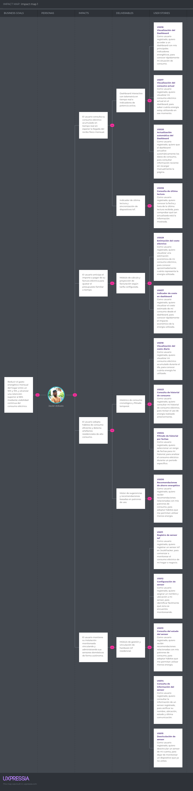
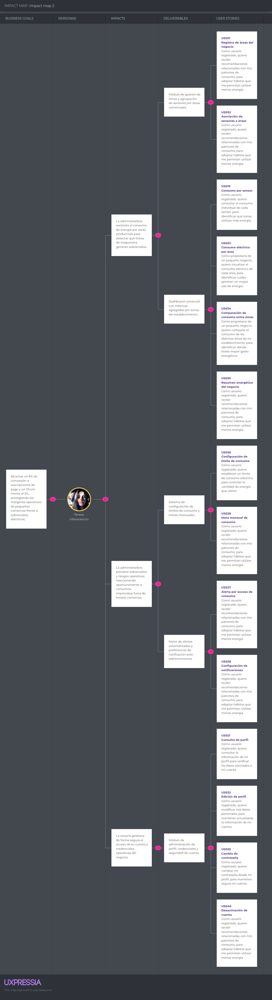
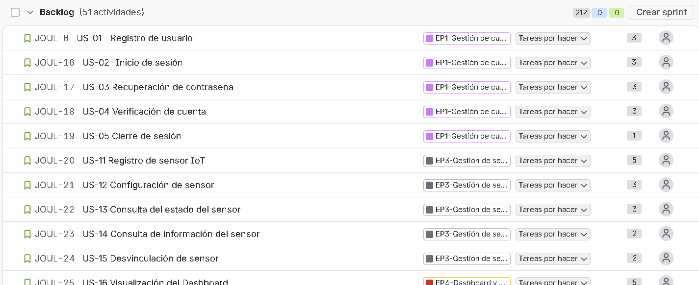

# Capítulo III: Requirements Specification

## 3.1. User Stories

Las User Stories de JouleTracker representan las necesidades funcionales identificadas para los visitantes, usuarios registrados, jefes de hogar y propietarios o administradores de pequeños negocios.

Además, se incluyen Technical Stories asociadas a las necesidades técnicas que permitirán soportar las funcionalidades planteadas. Estas Technical Stories representan trabajo planificado dentro del Product Backlog y no implican que todos los servicios se encuentren implementados actualmente.

### Epics

| Epic ID | Título | Descripción |
|---|---|---|
| **EP-01** | **Gestión de cuentas y autenticación** | Agrupa las funcionalidades relacionadas con el registro, inicio de sesión, verificación, recuperación de contraseña y seguridad de acceso de los usuarios en JouleTracker. |
| **EP-02** | **Landing Page y presentación de JouleTracker** | Incluye las funcionalidades públicas que permiten presentar JouleTracker, explicar sus beneficios, mostrar cómo funciona la solución y facilitar el acceso de los visitantes a la plataforma. |
| **EP-03** | **Gestión de sensores IoT** | Reúne las funcionalidades necesarias para registrar, configurar, consultar y desvincular sensores IoT, así como gestionar las lecturas eléctricas obtenidas mediante los dispositivos. |
| **EP-04** | **Dashboard y monitoreo de consumo** | Comprende la visualización del consumo eléctrico actual, consumo diario, información por sensor, última lectura, costo estimado y actualización de la información presentada en el dashboard. |
| **EP-05** | **Perfil, historial y gestión personal** | Agrupa las funcionalidades que permiten al usuario consultar y actualizar su perfil, revisar su historial de consumo, filtrar registros, cambiar su contraseña y desactivar su cuenta. |
| **EP-06** | **Alertas, metas y optimización energética** | Incluye la configuración de límites y metas, alertas por exceso de consumo, estimaciones económicas, recomendaciones de ahorro y preferencias de notificación. |
| **EP-07** | **Gestión energética para pequeños negocios** | Reúne las funcionalidades orientadas a organizar áreas de un establecimiento, asociar sensores, comparar consumos y consultar métricas energéticas para apoyar la gestión de pequeños negocios. |

### User Stories

| Story ID | Título | Descripción | Criterios de Aceptación | Epic |
|---|---|---|---|---|
| **US-01** | Registro de usuario | **Como visitante**, quiero registrarme en JouleTracker proporcionando mis datos personales y credenciales, para poder acceder a las funcionalidades de monitoreo de consumo eléctrico. | **Escenario 1: Registro exitoso** **Dado** que el visitante no posee una cuenta registrada **Cuando** completa todos los campos obligatorios con información válida **Entonces** el sistema crea la cuenta correctamente.  **Escenario 2: Correo registrado** **Dado** que existe una cuenta asociada al correo **Cuando** intenta registrarse nuevamente **Entonces** el sistema rechaza el registro.  **Escenario 3: Datos incompletos** **Dado** que existen campos obligatorios vacíos **Cuando** intenta registrarse **Entonces** el sistema solicita completar la información. | **EP-01** |
| **US-02** | Inicio de sesión | **Como usuario registrado**, quiero iniciar sesión con mis credenciales, para acceder de forma segura a las funcionalidades de JouleTracker. | **Escenario 1: Acceso correcto** **Dado** que el usuario posee una cuenta activa **Cuando** proporciona credenciales válidas **Entonces** el sistema permite acceder al dashboard.  **Escenario 2: Contraseña incorrecta** **Cuando** proporciona una contraseña incorrecta **Entonces** el sistema rechaza el acceso.  **Escenario 3: Cuenta inexistente** **Cuando** proporciona un correo no registrado **Entonces** el sistema informa que la cuenta no existe. | **EP-01** |
| **US-03** | Recuperación de contraseña | **Como usuario registrado**, quiero recuperar el acceso a mi cuenta cuando olvide mi contraseña, para continuar utilizando JouleTracker. | **Escenario 1:** El usuario proporciona un correo registrado y el sistema inicia el proceso de recuperación.  **Escenario 2:** El correo no pertenece a una cuenta y el sistema informa la situación.  **Escenario 3:** El usuario establece una nueva contraseña válida y puede volver a iniciar sesión. | **EP-01** |
| **US-04** | Verificación de cuenta | **Como usuario recién registrado**, quiero verificar mi cuenta, para confirmar mis datos y habilitar el acceso completo a JouleTracker. | **Escenario 1:** La verificación es válida y el sistema habilita la cuenta.  **Escenario 2:** La información de verificación es inválida y el sistema rechaza el proceso.  **Escenario 3:** La cuenta ya fue verificada y el sistema mantiene su estado. | **EP-01** |
| **US-05** | Cierre de sesión | **Como usuario autenticado**, quiero cerrar mi sesión, para evitar que otras personas accedan a mi información desde el mismo dispositivo. | **Escenario 1:** El usuario cierra sesión y el sistema finaliza el acceso.  **Escenario 2:** Después del cierre se intenta acceder a una función restringida y el sistema solicita iniciar sesión.  **Escenario 3:** La sesión expira y el sistema solicita nuevamente las credenciales. | **EP-01** |
| **US-06** | Visualización de Landing Page | **Como visitante**, quiero acceder a la Landing Page de JouleTracker, para conocer rápidamente de qué trata la solución. | **Escenario 1:** La Landing Page carga y muestra la propuesta de valor y principales funcionalidades.  **Escenario 2:** El visitante accede desde un dispositivo móvil y el contenido se adapta correctamente.  **Escenario 3:** Un recurso visual presenta un problema y el contenido principal continúa disponible. | **EP-02** |
| **US-07** | Consulta de beneficios de JouleTracker | **Como visitante**, quiero conocer los principales beneficios de JouleTracker, para evaluar si la solución puede ayudarme a controlar mi consumo eléctrico. | **Escenario 1:** El visitante accede a la sección de beneficios y puede visualizar las ventajas principales.  **Escenario 2:** Selecciona la sección desde la navegación y la página lo dirige correctamente.  **Escenario 3:** Puede consultar la información sin necesidad de autenticarse. | **EP-02** |
| **US-08** | Consulta del funcionamiento de JouleTracker | **Como visitante**, quiero conocer cómo funciona JouleTracker y sus sensores IoT, para comprender cómo se obtiene y visualiza la información de consumo. | **Escenario 1:** El sistema explica el proceso de medición, envío y visualización.  **Escenario 2:** La información se presenta mediante pasos comprensibles.  **Escenario 3:** El visitante puede acceder a la sección mediante la navegación. | **EP-02** |
| **US-09** | Consulta de funcionalidades principales | **Como visitante**, quiero conocer las funcionalidades principales de JouleTracker, para identificar qué herramientas ofrece la plataforma antes de registrarme. | **Escenario 1:** Se muestran las principales funcionalidades.  **Escenario 2:** Cada funcionalidad contiene información comprensible.  **Escenario 3:** El contenido puede visualizarse sin una cuenta registrada. | **EP-02** |
| **US-10** | Acceso a registro e inicio de sesión desde Landing Page | **Como visitante**, quiero acceder al registro o inicio de sesión desde la Landing Page, para comenzar a utilizar JouleTracker. | **Escenario 1:** El visitante selecciona registro y accede al formulario correspondiente.  **Escenario 2:** Selecciona inicio de sesión y accede a la autenticación.  **Escenario 3:** Las opciones se mantienen visibles y disponibles en la Landing Page. | **EP-02** |
| **US-11** | Registro de sensor IoT | **Como usuario registrado**, quiero registrar un sensor IoT en JouleTracker, para comenzar a monitorear el consumo eléctrico de mi hogar o negocio. | **Escenario 1:** El identificador es válido y el sensor queda asociado a la cuenta.  **Escenario 2:** El sensor ya está registrado y el sistema rechaza una asociación duplicada.  **Escenario 3:** El identificador es inválido y el sistema solicita verificar la información. | **EP-03** |
| **US-12** | Configuración de sensor | **Como usuario registrado**, quiero asignar un nombre y ubicación a mi sensor, para identificar fácilmente qué zona se encuentra monitoreando. | **Escenario 1:** El usuario establece nombre y ubicación y el sistema guarda la configuración.  **Escenario 2:** El nombre está vacío y el sistema solicita un nombre válido.  **Escenario 3:** El usuario cambia la ubicación y el sistema actualiza la información. | **EP-03** |
| **US-13** | Consulta del estado del sensor | **Como usuario registrado**, quiero consultar el estado de conexión de mis sensores, para comprobar si están enviando información correctamente. | **Escenario 1:** El sensor está conectado y el sistema muestra su estado.  **Escenario 2:** El sensor está desconectado y se muestra su última comunicación.  **Escenario 3:** El sensor recupera la conexión y el sistema actualiza su estado. | **EP-03** |
| **US-14** | Consulta de información del sensor | **Como usuario registrado**, quiero consultar la información de un sensor registrado, para verificar su nombre, ubicación, estado y última comunicación. | **Escenario 1:** El sensor existe y se presenta su información.  **Escenario 2:** El sensor no posee lecturas y el sistema lo indica.  **Escenario 3:** El identificador no existe y el sistema no muestra información de otro dispositivo. | **EP-03** |
| **US-15** | Desvinculación de sensor | **Como usuario registrado**, quiero desvincular un sensor de mi cuenta, para dejar de monitorear un dispositivo que ya no utilizo. | **Escenario 1:** El usuario confirma y el sensor se desvincula.  **Escenario 2:** El usuario cancela la operación y no se realizan cambios.  **Escenario 3:** El sensor no se encuentra asociado y el sistema informa la situación. | **EP-03** |
| **US-16** | Visualización del Dashboard | **Como usuario registrado**, quiero acceder a un dashboard con mis principales indicadores energéticos, para conocer rápidamente mi situación de consumo. | **Escenario 1:** Existen datos y se muestran los indicadores disponibles.  **Escenario 2:** No existen lecturas y el sistema informa que todavía no dispone de información suficiente.  **Escenario 3:** La sesión no es válida y el sistema solicita autenticación. | **EP-04** |
| **US-17** | Visualización del consumo actual | **Como usuario registrado**, quiero visualizar mi consumo eléctrico actual en el dashboard, para saber cuánta energía estoy utilizando en ese momento. | **Escenario 1:** Existe una lectura y el sistema muestra el consumo actual.  **Escenario 2:** El sensor está desconectado y el sistema informa que la lectura no está disponible.  **Escenario 3:** Se recibe una nueva lectura y el valor mostrado se actualiza. | **EP-04** |
| **US-18** | Visualización del consumo diario | **Como usuario registrado**, quiero visualizar mi consumo eléctrico acumulado durante el día, para conocer cuánta energía he utilizado. | **Escenario 1:** Existen lecturas y se calcula el consumo diario.  **Escenario 2:** No existen lecturas del día y el sistema lo informa.  **Escenario 3:** Se recibe una nueva lectura y el acumulado se actualiza. | **EP-04** |
| **US-19** | Consumo por sensor | **Como usuario registrado**, quiero consultar el consumo individual de cada sensor, para identificar qué zonas utilizan más energía. | **Escenario 1:** Se selecciona un sensor y se muestra su consumo.  **Escenario 2:** El sensor no posee registros y el sistema informa que no existen datos.  **Escenario 3:** El usuario cambia de sensor y la información se actualiza. | **EP-04** |
| **US-20** | Actualización automática del Dashboard | **Como usuario registrado**, quiero que el dashboard actualice automáticamente los datos de consumo, para consultar información reciente sin recargar manualmente la página. | **Escenario 1:** Existen nuevas lecturas y los indicadores se actualizan.  **Escenario 2:** No existen nuevos datos y se conserva la última información válida.  **Escenario 3:** Existe un problema de comunicación y se mantienen los últimos valores disponibles. | **EP-04** |
| **US-21** | Consulta de perfil | **Como usuario registrado**, quiero consultar la información de mi perfil, para verificar los datos asociados a mi cuenta. | **Escenario 1:** El usuario está autenticado y puede consultar su información.  **Escenario 2:** La sesión no es válida y se solicita autenticación.  **Escenario 3:** Los datos fueron modificados y se presenta la información actualizada. | **EP-05** |
| **US-22** | Edición de perfil | **Como usuario registrado**, quiero modificar mis datos personales, para mantener actualizada la información de mi cuenta. | **Escenario 1:** Los datos son válidos y se guardan correctamente.  **Escenario 2:** La información posee un formato inválido y se rechaza la modificación.  **Escenario 3:** Existen campos obligatorios vacíos y el sistema solicita completarlos. | **EP-05** |
| **US-23** | Consulta de historial de consumo | **Como usuario registrado**, quiero consultar mi historial de consumo eléctrico, para revisar el uso de energía realizado anteriormente. | **Escenario 1:** Existen lecturas históricas y se muestran cronológicamente.  **Escenario 2:** No existen registros y el sistema lo informa.  **Escenario 3:** Se incorporan nuevas lecturas y aparecen en futuras consultas. | **EP-05** |
| **US-24** | Filtrado de historial por fechas | **Como usuario registrado**, quiero seleccionar un rango de fechas para mi historial, para analizar el consumo eléctrico durante un periodo específico. | **Escenario 1:** El rango es válido y se muestran los registros correspondientes.  **Escenario 2:** No existen datos en el periodo y el sistema lo informa.  **Escenario 3:** La fecha inicial es posterior a la final y el sistema solicita corregirlas. | **EP-05** |
| **US-25** | Cambio de contraseña | **Como usuario registrado**, quiero cambiar mi contraseña desde mi perfil, para mantener segura mi cuenta. | **Escenario 1:** La contraseña actual es correcta y la nueva cumple los requisitos.  **Escenario 2:** La contraseña actual es incorrecta y se rechaza el cambio.  **Escenario 3:** La nueva contraseña no cumple los requisitos y el sistema solicita corregirla. | **EP-05** |
| **US-26** | Configuración de límite de consumo | **Como usuario registrado**, quiero establecer un límite de consumo eléctrico, para controlar la cantidad de energía que utilizo. | **Escenario 1:** El límite es válido y se almacena.  **Escenario 2:** El valor es inválido y se rechaza la configuración.  **Escenario 3:** Existe un límite anterior y se reemplaza por el nuevo valor. | **EP-06** |
| **US-27** | Alerta por exceso de consumo | **Como usuario registrado**, quiero recibir una alerta cuando mi consumo supere el límite establecido, para reducir oportunamente el uso de energía. | **Escenario 1:** El consumo supera el límite y se genera una alerta.  **Escenario 2:** El consumo permanece dentro del límite y no se genera alerta de exceso.  **Escenario 3:** Se detecta posteriormente un nuevo exceso y se registra un nuevo evento. | **EP-06** |
| **US-28** | Meta mensual de consumo | **Como usuario registrado**, quiero establecer una meta mensual de consumo eléctrico, para administrar mejor la energía utilizada durante el mes. | **Escenario 1:** La meta es válida y se almacena.  **Escenario 2:** El valor es inválido y el sistema solicita corregirlo.  **Escenario 3:** El usuario modifica su meta y el sistema actualiza el objetivo mensual. | **EP-06** |
| **US-29** | Estimación del costo eléctrico | **Como usuario registrado**, quiero visualizar una estimación económica de mi consumo eléctrico, para conocer aproximadamente cuánto representa la energía utilizada. | **Escenario 1:** Existen datos suficientes y se muestra una estimación.  **Escenario 2:** No existe información tarifaria y el sistema informa que el cálculo no está disponible.  **Escenario 3:** Se reciben nuevas lecturas y la estimación se actualiza. | **EP-06** |
| **US-30** | Recomendaciones de ahorro energético | **Como usuario registrado**, quiero recibir recomendaciones relacionadas con mis patrones de consumo, para adoptar hábitos que me permitan utilizar menos energía. | **Escenario 1:** Existen suficientes registros y se muestran recomendaciones.  **Escenario 2:** No existe suficiente información y el sistema no genera recomendaciones sin datos suficientes.  **Escenario 3:** Los patrones cambian y las recomendaciones se actualizan. | **EP-06** |
| **US-31** | Registro de áreas del negocio | **Como propietario de un pequeño negocio**, quiero registrar diferentes áreas de mi establecimiento, para organizar los sensores según la zona que monitorean. | **Escenario 1:** El área posee un nombre válido y queda registrada.  **Escenario 2:** El nombre está vacío y la operación es rechazada.  **Escenario 3:** El propietario modifica el nombre y el sistema actualiza el área. | **EP-07** |
| **US-32** | Asociación de sensores a áreas | **Como propietario de un pequeño negocio**, quiero asociar mis sensores a diferentes áreas del establecimiento, para conocer dónde se genera cada consumo. | **Escenario 1:** El sensor y el área existen y quedan asociados.  **Escenario 2:** El sensor cambia de área y se actualiza la asociación.  **Escenario 3:** El área no existe y el sistema impide la operación. | **EP-07** |
| **US-33** | Consumo eléctrico por área | **Como propietario de un pequeño negocio**, quiero visualizar el consumo eléctrico de cada área, para identificar cuáles generan un mayor uso de energía. | **Escenario 1:** Existen sensores asociados y se muestra el consumo del área.  **Escenario 2:** El área no posee sensores y el sistema informa que no existen datos.  **Escenario 3:** Se recibe una nueva lectura y se actualiza el consumo. | **EP-07** |
| **US-34** | Comparación de consumo entre áreas | **Como propietario de un pequeño negocio**, quiero comparar el consumo de las distintas áreas de mi establecimiento, para identificar dónde existe mayor gasto energético. | **Escenario 1:** Existen datos de diferentes áreas y se muestran para comparación.  **Escenario 2:** Una zona no posee datos suficientes y el sistema lo informa.  **Escenario 3:** Se selecciona un periodo y la comparación utiliza únicamente esos registros. | **EP-07** |
| **US-35** | Resumen energético del negocio | **Como propietario de un pequeño negocio**, quiero consultar un resumen del consumo total de mi establecimiento, para supervisar rápidamente el uso general de energía. | **Escenario 1:** Existen datos y se presenta el consumo total.  **Escenario 2:** Existen varias áreas y se incluye información de las principales zonas.  **Escenario 3:** No existen lecturas y el sistema informa que todavía no dispone de datos. | **EP-07** |
| **US-36** | Consulta de última lectura | **Como usuario registrado**, quiero conocer la fecha y hora de la última lectura recibida, para comprobar qué tan actualizada está la información mostrada. | **Escenario 1:** Existe una lectura y se presenta su fecha y hora.  **Escenario 2:** El sensor no posee lecturas y el sistema lo informa.  **Escenario 3:** Se recibe una nueva lectura y se actualiza la fecha y hora. | **EP-04** |
| **US-37** | Indicador de costo en Dashboard | **Como usuario registrado**, quiero visualizar el costo estimado de mi consumo desde el dashboard, para conocer rápidamente el impacto económico de la energía utilizada. | **Escenario 1:** Existen consumo y tarifa y se presenta el costo estimado.  **Escenario 2:** No existe tarifa y se informa que el cálculo no está disponible.  **Escenario 3:** Se reciben nuevas lecturas y el importe se actualiza. | **EP-04** |
| **US-38** | Configuración de notificaciones | **Como usuario registrado**, quiero configurar qué notificaciones deseo recibir, para controlar los avisos enviados por JouleTracker. | **Escenario 1:** El usuario activa o desactiva una categoría y se guarda la preferencia.  **Escenario 2:** No realiza cambios y se conserva la configuración existente.  **Escenario 3:** Ocurre un evento crítico y se registra la notificación correspondiente. | **EP-06** |
| **US-39** | Consulta de soluciones para hogares y pequeños negocios | **Como visitante**, quiero conocer cómo JouleTracker puede utilizarse en hogares y pequeños negocios, para identificar qué opción se adapta mejor a mis necesidades. | **Escenario 1:** El visitante consulta la solución para hogares y visualiza sus beneficios.  **Escenario 2:** Consulta la solución para pequeños negocios y visualiza sus funcionalidades.  **Escenario 3:** Puede cambiar entre ambos segmentos manteniendo disponible la navegación. | **EP-02** |
| **US-40** | Desactivación de cuenta | **Como usuario registrado**, quiero desactivar mi cuenta cuando ya no desee utilizar JouleTracker, para dejar de acceder a las funcionalidades de la plataforma. | **Escenario 1:** El usuario confirma la desactivación y la cuenta pasa a estado inactivo.  **Escenario 2:** Cancela la confirmación y la cuenta permanece activa.  **Escenario 3:** Intenta acceder posteriormente y el sistema informa que la cuenta se encuentra inactiva. | **EP-05** |
| **US-41** | Registro y administración de dispositivos eléctricos | **Como usuario registrado**, quiero registrar, editar y categorizar mis electrodomésticos según su ubicación, para identificar y gestionar individualmente los aparatos que consumen energía en mi inmueble. | **Escenario 1: Registro exitoso de dispositivo** **Dado** que el usuario accede al formulario de nuevo dispositivo **Cuando** ingresa nombre, ubicación, categoría (Hogar, Cocina, Oficina u otros) y estado inicial **Entonces** el sistema registra el dispositivo y lo muestra en el catálogo.  **Escenario 2: Edición de dispositivo existente** **Dado** un dispositivo registrado en el sistema **Cuando** el usuario modifica su denominación, categoría o ubicación **Entonces** el sistema actualiza la información del dispositivo correctamente.  **Escenario 3: Límite de dispositivos alcanzado según el plan** **Dado** un usuario que ha alcanzado el límite máximo de dispositivos permitidos por su plan **Cuando** intenta registrar un dispositivo adicional **Entonces** el sistema restringe el registro e informa que requiere actualizar su suscripción. | **EP-03** |
| **US-42** | Detección y visualización de consumo fantasma (*Standby Power*) | **Como usuario registrado**, quiero visualizar el consumo residual o en espera de mis dispositivos con alta precisión, para identificar qué aparatos continúan consumiendo energía aun cuando no están en uso activo. | **Escenario 1: Detección de consumo residual bajo** **Dado** que un dispositivo registra una potencia mayor a 0 kW pero inferior a 0.05 kW **Cuando** el usuario consulta su tarjeta de dispositivo **Entonces** el sistema presenta el consumo con tres decimales en kW para visibilizar el consumo en espera.  **Escenario 2: Consumo en operación estándar** **Dado** que un dispositivo registra una potencia igual o mayor a 0.05 kW **Cuando** se muestra en la interfaz **Entonces** el sistema presenta el valor con dos decimales estándar en kW.  **Escenario 3: Filtrado de dispositivos en espera** **Dado** el catálogo de dispositivos registrados **Cuando** el usuario selecciona el filtro por estado "En espera" **Entonces** el sistema lista únicamente los equipos con consumo residual activo. | **EP-04** |
| **US-43** | Asignación de sensores a perfiles referenciales de artefactos | **Como usuario registrado**, quiero asociar mis sensores a perfiles predeterminados de artefactos (refrigeradora, aire acondicionado, terma), para comparar su consumo diario frente a estándares de eficiencia energética. | **Escenario 1: Asignación de perfil referencial al sensor** **Dado** que el usuario registra o configura un sensor IoT **Cuando** selecciona un perfil de artefacto con consumo diario recomendado **Entonces** el sensor adopta dicho umbral de referencia para su monitoreo.  **Escenario 2: Alerta visual por consumo superior al estándar** **Dado** que la energía diaria acumulada del sensor excede el valor recomendado del perfil asignado **Cuando** el usuario consulta el listado de sensores **Entonces** el sistema resalta visualmente el estado de sobreconsumo frente al benchmark.  **Escenario 3: Sensor sin perfil asignado** **Dado** que el usuario no selecciona un perfil específico para el sensor **Cuando** guarda la configuración **Entonces** el sistema monitorea el consumo del dispositivo sin contrastarlo con un umbral predeterminado. | **EP-03** |
| **US-44** | Eliminación de dispositivos y liberación de sensores | **Como usuario registrado**, quiero eliminar un dispositivo retirado del inmueble, para mantener actualizado mi inventario y liberar el sensor IoT vinculado para su reutilización. | **Escenario 1: Eliminación de dispositivo con sensor vinculado** **Dado** que el usuario confirma la eliminación de un dispositivo que tiene un sensor asignado **Cuando** se procesa la eliminación **Entonces** el dispositivo es retirado del catálogo y el sensor asociado pasa automáticamente al estado libre sin asignar.  **Escenario 2: Cancelación de la eliminación** **Dado** que se presenta el cuadro modal de confirmación de eliminación **Cuando** el usuario cancela la acción **Entonces** el sistema conserva el dispositivo y mantiene la vinculación del sensor sin cambios.  **Escenario 3: Eliminación de dispositivo sin sensor vinculado** **Dado** un dispositivo sin sensor asociado **Cuando** el usuario confirma su eliminación **Entonces** el sistema lo elimina del catálogo sin alterar el estado de otros componentes. | **EP-03** |
| **US-45** | Visualización de impacto ambiental y emisiones de CO₂ evitadas | **Como usuario registrado**, quiero consultar las emisiones de CO₂ evitadas y su equivalencia en árboles plantados a partir de mis ahorros, para conocer el impacto ecológico positivo de mis hábitos de consumo. | **Escenario 1: Cálculo y presentación de emisiones de CO₂ evitadas** **Dado** que el usuario registra un ahorro de energía frente a su línea base **Cuando** accede al dashboard o a la sección de recomendaciones **Entonces** el sistema calcula y muestra los kilogramos de CO₂ evitados aplicando el factor de emisión de la red eléctrica nacional (0.25 kg CO₂/kWh).  **Escenario 2: Equivalencia ecológica en árboles absorbentes** **Dado** que se han calculado emisiones de CO₂ evitadas **Cuando** el usuario visualiza el indicador ambiental **Entonces** el sistema presenta la equivalencia en cantidad de árboles urbanos requeridos para absorber dicha cantidad de carbono.  **Escenario 3: Sin ahorros registrados en el periodo** **Dado** que el usuario no presenta ahorro energético respecto a su consumo base **Cuando** consulta el indicador ambiental **Entonces** el sistema muestra el valor en cero sin emitir advertencias de error. | **EP-06** |
| **US-46** | Selección de planes y control de acceso por niveles (*Paywall*) | **Como usuario registrado**, quiero consultar los planes de suscripción disponibles (Starter, Plus, Pro) y recibir avisos ante funciones restringidas, para gestionar las capacidades operativas de mi cuenta. | **Escenario 1: Actualización de plan de suscripción** **Dado** que el usuario selecciona un nuevo plan de suscripción desde la vista correspondiente **Cuando** confirma su elección **Entonces** el sistema actualiza inmediatamente su nivel de acceso y los límites asignados a su cuenta.  **Escenario 2: Acceso a funcionalidad restringida por el plan actual** **Dado** que el usuario posee un plan que restringe un módulo (como sensores o recomendaciones avanzadas) **Cuando** intenta ingresar a dicha sección **Entonces** el sistema presenta un componente informativo indicando el plan requerido para habilitar la funcionalidad.  **Escenario 3: Restricción de rango histórico según el plan** **Dado** que el usuario posee un plan con límite de consulta histórica **Cuando** intenta filtrar reportes por un periodo superior al permitido **Entonces** el sistema bloquea los rangos no disponibles e invita a mejorar el plan. | **EP-01** |
| **US-47** | Reportes analíticos con métricas agregadas y evolución temporal | **Como usuario registrado**, quiero consultar un módulo de reportes con métricas agregadas (promedio, pico, costo) y un gráfico de evolución temporal, para analizar detalladamente las tendencias de mi consumo. | **Escenario 1: Cálculo de métricas agregadas del periodo** **Dado** que el usuario selecciona un rango de fechas válido **Cuando** se generan los reportes **Entonces** el sistema calcula y presenta el consumo total, el promedio diario, el costo estimado total y el valor pico registrado en dicho periodo.  **Escenario 2: Visualización del gráfico de barras de evolución** **Dado** que existen registros diarios en el rango seleccionado **Cuando** se carga la sección de reportes **Entonces** el sistema despliega un gráfico de barras interactivo con el consumo de cada jornada.  **Escenario 3: Periodo sin registros de consumo** **Dado** que no existen lecturas en el periodo consultado **Cuando** se aplican los filtros **Entonces** el sistema informa que no hay datos disponibles sin interrumpir la operatividad de la página. | **EP-05** |
| **US-48** | Configuración de datos del inmueble ("Mi Hogar") | **Como usuario registrado**, quiero ingresar y actualizar las características de mi vivienda (tipo de inmueble, ocupantes, ubicación y tarifa), para que las estimaciones y sugerencias se adecúen a mi entorno real. | **Escenario 1: Guardado exitoso de información del hogar** **Dado** que el usuario completa los campos del formulario de su vivienda en la vista de configuración **Cuando** guarda los cambios **Entonces** el sistema almacena el tipo de inmueble, ocupantes, distrito y tarifa asignada en su perfil.  **Escenario 2: Validación de datos obligatorios** **Dado** que existen campos requeridos incompletos o con formatos no válidos **Cuando** intenta guardar la información **Entonces** el sistema resalta los campos con error y mantiene la información previa.  **Escenario 3: Persistencia de datos registrados** **Dado** que el usuario ha guardado previamente los datos de su vivienda **Cuando** vuelve a ingresar a la sección de configuración **Entonces** el sistema muestra los datos previamente ingresados para su consulta o modificación. | **EP-05** |

### Technical Stories

| Technical Story ID | Título | Descripción | Criterios de Aceptación | Epic |
|---|---|---|---|---|
| **TS-01** | Register User | **Como desarrollador**, quiero implementar el servicio de registro de usuario, para permitir la creación de cuentas en JouleTracker. | Una solicitud válida permite registrar al usuario; los datos inválidos son rechazados; no se permiten correos duplicados. | **EP-01** |
| **TS-02** | Login User | **Como desarrollador**, quiero implementar el servicio de inicio de sesión, para autenticar usuarios y permitir el acceso seguro a las funcionalidades privadas. | Las credenciales válidas permiten autenticación; las credenciales incorrectas son rechazadas; no se expone información sensible. | **EP-01** |
| **TS-03** | Recover Password | **Como desarrollador**, quiero implementar el proceso de recuperación de contraseña, para que un usuario pueda restablecer sus credenciales de forma segura. | El sistema inicia la recuperación para una cuenta válida; rechaza información inválida; el proceso de recuperación posee una vigencia controlada. | **EP-01** |
| **TS-04** | Verify Account | **Como desarrollador**, quiero implementar la verificación de cuenta, para habilitar usuarios que hayan completado correctamente el proceso de validación. | Una verificación válida actualiza la cuenta; una verificación inválida es rechazada; una cuenta ya verificada mantiene su estado. | **EP-01** |
| **TS-05** | Register Sensor | **Como desarrollador**, quiero implementar el registro de sensores IoT, para asociar dispositivos de medición con una cuenta autenticada. | Se registra un sensor válido; se evita el registro duplicado; los identificadores inválidos son rechazados. | **EP-03** |
| **TS-06** | Configure Sensor | **Como desarrollador**, quiero implementar la actualización de la configuración de un sensor, para modificar su nombre y ubicación dentro de JouleTracker. | Se permite modificar un sensor perteneciente al usuario; los sensores inexistentes son identificados; no se permite modificar dispositivos asociados a otra cuenta. | **EP-03** |
| **TS-07** | Receive Energy Reading | **Como desarrollador**, quiero implementar la recepción de lecturas eléctricas, para almacenar las mediciones enviadas por los sensores IoT. | Las lecturas válidas se almacenan; los sensores desconocidos no pueden registrar lecturas; las mediciones inválidas son rechazadas. | **EP-03** |
| **TS-08** | Get Sensor Status | **Como desarrollador**, quiero implementar la consulta del estado de sensores, para indicar si un dispositivo está conectado y cuándo transmitió por última vez. | Se informa correctamente el estado del sensor; se conserva la última comunicación disponible; los sensores inexistentes son identificados. | **EP-03** |
| **TS-09** | Get Dashboard Summary | **Como desarrollador**, quiero implementar la consulta principal del dashboard, para entregar los indicadores energéticos de la cuenta autenticada. | Se presentan los indicadores disponibles; una cuenta sin lecturas recibe una respuesta válida sin datos; el acceso requiere autenticación. | **EP-04** |
| **TS-10** | Get Latest Reading | **Como desarrollador**, quiero implementar la consulta de la última lectura, para mostrar el consumo reciente y la fecha de actualización de cada sensor. | Se devuelve la lectura más reciente; se identifica cuando todavía no existen lecturas; se controlan sensores inexistentes. | **EP-04** |
| **TS-11** | Update Dashboard Data | **Como desarrollador**, quiero implementar la actualización de los datos del dashboard, para reflejar nuevas lecturas sin recargar manualmente la página. | Los nuevos datos actualizan el dashboard; sin lecturas nuevas se mantiene la última información válida; ante problemas de comunicación se conservan los datos previos. | **EP-04** |
| **TS-12** | Get User Profile | **Como desarrollador**, quiero implementar la consulta y actualización del perfil, para permitir que cada usuario gestione sus datos personales. | El usuario puede consultar su perfil; los datos válidos pueden actualizarse; la información inválida es rechazada. | **EP-05** |
| **TS-13** | Get Consumption History | **Como desarrollador**, quiero implementar la consulta del historial de consumo, para mostrar únicamente las lecturas pertenecientes al usuario autenticado. | Se recuperan los registros del usuario; se admite una colección vacía cuando no existen datos; pueden utilizarse rangos de fechas válidos. | **EP-05** |
| **TS-14** | Generate Consumption Alert | **Como desarrollador**, quiero implementar la evaluación automática del consumo, para generar alertas preventivas o de exceso según los límites configurados. | Se genera una alerta cuando se supera un límite; pueden producirse advertencias preventivas; el consumo normal no genera alertas de exceso. | **EP-06** |
| **TS-15** | Calculate Estimated Cost | **Como desarrollador**, quiero implementar el cálculo del costo estimado, para convertir el consumo registrado en un importe aproximado según la información tarifaria disponible. | Con datos suficientes se calcula un importe; sin información tarifaria no se genera un valor incorrecto; nuevas lecturas actualizan la estimación. | **EP-06** |
| **TS-16** | Manage Business Areas | **Como desarrollador**, quiero implementar la gestión de áreas de pequeños negocios, para organizar sensores y consumo eléctrico por zonas. | Se pueden crear áreas válidas; los sensores pueden asociarse a áreas existentes; no se permiten asociaciones con áreas inexistentes. | **EP-07** |
| **TS-17** | Get Business Dashboard Metrics | **Como desarrollador**, quiero implementar las consultas del dashboard para pequeños negocios, para obtener consumo total y métricas por área. | Se muestran métricas cuando existen datos; las áreas sin información son identificadas; las consultas pueden considerar un periodo seleccionado. | **EP-07** |

---

## 3.2. Impact Mapping

El Impact Mapping de JouleTracker refleja la relación entre los objetivos de negocio de VoltLab, los actores clave identificados, los impactos esperados en su comportamiento y las funcionalidades de software propuestas para alcanzar dichos objetivos.

### Objetivo de negocio 1: Segmento de propietarios de hogares urbanos

Alcanzar una tasa de retención mensual superior al 65% en usuarios residenciales y promover una reducción del consumo eléctrico doméstico mediante el monitoreo energético, la visualización de información de consumo, las proyecciones económicas y las alertas preventivas.

**Actor principal:** Jefe de hogar.

**Impacto esperado:** Transicionar de una gestión reactiva del consumo eléctrico a una gestión preventiva, permitiendo anticipar posibles sobrecostos, identificar patrones de consumo y tomar decisiones orientadas al ahorro energético.

**Entregables y funcionalidades relacionadas:**

- Monitoreo mediante sensores IoT.
- Dashboard de consumo eléctrico.
- Visualización del consumo actual.
- Historial de consumo.
- Estimación del costo eléctrico.
- Configuración de límites.
- Metas mensuales de consumo.
- Alertas por exceso de consumo.
- Recomendaciones de ahorro energético.

**Figura:** Impact Mapping correspondiente al segmento de jefes de hogares urbanos.

---

### Objetivo de negocio 2: Segmento de propietarios y administradores de pequeños negocios

Lograr que los propietarios y administradores de pequeños negocios puedan supervisar y controlar el consumo eléctrico de sus establecimientos mediante información organizada por áreas, indicadores energéticos y alertas preventivas que permitan reducir sobrecostos operativos.

**Actor principal:** Propietario o administrador de pequeño negocio.

**Impacto esperado:** Mejorar el control energético del establecimiento mediante el monitoreo de diferentes áreas, identificación de consumos elevados y consulta de indicadores que permitan tomar decisiones sobre el uso de energía.

**Entregables y funcionalidades relacionadas:**

- Registro de áreas del negocio.
- Asociación de sensores a áreas.
- Consumo eléctrico por área.
- Comparación de consumo entre áreas.
- Resumen energético del negocio.
- Monitoreo mediante sensores IoT.
- Alertas por exceso de consumo.
- Estimación del costo eléctrico.

**Figura:** Impact Mapping correspondiente al segmento de propietarios y administradores de pequeños negocios.

---

## 3.3. Product Backlog

El Product Backlog de JouleTracker organiza y prioriza las User Stories y Technical Stories identificadas para el producto. Los Story Points corresponden a la estimación de esfuerzo registrada por el equipo en Jira.

| # Orden | Story ID | Título | Descripción | Story Points |
|:---:|:---:|---|---|:---:|
| 1 | **US-06** | Visualización de Landing Page | Como visitante, quiero acceder a la Landing Page de JouleTracker, para conocer rápidamente de qué trata la solución. | **3** |
| 2 | **US-07** | Consulta de beneficios de JouleTracker | Como visitante, quiero conocer los principales beneficios de JouleTracker, para evaluar si la solución puede ayudarme a controlar mi consumo eléctrico. | **2** |
| 3 | **US-08** | Consulta del funcionamiento de JouleTracker | Como visitante, quiero conocer cómo funciona JouleTracker y sus sensores IoT, para comprender cómo se obtiene y visualiza la información de consumo. | **2** |
| 4 | **US-09** | Consulta de funcionalidades principales | Como visitante, quiero conocer las funcionalidades principales de JouleTracker, para identificar qué herramientas ofrece la plataforma antes de registrarme. | **2** |
| 5 | **US-10** | Acceso a registro e inicio de sesión desde Landing Page | Como visitante, quiero acceder al registro o inicio de sesión desde la Landing Page, para comenzar a utilizar JouleTracker. | **2** |
| 6 | **US-01** | Registro de usuario | Como visitante, quiero registrarme en JouleTracker proporcionando mis datos personales y credenciales, para acceder a las funcionalidades de monitoreo de consumo eléctrico. | **3** |
| 7 | **US-02** | Inicio de sesión | Como usuario registrado, quiero iniciar sesión con mis credenciales, para acceder de forma segura a JouleTracker. | **3** |
| 8 | **US-11** | Registro de sensor IoT | Como usuario registrado, quiero registrar un sensor IoT en JouleTracker, para comenzar a monitorear el consumo eléctrico de mi hogar o negocio. | **5** |
| 9 | **US-12** | Configuración de sensor | Como usuario registrado, quiero asignar un nombre y ubicación a mi sensor, para identificar la zona monitoreada. | **3** |
| 10 | **US-16** | Visualización del Dashboard | Como usuario registrado, quiero acceder a un dashboard con mis principales indicadores energéticos, para conocer rápidamente mi situación de consumo. | **5** |
| 11 | **US-17** | Visualización del consumo actual | Como usuario registrado, quiero visualizar mi consumo eléctrico actual, para saber cuánta energía estoy utilizando. | **5** |
| 12 | **US-18** | Visualización del consumo diario | Como usuario registrado, quiero visualizar mi consumo acumulado durante el día, para conocer cuánta energía he utilizado. | **3** |
| 13 | **US-19** | Consumo por sensor | Como usuario registrado, quiero consultar el consumo individual de cada sensor, para identificar qué zonas utilizan más energía. | **3** |
| 14 | **US-20** | Actualización automática del Dashboard | Como usuario registrado, quiero que el dashboard actualice los datos de consumo, para consultar información reciente. | **5** |
| 15 | **US-36** | Consulta de última lectura | Como usuario registrado, quiero conocer la fecha y hora de la última lectura recibida, para comprobar qué tan actualizada está la información. | **2** |
| 16 | **US-37** | Indicador de costo en Dashboard | Como usuario registrado, quiero visualizar el costo estimado desde el dashboard, para conocer el impacto económico del consumo. | **3** |
| 17 | **US-23** | Consulta de historial de consumo | Como usuario registrado, quiero consultar mi historial de consumo eléctrico, para revisar el uso de energía realizado anteriormente. | **3** |
| 18 | **US-24** | Filtrado de historial por fechas | Como usuario registrado, quiero seleccionar un rango de fechas, para analizar el consumo durante un periodo específico. | **3** |
| 19 | **US-26** | Configuración de límite de consumo | Como usuario registrado, quiero establecer un límite de consumo eléctrico, para controlar la cantidad de energía que utilizo. | **3** |
| 20 | **US-27** | Alerta por exceso de consumo | Como usuario registrado, quiero recibir una alerta cuando mi consumo supere el límite establecido, para reducir oportunamente el uso de energía. | **5** |
| 21 | **US-28** | Meta mensual de consumo | Como usuario registrado, quiero establecer una meta mensual de consumo eléctrico, para administrar mejor la energía utilizada durante el mes. | **3** |
| 22 | **US-29** | Estimación del costo eléctrico | Como usuario registrado, quiero visualizar una estimación económica de mi consumo, para conocer aproximadamente cuánto representa la energía utilizada. | **5** |
| 23 | **US-30** | Recomendaciones de ahorro energético | Como usuario registrado, quiero recibir recomendaciones relacionadas con mis patrones de consumo, para adoptar hábitos de ahorro energético. | **5** |
| 24 | **US-38** | Configuración de notificaciones | Como usuario registrado, quiero configurar qué notificaciones deseo recibir, para controlar los avisos enviados por JouleTracker. | **2** |
| 25 | **US-31** | Registro de áreas del negocio | Como propietario de un pequeño negocio, quiero registrar diferentes áreas de mi establecimiento, para organizar los sensores según la zona que monitorean. | **3** |
| 26 | **US-32** | Asociación de sensores a áreas | Como propietario de un pequeño negocio, quiero asociar mis sensores a diferentes áreas, para conocer dónde se genera cada consumo. | **3** |
| 27 | **US-33** | Consumo eléctrico por área | Como propietario de un pequeño negocio, quiero visualizar el consumo eléctrico de cada área, para identificar cuáles generan mayor uso de energía. | **5** |
| 28 | **US-34** | Comparación de consumo entre áreas | Como propietario de un pequeño negocio, quiero comparar el consumo de las distintas áreas, para identificar dónde existe mayor gasto energético. | **5** |
| 29 | **US-35** | Resumen energético del negocio | Como propietario de un pequeño negocio, quiero consultar un resumen del consumo total de mi establecimiento, para supervisar rápidamente el uso de energía. | **5** |
| 30 | **US-21** | Consulta de perfil | Como usuario registrado, quiero consultar la información de mi perfil, para verificar los datos asociados a mi cuenta. | **2** |
| 31 | **US-22** | Edición de perfil | Como usuario registrado, quiero modificar mis datos personales, para mantener actualizada la información de mi cuenta. | **3** |
| 32 | **US-25** | Cambio de contraseña | Como usuario registrado, quiero cambiar mi contraseña, para mantener segura mi cuenta. | **3** |
| 33 | **US-03** | Recuperación de contraseña | Como usuario registrado, quiero recuperar el acceso cuando olvide mi contraseña, para continuar utilizando JouleTracker. | **3** |
| 34 | **US-04** | Verificación de cuenta | Como usuario recién registrado, quiero verificar mi cuenta, para habilitar el acceso completo a JouleTracker. | **3** |
| 35 | **US-05** | Cierre de sesión | Como usuario autenticado, quiero cerrar mi sesión, para proteger mi información. | **1** |
| 36 | **US-13** | Consulta del estado del sensor | Como usuario registrado, quiero consultar el estado de conexión de mis sensores, para comprobar si están enviando información correctamente. | **3** |
| 37 | **US-14** | Consulta de información del sensor | Como usuario registrado, quiero consultar la información de un sensor, para verificar su nombre, ubicación, estado y última comunicación. | **2** |
| 38 | **US-15** | Desvinculación de sensor | Como usuario registrado, quiero desvincular un sensor, para dejar de monitorear un dispositivo que ya no utilizo. | **2** |
| 39 | **US-39** | Consulta de soluciones para hogares y pequeños negocios | Como visitante, quiero conocer cómo JouleTracker puede utilizarse en hogares y pequeños negocios, para identificar qué opción se adapta a mis necesidades. | **2** |
| 40 | **US-40** | Desactivación de cuenta | Como usuario registrado, quiero desactivar mi cuenta cuando ya no desee utilizar JouleTracker. | **3** |
| 41 | **US-41** | Registro y administración de dispositivos eléctricos | Como usuario registrado, quiero registrar, editar y categorizar mis electrodomésticos, para identificar los aparatos conectados a mis sensores. | **5** |
| 42 | **US-42** | Detección de consumo fantasma (*Standby Power*) | Como usuario registrado, quiero visualizar el consumo residual de mis equipos apagados con alta precisión, para identificar pérdidas energéticas pasivas. | **3** |
| 43 | **US-43** | Asignación de sensores a perfiles referenciales de artefactos | Como usuario registrado, quiero vincular un sensor a un perfil de electrodoméstico predefinido, para comparar su consumo diario contra estándares eficientes. | **5** |
| 44 | **US-44** | Eliminación de dispositivos y liberación de sensores | Como usuario registrado, quiero eliminar un dispositivo retirado del inmueble, para mantener actualizado mi inventario y liberar el sensor asociado. | **3** |
| 45 | **US-45** | Visualización de impacto ambiental y emisiones de CO₂ evitadas | Como usuario registrado, quiero consultar el CO₂ evitado y su equivalencia en árboles a partir de mis ahorros, para conocer el impacto ecológico de mi consumo. | **3** |
| 46 | **US-46** | Selección de planes y control de acceso por niveles (*Paywall*) | Como usuario registrado, quiero consultar los planes de suscripción y recibir avisos ante funciones restringidas, para gestionar las capacidades de mi cuenta. | **5** |
| 47 | **US-47** | Reportes analíticos con métricas agregadas y evolución temporal | Como usuario registrado, quiero consultar reportes con métricas agregadas (promedio, pico, costo) y evolución temporal, para analizar tendencias de consumo. | **5** |
| 48 | **US-48** | Configuración de datos del inmueble ("Mi Hogar") | Como usuario registrado, quiero registrar las características de mi vivienda, para que las estimaciones y sugerencias se adecúen a mi entorno real. | **2** |
| 49 | **TS-01** | Register User | Como desarrollador, quiero implementar el registro de usuario, para permitir la creación de cuentas en JouleTracker. | **5** |
| 50 | **TS-02** | Login User | Como desarrollador, quiero implementar el inicio de sesión, para autenticar usuarios y permitir el acceso seguro. | **5** |
| 51 | **TS-03** | Recover Password | Como desarrollador, quiero implementar la recuperación de contraseña, para permitir restablecer credenciales de forma segura. | **5** |
| 52 | **TS-04** | Verify Account | Como desarrollador, quiero implementar la verificación de cuenta, para validar correctamente a los usuarios registrados. | **3** |
| 53 | **TS-05** | Register Sensor | Como desarrollador, quiero implementar el registro de sensores IoT, para asociar dispositivos con una cuenta. | **5** |
| 54 | **TS-06** | Configure Sensor | Como desarrollador, quiero implementar la configuración de un sensor, para modificar su nombre y ubicación. | **6** |
| 55 | **TS-07** | Receive Energy Reading | Como desarrollador, quiero implementar la recepción de lecturas eléctricas, para almacenar mediciones enviadas por sensores IoT. | **8** |
| 56 | **TS-08** | Get Sensor Status | Como desarrollador, quiero implementar la consulta del estado de sensores, para conocer su conexión y última transmisión. | **3** |
| 57 | **TS-09** | Get Dashboard Summary | Como desarrollador, quiero implementar la consulta principal del dashboard, para entregar los indicadores energéticos del usuario. | **8** |
| 58 | **TS-10** | Get Latest Reading | Como desarrollador, quiero implementar la consulta de la última lectura, para mostrar el consumo reciente y su fecha de actualización. | **5** |
| 59 | **TS-11** | Update Dashboard Data | Como desarrollador, quiero implementar la actualización de los datos del dashboard, para reflejar nuevas lecturas. | **8** |
| 60 | **TS-12** | Get User Profile | Como desarrollador, quiero implementar la consulta y actualización del perfil, para permitir gestionar los datos personales. | **5** |
| 61 | **TS-13** | Get Consumption History | Como desarrollador, quiero implementar la consulta del historial de consumo, para recuperar los registros del usuario autenticado. | **5** |
| 62 | **TS-14** | Generate Consumption Alert | Como desarrollador, quiero implementar la evaluación automática del consumo, para generar alertas según los límites configurados. | **8** |
| 63 | **TS-15** | Calculate Estimated Cost | Como desarrollador, quiero implementar el cálculo del costo estimado, para transformar el consumo registrado en un importe aproximado. | **5** |
| 64 | **TS-16** | Manage Business Areas | Como desarrollador, quiero implementar la gestión de áreas de pequeños negocios, para organizar sensores y consumos por zonas. | **5** |
| 65 | **TS-17** | Get Business Dashboard Metrics | Como desarrollador, quiero implementar las consultas del dashboard para pequeños negocios, para obtener consumo total y métricas por área. | **8** |

Se adjunta la captura del Product Backlog de JouleTracker, donde se observa la priorización de User Stories y Technical Stories, junto con sus respectivos Story Points.

**Figura:** Product Backlog de JouleTracker registrado en Jira Software.

El Product Backlog completo y actualizado puede consultarse en Jira Software Cloud:

Jira Software Cloud - JouleTracker
https://alejandrochoquehuanca007.atlassian.net/jira/software/projects/JOUL/boards/1/backlog?atlOrigin=eyJpIjoiYzkxZjFiZTFlZTEzNDEwMzk2ZmEwZDBhODJmNDI4OWYiLCJwIjoiaiJ9

---

