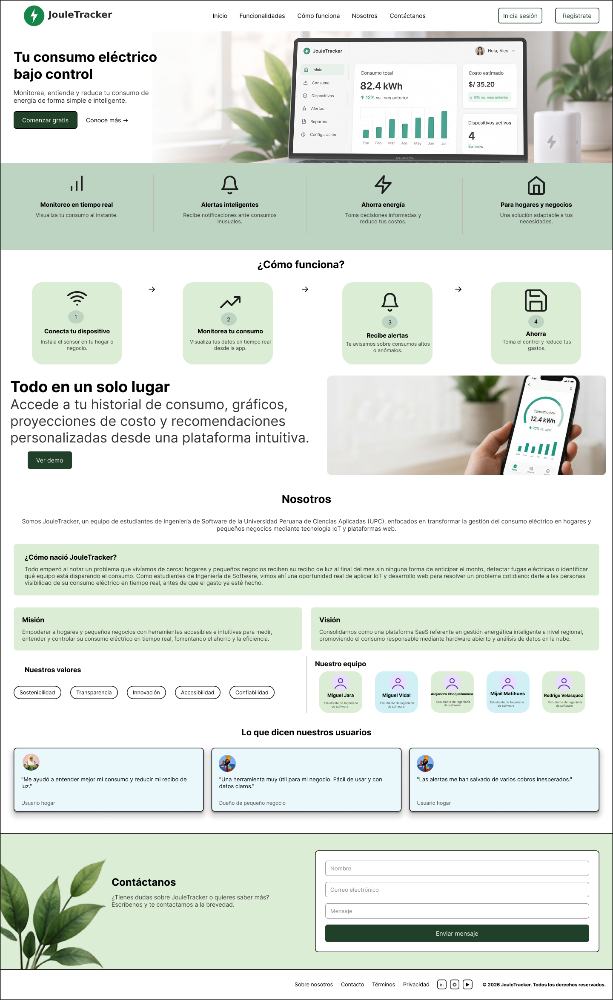

## 4.3. Landing Page UI Design.

La interfaz del Landing Page de JouleTracker busca comunicar de forma directa el problema que resolvemos y cómo lo resolvemos, sin que el usuario tenga que pensar mucho para entenderlo. La idea principal es que cualquier persona que entre a la página, ya sea un jefe de hogar o el dueño de un pequeño negocio, entienda en los primeros segundos que puede monitorear su consumo eléctrico en tiempo real y evitar sorpresas en su recibo de luz.

Para lograr esto, ordenamos el contenido de forma progresiva: primero captamos la atención con el mensaje principal y el llamado a la acción, luego mostramos las funcionalidades clave, después explicamos paso a paso cómo funciona la plataforma, y finalmente reforzamos la confianza del usuario con la sección "Nosotros" y los testimonios, antes de invitarlo a registrarse o escribirnos. Con esta estructura evitamos que el usuario se pierda navegando o se sature de información antes de entender el valor real del producto.

A nivel visual, todavía estamos en la etapa de wireframe, por lo que la interfaz se trabajó en escala de grises para enfocarnos en la jerarquía de la información y el orden de lectura, dejando la definición de colores, tipografía y demás elementos de identidad para la siguiente etapa del diseño. Aun así, se buscó que la distribución en bloques y el espaciado entre secciones dieran una sensación clara y ordenada, tanto en escritorio como en versión móvil.

## 4.3.1. Landing Page Wireframe.

Los wireframes del Landing Page de JouleTracker representan la primera versión estructurada de la página, antes de pensar en colores o estilos. Nos sirvieron para definir qué bloques debía tener la página, en qué orden mostrarlos y qué tan visible debía quedar cada elemento importante, como el mensaje principal o los botones de acción. Esta etapa nos permitió validar que la información clave apareciera desde el primer momento y que el recorrido del usuario tuviera sentido antes de invertir tiempo en el diseño final.

**Desktop**

En la versión desktop, el wireframe prioriza una hero section amplia con el mensaje "Tu consumo eléctrico bajo control", acompañada del botón "Comenzar gratis" y una navegación superior fija con acceso directo a cada sección. A partir de la cabecera, el contenido se organiza en bloques horizontales que muestran las funcionalidades clave de la plataforma, el funcionamiento en 4 pasos, una vista previa del panel de control, la sección "Nosotros" y los testimonios de usuarios, cerrando con un bloque de contacto. Esta distribución aprovecha el ancho completo de la pantalla y permite que el usuario recorra la página de forma escaneable, sin perder de vista el mensaje principal.

El primer contacto del usuario con la parte funcional de JouleTracker ocurre en el flujo de autenticación. Aquí buscamos que iniciar sesión o recuperar el acceso a la cuenta sea rápido y no genere fricción, ya que es el paso previo a que la persona pueda ver su consumo eléctrico. Por eso mantuvimos el mismo header del resto del sitio, y acompañamos el formulario con un mensaje que recuerda el beneficio principal de la plataforma ("Gestiona tu energía desde cualquier lugar"), para que el usuario no pierda de vista por qué está ahí.

**Si el usuario no tiene cuenta** 
Se puede registrar de una forma rapida, sencilla y segura.

Una vez que el usuario decide crear una cuenta, lo acompañamos en tres pasos: completar sus datos, verificar su correo y confirmar que todo salió bien. Dividimos este proceso en pantallas separadas en lugar de un solo formulario largo, para que se sienta más liviano y el usuario sepa siempre en qué parte del proceso está. En el registro reforzamos por qué vale la pena unirse (fácil de usar, datos seguros, impacto real), y cerramos con una confirmación clara de que la cuenta ya está lista para usarse.

**Mobile**

En la versión mobile, la estructura se reorganiza en una sola columna, priorizando el mensaje principal y el botón "Comenzar gratis" para que sean lo primero que vea el usuario. La navegación se compacta en un menú hamburguesa para no ocupar espacio innecesario en la pantalla, y las secciones (funcionalidades, cómo funciona, nosotros, testimonios y contacto) se apilan una debajo de otra en el mismo orden que en desktop. Así mantenemos la misma lógica de lectura, pero adaptada a una pantalla más pequeña y a una navegación táctil.

 

En la versión mobile del flujo de autenticación, simplificamos cada pantalla a lo esencial: un solo formulario visible a la vez, sin distracciones, para que iniciar sesión o crear una cuenta desde el celular se sienta tan rápido como hacerlo desde una laptop. Mantuvimos las mismas opciones de acceso rápido (Google, Apple, Facebook, Instagram) y los mismos pasos del registro (crear cuenta, verificar correo, confirmación), pero apilados en una sola columna y con botones más grandes, pensados para el dedo y no para el cursor.

**Crear cuenta**

## 4.3.2. Landing Page Mock-up.

Los mock-ups finales del Landing Page de JouleTracker representan la consolidación visual de todo lo planteado en los wireframes. En esta etapa incorporamos la paleta cromática de la marca, basada en tonos verdes junto con blanco y negro, para transmitir la idea de sostenibilidad, energía limpia y confianza que buscamos asociar con el producto. También se sumaron íconos, imágenes reales de dispositivos y espacios del hogar, y elementos decorativos como hojas, que refuerzan visualmente el concepto de eficiencia energética.

**Desktop**

En el mock-up desktop se evidencia una jerarquía visual clara, reforzada mediante el uso del verde institucional en botones, íconos y puntos de énfasis, combinado con fondos claros y bloques bien espaciados. La hero section destaca la propuesta de valor de JouleTracker acompañada de una imagen del dashboard en un laptop, dando una idea concreta del producto desde el primer momento. Las secciones posteriores mantienen la misma lógica del wireframe (funcionalidades, cómo funciona, vista previa de la plataforma, nosotros, testimonios y contacto), pero ahora con imágenes reales, íconos ilustrativos y una paleta consistente que facilita la comprensión rápida del producto.

**Iniciar sesion**

**Registro**

**Mobile**

En la versión mobile del mock-up, la estructura se adapta a pantallas reducidas manteniendo la misma paleta de verdes, tipografía y jerarquía visual que en desktop. La navegación se compacta en un menú desplegable que aparece al tocar el ícono superior, dejando siempre visibles los accesos a Registrarte e Iniciar sesión. Las secciones se apilan en una sola columna: primero el mensaje principal con la imagen del dispositivo móvil, luego las funcionalidades en tarjetas de dos columnas, el paso a paso de "¿Cómo funciona?", la vista previa de la plataforma, la sección "Nosotros" con la misión, visión y equipo, y finalmente el bloque de contacto con los datos de la empresa. Esta adaptación busca que la propuesta de JouleTracker siga siendo clara y fácil de recorrer con el dedo, sin perder la identidad visual definida para desktop.

**El usuario puede ingresar con su cuenta**

**El usuario puede crear su propia cuenta**

## 4.4. Aplicación Web UX/UI Design.

La propuesta UX/UI del panel interno de JouleTracker está pensada para que el usuario, una vez registrado, entienda de un vistazo cómo va su consumo eléctrico y qué puede hacer al respecto. A partir de esa necesidad, la interfaz prioriza el acceso directo a los módulos más importantes (consumo, dispositivos, alertas, reportes y recomendaciones), la visualización rápida del estado actual mediante métricas clave, y la reducción de pasos para las acciones que el usuario repetirá con más frecuencia, como revisar su gasto del mes o atender una alerta.

### 4.4.1. Aplicación Web Wireframes.

Los wireframes de la aplicación definen la estructura base de las vistas más importantes del panel antes de aplicar el diseño visual final. En ellos se observa la distribución del sidebar de navegación, el header con los datos del usuario, las tarjetas de métricas, los gráficos de consumo y las tablas de detalle. Esta etapa permitió validar que la información más relevante para el usuario (cuánto está consumiendo, cuánto le está costando y qué puede optimizar) estuviera siempre visible, sin importar en qué módulo se encuentre.

**Desktop**

En escritorio, los wireframes muestran una estructura consistente en los siete módulos del panel: un sidebar fijo a la izquierda con acceso a Inicio, Consumo, Dispositivos, Alertas, Reportes, Recomendaciones y Configuración, y un área central que cambia según el módulo seleccionado. En **Inicio** y **Consumo** se prioriza un resumen visual del gasto eléctrico mediante tarjetas de métricas y gráficos de consumo. En **Dispositivos** y **Alertas** el foco pasa a tablas con el detalle de cada dispositivo o notificación. En **Reportes** se organiza la información histórica con filtros y comparativas, mientras que en **Recomendaciones** se muestran tarjetas de sugerencias personalizadas de ahorro. Finalmente, **Configuración** agrupa los datos de la cuenta, del hogar y las preferencias del usuario en bloques independientes. Esta consistencia entre módulos facilita que el usuario aprenda a usar el panel una sola vez y lo aplique en cualquier sección.

**Mobile**

En la versión mobile del Dashboard, la navegación lateral se reemplaza por una barra inferior fija con acceso directo a los módulos más usados (Inicio, Consumo, Dispositivos, Alertas) y un botón "Más" que despliega el resto de opciones (Reportes, Recomendaciones, Configuración, Contacto y Cerrar sesión) en un menú lateral. El contenido de cada módulo se reorganiza en una sola columna, apilando las tarjetas de métricas y los gráficos que en desktop iban en fila, para que toda la información siga siendo legible sin necesidad de hacer scroll horizontal. Las tablas de Dispositivos y Alertas se simplifican a listas verticales con la información esencial de cada fila, y en Configuración los bloques de información personal, hogar, preferencias y notificaciones se apilan uno debajo del otro, manteniendo el mismo criterio de agrupación que en la versión de escritorio.

