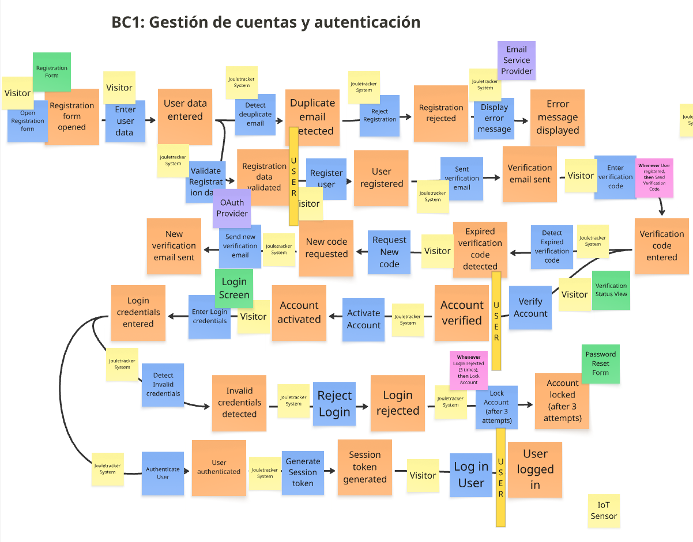
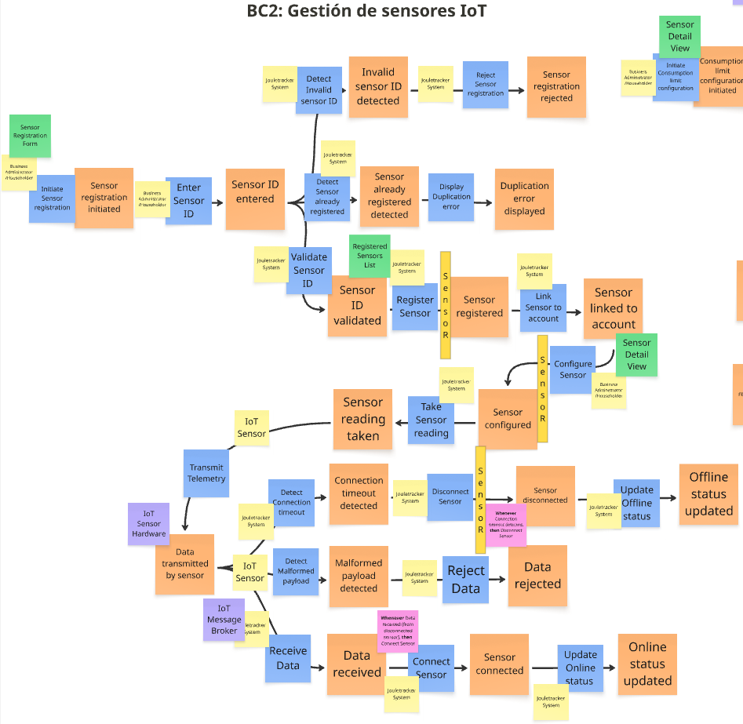
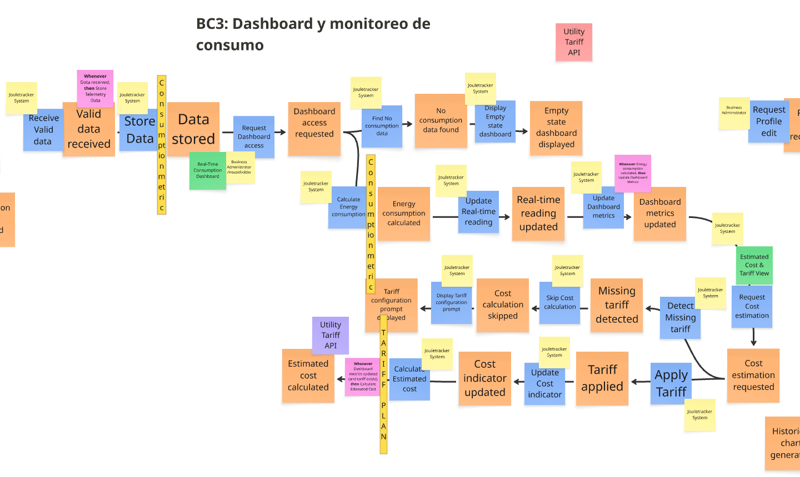
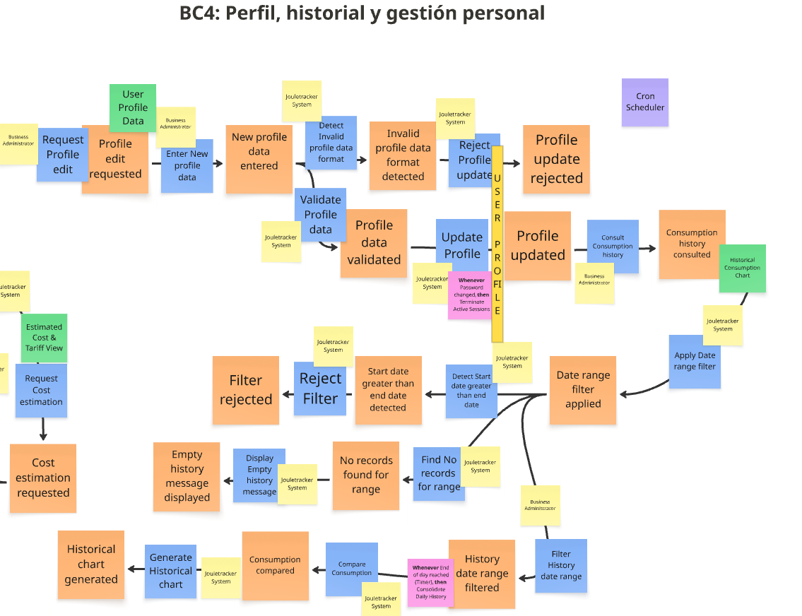
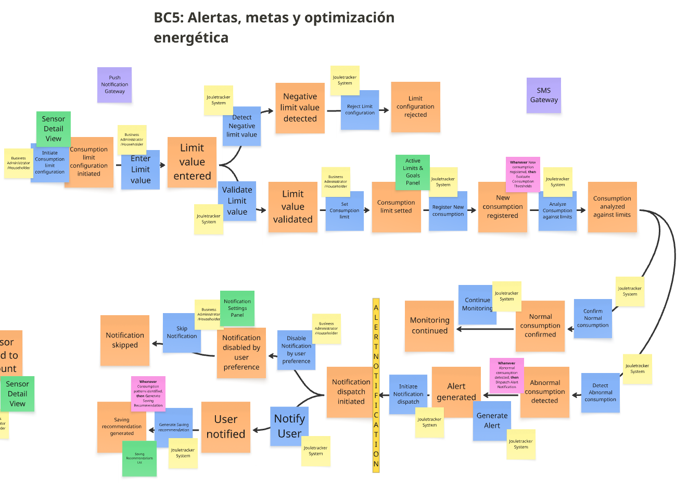
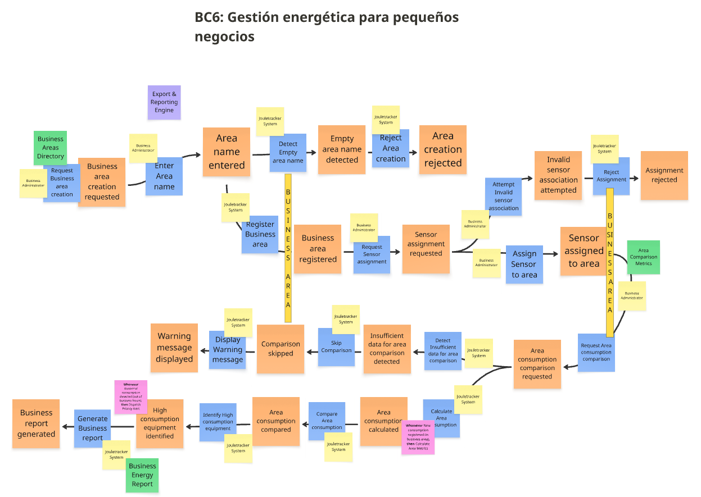
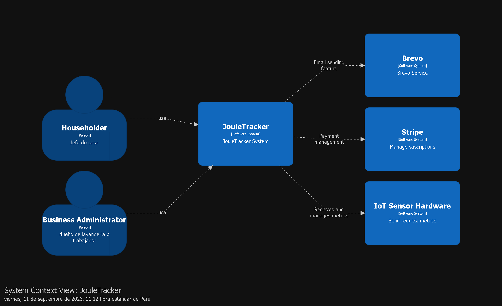
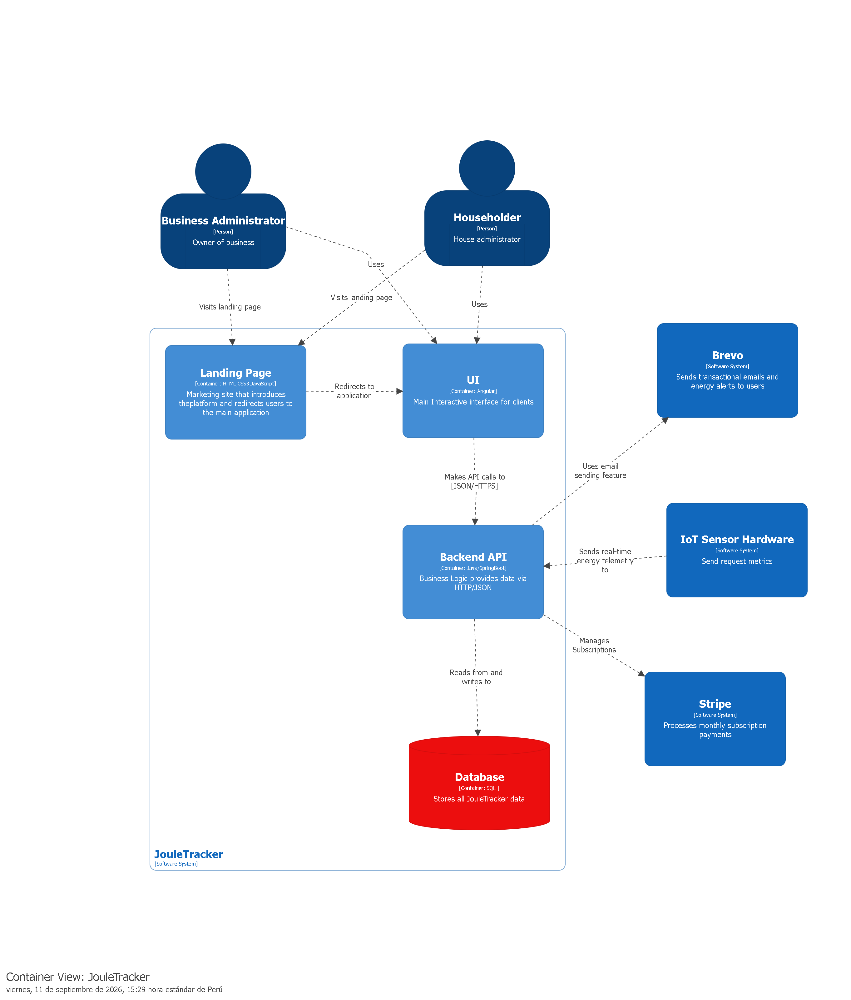
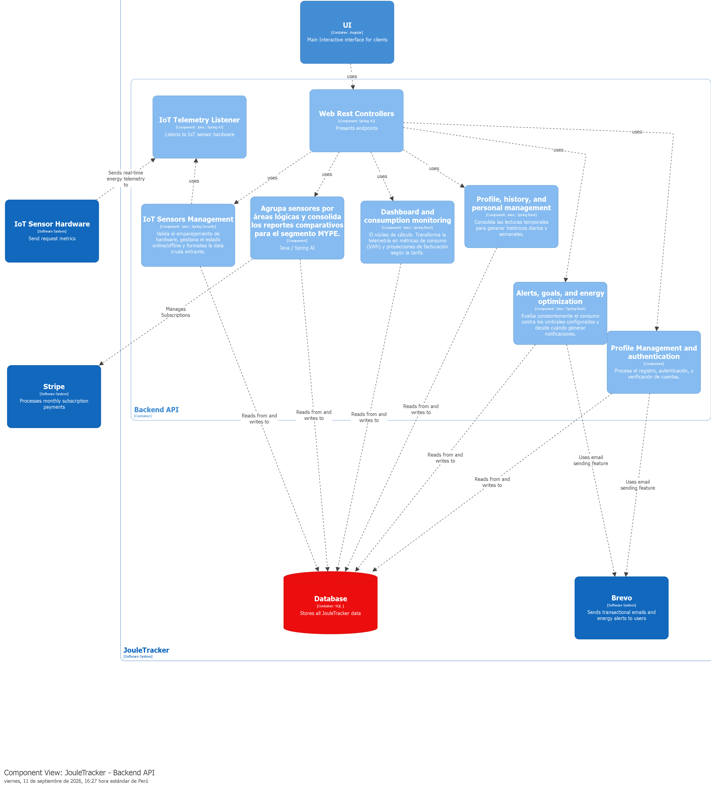

# Capítulo IV: Product Design

## 4.1. Style Guidelines

### 4.1.1. General Style Guidelines

#### Tipografía

En JouleTracker se utilizan dos tipografías que permiten establecer una jerarquía visual clara y mantener una experiencia de lectura cómoda.

**Inter** se utiliza en títulos y encabezados debido a su apariencia moderna, limpia y profesional. Su diseño permite destacar las secciones principales y facilitar la identificación de la información más importante.

Para los textos generales se utiliza **Roboto**, una tipografía ampliamente utilizada en interfaces digitales por su buena legibilidad en diferentes tamaños de pantalla. Se aplica principalmente en párrafos, descripciones, etiquetas y contenido informativo.

La combinación de ambas tipografías permite diferenciar los encabezados del contenido general, generando una estructura visual ordenada y consistente a lo largo de la plataforma.

**Figura 1:**  
Uso de la tipografía "Inter" en encabezados.

**Fuente:** [Google Fonts - Inter](https://www.1001fonts.com/inter-font.html)

**Figura 2:**  
Uso de la tipografía "Roboto" en textos generales.

**Fuente:** [Google Fonts - Roboto.](https://www.1001fonts.com/roboto-font.html)

#### Colores principales

La elección de colores en JouleTracker busca transmitir una identidad tecnológica, moderna y relacionada con la eficiencia energética.

El color azul **#0066FF** se establece como color principal y se utiliza para acciones importantes, botones, enlaces y elementos seleccionados. Este color permite destacar las acciones principales y facilita la identificación de los elementos interactivos.

El color verde **#10B981** funciona como color secundario y se utiliza para representar estados positivos, eficiencia y resultados favorables dentro de la plataforma.

El color ámbar **#F59E0B** corresponde al color terciario y se utiliza principalmente para advertencias o situaciones que requieren atención.

Por último, el color **#0F172A** funciona como color neutral y se emplea principalmente en títulos, textos principales y otros elementos que requieren un alto nivel de contraste.

En conjunto, esta paleta permite establecer una jerarquía visual clara y utilizar los colores de manera semántica para comunicar diferentes estados de la aplicación.

#### Estilo visual

El estilo visual de JouleTracker busca mantener una interfaz limpia, moderna y enfocada en la información.

La combinación del azul principal **#0066FF** con el verde **#10B981** permite destacar acciones y estados positivos, mientras que el ámbar **#F59E0B** se reserva para situaciones de advertencia.

El color **#0F172A** proporciona contraste para títulos y textos importantes. Los fondos claros permiten que los contenidos sean fáciles de identificar y evitan una interfaz visualmente saturada.

Los componentes utilizan formas simples y bordes suavemente redondeados para mantener una apariencia moderna. Las tarjetas y bloques de información permiten agrupar contenidos relacionados y mejorar la organización visual.

#### Interactividad

Los elementos interactivos de JouleTracker proporcionan retroalimentación visual para indicar al usuario cuándo un elemento puede ser seleccionado, cuándo se encuentra activo o cuándo una acción ha sido realizada.

Los botones principales utilizan el color **#0066FF** y pueden presentar una variación de tono durante estados como `hover` o `active`.

Los elementos seleccionados mantienen una diferenciación visual respecto al resto de opciones para facilitar la orientación dentro de la interfaz.

Las tarjetas y componentes interactivos pueden utilizar cambios sutiles de elevación o sombra al pasar el cursor, proporcionando feedback inmediato sin generar distracciones.

Las transiciones son suaves y breves, buscando que las interacciones sean naturales y no interfieran con la comprensión de la información.

---

### 4.1.2. Web Style Guidelines

#### Responsividad

El diseño de JouleTracker está orientado a diferentes tamaños de pantalla, permitiendo adaptar la interfaz desde dispositivos móviles hasta computadoras de escritorio.

Los elementos se reorganizan de acuerdo con el espacio disponible, pasando de estructuras horizontales a verticales cuando es necesario. También se ajustan los tamaños, márgenes y espacios para mantener una correcta legibilidad.

La aplicación de principios responsive permite que las principales funcionalidades puedan utilizarse independientemente del dispositivo desde el cual se acceda a la plataforma.

#### Componentes

Los componentes mantienen un estilo visual consistente mediante el uso de la misma tipografía, colores y reglas de espaciado.

Los botones utilizan principalmente el color **#0066FF** para las acciones principales, mientras que las acciones secundarias pueden utilizar estilos neutros.

Las tarjetas permiten organizar información relacionada y presentar datos de manera diferenciada. Los indicadores pueden utilizar los colores semánticos definidos en la paleta para representar estados positivos o situaciones que requieren atención.

Esta consistencia facilita el reconocimiento de patrones y permite que el usuario comprenda rápidamente el propósito de cada elemento.

#### Accesibilidad

Se prioriza un contraste adecuado entre textos y fondos para facilitar la lectura.

El color **#0F172A** se utiliza principalmente para textos sobre fondos claros, mientras que los colores de los elementos interactivos deben mantener suficiente contraste para poder ser identificados fácilmente.

Además, los elementos interactivos deben ser accesibles mediante teclado y presentar estados de `focus` visibles.

Se utilizan etiquetas descriptivas y una estructura semántica adecuada para facilitar la interpretación de la interfaz mediante tecnologías de asistencia.

#### Animaciones suaves

Las interacciones utilizan transiciones sutiles para proporcionar retroalimentación sin sobrecargar visualmente la interfaz.

Entre los efectos considerados se encuentran:

- Cambio de color en botones.
- Modificación visual de los elementos seleccionados.
- Elevación ligera de tarjetas durante el estado `hover`.
- Transiciones suaves entre estados.

Estas animaciones tienen como objetivo mejorar la experiencia de usuario y proporcionar una respuesta visual clara ante las acciones realizadas.

---

## 4.2. Information Architecture

La arquitectura de información de JouleTracker organiza los contenidos y funcionalidades de la plataforma de manera que los usuarios puedan acceder fácilmente a la información relacionada con el consumo energético.

La estructura diferencia entre el contenido informativo de la Landing Page y las funcionalidades propias de la aplicación web.

La Landing Page presenta el propósito y las principales características de JouleTracker, mientras que la aplicación concentra las funciones relacionadas con la consulta y gestión de información energética.

Esta separación permite que cada espacio responda a diferentes necesidades: informar a nuevos usuarios en la Landing Page y facilitar la gestión de información a los usuarios de la aplicación.

### 4.2.1. Organization Systems

#### Jerárquico

La estructura de JouleTracker sigue un sistema jerárquico en el que la **Landing Page** funciona como punto principal de acceso a la plataforma. Desde esta página, el usuario puede conocer el propósito de JouleTracker, revisar sus principales funcionalidades y acceder a la aplicación web.

La información se presenta de manera progresiva, comenzando con una introducción general de la plataforma y continuando con las características y funcionalidades que ofrece. Finalmente, el usuario puede dirigirse hacia la aplicación para interactuar directamente con sus herramientas.

Dentro de la aplicación web, el **Dashboard** funciona como punto central desde el cual el usuario puede acceder a las diferentes funcionalidades relacionadas con el monitoreo y gestión del consumo energético.

Esta organización permite que la información fluya de lo general a lo particular, facilitando la comprensión y exploración de la plataforma.

#### Modular y Seccional

La información de JouleTracker se encuentra organizada en diferentes secciones y módulos, cada uno enfocado en una función o tipo de contenido específico.

En la Landing Page, las secciones presentan de manera ordenada la información principal de la plataforma, sus características y los beneficios que ofrece. En la aplicación web, los módulos permiten organizar las funcionalidades relacionadas con el consumo energético y la gestión de la información.

Esta organización modular permite mantener una interfaz limpia y enfocada, evitando presentar toda la información en un único espacio. Además, facilita la incorporación de nuevas funcionalidades y permite que cada módulo pueda evolucionar sin afectar la estructura general de la plataforma.

### 4.2.2. Labeling Systems

#### Menú principal

Las etiquetas utilizadas en la navegación de JouleTracker son directas y permiten identificar fácilmente las principales secciones de la plataforma.

En la Landing Page se utilizan etiquetas orientadas a presentar el proyecto y sus funcionalidades, mientras que dentro de la aplicación se emplean nombres relacionados con la gestión y monitoreo del consumo energético.

El uso de etiquetas claras permite que el usuario pueda comprender qué contenido o funcionalidad encontrará al seleccionar cada opción, reduciendo la confusión durante la navegación.

#### Botones de acción

Los botones utilizan etiquetas breves y orientadas a la acción, permitiendo que el usuario comprenda rápidamente qué ocurrirá al interactuar con ellos.

Se utilizan expresiones como **"Get Started"**, **"Learn More"**, **"Add Device"**, **"View Details"** y **"Save"**, dependiendo de la acción correspondiente.

El uso de verbos facilita la toma de decisiones y proporciona una relación clara entre el texto del botón y la acción que ejecutará el sistema.

#### Formularios

Los campos de los formularios utilizan etiquetas sencillas y descriptivas para indicar la información que debe ingresar el usuario.

Se consideran etiquetas como **"Name"**, **"Email"**, **"Password"**, **"Device Name"** y **"Device Type"**.

Esta nomenclatura permite que los usuarios comprendan fácilmente qué información deben proporcionar y reduce la posibilidad de errores durante el ingreso de datos.

### 4.2.3. SEO Tags and Meta Tags

JouleTracker debe incorporar metaetiquetas básicas que permitan identificar correctamente el contenido de la Landing Page, mejorar su presentación en los motores de búsqueda y garantizar una correcta visualización en diferentes dispositivos.

**Título:** La etiqueta `title` define el nombre de la página que aparece en la pestaña del navegador. También permite identificar de manera clara el contenido principal del sitio.

    <title>JouleTracker | Monitoreo del consumo energético</title>

**Descripción:** La meta descripción proporciona un resumen breve del propósito de JouleTracker. Esta información puede utilizarse para presentar una descripción del sitio en los resultados de búsqueda.

    <meta
      name="description"
      content="JouleTracker permite monitorear y analizar el consumo energético para mejorar el uso eficiente de la energía."
    >

**Palabras clave:** El contenido de la plataforma utiliza términos relacionados con su propósito, como **consumo energético**, **monitoreo energético**, **eficiencia energética**, **energy monitoring** y **energy tracking**. Estas palabras ayudan a mantener una relación temática clara entre el contenido del sitio y su objetivo.

**Viewport:** La etiqueta viewport permite adaptar correctamente el contenido de la página al tamaño de pantalla del dispositivo, siendo fundamental para el diseño responsive.

    <meta name="viewport" content="width=device-width, initial-scale=1.0">

**Robots:** Para las páginas públicas se puede utilizar la directiva `index, follow`, permitiendo que los motores de búsqueda indexen el contenido y sigan los enlaces disponibles.

    <meta name="robots" content="index, follow">

### 4.2.4. Searching Systems

La Landing Page de JouleTracker no requiere un sistema de búsqueda global, debido a que la información se encuentra distribuida en secciones específicas y puede ser consultada mediante la navegación principal.

En la aplicación web, un sistema de búsqueda puede ser útil para localizar rápidamente información cuando aumente la cantidad de dispositivos, registros o datos relacionados con el consumo energético.

Esta funcionalidad podría implementarse mediante un campo de búsqueda acompañado de filtros que permitan reducir los resultados según criterios como dispositivo, fecha, periodo o estado.

Actualmente, si esta funcionalidad no se encuentra implementada, se puede considerar como una mejora para futuras versiones de JouleTracker, especialmente para facilitar la consulta de grandes cantidades de información.

### 4.2.5. Navigation Systems

#### Navegación superior

La navegación principal de JouleTracker se encuentra ubicada en la parte superior de la Landing Page, permitiendo acceder directamente a las diferentes secciones informativas.

Esta ubicación facilita el acceso a la información principal y permite que el usuario pueda desplazarse por la página de manera rápida y sencilla.

Dentro de la aplicación web, la navegación permite acceder al Dashboard y a las diferentes funcionalidades relacionadas con el monitoreo energético.

#### Flujo lógico

El recorrido del usuario sigue una estructura progresiva que comienza en la Landing Page y continúa hacia la aplicación web.

El usuario puede conocer primero el propósito de JouleTracker, revisar sus funcionalidades y posteriormente acceder a la plataforma para utilizar sus herramientas.

El flujo general parte de la presentación de la plataforma, continúa con la exploración de sus características y termina con el acceso al Dashboard, desde donde se pueden consultar las funcionalidades principales.

Esta organización permite mantener un recorrido intuitivo y evita pasos innecesarios durante la interacción.

#### Navegación dentro de la aplicación

El **Dashboard** funciona como uno de los principales puntos de navegación dentro de la aplicación web.

Desde este espacio, el usuario puede acceder a las funcionalidades relacionadas con los dispositivos, el consumo energético y la información disponible en la plataforma.

La sección actualmente seleccionada debe diferenciarse visualmente mediante el color principal **#0066FF**, permitiendo que el usuario reconozca fácilmente dónde se encuentra dentro de la aplicación.

#### Footer con navegación secundaria

El footer complementa la navegación principal proporcionando acceso a información adicional relacionada con JouleTracker.

Puede incluir enlaces hacia información del proyecto, contacto, políticas, términos y otros recursos relevantes.

De esta manera, el menú principal puede mantenerse enfocado en las funcionalidades y secciones más importantes, mientras que el footer concentra enlaces secundarios.

#### Estructura modular

La navegación mantiene una estructura modular que permite incorporar nuevas secciones y funcionalidades conforme evolucione JouleTracker.

Esta organización facilita la escalabilidad de la plataforma, ya que nuevos módulos pueden incorporarse siguiendo los mismos patrones de navegación sin afectar significativamente la estructura existente.

Además, mantener una estructura consistente permite que los usuarios puedan familiarizarse rápidamente con nuevas funcionalidades a medida que estas sean incorporadas.

## 4.3. Landing Page UI Design

### 4.3.1. Landing Page Wireframe

### 4.3.2. Landing Page Mock-up

## 4.4. Web Applications UX/UI Design

### 4.4.1. Web Applications Wireframes

### 4.4.2. Web Applications Wireflow Diagrams

### 4.4.3. Web Applications Mock-ups

### 4.4.4. Web Applications User Flow Diagrams

## 4.5. Web Applications Prototyping

## 4.6. Domain-Driven Software Architecture

### 4.6.1. Design-Level Event Storming

En esta sección se detalla el proceso de Design-Level EventStorming realizado por el equipo para perfeccionar el modelo del dominio de JoulTracker. Partiendo del Big Picture, profundizamos en el comportamiento interno del sistema para alcanzar el mayor nivel de detalle arquitectónico posible.

Primero, refinamos la línea de tiempo original, eliminando eventos redundantes o procesos manuales que quedaban fuera del alcance tecnológico de la plataforma. Sobre este flujo depurado, incorporamos los elementos tácticos del Domain-Driven Design: Actores y Comandos para representar las intenciones, Read Models para la interfaz gráfica, Políticas para las reglas automáticas y de negocio, Sistemas Externos, y Agregados (Aggregates) como responsables de procesar las operaciones y emitir los eventos de dominio. Este nivel de granularidad nos permitió consolidar y justificar las fronteras definitivas de nuestros Bounded Contexts.

Bounded Context 1: Identity & Access Management

Este contexto delimitado constituye el núcleo de seguridad y gestión de accesos para los usuarios residenciales y comerciales dentro de la plataforma JoulTracker. Se identificaron entidades clave como Usuario, Credenciales y Sesión, junto con conceptos del lenguaje ubicuo como token y autenticación. A partir de comandos como Register User y Log In, se generan eventos como User registered y User authenticated. Asimismo, se definieron políticas de seguridad automatizadas, como el envío de códigos de verificación tras el registro inicial y el bloqueo preventivo de cuentas tras detectar múltiples intentos fallidos de acceso.

Bounded Context 2: Device & Telemetry Management

Este contexto delimitado centraliza la gestión del hardware IoT y la ingesta física de datos hacia la plataforma. Se identificaron entidades como SensorDevice y Telemetry, junto con conceptos del lenguaje ubicuo como payload y heartbeat. A partir de comandos como Register Sensor y Send Telemetry Data, se generan eventos como Sensor registered y Data received. Se establecieron políticas reactivas críticas para mantener la consistencia del estado del hardware, como la desconexión automática del sensor al detectar un timeout prolongado en la red y su posterior reconexión automática al recuperar la transmisión.

Bounded Context 3: Dashboard & Energy Analytics

Este contexto conforma el núcleo analítico de JoulTracker, responsable de procesar la telemetría y calcular el gasto energético en tiempo real. Se manejan entidades como ConsumptionMetric y TariffPlan, utilizando términos como kilovatio-hora (kWh) y estimación monetaria. Mediante comandos como Calculate Energy Consumption y Calculate Estimated Cost, el sistema emite eventos como Energy consumption calculated y Estimated cost calculated. Las políticas de este contexto aseguran la actualización continua del dashboard cada vez que se ingesta nueva data y la conversión automática del consumo a moneda local según la tarifa vigente configurada.

Bounded Context 4: Profiles & History Management

Este contexto delimitado gestiona la información personal de los usuarios y la consolidación estructurada de sus series temporales de consumo. Destacan entidades como UserProfile e HistoricalLog. A través de comandos como Update User Profile y Filter Consumption History, el sistema dispara eventos como Profile updated y History date range filtered. Una política clave en este módulo es la consolidación diaria automatizada (a través de disparadores de tiempo o cronjobs), que congela y empaqueta las lecturas cada 24 horas para garantizar consultas históricas eficientes sin sobrecargar la base de datos.

Bounded Context 5: Alerting & Energy Optimization

Este contexto es el motor de prevención y optimización energética de la plataforma. Gira en torno a entidades como ConsumptionThreshold y AlertNotification, integrando conceptos como umbral de advertencia y patrón de consumo. A partir de comandos como Set Consumption Limit y Evaluate Consumption Thresholds, se originan eventos como Consumption limit set y Abnormal consumption detected. Sus políticas son altamente reactivas: evalúan cada nuevo registro contra las metas del usuario para despachar notificaciones inmediatas o generar recomendaciones de ahorro de forma automática si se detectan patrones anómalos.

Bounded Context 6: Facility & Small Business Analytics

Este contexto delimitado provee las herramientas avanzadas de estructuración física para el segmento comercial (MYPE). Se identificaron entidades como BusinessArea y conceptos como mapeo de zonas y rendimiento de equipamiento. Comandos como Create Business Area y Compare Areas Consumption desencadenan eventos clave como Business area registered y Area consumption compared. Las políticas de este contexto automatizan la agregación de métricas por zona y alertan sobre consumos atípicos (fugas energéticas o maquinaria encendida por error) cuando los locales comerciales se encuentran fuera de su horario de atención.

Se adjunta el enlance del table de miro con el proceso: [miro](https://miro.com/welcomeonboard/TnpJZmYyak5sRFNiYk9yemozbUJtUjBLZDZyYUpTek9McmxaMk9lM0VlTkFEZy81cU5OWWxrZ0U2Rkp0aUxVbWxMOXhrbDEvNkU5QTE3djZjbDNXb0tKa0EydzdPN20yN3dxUXNXSzdXb1J4ZDJITG5ndnJXN1piUnEyeEJpdEl3VHhHVHd5UWtSM1BidUtUYmxycDRnPT0hdjE=?share_link_id=815831854787)

### 4.6.2. Software Architecture Context Diagram

El Diagrama de Contexto (Nivel 1 del modelo C4) establece las fronteras de JouleTracker, ofreciendo una visión de alto nivel sobre cómo la plataforma se integra dentro de su entorno operativo. Este nivel abstrae los detalles internos de implementación y representa al sistema como una única entidad central, destacando exclusivamente las interacciones con los actores humanos y los sistemas de software o hardware externos.

Para este proyecto, el diagrama detalla la relación entre la plataforma y sus principales usuarios (el Jefe de Hogar y el Administrador de Negocio), evidenciando cómo consumen los servicios de monitoreo energético. Asimismo, ilustra la dependencia crítica con el ecosistema de hardware (Sensores IoT) para la ingesta continua de telemetría en tiempo real. Finalmente, establece los límites de responsabilidad del sistema al delegar procesos operativos clave a servicios de terceros, específicamente la gestión de cobros de suscripciones a la pasarela de pagos (Stripe) y la emisión de notificaciones transaccionales al proveedor de correos (Brevo).

El propósito de esta vista es proporcionar una comprensión clara y no técnica del alcance del sistema, el flujo principal de valor y sus dependencias tecnológicas externas.

### 4.6.3. Software Architecture Container Diagrams

El Diagrama de Contenedores (Nivel 2 del modelo C4) realiza un acercamiento al sistema central de JouleTracker para revelar su arquitectura de software interna. En este nivel, el sistema se descompone en unidades técnicas de ejecución y despliegue separadas, conocidas como contenedores, mostrando sus responsabilidades específicas, la distribución del trabajo y las decisiones tecnológicas de alto nivel adoptadas por el equipo de desarrollo.

Para la plataforma JouleTracker, el diagrama ilustra una separación arquitectónica clara. Por un lado, se expone la interfaz de usuario a través de una aplicación web interactiva (Single-Page Application) y un sitio promocional (Landing Page), mediante los cuales interactúan los distintos tipos de clientes. Por otro lado, se detalla el núcleo operativo alojado en una Backend API estructurada con Spring Boot, la cual encapsula la lógica de los dominios, y finalmente, el motor de almacenamiento persistente representado por una base de datos relacional.

Adicionalmente, esta vista mapea el flujo de los datos especificando los protocolos de comunicación utilizados (como llamadas HTTPS/REST y conexiones a base de datos). También evidencia que es la Backend API la que asume la responsabilidad exclusiva de orquestar la ingesta directa desde los sensores IoT y la integración segura con los servicios de terceros (Stripe y Brevo) identificados en el nivel anterior.

### 4.6.4. Software Architecture Components Diagrams

El Diagrama de Componentes (Nivel 3 del modelo C4) realiza un acercamiento exhaustivo y exclusivo al contenedor principal del sistema, la Backend API, para detallar sus bloques de construcción internos. En este nivel, se expone cómo el código de la aplicación se organiza lógicamente en componentes que encapsulan reglas de negocio, interfaces de entrada y adaptadores de salida, sirviendo como mapa directo para la implementación por parte del equipo de desarrollo.

Para la API de JouleTracker, el diagrama ilustra una arquitectura interna fuertemente influenciada por los principios de Domain-Driven Design (DDD). Primero, se identifican los componentes de entrada (REST Controllers y Listeners IoT) responsables de recibir las peticiones de las aplicaciones web y la telemetría de los sensores. Estos adaptadores delegan el procesamiento a los componentes de dominio centrales, los cuales materializan directamente en código los seis Bounded Contexts definidos en el diseño táctico.

Finalmente, la vista detalla los componentes de infraestructura de salida (Repositorios SQL y Clientes REST), que asumen la responsabilidad puramente técnica de persistir los agregados en la base de datos relacional y ejecutar las llamadas hacia los sistemas de terceros como Stripe y Brevo, manteniendo el núcleo del negocio aislado de los detalles de implementación externa.

## 4.7. Software Object-Oriented Design

### 4.7.1. Class Diagrams

## 4.8. Database Design

### 4.8.1. Database Diagrams
