# Capítulo IV: Product Design

## 4.1. Style Guidelines

### 4.1.1. General Style Guidelines

#### Tipografía

En JouleTracker se utilizan dos tipografías que permiten establecer una jerarquía visual clara y mantener una experiencia de lectura cómoda.

**Inter** se utiliza en títulos y encabezados debido a su apariencia moderna, limpia y profesional. Su diseño permite destacar las secciones principales y facilitar la identificación de la información más importante.

Para los textos generales se utiliza **Roboto**, una tipografía ampliamente utilizada en interfaces digitales por su buena legibilidad en diferentes tamaños de pantalla. Se aplica principalmente en párrafos, descripciones, etiquetas y contenido informativo.

La combinación de ambas tipografías permite diferenciar los encabezados del contenido general, generando una estructura visual ordenada y consistente a lo largo de la plataforma.

**Figura 1:**  
Uso de la tipografía "Inter" en encabezados.

**Fuente:** [Google Fonts - Inter](https://www.1001fonts.com/inter-font.html)

**Figura 2:**  
Uso de la tipografía "Roboto" en textos generales.

**Fuente:** [Google Fonts - Roboto.](https://www.1001fonts.com/roboto-font.html)

### 4.1.2. Web Style Guidelines

#### Paleta de colores

La elección de colores en **JouleTracker** busca transmitir una identidad tecnológica, moderna y relacionada con la eficiencia energética, el ahorro y el uso responsable de los recursos.

La paleta completa está conformada por colores principales, secundarios y neutros, los cuales se aplican de acuerdo con la función y jerarquía de cada elemento dentro de la interfaz.

**Figura 1:** Paleta completa de colores

**Paleta completa en Coolors:**  
[https://coolors.co/214029-dcedd5-bed4c2-4f378a-eaddff-ffffff-1a1a1a-404040](https://coolors.co/214029-dcedd5-bed4c2-4f378a-eaddff-ffffff-1a1a1a-404040)

---

#### Colores principales

La paleta principal está compuesta por diferentes tonalidades de verde, utilizadas para representar sostenibilidad, eficiencia y gestión responsable del consumo eléctrico.

- **Verde oscuro `#214029`**: color principal de la interfaz. Se utiliza en botones, llamadas a la acción, enlaces, elementos seleccionados y componentes que requieren mayor énfasis visual.
- **Verde claro `#DCEDD5`**: color complementario utilizado principalmente en fondos, secciones destacadas, bloques de información y superficies.
- **Verde medio `#BED4C2`**: utilizado en fondos secundarios, separadores, elementos de apoyo y diferentes superficies de la interfaz.

**Figura 2:** Colores principales

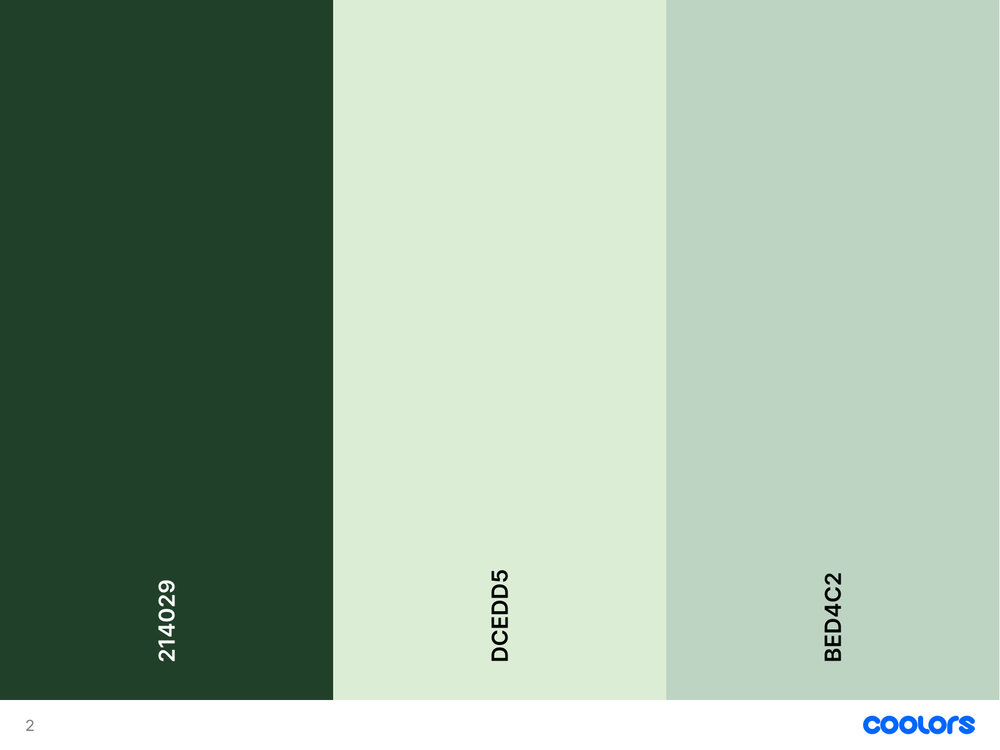

**Paleta en Coolors:**  
[https://coolors.co/214029-dcedd5-bed4c2](https://coolors.co/214029-dcedd5-bed4c2)

---

#### Colores secundarios

Los colores secundarios complementan la paleta principal y permiten establecer diferentes niveles de jerarquía visual dentro de la interfaz.

La paleta secundaria utiliza tonalidades moradas para diferenciar determinados elementos sin reemplazar el protagonismo de los colores verdes.

- **Morado `#4F378A`**: utilizado como color de acento en componentes secundarios, indicadores, elementos destacados y recursos visuales que requieren diferenciación.
- **Lavanda `#EADDFF`**: utilizado principalmente en fondos suaves, tarjetas y superficies asociadas a elementos de acento.

**Figura 3:** Colores secundarios

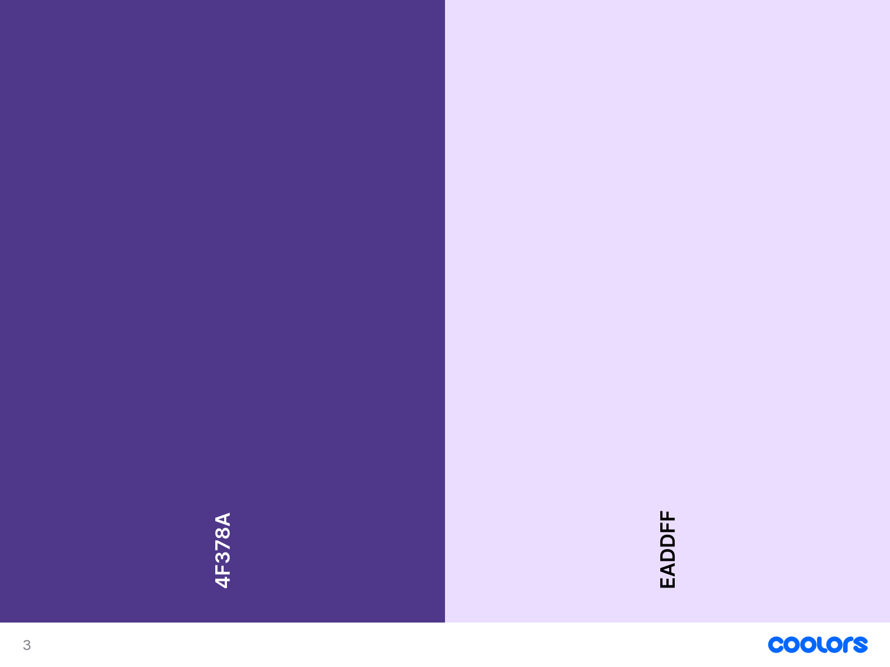

**Paleta en Coolors:**  
[https://coolors.co/4f378a-eaddff](https://coolors.co/4f378a-eaddff)

---

#### Colores neutros

Los colores neutros permiten estructurar la interfaz y garantizar una adecuada legibilidad de los contenidos.

- **Blanco `#FFFFFF`**: utilizado principalmente como fondo principal y superficie de diferentes componentes.
- **Negro suave `#1A1A1A`**: utilizado en títulos, encabezados y textos de mayor jerarquía.
- **Gris oscuro `#404040`**: utilizado en textos secundarios, descripciones, etiquetas y contenido informativo.

Estos colores proporcionan contraste y permiten complementar las paletas principal y secundaria.

**Figura 4:** Colores neutros

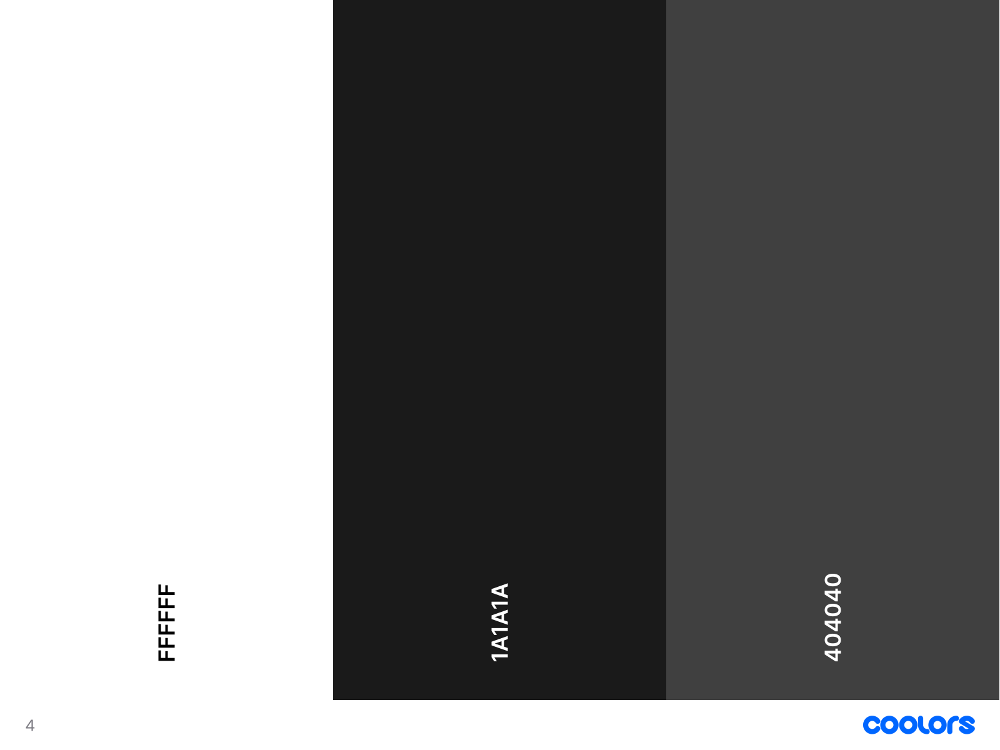

**Paleta en Coolors:**  
[https://coolors.co/ffffff-1a1a1a-404040](https://coolors.co/ffffff-1a1a1a-404040)

---

#### Estilo visual

El estilo visual de **JouleTracker** busca mantener una interfaz limpia, moderna, tecnológica y enfocada en la información.

La combinación del **verde oscuro `#214029`** con los verdes **#DCEDD5** y **#BED4C2** constituye la base visual de la plataforma. El verde oscuro se utiliza para elementos de mayor importancia, mientras que los tonos claros permiten diferenciar secciones y superficies sin generar una apariencia saturada.

Los colores de acento **#4F378A** y **#EADDFF** se incorporan en componentes secundarios, indicadores y elementos que requieren una diferenciación visual respecto de los elementos principales.

Los colores neutros **#FFFFFF**, **#1A1A1A** y **#404040** proporcionan la estructura necesaria para fondos, títulos, textos y contenidos informativos.

Los componentes utilizan formas simples y bordes suavemente redondeados para mantener una apariencia moderna. Las tarjetas y bloques de información permiten agrupar contenidos relacionados y mejorar la organización visual.

#### Interactividad

Los elementos interactivos de **JouleTracker** proporcionan retroalimentación visual para indicar al usuario cuándo un elemento puede ser seleccionado, cuándo se encuentra activo o cuándo una acción ha sido realizada.

Los botones principales utilizan el **verde oscuro `#214029`** y pueden presentar variaciones sutiles de tono durante estados como `hover`, `focus` o `active`.

Los elementos seleccionados mantienen una diferenciación visual mediante el uso de los colores principales o secundarios, permitiendo identificar fácilmente la opción activa dentro de la interfaz.

Las tarjetas y componentes interactivos pueden utilizar cambios sutiles de elevación o sombra al pasar el cursor, proporcionando feedback inmediato sin generar distracciones.

Las transiciones son suaves y breves, buscando que las interacciones sean naturales y no interfieran con la comprensión de la información.

---

### 4.1.2.1. Responsividad

El diseño de **JouleTracker** está orientado a diferentes tamaños de pantalla, permitiendo adaptar la interfaz desde dispositivos móviles hasta computadoras de escritorio.

Los elementos se reorganizan de acuerdo con el espacio disponible, pasando de estructuras horizontales a verticales cuando es necesario. También se ajustan los tamaños, márgenes y espacios para mantener una correcta legibilidad.

La aplicación de principios responsive permite que las principales funcionalidades puedan utilizarse independientemente del dispositivo desde el cual se acceda a la plataforma.

#### Componentes

Los componentes mantienen un estilo visual consistente mediante el uso de la misma tipografía, colores y reglas de espaciado.

Los botones utilizan principalmente el **verde oscuro `#214029`** para las acciones principales, mientras que las acciones secundarias pueden utilizar estilos neutros o los colores de acento definidos en la paleta.

Las tarjetas permiten organizar información relacionada y presentar datos de manera diferenciada. Los fondos **#DCEDD5** y **#BED4C2** pueden utilizarse para generar diferentes niveles de agrupación visual.

Los indicadores y elementos secundarios pueden utilizar **#4F378A** y **#EADDFF** para establecer una diferenciación visual respecto de los elementos principales.

Los colores neutros **#FFFFFF**, **#1A1A1A** y **#404040** se utilizan para estructurar fondos, títulos, textos y contenido informativo.

#### Accesibilidad

Se prioriza un contraste adecuado entre textos y fondos para facilitar la lectura y mejorar la accesibilidad de la interfaz.

El **negro suave `#1A1A1A`** y el **gris oscuro `#404040`** se utilizan principalmente para textos sobre fondos claros, mientras que el **verde oscuro `#214029`** proporciona contraste para botones y otros elementos interactivos.

Los colores claros **#DCEDD5**, **#BED4C2** y **#EADDFF** se utilizan principalmente como fondos o superficies, evitando depender únicamente del color para comunicar información.

Además, los elementos interactivos deben ser accesibles mediante teclado y presentar estados de `focus` visibles.

Se utilizan etiquetas descriptivas y una estructura semántica adecuada para facilitar la interpretación de la interfaz mediante tecnologías de asistencia.

#### Animaciones suaves

Las interacciones utilizan transiciones sutiles para proporcionar retroalimentación sin sobrecargar visualmente la interfaz.

Entre los efectos considerados se encuentran:

- Cambio sutil de color en botones.
- Modificación visual de los elementos seleccionados.
- Elevación ligera de tarjetas durante el estado `hover`.
- Transiciones suaves entre estados.
- Aparición progresiva de determinados bloques de información.
- Microinteracciones en elementos interactivos.

Estas animaciones tienen como objetivo mejorar la experiencia de usuario y proporcionar una respuesta visual clara ante las acciones realizadas, manteniendo siempre una interfaz limpia y profesional.

---

## 4.2. Information Architecture

La arquitectura de información de JouleTracker organiza los contenidos y funcionalidades de la plataforma de manera que los usuarios puedan acceder fácilmente a la información relacionada con el consumo energético.

La estructura diferencia entre el contenido informativo de la Landing Page y las funcionalidades propias de la aplicación web.

La Landing Page presenta el propósito y las principales características de JouleTracker, mientras que la aplicación concentra las funciones relacionadas con la consulta y gestión de información energética.

Esta separación permite que cada espacio responda a diferentes necesidades: informar a nuevos usuarios en la Landing Page y facilitar la gestión de información a los usuarios de la aplicación.

### 4.2.1. Organization Systems

#### Jerárquico

La estructura de JouleTracker sigue un sistema jerárquico en el que la **Landing Page** funciona como punto principal de acceso a la plataforma. Desde esta página, el usuario puede conocer el propósito de JouleTracker, revisar sus principales funcionalidades y acceder a la aplicación web.

La información se presenta de manera progresiva, comenzando con una introducción general de la plataforma y continuando con las características y funcionalidades que ofrece. Finalmente, el usuario puede dirigirse hacia la aplicación para interactuar directamente con sus herramientas.

Dentro de la aplicación web, el **Dashboard** funciona como punto central desde el cual el usuario puede acceder a las diferentes funcionalidades relacionadas con el monitoreo y gestión del consumo energético.

Esta organización permite que la información fluya de lo general a lo particular, facilitando la comprensión y exploración de la plataforma.

#### Modular y Seccional

La información de JouleTracker se encuentra organizada en diferentes secciones y módulos, cada uno enfocado en una función o tipo de contenido específico.

En la Landing Page, las secciones presentan de manera ordenada la información principal de la plataforma, sus características y los beneficios que ofrece. En la aplicación web, los módulos permiten organizar las funcionalidades relacionadas con el consumo energético y la gestión de la información.

Esta organización modular permite mantener una interfaz limpia y enfocada, evitando presentar toda la información en un único espacio. Además, facilita la incorporación de nuevas funcionalidades y permite que cada módulo pueda evolucionar sin afectar la estructura general de la plataforma.

### 4.2.2. Labeling Systems

#### Menú principal

Las etiquetas utilizadas en la navegación de JouleTracker son directas y permiten identificar fácilmente las principales secciones de la plataforma.

En la Landing Page se utilizan etiquetas orientadas a presentar el proyecto y sus funcionalidades, mientras que dentro de la aplicación se emplean nombres relacionados con la gestión y monitoreo del consumo energético.

El uso de etiquetas claras permite que el usuario pueda comprender qué contenido o funcionalidad encontrará al seleccionar cada opción, reduciendo la confusión durante la navegación.

#### Botones de acción

Los botones utilizan etiquetas breves y orientadas a la acción, permitiendo que el usuario comprenda rápidamente qué ocurrirá al interactuar con ellos.

Se utilizan expresiones como **"Get Started"**, **"Learn More"**, **"Add Device"**, **"View Details"** y **"Save"**, dependiendo de la acción correspondiente.

El uso de verbos facilita la toma de decisiones y proporciona una relación clara entre el texto del botón y la acción que ejecutará el sistema.

#### Formularios

Los campos de los formularios utilizan etiquetas sencillas y descriptivas para indicar la información que debe ingresar el usuario.

Se consideran etiquetas como **"Name"**, **"Email"**, **"Password"**, **"Device Name"** y **"Device Type"**.

Esta nomenclatura permite que los usuarios comprendan fácilmente qué información deben proporcionar y reduce la posibilidad de errores durante el ingreso de datos.

### 4.2.3. SEO Tags and Meta Tags

JouleTracker debe incorporar metaetiquetas básicas que permitan identificar correctamente el contenido de la Landing Page, mejorar su presentación en los motores de búsqueda y garantizar una correcta visualización en diferentes dispositivos.

**Título:** La etiqueta `title` define el nombre de la página que aparece en la pestaña del navegador. También permite identificar de manera clara el contenido principal del sitio.

    <title>JouleTracker | Monitoreo del consumo energético</title>

**Descripción:** La meta descripción proporciona un resumen breve del propósito de JouleTracker. Esta información puede utilizarse para presentar una descripción del sitio en los resultados de búsqueda.

    <meta
      name="description"
      content="JouleTracker permite monitorear y analizar el consumo energético para mejorar el uso eficiente de la energía."
    >

**Palabras clave:** El contenido de la plataforma utiliza términos relacionados con su propósito, como **consumo energético**, **monitoreo energético**, **eficiencia energética**, **energy monitoring** y **energy tracking**. Estas palabras ayudan a mantener una relación temática clara entre el contenido del sitio y su objetivo.

**Viewport:** La etiqueta viewport permite adaptar correctamente el contenido de la página al tamaño de pantalla del dispositivo, siendo fundamental para el diseño responsive.

    <meta name="viewport" content="width=device-width, initial-scale=1.0">

**Robots:** Para las páginas públicas se puede utilizar la directiva `index, follow`, permitiendo que los motores de búsqueda indexen el contenido y sigan los enlaces disponibles.

    <meta name="robots" content="index, follow">

### 4.2.4. Searching Systems

La Landing Page de JouleTracker no requiere un sistema de búsqueda global, debido a que la información se encuentra distribuida en secciones específicas y puede ser consultada mediante la navegación principal.

En la aplicación web, un sistema de búsqueda puede ser útil para localizar rápidamente información cuando aumente la cantidad de dispositivos, registros o datos relacionados con el consumo energético.

Esta funcionalidad podría implementarse mediante un campo de búsqueda acompañado de filtros que permitan reducir los resultados según criterios como dispositivo, fecha, periodo o estado.

Actualmente, si esta funcionalidad no se encuentra implementada, se puede considerar como una mejora para futuras versiones de JouleTracker, especialmente para facilitar la consulta de grandes cantidades de información.

### 4.2.5. Navigation Systems

#### Navegación superior

La navegación principal de JouleTracker se encuentra ubicada en la parte superior de la Landing Page, permitiendo acceder directamente a las diferentes secciones informativas.

Esta ubicación facilita el acceso a la información principal y permite que el usuario pueda desplazarse por la página de manera rápida y sencilla.

Dentro de la aplicación web, la navegación permite acceder al Dashboard y a las diferentes funcionalidades relacionadas con el monitoreo energético.

#### Flujo lógico

El recorrido del usuario sigue una estructura progresiva que comienza en la Landing Page y continúa hacia la aplicación web.

El usuario puede conocer primero el propósito de JouleTracker, revisar sus funcionalidades y posteriormente acceder a la plataforma para utilizar sus herramientas.

El flujo general parte de la presentación de la plataforma, continúa con la exploración de sus características y termina con el acceso al Dashboard, desde donde se pueden consultar las funcionalidades principales.

Esta organización permite mantener un recorrido intuitivo y evita pasos innecesarios durante la interacción.

#### Navegación dentro de la aplicación

El **Dashboard** funciona como uno de los principales puntos de navegación dentro de la aplicación web.

Desde este espacio, el usuario puede acceder a las funcionalidades relacionadas con los dispositivos, el consumo energético y la información disponible en la plataforma.

La sección actualmente seleccionada debe diferenciarse visualmente mediante el color principal **#0066FF**, permitiendo que el usuario reconozca fácilmente dónde se encuentra dentro de la aplicación.

#### Footer con navegación secundaria

El footer complementa la navegación principal proporcionando acceso a información adicional relacionada con JouleTracker.

Puede incluir enlaces hacia información del proyecto, contacto, políticas, términos y otros recursos relevantes.

De esta manera, el menú principal puede mantenerse enfocado en las funcionalidades y secciones más importantes, mientras que el footer concentra enlaces secundarios.

#### Estructura modular

La navegación mantiene una estructura modular que permite incorporar nuevas secciones y funcionalidades conforme evolucione JouleTracker.

Esta organización facilita la escalabilidad de la plataforma, ya que nuevos módulos pueden incorporarse siguiendo los mismos patrones de navegación sin afectar significativamente la estructura existente.

Además, mantener una estructura consistente permite que los usuarios puedan familiarizarse rápidamente con nuevas funcionalidades a medida que estas sean incorporadas.

## 4.3. Landing Page UI Design.

La interfaz del Landing Page de JouleTracker busca comunicar de forma directa el problema que resolvemos y cómo lo resolvemos, sin que el usuario tenga que pensar mucho para entenderlo. La idea principal es que cualquier persona que entre a la página, ya sea un jefe de hogar o el dueño de un pequeño negocio, entienda en los primeros segundos que puede monitorear su consumo eléctrico en tiempo real y evitar sorpresas en su recibo de luz.

Para lograr esto, ordenamos el contenido de forma progresiva: primero captamos la atención con el mensaje principal y el llamado a la acción, luego mostramos las funcionalidades clave, después explicamos paso a paso cómo funciona la plataforma, y finalmente reforzamos la confianza del usuario con la sección "Nosotros" y los testimonios, antes de invitarlo a registrarse o escribirnos. Con esta estructura evitamos que el usuario se pierda navegando o se sature de información antes de entender el valor real del producto.

A nivel visual, todavía estamos en la etapa de wireframe, por lo que la interfaz se trabajó en escala de grises para enfocarnos en la jerarquía de la información y el orden de lectura, dejando la definición de colores, tipografía y demás elementos de identidad para la siguiente etapa del diseño. Aun así, se buscó que la distribución en bloques y el espaciado entre secciones dieran una sensación clara y ordenada, tanto en escritorio como en versión móvil.

## 4.3.1. Landing Page Wireframe.

Los wireframes del Landing Page de JouleTracker representan la primera versión estructurada de la página, antes de pensar en colores o estilos. Nos sirvieron para definir qué bloques debía tener la página, en qué orden mostrarlos y qué tan visible debía quedar cada elemento importante, como el mensaje principal o los botones de acción. Esta etapa nos permitió validar que la información clave apareciera desde el primer momento y que el recorrido del usuario tuviera sentido antes de invertir tiempo en el diseño final.

**Desktop**

En la versión desktop, el wireframe prioriza una hero section amplia con el mensaje "Tu consumo eléctrico bajo control", acompañada del botón "Comenzar gratis" y una navegación superior fija con acceso directo a cada sección. A partir de la cabecera, el contenido se organiza en bloques horizontales que muestran las funcionalidades clave de la plataforma, el funcionamiento en 4 pasos, una vista previa del panel de control, la sección "Nosotros" y los testimonios de usuarios, cerrando con un bloque de contacto. Esta distribución aprovecha el ancho completo de la pantalla y permite que el usuario recorra la página de forma escaneable, sin perder de vista el mensaje principal.

El primer contacto del usuario con la parte funcional de JouleTracker ocurre en el flujo de autenticación. Aquí buscamos que iniciar sesión o recuperar el acceso a la cuenta sea rápido y no genere fricción, ya que es el paso previo a que la persona pueda ver su consumo eléctrico. Por eso mantuvimos el mismo header del resto del sitio, y acompañamos el formulario con un mensaje que recuerda el beneficio principal de la plataforma ("Gestiona tu energía desde cualquier lugar"), para que el usuario no pierda de vista por qué está ahí.

**Si el usuario no tiene cuenta** 
Se puede registrar de una forma rapida, sencilla y segura.

Una vez que el usuario decide crear una cuenta, lo acompañamos en tres pasos: completar sus datos, verificar su correo y confirmar que todo salió bien. Dividimos este proceso en pantallas separadas en lugar de un solo formulario largo, para que se sienta más liviano y el usuario sepa siempre en qué parte del proceso está. En el registro reforzamos por qué vale la pena unirse (fácil de usar, datos seguros, impacto real), y cerramos con una confirmación clara de que la cuenta ya está lista para usarse.

**Mobile**

En la versión mobile, la estructura se reorganiza en una sola columna, priorizando el mensaje principal y el botón "Comenzar gratis" para que sean lo primero que vea el usuario. La navegación se compacta en un menú hamburguesa para no ocupar espacio innecesario en la pantalla, y las secciones (funcionalidades, cómo funciona, nosotros, testimonios y contacto) se apilan una debajo de otra en el mismo orden que en desktop. Así mantenemos la misma lógica de lectura, pero adaptada a una pantalla más pequeña y a una navegación táctil.

 

En la versión mobile del flujo de autenticación, simplificamos cada pantalla a lo esencial: un solo formulario visible a la vez, sin distracciones, para que iniciar sesión o crear una cuenta desde el celular se sienta tan rápido como hacerlo desde una laptop. Mantuvimos las mismas opciones de acceso rápido (Google, Apple, Facebook, Instagram) y los mismos pasos del registro (crear cuenta, verificar correo, confirmación), pero apilados en una sola columna y con botones más grandes, pensados para el dedo y no para el cursor.

**Crear cuenta**

## 4.3.2. Landing Page Mock-up.

Los mock-ups finales del Landing Page de JouleTracker representan la consolidación visual de todo lo planteado en los wireframes. En esta etapa incorporamos la paleta cromática de la marca, basada en tonos verdes junto con blanco y negro, para transmitir la idea de sostenibilidad, energía limpia y confianza que buscamos asociar con el producto. También se sumaron íconos, imágenes reales de dispositivos y espacios del hogar, y elementos decorativos como hojas, que refuerzan visualmente el concepto de eficiencia energética.

**Desktop**

En el mock-up desktop se evidencia una jerarquía visual clara, reforzada mediante el uso del verde institucional en botones, íconos y puntos de énfasis, combinado con fondos claros y bloques bien espaciados. La hero section destaca la propuesta de valor de JouleTracker acompañada de una imagen del dashboard en un laptop, dando una idea concreta del producto desde el primer momento. Las secciones posteriores mantienen la misma lógica del wireframe (funcionalidades, cómo funciona, vista previa de la plataforma, nosotros, testimonios y contacto), pero ahora con imágenes reales, íconos ilustrativos y una paleta consistente que facilita la comprensión rápida del producto.

**Iniciar sesion**

**Registro**

**Mobile**

En la versión mobile del mock-up, la estructura se adapta a pantallas reducidas manteniendo la misma paleta de verdes, tipografía y jerarquía visual que en desktop. La navegación se compacta en un menú desplegable que aparece al tocar el ícono superior, dejando siempre visibles los accesos a Registrarte e Iniciar sesión. Las secciones se apilan en una sola columna: primero el mensaje principal con la imagen del dispositivo móvil, luego las funcionalidades en tarjetas de dos columnas, el paso a paso de "¿Cómo funciona?", la vista previa de la plataforma, la sección "Nosotros" con la misión, visión y equipo, y finalmente el bloque de contacto con los datos de la empresa. Esta adaptación busca que la propuesta de JouleTracker siga siendo clara y fácil de recorrer con el dedo, sin perder la identidad visual definida para desktop.

**El usuario puede ingresar con su cuenta**

**El usuario puede crear su propia cuenta**

## 4.4. Aplicación Web UX/UI Design.

La propuesta UX/UI del panel interno de JouleTracker está pensada para que el usuario, una vez registrado, entienda de un vistazo cómo va su consumo eléctrico y qué puede hacer al respecto. A partir de esa necesidad, la interfaz prioriza el acceso directo a los módulos más importantes (consumo, dispositivos, alertas, reportes y recomendaciones), la visualización rápida del estado actual mediante métricas clave, y la reducción de pasos para las acciones que el usuario repetirá con más frecuencia, como revisar su gasto del mes o atender una alerta.

### 4.4.1. Aplicación Web Wireframes.

Los wireframes de la aplicación definen la estructura base de las vistas más importantes del panel antes de aplicar el diseño visual final. En ellos se observa la distribución del sidebar de navegación, el header con los datos del usuario, las tarjetas de métricas, los gráficos de consumo y las tablas de detalle. Esta etapa permitió validar que la información más relevante para el usuario (cuánto está consumiendo, cuánto le está costando y qué puede optimizar) estuviera siempre visible, sin importar en qué módulo se encuentre.

**Desktop**

En escritorio, los wireframes muestran una estructura consistente en los siete módulos del panel: un sidebar fijo a la izquierda con acceso a Inicio, Consumo, Dispositivos, Alertas, Reportes, Recomendaciones y Configuración, y un área central que cambia según el módulo seleccionado. En **Inicio** y **Consumo** se prioriza un resumen visual del gasto eléctrico mediante tarjetas de métricas y gráficos de consumo. En **Dispositivos** y **Alertas** el foco pasa a tablas con el detalle de cada dispositivo o notificación. En **Reportes** se organiza la información histórica con filtros y comparativas, mientras que en **Recomendaciones** se muestran tarjetas de sugerencias personalizadas de ahorro. Finalmente, **Configuración** agrupa los datos de la cuenta, del hogar y las preferencias del usuario en bloques independientes. Esta consistencia entre módulos facilita que el usuario aprenda a usar el panel una sola vez y lo aplique en cualquier sección.

**Mobile**

En la versión mobile del Dashboard, la navegación lateral se reemplaza por una barra inferior fija con acceso directo a los módulos más usados (Inicio, Consumo, Dispositivos, Alertas) y un botón "Más" que despliega el resto de opciones (Reportes, Recomendaciones, Configuración, Contacto y Cerrar sesión) en un menú lateral. El contenido de cada módulo se reorganiza en una sola columna, apilando las tarjetas de métricas y los gráficos que en desktop iban en fila, para que toda la información siga siendo legible sin necesidad de hacer scroll horizontal. Las tablas de Dispositivos y Alertas se simplifican a listas verticales con la información esencial de cada fila, y en Configuración los bloques de información personal, hogar, preferencias y notificaciones se apilan uno debajo del otro, manteniendo el mismo criterio de agrupación que en la versión de escritorio.

### 4.4.2. Web Applications Wireflow Diagrams

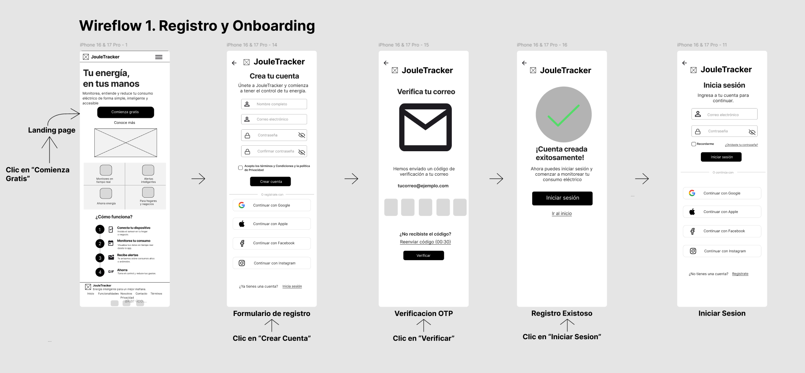

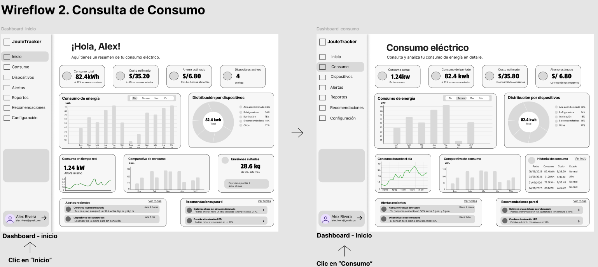

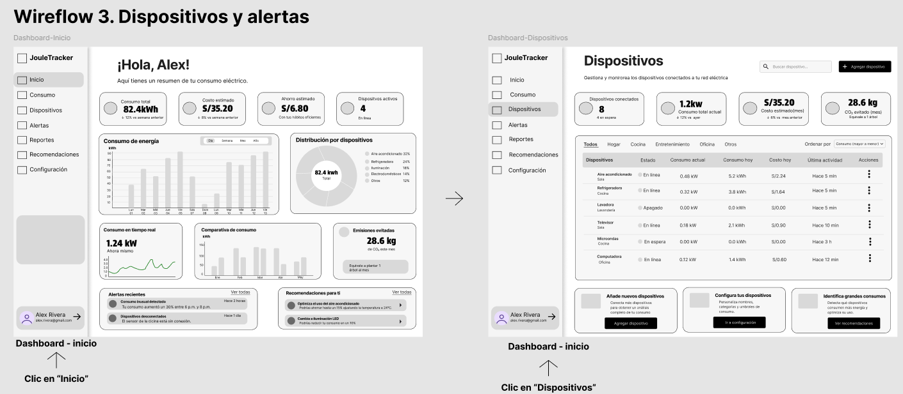

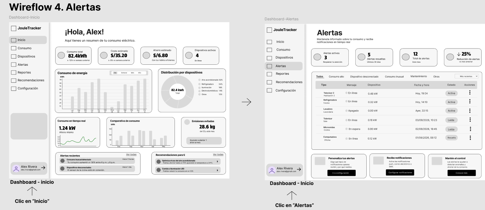

### 4.4.3. Web Applications Mock-ups

Los mock-ups de JouleTracker muestran la versión visual final de la aplicación, incorporando la paleta de verdes, la tipografía y el espaciado definidos para la marca. En estas vistas se evidencia cómo la jerarquía visual y la arquitectura de información definidas en los wireframes se traducen en pantallas operativas, claras y consistentes tanto para el jefe de hogar como para el dueño de un pequeño negocio.

En escritorio, los mock-ups reflejan una interfaz de trabajo con navegación lateral persistente, tarjetas de métricas, gráficos y tablas orientadas a la lectura del consumo eléctrico. En mobile, la experiencia se reorganiza en bloques táctiles de una sola columna, priorizando la consulta rápida y las acciones esenciales.
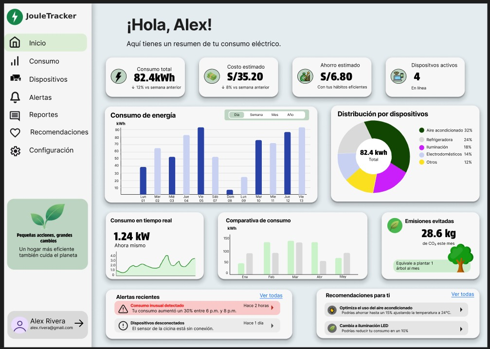

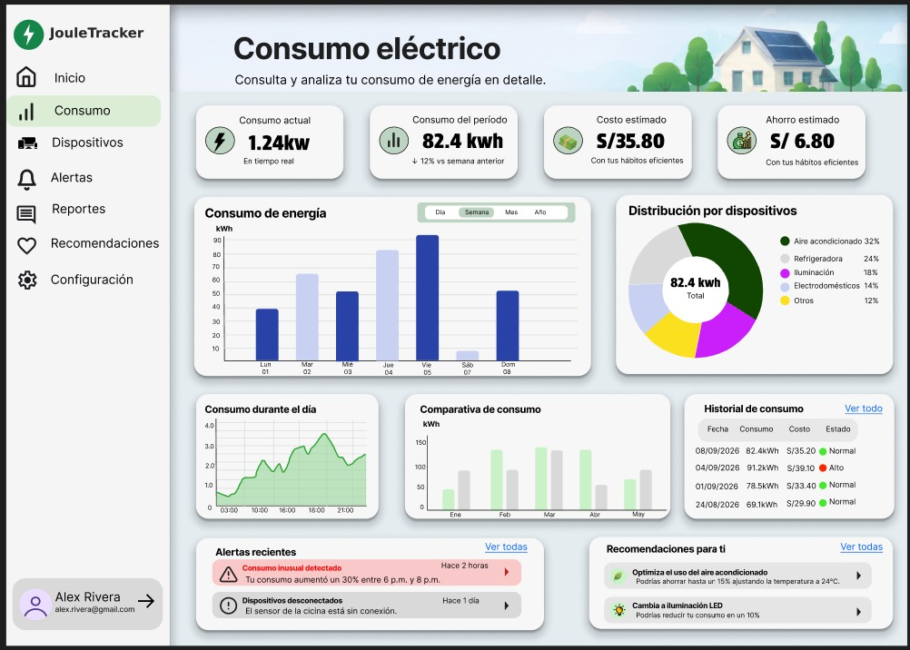

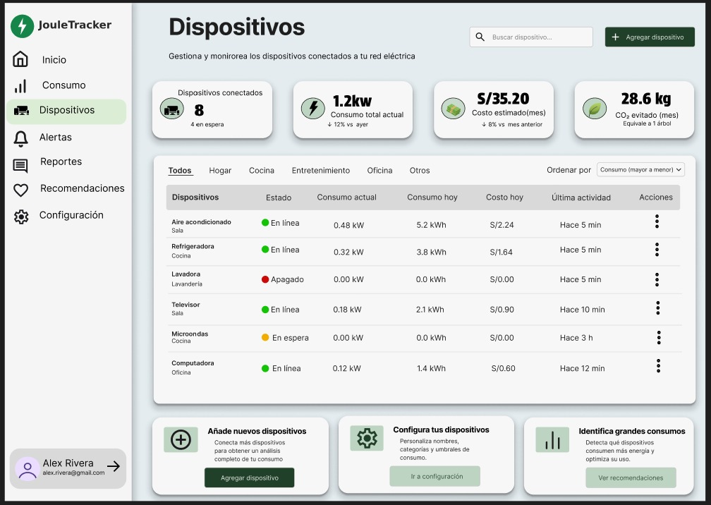

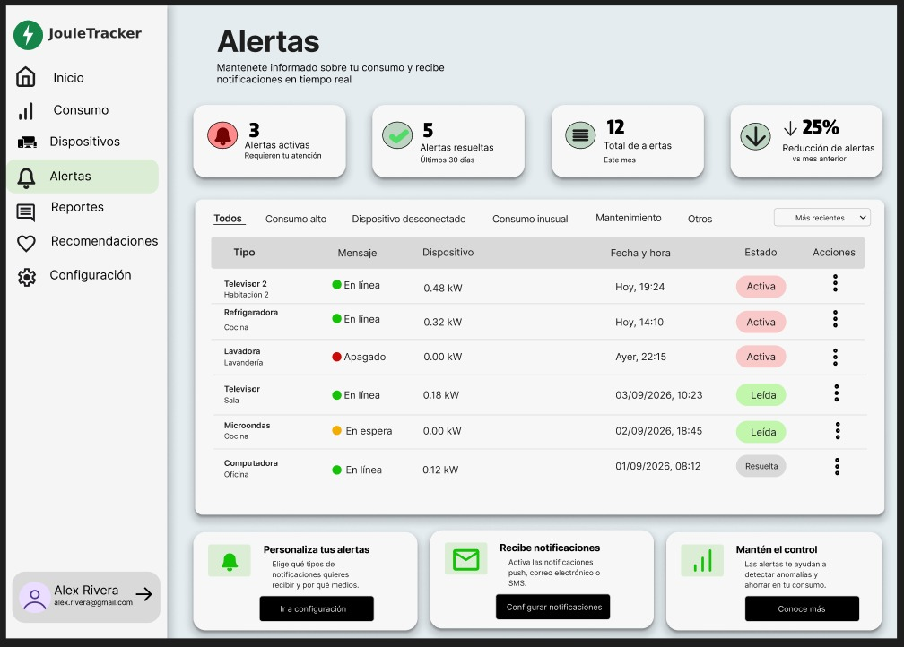

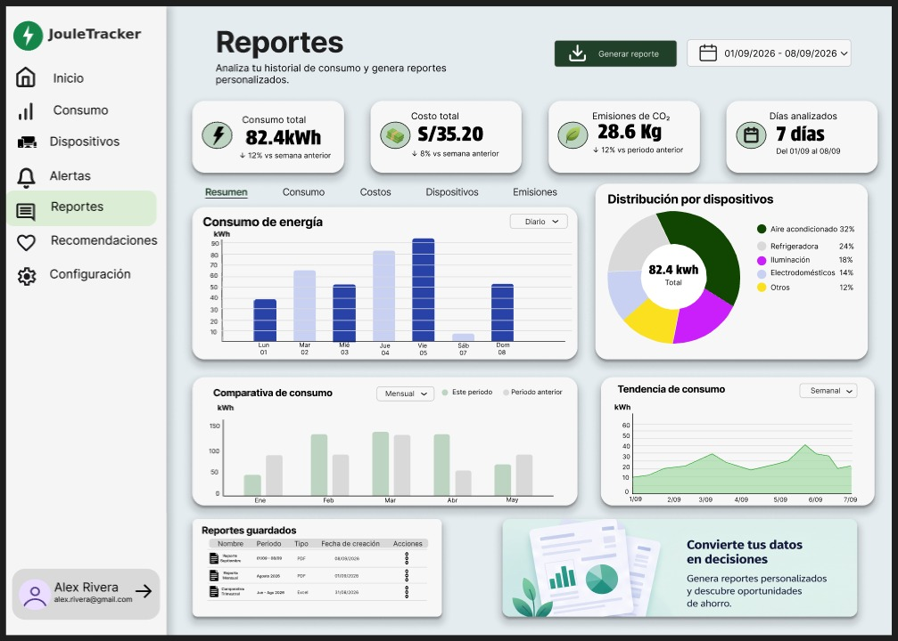

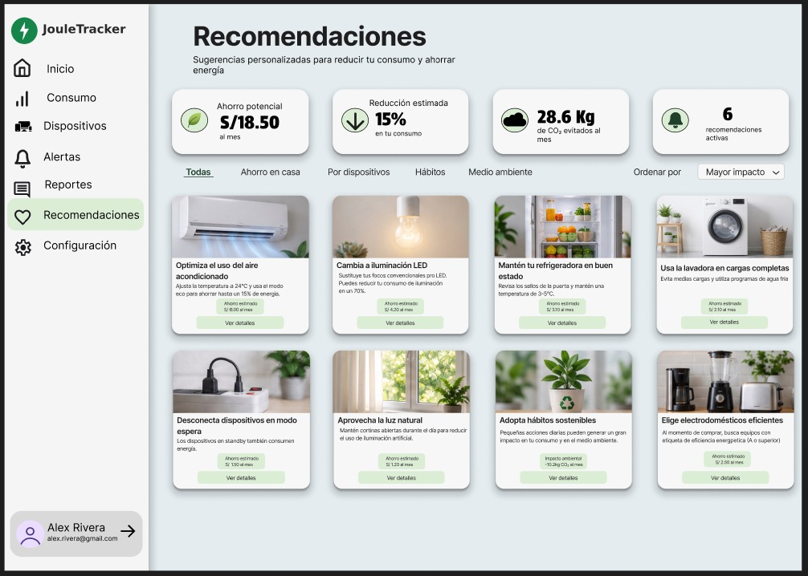

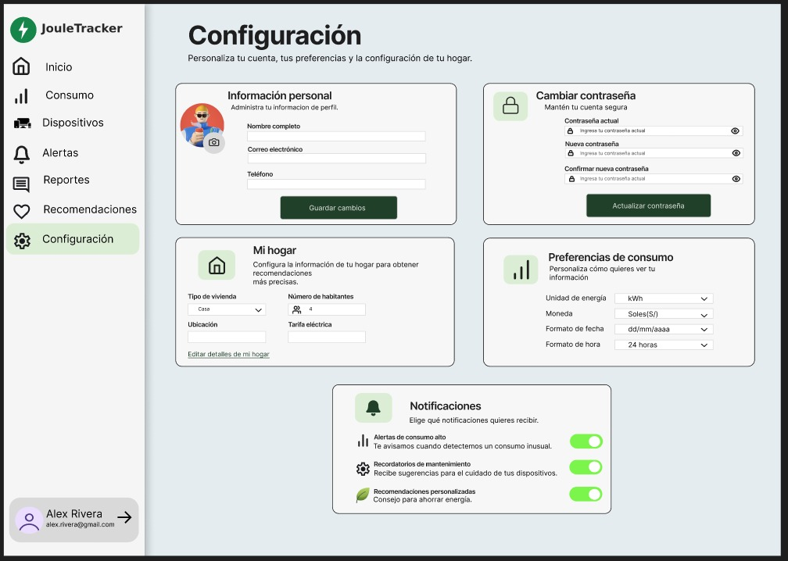

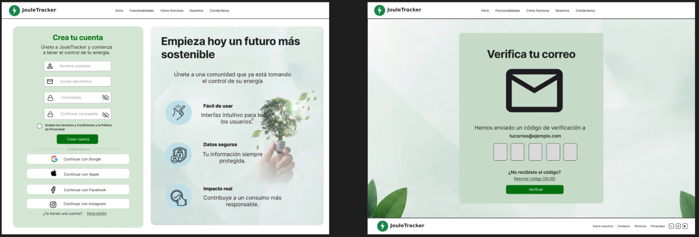

**Login and Register Web**

1) El header de la plataforma, con el logo, la navegación a las secciones del Landing Page (Inicio, Funcionalidades, Cómo funciona, Nosotros, Contáctanos) y el botón de Registrate, manteniendo la misma cabecera del resto del sitio.
2) Es la sección donde el usuario podrá ingresar su información, en el caso del login pide su correo y contraseña, mientras que para registrarse pide nombre completo, correo, contraseña y confirmación de contraseña.
3) Son los campos para rellenar la información solicitada, en el caso del login son solo dos campos, mientras que para registrarse son cuatro.
4) Son los textos interactivos, estos redirigen al usuario a otras secciones del sistema según indique el texto (por ejemplo, ir al registro desde el login, o volver al login desde recuperar contraseña).
5) El botón principal, en el caso del login permite iniciar sesión, mientras que en el registro permite crear la cuenta.
6) El bloque lateral de apoyo, que refuerza el mensaje de valor de la plataforma junto con los beneficios clave (datos en tiempo real, alertas personalizadas, acceso desde cualquier dispositivo, o en el registro: fácil de usar, datos seguros, impacto real).

**Dashboard - Inicio**

1) La barra de navegación lateral de la plataforma, interactuando con ella el usuario puede navegar a las diferentes secciones del sistema: Inicio, Consumo, Dispositivos, Alertas, Reportes, Recomendaciones y Configuración.
2) La sección superior con la vista general del consumo eléctrico del usuario, mostrando el consumo total, el costo estimado, el ahorro estimado y la cantidad de dispositivos activos.
3) Los gráficos de consumo de energía y distribución por dispositivos, que muestran de forma visual en qué se está yendo la electricidad del hogar o negocio.
4) Los paneles de consumo en tiempo real, comparativa de consumo y emisiones evitadas, que refuerzan al usuario el impacto directo de sus hábitos de consumo.
5) Los paneles de alertas recientes y recomendaciones para el usuario, mostrando lo más urgente que necesita revisar.

**Consumo**

1) La barra de navegación lateral de la plataforma, interactuando con ella el usuario puede navegar a las diferentes secciones del sistema.
2) La vista detallada del consumo eléctrico del periodo seleccionado, con las mismas métricas que Inicio pero enfocadas en el detalle del periodo actual.
3) Los gráficos de consumo por día, comparativa de consumo y el historial de consumo con fecha, costo y estado de cada registro.

**Dispositivos**

1) La barra de navegación lateral de la plataforma, interactuando con ella el usuario puede navegar a las diferentes secciones del sistema.
2) La sección con la vista general de los dispositivos conectados a la red eléctrica, mostrando cuántos dispositivos hay, el consumo total actual, el costo estimado del mes y el CO₂ evitado.
3) La lista detallada de dispositivos, mostrando su estado, consumo actual, consumo acumulado, costo y última actividad, con acciones para gestionarlos.
4) El botón principal de esta sección, el cual permite agregar un nuevo dispositivo a la red.

**Alertas**

1) La barra de navegación lateral de la plataforma, interactuando con ella el usuario puede navegar a las diferentes secciones del sistema.
2) La sección con la vista general de las alertas del usuario, mostrando cuántas están activas, cuántas se resolvieron, el total del mes y la reducción de alertas respecto al mes anterior.
3) La lista detallada de las alertas, filtrable por tipo, mostrando el mensaje, el dispositivo relacionado, la fecha, el estado y las acciones disponibles para cada una.

**Reportes**

1) La barra de navegación lateral de la plataforma, interactuando con ella el usuario puede navegar a las diferentes secciones del sistema.
2) El botón para generar un nuevo reporte y el selector de rango de fechas a analizar.
3) La sección con la vista general del periodo (consumo total, costo total, emisiones de CO₂ y días analizados) junto a los gráficos de consumo, comparativa, tendencia y el historial de reportes guardados.

**Recomendaciones**

1) La barra de navegación lateral de la plataforma, interactuando con ella el usuario puede navegar a las diferentes secciones del sistema.
2) La sección con la vista general del ahorro potencial, la reducción estimada, el CO₂ evitado y el número de recomendaciones activas.
3) Las tarjetas de recomendaciones personalizadas, filtrables por categoría, mostrando el ahorro estimado de cada una y un acceso para ver más detalles.

**Configuración**

1) La barra de navegación lateral de la plataforma, interactuando con ella el usuario puede navegar a las diferentes secciones del sistema.
2) La sección de información personal, donde el usuario administra su nombre, correo y teléfono.
3) La sección para cambiar la contraseña, manteniendo la cuenta segura.
4) La sección "Mi hogar", donde el usuario configura el tipo de vivienda, número de habitantes, ubicación y tarifa eléctrica para obtener recomendaciones más precisas.
5) La sección de preferencias de consumo (unidad de energía, moneda, formato de fecha y hora) y la sección de notificaciones, donde el usuario elige qué avisos quiere recibir.

**Mobile**

1) La navegación se compacta en una barra inferior con acceso a los módulos más usados, dejando el resto en un menú desplegable.
2) Cada sección conserva las mismas métricas y funcionalidades de la versión desktop, pero reorganizadas en una sola columna para facilitar la lectura y la interacción táctil.
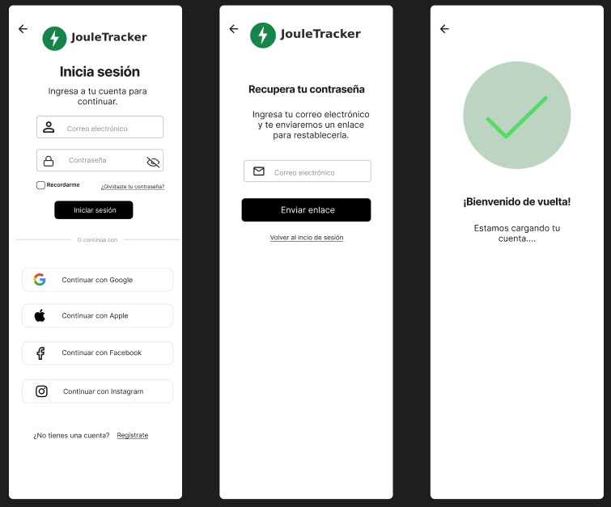
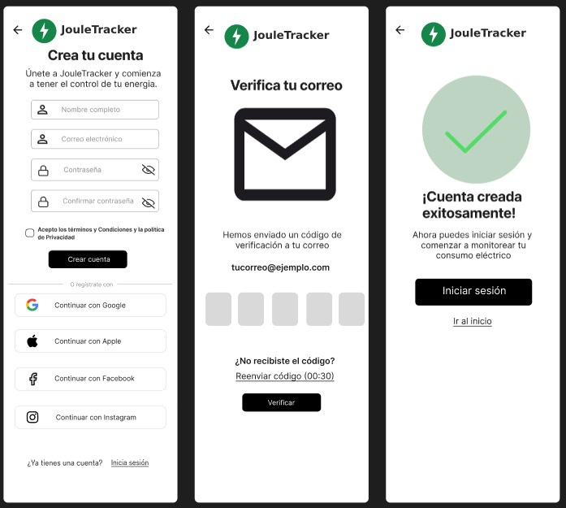

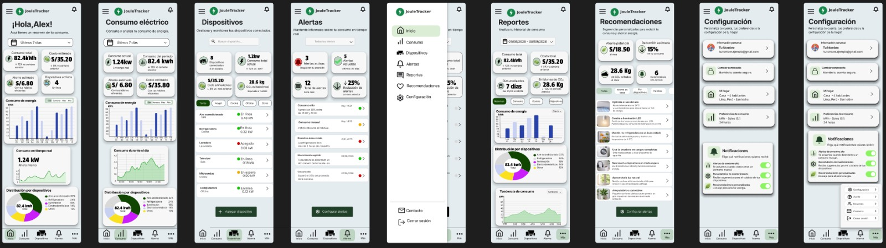

### 4.4.4. Web Applications User Flow Diagrams

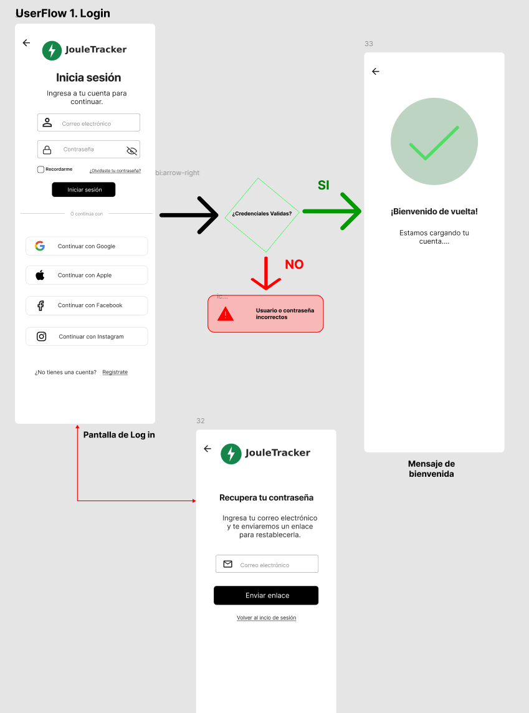

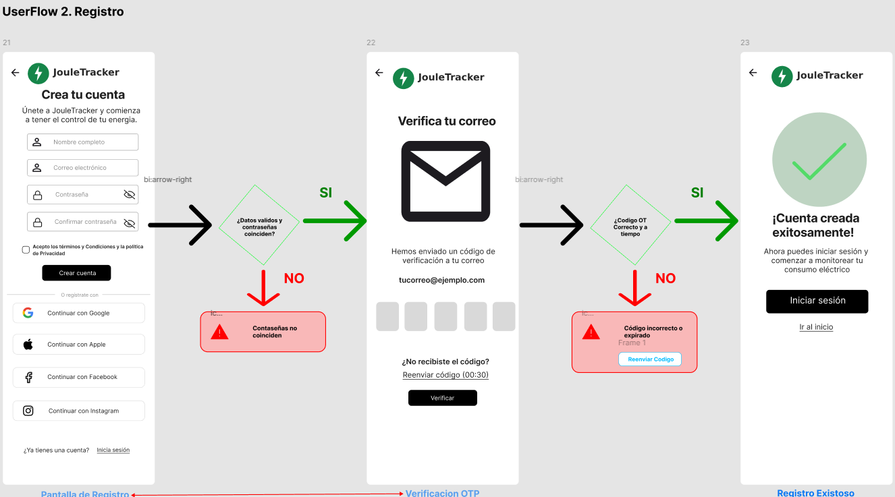

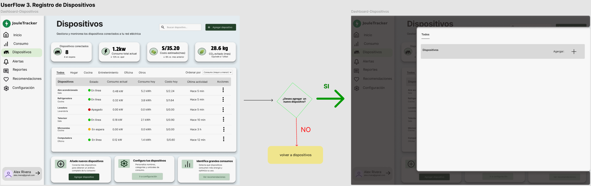

## 4.5. Aplicación Web Prototyping.

La fase de prototipado de JouleTracker nos permitió simular la navegación real de la plataforma antes de pensar en el desarrollo. Con esto validamos que la arquitectura de información, los componentes de interfaz y los flujos que definimos en los wireframes y wireflows realmente tuvieran sentido cuando alguien los recorre de principio a fin, tanto en escritorio como en mobile. Además del prototipo navegable en Figma, dejamos también evidencia en video del recorrido, para mostrar cómo se comporta la interfaz al interactuar con ella.

**Escritorio**

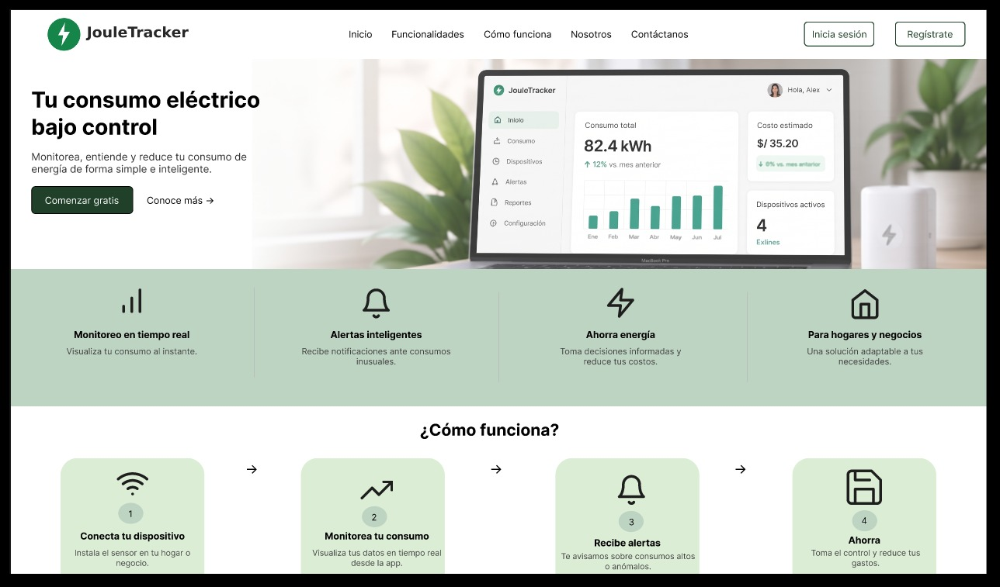

<a href="https://www.figma.com/proto/I9Hbim3oES3bOynqQrzlHw/JouleTracker_Mockap-II--Desktop-?node-id=24-13&t=ywhOr6HZ8TOlJlUd-1&scaling=scale-down&content-scaling=fixed&page-id=0%3A1&starting-point-node-id=24%3A13" target="_blank">Ver prototipo en Figma</a>

**Mobile**
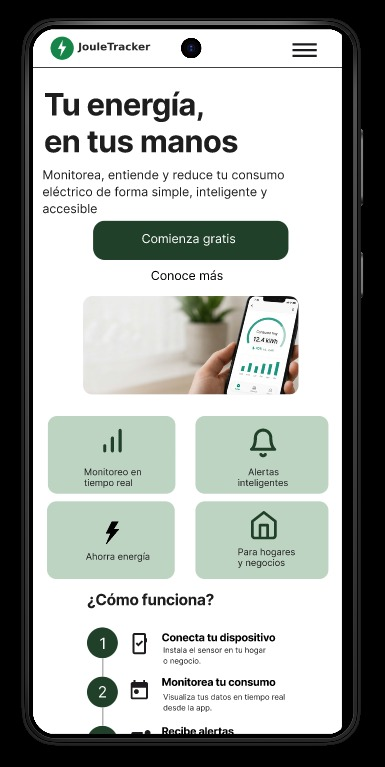

<a href="https://www.figma.com/proto/2cOm4G2UT14h4DdrItKjsA/JouleTracker_Mockap_mobile?node-id=2-66&t=e5ma48eTjakvBbnU-1&scaling=scale-down&content-scaling=fixed&page-id=0%3A1" target="_blank">Ver prototipo en Figma</a>

**Video prototype**
<a href="https://drive.google.com/file/d/1NVVftMkgkf8UINHr9ddtzFL6ZltgTxzm/view?usp=sharing" target="_blank">Video prototype</a>

## 4.6. Domain-Driven Software Architecture

### 4.6.1. Design-Level Event Storming

En esta sección se detalla el proceso de Design-Level EventStorming realizado por el equipo para perfeccionar el modelo del dominio de JoulTracker. Partiendo del Big Picture, profundizamos en el comportamiento interno del sistema para alcanzar el mayor nivel de detalle arquitectónico posible.

Primero, refinamos la línea de tiempo original, eliminando eventos redundantes o procesos manuales que quedaban fuera del alcance tecnológico de la plataforma. Sobre este flujo depurado, incorporamos los elementos tácticos del Domain-Driven Design: Actores y Comandos para representar las intenciones, Read Models para la interfaz gráfica, Políticas para las reglas automáticas y de negocio, Sistemas Externos, y Agregados (Aggregates) como responsables de procesar las operaciones y emitir los eventos de dominio. Este nivel de granularidad nos permitió consolidar y justificar las fronteras definitivas de nuestros Bounded Contexts.

Bounded Context 1: Identity & Access Management

Este contexto delimitado constituye el núcleo de seguridad y gestión de accesos para los usuarios residenciales y comerciales dentro de la plataforma JoulTracker. Se identificaron entidades clave como Usuario, Credenciales y Sesión, junto con conceptos del lenguaje ubicuo como token y autenticación. A partir de comandos como Register User y Log In, se generan eventos como User registered y User authenticated. Asimismo, se definieron políticas de seguridad automatizadas, como el envío de códigos de verificación tras el registro inicial y el bloqueo preventivo de cuentas tras detectar múltiples intentos fallidos de acceso.

Bounded Context 2: Device & Telemetry Management

Este contexto delimitado centraliza la gestión del hardware IoT y la ingesta física de datos hacia la plataforma. Se identificaron entidades como SensorDevice y Telemetry, junto con conceptos del lenguaje ubicuo como payload y heartbeat. A partir de comandos como Register Sensor y Send Telemetry Data, se generan eventos como Sensor registered y Data received. Se establecieron políticas reactivas críticas para mantener la consistencia del estado del hardware, como la desconexión automática del sensor al detectar un timeout prolongado en la red y su posterior reconexión automática al recuperar la transmisión.

Bounded Context 3: Dashboard & Energy Analytics

Este contexto conforma el núcleo analítico de JoulTracker, responsable de procesar la telemetría y calcular el gasto energético en tiempo real. Se manejan entidades como ConsumptionMetric y TariffPlan, utilizando términos como kilovatio-hora (kWh) y estimación monetaria. Mediante comandos como Calculate Energy Consumption y Calculate Estimated Cost, el sistema emite eventos como Energy consumption calculated y Estimated cost calculated. Las políticas de este contexto aseguran la actualización continua del dashboard cada vez que se ingesta nueva data y la conversión automática del consumo a moneda local según la tarifa vigente configurada.

Bounded Context 4: Profiles & History Management

Este contexto delimitado gestiona la información personal de los usuarios y la consolidación estructurada de sus series temporales de consumo. Destacan entidades como UserProfile e HistoricalLog. A través de comandos como Update User Profile y Filter Consumption History, el sistema dispara eventos como Profile updated y History date range filtered. Una política clave en este módulo es la consolidación diaria automatizada (a través de disparadores de tiempo o cronjobs), que congela y empaqueta las lecturas cada 24 horas para garantizar consultas históricas eficientes sin sobrecargar la base de datos.

Bounded Context 5: Alerting & Energy Optimization

Este contexto es el motor de prevención y optimización energética de la plataforma. Gira en torno a entidades como ConsumptionThreshold y AlertNotification, integrando conceptos como umbral de advertencia y patrón de consumo. A partir de comandos como Set Consumption Limit y Evaluate Consumption Thresholds, se originan eventos como Consumption limit set y Abnormal consumption detected. Sus políticas son altamente reactivas: evalúan cada nuevo registro contra las metas del usuario para despachar notificaciones inmediatas o generar recomendaciones de ahorro de forma automática si se detectan patrones anómalos.

Bounded Context 6: Facility & Small Business Analytics

Este contexto delimitado provee las herramientas avanzadas de estructuración física para el segmento comercial (MYPE). Se identificaron entidades como BusinessArea y conceptos como mapeo de zonas y rendimiento de equipamiento. Comandos como Create Business Area y Compare Areas Consumption desencadenan eventos clave como Business area registered y Area consumption compared. Las políticas de este contexto automatizan la agregación de métricas por zona y alertan sobre consumos atípicos (fugas energéticas o maquinaria encendida por error) cuando los locales comerciales se encuentran fuera de su horario de atención.

Se adjunta el enlance del table de miro con el proceso: [miro](https://miro.com/welcomeonboard/TnpJZmYyak5sRFNiYk9yemozbUJtUjBLZDZyYUpTek9McmxaMk9lM0VlTkFEZy81cU5OWWxrZ0U2Rkp0aUxVbWxMOXhrbDEvNkU5QTE3djZjbDNXb0tKa0EydzdPN20yN3dxUXNXSzdXb1J4ZDJITG5ndnJXN1piUnEyeEJpdEl3VHhHVHd5UWtSM1BidUtUYmxycDRnPT0hdjE=?share_link_id=815831854787)

### 4.6.2. Software Architecture Context Diagram

El Diagrama de Contexto (Nivel 1 del modelo C4) establece las fronteras de JouleTracker, ofreciendo una visión de alto nivel sobre cómo la plataforma se integra dentro de su entorno operativo. Este nivel abstrae los detalles internos de implementación y representa al sistema como una única entidad central, destacando exclusivamente las interacciones con los actores humanos y los sistemas de software o hardware externos.

Para este proyecto, el diagrama detalla la relación entre la plataforma y sus principales usuarios (el Jefe de Hogar y el Administrador de Negocio), evidenciando cómo consumen los servicios de monitoreo energético. Asimismo, ilustra la dependencia crítica con el ecosistema de hardware (Sensores IoT) para la ingesta continua de telemetría en tiempo real. Finalmente, establece los límites de responsabilidad del sistema al delegar procesos operativos clave a servicios de terceros, específicamente la gestión de cobros de suscripciones a la pasarela de pagos (Stripe) y la emisión de notificaciones transaccionales al proveedor de correos (Brevo).

El propósito de esta vista es proporcionar una comprensión clara y no técnica del alcance del sistema, el flujo principal de valor y sus dependencias tecnológicas externas.

### 4.6.3. Software Architecture Container Diagrams

El Diagrama de Contenedores (Nivel 2 del modelo C4) realiza un acercamiento al sistema central de JouleTracker para revelar su arquitectura de software interna. En este nivel, el sistema se descompone en unidades técnicas de ejecución y despliegue separadas, conocidas como contenedores, mostrando sus responsabilidades específicas, la distribución del trabajo y las decisiones tecnológicas de alto nivel adoptadas por el equipo de desarrollo.

Para la plataforma JouleTracker, el diagrama ilustra una separación arquitectónica clara. Por un lado, se expone la interfaz de usuario a través de una aplicación web interactiva (Single-Page Application) y un sitio promocional (Landing Page), mediante los cuales interactúan los distintos tipos de clientes. Por otro lado, se detalla el núcleo operativo alojado en una Backend API estructurada con Spring Boot, la cual encapsula la lógica de los dominios, y finalmente, el motor de almacenamiento persistente representado por una base de datos relacional.

Adicionalmente, esta vista mapea el flujo de los datos especificando los protocolos de comunicación utilizados (como llamadas HTTPS/REST y conexiones a base de datos). También evidencia que es la Backend API la que asume la responsabilidad exclusiva de orquestar la ingesta directa desde los sensores IoT y la integración segura con los servicios de terceros (Stripe y Brevo) identificados en el nivel anterior.

### 4.6.4. Software Architecture Components Diagrams

El Diagrama de Componentes (Nivel 3 del modelo C4) realiza un acercamiento exhaustivo y exclusivo al contenedor principal del sistema, la Backend API, para detallar sus bloques de construcción internos. En este nivel, se expone cómo el código de la aplicación se organiza lógicamente en componentes que encapsulan reglas de negocio, interfaces de entrada y adaptadores de salida, sirviendo como mapa directo para la implementación por parte del equipo de desarrollo.

Para la API de JouleTracker, el diagrama ilustra una arquitectura interna fuertemente influenciada por los principios de Domain-Driven Design (DDD). Primero, se identifican los componentes de entrada (REST Controllers y Listeners IoT) responsables de recibir las peticiones de las aplicaciones web y la telemetría de los sensores. Estos adaptadores delegan el procesamiento a los componentes de dominio centrales, los cuales materializan directamente en código los seis Bounded Contexts definidos en el diseño táctico.

Finalmente, la vista detalla los componentes de infraestructura de salida (Repositorios SQL y Clientes REST), que asumen la responsabilidad puramente técnica de persistir los agregados en la base de datos relacional y ejecutar las llamadas hacia los sistemas de terceros como Stripe y Brevo, manteniendo el núcleo del negocio aislado de los detalles de implementación externa.

## 4.7. Software Object-Oriented Design

### 4.7.1. Class Diagrams

#### Consumption Analysis Context

  

[Ver diagrama UML en PlantUML](https://www.plantuml.com/plantuml/png/tLXDR-Cs4BthLn2-DDr53BUz6K6mhkrc1UGZjUAsLqQQA4GaKIL7NhZj_lUEP4OX8rdq6jbBSh58pZoIR-ODoNpIo1LMUHPay80C9LCYVKIM20Kn2ba4-aaK9LSyPoMFdtWA4MupOFKmBz8CB8CuurhF49Muhn32M1QH-0VO97WK2J38Izoo7F9xK3e8TCm9vkV9PCA-Y0GVBPoa5EoNoIG8p8niHBF9F8SYuVMQSbvGBpLnpCio4t7JEtxWCKzWnFuD66ExnR2LutZLElxMsBApizt7-Rdngly-iXGAK1p1zJwf6xn8fYoyw3MOxyP_dBwQraAkogJZ5Y77Iblewxr61yoG0hfZ-jTjH4J2oTyLg6sz-7qMlzS6X7qfD9wv9kVM31IukCeuGiGteaXNeAiCTGi_xnr-nhOx6yolmTT30ft8d8jYdCi4iZ5r21IWdsCDHPMpMoMa4hYzX0raLZWlR_vilw-MYt1zrJO_XnUVsyPwTR6ylZDhUe7j2uE5FflVXNyihUPyUNktNBGTYp2w2gF8wbd-THkkgDrEr9-hb9kpD5MGSWIsaXAT73rbWZ9blGuNLbSk2u5IGT94C-mQeC0CA0QeA0PMVscecxeaMXQWKUGS8Td5RyeM45E7RQ8RQgQzXFLewuIIOID5qX67aKC1Nw81HEFjOt4M6owN1TAs_1ow2TZ38MyG5w1Z9ShwiuTFKGkrp021_E-bp83R4isvUfgzc9pitOijbhVSGns2T4lea5YHx0PxBZNsMtNBWAPjj5R72jlKm5ROea1GLDV1KtA97FFLgUHuvQg2w3PyE5PtjJHeo0sc6NnMnRxnfQkEBXFkPZmLthSXrstVXgwVzMCj-jYmrALTG3SglhE4Tj7y7XwKVhw6pfJk73wUZg01DjJGGrUBv_HCbhKfBMhHU3OjTsaUUPA1ZEDA4JSt1UKHOTw97Fo5BeRo-qr_16SAIgafo7ionrt-oXWtyMmRhuEg-GPEt7bVdmxTK-L150abfSapRH-DthkESIO_yUBYMX_1Z0Qr4J7ejjoPjfSbKnAYdVqxkB8UoLjprJoOjQOyj9oz_wkoA1uKrwYg62i5jWu7AfWjmJ0litUbkpOrDB6XaNHNe99P1cgGaNbhrYirOeG2gN7A-hMrsWrtLauHBMMXOT_DjuLTMxr-iEFfKA1bfUgccTfbPNXx3ZLEbAt-_eV7n_RXqHqQVd7O1s4VJTzsuBLFZNOPRqEc2SsmweoHisBn_HaqyNgpRTFE8BytYlBkTcQiNM6XDEFUOkDNmGzijRoSpSERwsKKkCRizFJSVUZs6VITPQ_jHZ-Ds8VJKpQQZCSVHhrFpo4N-dHgV30ijF7ultFFEHvqjM3y_2Tq4EojViI7xpzfKrPfq1u8JouOZC0p5K5vBaPJba06AKVGHu2P-q8NAXYUTJpsXOVG7kad0-s7yaVCXWk6za1etfTQ2-L76dgC6HW_MSJxm1l0PCB0KWu320QlE2IC0OnXtsu-qvmbA2qq7fGfWyz7WghkCw4V3ygKePUWZHJu1DZTbAjhlsVNXX1Y1JlzVAB1Ai_-1m00)

#### Device Management Context

  

[Ver diagrama UML en PlantUML](https://www.plantuml.com/plantuml/png/tLXHR-Cs37xthn3wijmL3RBjBIYAowMvmK0lnPfqm1vLYtM5isLFadl8jlllOwmufMSnItO5XbrV78dyAFAZI4bzvxoqlYcBf817BtmbhCwVl53QGkPrPHBtIPjQMbcAMcQVP0uhlob0RCNIv0KGXQoGpisyj_gXyP1cbLdftq5CaYUjG41P-uqeeNm0wvB4PHBD_32PJCHdhVmJiQDgBNwSJ99ajw8uK_2iCoYbmL49nezbNHSwariFnuyoamhEn1-9428u8QvRmCSzu4Eh8oulmu-hgw3T_frZCBbs7cn0ZRAgnANKLAHtFS4ypB-PximJ2nZheyuR2mCJSoePskZ4RIZ4e5Hg1SPLTbqDJCxwCceqp1CxEVYWytwJgj5l3TWDMlY9plwydQH14MomvzvlWf2QY0WxIpT8scMGNhNslYHV3cLJLQNKPbnM2eenJcYlmNK91TEKEzzMNlh6aTJDvklqbyL-c2x_Dl5nbYxNY-LiEN-PkqvNyzlbSZ5VBwvtphsi4vm-UPqFi_kRzQ_K6js6kErcUMuXbnx4NLNvtlQx41gJUd-VNfCf8ql0R7ghJKwcrIxTYXUkDtLCwDgGfZqY8nKmmkmzLreHKLChwNU8aO7FguWbYg84xFX40XRRh6uE1Kw3I8zcnBKBC44tHli3ND1aqrgMXNwmqiE83IjIkwyHevDbNQ2lgV5WdsMnWgmo2ZtTJkHWYQgtqhXIEuTB7rOdIGmEax1EgynT1zfNfjwkYzqNc4Q9bEn-1KveOrdA4laboI6opeZYDRgjJZH8beXdJFyzvDg-rRtf4aIbgtYEK9dGJlJNVA88Xd6Uw_IdktyCxwkkbbYDUwCzaPswWRPdXuRX_eaTI1XY-pqom25tt05rWkKJ0eHd7BZO9QGh3L2BhGwkVjr2sb7V1wOpeA3AiiQYYLk3ZLTwMEiIk6wBcmPKjs6-OitGMazpvXYgBDILqxvYjaB7Mb1gqzKD1ZbpyXb6OPtkG1eUO8_QgFRsqxLYSjU9xfn0umaU1AQw0uNpOB-x-ep_-_kI0xiLkAunXp53AkaUgw3txL-1JwInlTh-8ubjxo0K_h-ksjeyMkcyRJBVMA2r66bUj0pJiYvUiVROxiMi-9_LsZx_3ibo7clDU5iL1TWeOVEz-51vMS3SEZyL_Ugw2zFePJTsTMKSn8hYnSQ-5bxWOKpXfuPfmLMDROV1QZ_QkECqvFY5_VpG4-QSUyBGRJ88zxZ3ZF66VpwWa3uVlfB3a0ckneAm5qXNBySo5zuqHC0K5xyKpzQh4OAEGFaGIeVdOTPfzRpqLISVDfq-dWl-IFk35iENqtVYRd4pcwUtoyKg2Kw8Yukh_YCxWDjv-k3izC--FnDlBoxmEnw_FTkf38IJLXWxBvDu9Ox7VrunXtT2AeWgSsTgaWnQ6mR3_OjjAXe7Ze4mUMOmX3CMap1k89IvzKo5WW9owS4T1jFJVWXDujR7OuvsH3_Xfm37G-bTwNGiII27JcXO51ovfn0OZsAk9XJCk4n89bVjaDP3aB0U2w4-7buZYLvni1OYc8IkIdKZ3iKDam901sgmJZlledR9lgUgVEgPboPYcuT2kwU3suPzD59umfKkZOfMCQj9P8Z8BBJLn5KvPGBD7wKPCP-y0wEQilWB)

#### Energy Monitoring Context

  

[Ver diagrama UML en PlantUML](https://www.plantuml.com/plantuml/png/xLbHRzis47xNho3oigvP36zxCugWhkCM1fpOjTk-qz95vYgHAacvSBV-zr4KevvDiRGm3CE6zIMMxlYHz_6xEr9zgJILkYwBf817JRGWakLxJJ8c8TLCy4HzPBoYafQaekb7ciDM7miWZPdol03aa1PKgQdMakrg3OjKy2tx0cISx5a61CfA7qa9vGwaIXALKWFpotWy9fzPflS89wiO-NKyJX8t8xa23Z8_be8pBIJZ-OXMLS5Isgnmz4XJci4L-JqXXBIB87CxuBuRyDhwa1SlsX-tjywx-NVT12DaTWzKrH9AuFfPAigIycn25fjpswmr_JXnao0JWgoaI44fP7n5TRf7mEj-Zs_mvnQ4RfRKR43_YcUUiHVJkHa64N0EUaarg1FeJpN8em5-qsDyszWYNEI0HwXNnpiui1GGRg_z2Nh9b7xXuT_Q2RucNxydaqoKbF5HAJ8eHcOGqmpKarA0roMnp6urrRL2abYjvm_TmtgpcistsyN3c-xLR7M_NixVpU-wDw-dYwLxD2lguD_Mj63ww4tmORfSV1kyVRzTpsVlkkV5GsD7Q4xMdYICeATvBY6d6iX627qYx1l2Z1xUlqSptP3CShlm3ROIG3RL4t9duDwn4f0LU1QqbLXKDJTE2wuX1udHBGCJpBUVBMsAc2q_29PXkHT2WM_4rFW2DDpCkJRanpdPDT2B8Lm1LqBw1aT5c4Mxo9dWgYwh9lMC5wIif0LogiHda7s6WoWqpQ7FbDPI0jTzfaS99j5uUWpEPMgY5lwCNM4CauxeTaeth7-WHGrajViDqhWUiNXw-Fo4ysTocawO6VCwiztW7fIo76rrKm5GBCu774OJr4w80YZtukelas513GnAI9OpJWjBLEzkjdD25lDWWc-0Ai5xucrQvF7Rwfzn-7mAznEH9sFTBW-kgwxpT7MLSGtID6K8Dqz3fVk5k7IjuiubdTaWJ9opRbtczLldv_bbt11xoFD3cqj1-wnDA6H7Aa4X1jjuF53hXoBfn_UxUHmQUuUecc6DXNbevMNCJYI3rT4qUGOzuWWV9qnazcz86n7EWWUAuU38kdPgGQqDgP9zmSO19C41k7Ri15jPcqQGpGzjNxkpO-sJ2oDUUFn-DhGlYTHscMp5KM-B7b5SVWGN7s_3moVkj3sSiFZC0pPNGYMKUHT807-VdRzLwTE39rL53_0ChRldyEqVeHuPpruTZRYPYp9mPiV-RNO-POyPw_GJG_0JybmK0mArel0lGvT4w8yQi7SAP1EiwjgRUmxlOmVXolAs7O53-l-cEPn_UqiSmBwjxfZx_-ZTbl57IPMMTQhDCB_M-Et4BpEBiYh-TRKbt6lymFxXMjB9L8qaA6rg2TTI50N8tZr29QHpZ9GFUxbJPf-ywh5fBOX9P5ALu0e2oU63EzDmy87yI52YbisZc_gKfc2GcAJGAUSwT6k_lkJuSns-VL_xjszFgJw1yON_DVxSBaHhWVF32y4tMdzjVpztpXJuc3AS5QeKbBjWqlbaJDs0q-JJmjaZ5VB2hFY1RERBwMonUfXl4-_3titDxSctClzBYtKv-I3YerpzV4MUtzoGg_5ezFogfwHwRqw6c9_-lE4nRff0wq-2oJiQ_N4RFluaE7VySU7EdIJXgch92_mdmOJK2bHyS5Gy3YW9p6DGecV72ScWWBo9Rn2C9Q0F98dDE1fzPoyCrDxyAK1TWXCvUGv6yu-RFb0Ie0BXX1M3SE8muQCTHeepxZOmV4XpEheCvvpgE8oBRE1YaiYfqYNdTxoyQjKB47QABw4tJKq05KZ5bFRhPS_uSnSy_1BLnZxc6BXwLp2rlom98fzNXiDvfReFAOaNkm3PJYt3nljk1YULq1Qmby2pkYp-1000)

#### Monitoring Space Context

  

[Ver diagrama UML en PlantUML](https://www.plantuml.com/plantuml/png/vLXBR-Cs4BxpLn2-DDrk3BUz6K6mZkqs0l90hRZNWf4cDh4IfP9K2hVT_rwAuieZUyAiaLuMcqDipUFZl3do1sE5jarPi0AUBBSLrtApjJoN6Z8hAyNCHwbgeKN9Qv5z51j8xQu0thA5sXI01B9263EpLil7naAILIgLVmEViAtCWKDPsnqleNm4RHWpcN0mFqqc4_wNpEqMuUIrv3zF9eo54_ceh9IqbPPgOnmDngAk2vc9ri3nayX43YF-3-ESTpRmsru-RUL_yIByugBxSdaPXDk_7tYcGLW8Af1xZREiAakXyYbFvWHxtd6_d_8X7Q6Al2FTUeSHtcp0s2CX8e9fwbnOyBmKh6qZWB3Mnrm4YCW8SGFMSwvsINxsPmDwvu1-HSJVMXhjsX31NEtM1ZG14pXxh1jfxCKGyD8ZVcAV8ddEgr98DIwh78enA2kj1FCvrQ2QidFoOLS3Ikdr_JfTNj_VB7hArJfDxfPf-iVy_lPskPedivkUbzmjrkd3Af2SGGVWgHMsCGX-Ddz8VbyY_GF2R3M_TiyB38VBCWIWhSVPPgDX8opmLLNPGLsUS-aol5ud2qHIeWINMDj6297Dvo1Cz_50x1nCfcNTTWkbxFsROcUFcgFh2PV7vqhcHzMv02jaOSwmTU-fKp403WokVHULPPletUlHA0VXJ8u56WEQ86ie_EWmMrdxg0NpSFSQ8pSgz6xSxD1X_wVTMQCrg6n7P0iKwCrkxG0m4wS3pOa3cFU4Tl3jr5uC8wZlHQaiw2Sd5fsNBaRX6mfIc2XtedGLXfn2lBweNn9Ox6iDYuHyOVl8-HktB6J90OSyOMOOW2HlTL1dhvf6Z_CtsJSFDV1Iv9PzHM29qugXdVuIZck1k5QS7_xpTI_e2D4N38rAf-VB78DdK3PuH4_lhippPIlepbzuFVzqO8N1JOxeLURxCxzNKxvmK0-oXEXaT8NxblF8OKYRyULnqb1NnZF8_0z3jWh2Fc7xXqFxnJES-KCELv3Z--T9gjplCJ8uHgyjM3XK18x6c_SJX_KiCp3zM0pFH4JmE4mxiMzp6Jqji7x1V2siVWQWe7wLAwzKJreOgvlCDXg81aFZYEojfAoBhxQX-fGQvxcnhg6KrLLHW8uFurxC2T7BgmQNCMEdVBudhZeQzZ7GJLqfSz11eNbwe67lxB4m4GETvhdxLpMwU_J8mm0GRc3NwJU5S3dGEo-ri1_THxJJRxX_Oilu6q8MuXvlcI24hSVh-kcXZ5pUySDEZzw9eN7ME3E8DY8ZCWlImswoLU2_F4rekBszt_7LycOsJ-xTopWR2lFpyqlqzaemyGlg0NlquuY_Ep_deybu_6w4unwJT5y7rn8ZUcey_lSoUkqogYE27dszClRIyF9kqhzTJTiACAzhnf8PC1XzWaEWrvCfpw7mlrAOY2gwWYb5HaAFn_7WEeYj-oZ0HFI7GJv1CxAn87M6F4FQn0A1b6WTUbl0YcISV80ZotJ8Aphp93qMtIHS8KSmehf4KRepQz166XihYSYRbjDl7Wjfjh74qYzDM9N5UeNk9xe5QKrQXa_3HcBO1r1vKnR_0G00)

#### Recommendation Management Context

  

[Ver diagrama UML en PlantUML](https://www.plantuml.com/plantuml/png/tLXDR-Cs4BthLn2-DDr53BUz6K6mhkrc1UGZjUAsLqQQA4GaKIL7NhZj_lUEP4OX8rdq6jbBSh58pZoIR-ODoNpIo1LMUHPay80C9LCYVKIM20Kn2ba4-aaK9LSyPoMFdtWA4MupOFKmBz8CB8CuurhF49Muhn32M1QH-0VO97WK2J38Izoo7F9xK3e8TCm9vkV9PCA-Y0GVBPoa5EoNoIG8p8niHBF9F8SYuVMQSbvGBpLnpCio4t7JEtxWCKzWnFuD66ExnR2LutZLElxMsBApizt7-Rdngly-iXGAK1p1zJwf6xn8fYoyw3MOxyP_dBwQraAkogJZ5Y77Iblewxr61yoG0hfZ-jTjH4J2oTyLg6sz-7qMlzS6X7qfD9wv9kVM31IukCeuGiGteaXNeAiCTGi_xnr-nhOx6yolmTT30ft8d8jYdCi4iZ5r21IWdsCDHPMpMoMa4hYzX0raLZWlR_vilw-MYt1zrJO_XnUVsyPwTR6ylZDhUe7j2uE5FflVXNyihUPyUNktNBGTYp2w2gF8wbd-THkkgDrEr9-hb9kpD5MGSWIsaXAT73rbWZ9blGuNLbSk2u5IGT94C-mQeC0CA0QeA0PMVscecxeaMXQWKUGS8Td5RyeM45E7RQ8RQgQzXFLewuIIOID5qX67aKC1Nw81HEFjOt4M6owN1TAs_1ow2TZ38MyG5w1Z9ShwiuTFKGkrp021_E-bp83R4isvUfgzc9pitOijbhVSGns2T4lea5YHx0PxBZNsMtNBWAPjj5R72jlKm5ROea1GLDV1KtA97FFLgUHuvQg2w3PyE5PtjJHeo0sc6NnMnRxnfQkEBXFkPZmLthSXrstVXgwVzMCj-jYmrALTG3SglhE4Tj7y7XwKVhw6pfJk73wUZg01DjJGGrUBv_HCbhKfBMhHU3OjTsaUUPA1ZEDA4JSt1UKHOTw97Fo5BeRo-qr_16SAIgafo7ionrt-oXWtyMmRhuEg-GPEt7bVdmxTK-L150abfSapRH-DthkESIO_yUBYMX_1Z0Qr4J7ejjoPjfSbKnAYdVqxkB8UoLjprJoOjQOyj9oz_wkoA1uKrwYg62i5jWu7AfWjmJ0litUbkpOrDB6XaNHNe99P1cgGaNbhrYirOeG2gN7A-hMrsWrtLauHBMMXOT_DjuLTMxr-iEFfKA1bfUgccTfbPNXx3ZLEbAt-_eV7n_RXqHqQVd7O1s4VJTzsuBLFZNOPRqEc2SsmweoHisBn_HaqyNgpRTFE8BytYlBkTcQiNM6XDEFUOkDNmGzijRoSpSERwsKKkCRizFJSVUZs6VITPQ_jHZ-Ds8VJKpQQZCSVHhrFpo4N-dHgV30ijF7ultFFEHvqjM3y_2Tq4EojViI7xpzfKrPfq1u8JouOZC0p5K5vBaPJba06AKVGHu2P-q8NAXYUTJpsXOVG7kad0-s7yaVCXWk6za1etfTQ2-L76dgC6HW_MSJxm1l0PCB0KWu320QlE2IC0OnXtsu-qvmbA2qq7fGfWyz7WghkCw4V3ygKePUWZHJu1DZTbAjhlsVNXX1Y1JlzVAB1Ai_-1m00)

#### User Management Context

  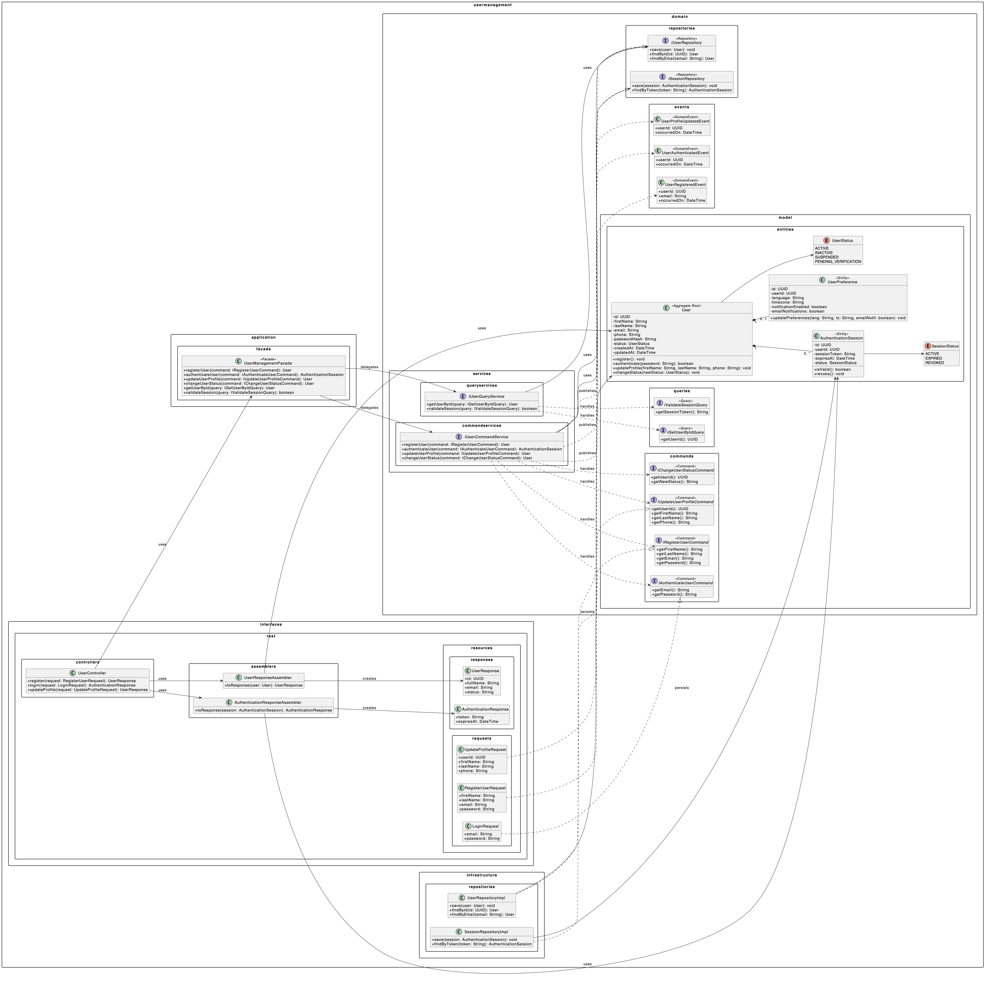

[Ver diagrama UML en PlantUML](https://www.plantuml.com/plantuml/png/xLXBSzis4BxpLs1ygPh46hMzQJAUgBQISfeghcHxUkl0v4h217mK09tQRVvx0GgIbreWBEjqcaDr4ObzxEBR1nPyfGrNfYba8c5jcAcO4fkjORbGa1bHbOb-BygQArwmccVl-GPMvbu2SsHURYGWXanohMV6A77R64Ypgbo91s2JP2joO53KvfuLKDo2qacYCsxLV3kPJDW7aPijqfFNWdqtcII9jyXE6WsguALzBg0qOrxNKcJS-JTUyupdSCB-I1XZEnVOjMN_wS3-kkLWBr_k7ixE7A__FMSADa8RK4vcb5M5DPDFMRf4o-UxrQ-dhM8aonkpjGQSAt0aF-kIa0vFyVwlG6lxXvGsTUvbBbMr5XAGrkjZMjIrR6kZqtAk33UDHahEZqXH7HimRkNx-pGV_TQ0khV2RnxNVdPBLEgEI-6yz3ixIDvqr_VIjrKbWUy0-9XyZ0Szhmekod5HvI373a0ZGE_Z3cLJiCSjeGZFpg_Ic_dXDLqSBQokLvVpnSNyuh3YNjF5crzlvilqTNe-kqhVBRnxZxRyBlhCpN-vJ9T8zt9-y-v7_zwgmobhKtIssIZOS0DiMLMcawgdJEGMxElq0YsjXT9cmGkOifLHejmWckHH4bWePM2ztbObXDQjYnygbV_0zJP0rYqAKnG0HCmKS0Fvp4pPXNsu4WKWgirsGgN5ERA9SbU9F59xexr_UzyEUKKBQrzK1BaN1B0NNJo83xx8V86Ly655SC0o9DwN2jQWeCnSSvgxZBxIzxYhYfGkI-j9mpUXu1cBwKCuhcLbnDftedd9RoNa53cVBWl4g-FuFcvAZvnJZs2QXyCpqdZG58Cgt32VZfZUARggtaCPAf7VQw50uyIa6Tzj0mWBeTjsDmecee8xQnJdz83Ev_lueVE9qe1Qymo2PvQ5oJzvd51IV-qhm7g2zeyOtl9Fq-SkY37YfIz9JFUHnLxJapBk-MSsJ0_JVikEExMgVJPzNZmlNRVfSviStq_qUh5IMzZme8nq1xm0cf1qMB0-jlzz7WPtJYQ87fKhLD__O6zmPryqdIltHGRvt75O-nUjGFlMzIBSUPxJqzUlLrdMAAluNObwJl3am3Kpt8_Xzdo1s8hvjmps1qH1NMbXgaYkxMBZMLnQx5z8RcX-1oDdOtTGqsDzBSgy7NhtXmaPSZtBhWzrmebPQGRxd1pWfp-b8jU6cE-xf3VuQ8lTFFus_dRnJcIWzoUGVu_5mZUZrOxh_ojNtvLhK0ZQErLF0DgsIE7_qgvrebmhhergCjCem5LEcYykyBIevNzPrTuflslYrvTNnOViq1PZRMmLbqPLKe8Au7n-80OBTwJ0Xb-RASCrkzmjUgoMeEkgr834PRKHvQFiM_VgXSY-i7Zm_dPGSusNmpuCHqU1hXhbNhsTBaYXVMEawBqSqSYzl7yoEBxVaaJqO19Fdg0o26pqb7_othjtxIT5p4Szr3yygRCD4TX28-Mm4FaROHnDajxK4L_fr2IzYWx7n_e0nIqkTmhBRCzpv9Qdu_vAAwn_l_qM-ZjbM2_2uoksdB-TdTjlTlDLubnafwTd-CjKKB5ZwbxcTx8dtvomPwUdx6Go7jl7xbSRolBi9DAUar3368__F0kEFOclPimMcMuIMgLU93ww90dkyGWXyirywcfSnzXfKEFyuR0HoIJeXbKG6YgjK0wo_Loguu9q6C9YIKZlU1oEYvNSsZy9EY96uZH8bCHhW2oPC8beGe6madJqGQ8H2JhoOQamf3uIU8JpCO-pU_r40ILHpwXWwEh3yAV87E4bT22QIUSOKTNeBJGHaUqqfBmV5Wq5ktWTmWhrznAeRUWFoc7h0uIfLy1Y6mIRWe7L7n0uboOOhap1MsDzlMEE9ZUud050IzUGPatXVmB)

## 4.8. Database Design

### 4.8.1. Database Diagrams

En esta sección se presentan los diagramas de base de datos de cada Bounded Context, mostrando sus tablas, columnas, tipos de datos, claves primarias y foráneas, constraints y relaciones, con el fin de representar la estructura necesaria para la correcta persistencia de la información.

## 1. User Management Database Diagram

El **User Management Database Diagram** representa la estructura de persistencia responsable de gestionar la información de los usuarios del sistema. Este bounded context permite almacenar los datos básicos de identificación, autenticación, rol y estado de cada usuario, manteniendo la información necesaria para controlar su acceso y participación dentro de la plataforma.git pull --rebase

Las entidades pertenecientes a este contexto se encuentran enfocadas exclusivamente en la gestión de usuarios y sus datos de acceso, evitando almacenar información propia de otros bounded contexts.

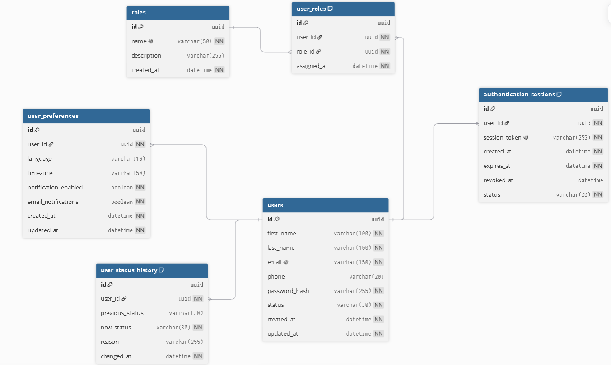

## 2. Monitoring Space Database Diagram

El **Monitoring Space Database Diagram** representa la estructura de persistencia utilizada para gestionar los espacios que serán monitoreados por la plataforma. Un espacio puede representar un hogar, negocio u otro establecimiento donde se realiza el seguimiento del consumo energético.

Este bounded context permite almacenar la información de los espacios monitoreados, sus características generales y la relación de los usuarios con dichos espacios. La información relacionada directamente con dispositivos o mediciones pertenece a sus respectivos bounded contexts.

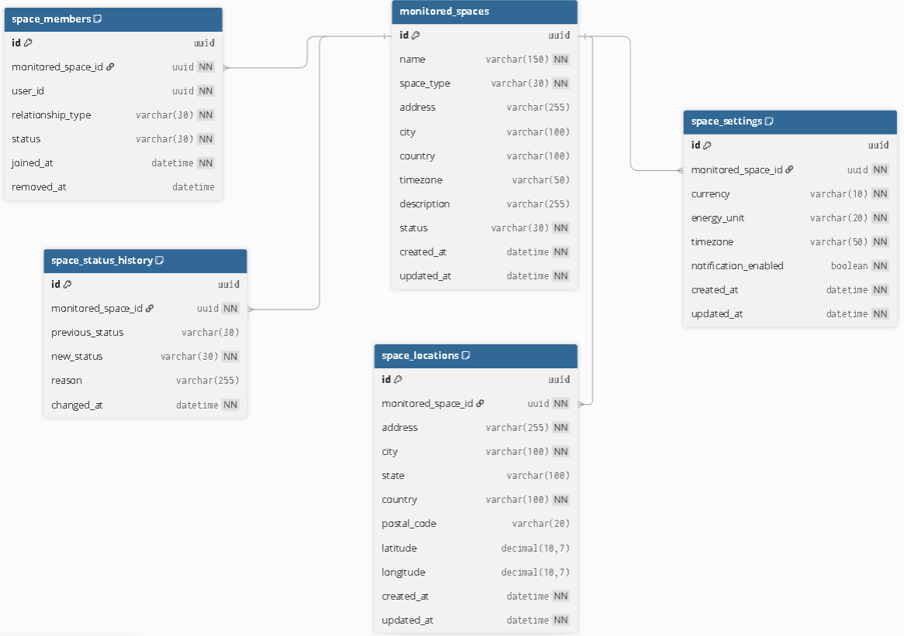

## 3. Device Management Database Diagram

El **Device Management Database Diagram** representa la estructura de persistencia encargada de administrar los dispositivos IoT y sensores utilizados por la plataforma. Este contexto mantiene la información relacionada con el registro, configuración, estado y seguimiento de los dispositivos.

Las entidades de este bounded context permiten identificar los dispositivos y sensores disponibles, almacenar sus configuraciones y mantener un historial de sus estados. Las mediciones generadas por estos dispositivos pertenecen al bounded context de Energy Monitoring.

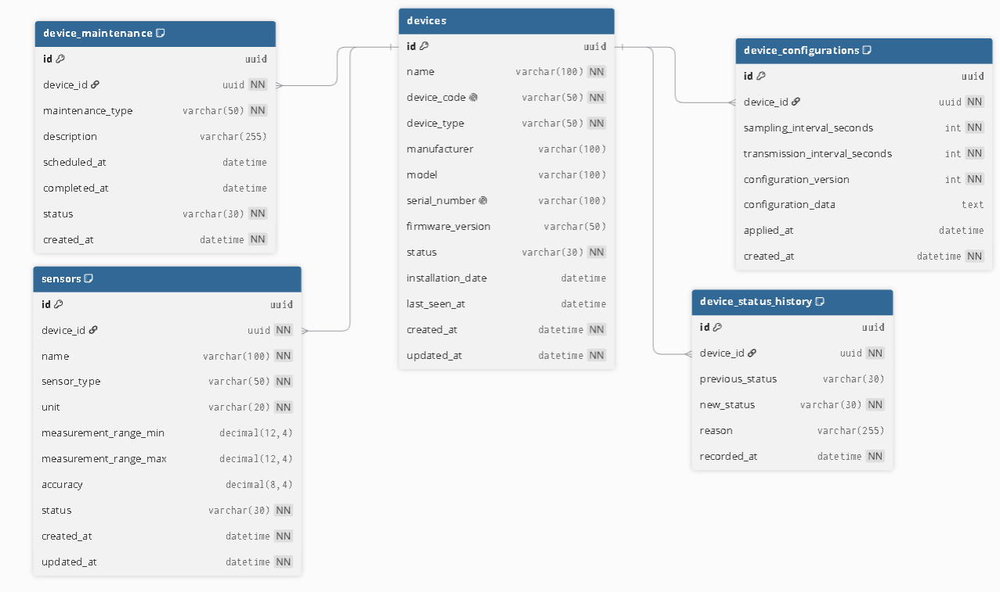

## 4. Energy Monitoring Database Diagram

El **Energy Monitoring Database Diagram** representa la estructura de persistencia responsable de almacenar las mediciones obtenidas desde los dispositivos IoT. Este bounded context permite registrar los datos de consumo y las variables eléctricas asociadas a cada medición.

También contempla la organización de las mediciones en lotes y el control de su calidad o validación. Las referencias hacia dispositivos y sensores pertenecen conceptualmente al contexto de Device Management, por lo que no se establecen dependencias de base de datos que rompan la autonomía entre bounded contexts.

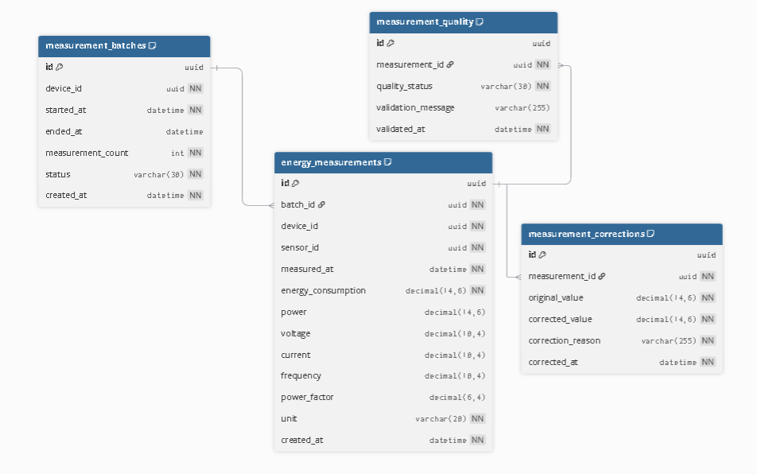

## 5. Consumption Analysis Database Diagram

El **Consumption Analysis Database Diagram** representa la estructura de persistencia utilizada para analizar la información de consumo previamente registrada. Este bounded context permite almacenar perfiles de consumo, análisis realizados sobre determinados periodos, patrones identificados y anomalías detectadas.

Su responsabilidad se centra en transformar las mediciones recopiladas en información útil para comprender el comportamiento del consumo. Las referencias hacia los espacios monitoreados se manejan como referencias externas al bounded context correspondiente.

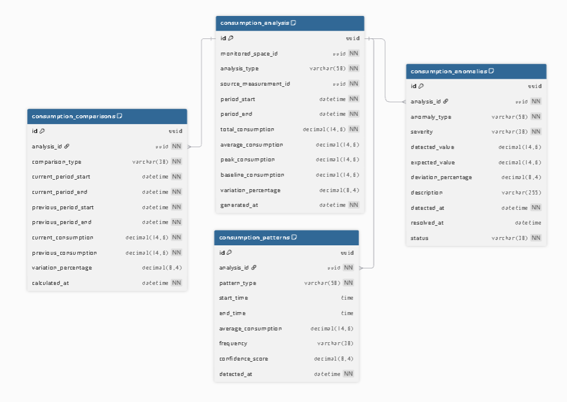

## 6. Recommendation Management Database Diagram

El **Recommendation Management Database Diagram** representa la estructura de persistencia responsable de gestionar las recomendaciones generadas a partir del análisis del consumo. Este bounded context permite registrar recomendaciones, su descripción, prioridad, ahorro estimado y estado de seguimiento.

Asimismo, permite almacenar las acciones asociadas a cada recomendación, facilitando el seguimiento de las medidas propuestas para mejorar el comportamiento del consumo. Las referencias hacia espacios monitoreados o resultados de análisis se mantienen como referencias externas, preservando la independencia del bounded context.

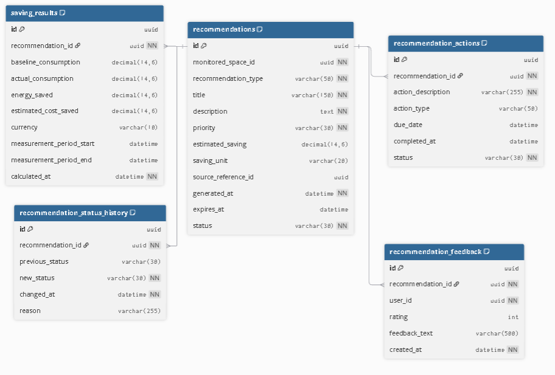
>>>>>>> origin/feature/chapter4
