# Capítulo V: Product Implementation, Validation & Deployment
## 5.1. Software Configuration Management.
Para el desarrollo de JouleTracker, el equipo establece un proceso de gestión de configuración de software con el propósito de mantener organizados, controlados y disponibles los diferentes artefactos generados durante el proyecto.

La gestión de configuración permite administrar el código fuente, la documentación, los recursos gráficos y las diferentes versiones desarrolladas durante los sprints. Para ello, el equipo utiliza Git como sistema de control de versiones distribuido y GitHub como plataforma para el almacenamiento remoto y la colaboración entre los integrantes de VoltLab.

El repositorio de JouleTracker se organiza mediante diferentes ramas destinadas al desarrollo de capítulos, funcionalidades y componentes específicos del proyecto. Esta estrategia permite que cada integrante pueda trabajar de manera independiente sobre las actividades asignadas sin modificar directamente las ramas principales.

Asimismo, el equipo emplea convenciones para los nombres de las ramas y los mensajes de commit, permitiendo mantener un historial comprensible de los cambios realizados durante el desarrollo.

La gestión de configuración de JouleTracker comprende principalmente los siguientes elementos:

- Control de versiones mediante Git.
- Almacenamiento y colaboración mediante GitHub.
- Uso de ramas para separar las diferentes actividades de desarrollo.
- Registro de modificaciones mediante commits descriptivos.
- Organización de la documentación y recursos del proyecto.
- Integración progresiva de los cambios desarrollados por los integrantes del equipo.
- Gestión de las versiones generadas durante los diferentes sprints del proyecto.
### 5.1.1. Software Development Environment Configuration.

Durante el desarrollo de JouleTracker, el equipo utiliza diferentes herramientas de software para gestionar el proyecto, desarrollar la aplicación web, diseñar la interfaz y colaborar durante las diferentes actividades del ciclo de vida del producto.

| Producto de software | Propósito de uso en el proyecto | Actividad | Tipo de acceso / enlace |
|---|---|---|---|
| GitHub | Repositorio utilizado para almacenar y gestionar el código fuente de la aplicación web, además de facilitar el control de versiones y la colaboración entre los integrantes. | Software Development | [GitHub](https://github.com/JouleTracker/JouleTracker) |
| Jira | Herramienta utilizada para organizar, asignar y realizar el seguimiento de las tareas correspondientes a los Sprints del proyecto. | Project Management | [Jira](https://alejandrochoquehuanca007.atlassian.net/jira/software/projects/JOUL/boards/1/backlog?atlOrigin=eyJpIjoiYzkxZjFiZTFlZTEzNDEwMzk2ZmEwZDBhODJmNDI4OWYiLCJwIjoiaiJ9) |
| UXPressia | Herramienta utilizada para elaborar y organizar elementos relacionados con la experiencia del usuario, como personas y mapas de experiencia/journey maps. | Requirements Management / Product UX | [UXPressia](https://uxpressia.com/w/NxJgO) |
| Miro | Plataforma colaborativa utilizada para organizar información, desarrollar actividades de ideación y trabajar visualmente de manera conjunta durante el proyecto. | Requirements Management / Collaboration | [Miro](https://miro.com/app/board/uXjVHqBr2y8=/) |
| Visual Studio | Entorno de desarrollo utilizado para escribir, editar y ejecutar el código fuente de la aplicación web. | Software Development | [Visual Studio](https://code.visualstudio.com) |
| Figma | Herramienta utilizada para el diseño UX/UI de JouleTracker, incluyendo wireframes, mockups y prototipos de la aplicación. | Product UX/UI Design | [Figma](https://www.figma.com/design/I9Hbim3oES3bOynqQrzlHw/JouleTracker_Mockap-II--Desktop-?t=t6nxRhPCoFxgRXay-0) |
| PantUML | Herramienta utilizada para elaborar diagramas UML que permiten representar visualmente la estructura y relaciones de los componentes del sistema. | Software Design / Modeling | [Diagrama UML](https://www.plantuml.com/plantuml/png/tLXHR-Cs37xthn3wijmL3RBjBIYAowMvmK0lnPfqm1vLYtM5isLFadl8jlllOwmufMSnItO5XbrV78dyAFAZI4bzvxoqlYcBf817BtmbhCwVl53QGkPrPHBtIPjQMbcAMcQVP0uhlob0RCNIv0KGXQoGpisyj_gXyP1cbLdftq5CaYUjG41P-uqeeNm0wvB4PHBD_32PJCHdhVmJiQDgBNwSJ99ajw8uK_2iCoYbmL49nezbNHSwariFnuyoamhEn1-9428u8QvRmCSzu4Eh8oulmu-hgw3T_frZCBbs7cn0ZRAgnANKLAHtFS4ypB-PximJ2nZheyuR2mCJSoePskZ4RIZ4e5Hg1SPLTbqDJCxwCceqp1CxEVYWytwJgj5l3TWDMlY9plwydQH14MomvzvlWf2QY0WxIpT8scMGNhNslYHV3cLJLQNKPbnM2eenJcYlmNK91TEKEzzMNlh6aTJDvklqbyL-c2x_Dl5nbYxNY-LiEN-PkqvNyzlbSZ5VBwvtphsi4vm-UPqFi_kRzQ_K6js6kErcUMuXbnx4NLNvtlQx41gJUd-VNfCf8ql0R7ghJKwcrIxTYXUkDtLCwDgGfZqY8nKmmkmzLreHKLChwNU8aO7FguWbYg84xFX40XRRh6uE1Kw3I8zcnBKBC44tHli3ND1aqrgMXNwmqiE83IjIkwyHevDbNQ2lgV5WdsMnWgmo2ZtTJkHWYQgtqhXIEuTB7rOdIGmEax1EgynT1zfNfjwkYzqNc4Q9bEn-1KveOrdA4laboI6opeZYDRgjJZH8beXdJFyzvDg-rRtf4aIbgtYEK9dGJlJNVA88Xd6Uw_IdktyCxwkkbbYDUwCzaPswWRPdXuRX_eaTI1XY-pqom25tt05rWkKJ0eHd7BZO9QGh3L2BhGwkVjr2sb7V1wOpeA3AiiQYYLk3ZLTwMEiIk6wBcmPKjs6-OitGMazpvXYgBDILqxvYjaB7Mb1gqzKD1ZbpyXb6OPtkG1eUO8_QgFRsqxLYSjU9xfn0umaU1AQw0uNpOB-x-ep_-_kI0xiLkAunXp53AkaUgw3txL-1JwInlTh-8ubjxo0K_h-ksjeyMkcyRJBVMA2r66bUj0pJiYvUiVROxiMi-9_LsZx_3ibo7clDU5iL1TWeOVEz-51vMS3SEZyL_Ugw2zFePJTsTMKSn8hYnSQ-5bxWOKpXfuPfmLMDROV1QZ_QkECqvFY5_VpG4-QSUyBGRJ88zxZ3ZF66VpwWa3uVlfB3a0ckneAm5qXNBySo5zuqHC0K5xyKpzQh4OAEGFaGIeVdOTPfzRpqLISVDfq-dWl-IFk35iENqtVYRd4pcwUtoyKg2Kw8Yukh_YCxWDjv-k3izC--FnDlBoxmEnw_FTkf38IJLXWxBvDu9Ox7VrunXtT2AeWgSsTgaWnQ6mR3_OjjAXe7Ze4mUMOmX3CMap1k89IvzKo5WW9owS4T1jFJVWXDujR7OuvsH3_Xfm37G-bTwNGiII27JcXO51ovfn0OZsAk9XJCk4n89bVjaDP3aB0U2w4-7buZYLvni1OYc8IkIdKZ3iKDam901sgmJZlledR9lgUgVEgPboPYcuT2kwU3suPzD59umfKkZOfMCQj9P8Z8BBJLn5KvPGBD7wKPCP-y0wEQilWB) |


### 5.1.2. Source Code Management.
JouleTracker utiliza Git como sistema de control de versiones y GitHub como plataforma para almacenar, administrar y compartir el código fuente y la documentación del proyecto entre los integrantes de VoltLab.

El repositorio oficial del proyecto se encuentra disponible en el siguiente enlace:

[Repositorio de JouleTracker](https://github.com/JouleTracker/JouleTracker)

Para organizar el trabajo colaborativo, el equipo utiliza una estrategia basada en ramas. Cada integrante desarrolla las actividades correspondientes en ramas específicas, evitando realizar modificaciones directamente sobre las ramas principales del proyecto.

Entre las ramas utilizadas se encuentran:

| Rama | Propósito |
|---|---|
| `main` | Contiene la versión principal y estable del proyecto. |
| `develop` | Rama utilizada para integrar avances antes de incorporarlos a la versión principal. |
| `feature/chapter1` | Desarrollo y actualización del Capítulo I del informe. |
| `feature/chapter2` | Desarrollo y actualización del Capítulo II del informe. |
| `feature/chapter3` | Desarrollo y actualización del Capítulo III del informe. |
| `feature/chapter4` | Desarrollo y actualización del Capítulo IV del informe. |
| `feature/chapter5` | Desarrollo y actualización del Capítulo V del informe. |

Cada modificación realizada en el proyecto es registrada mediante commits descriptivos que permiten identificar el propósito de los cambios realizados.

El equipo emplea una estructura basada en Conventional Commits para mantener uniformidad en los mensajes registrados en el repositorio:

`type(scope): description`

Algunos ejemplos utilizados durante el desarrollo son:

`docs(chapter4): add UML class diagrams`

`docs(chapter5): add software configuration management`

Los principales tipos de commit utilizados son:

| Tipo | Descripción |
|---|---|
| `feat` | Incorporación de una nueva funcionalidad. |
| `fix` | Corrección de errores. |
| `docs` | Modificaciones relacionadas con la documentación. |
| `style` | Cambios de formato que no afectan el funcionamiento del software. |
| `refactor` | Modificaciones internas destinadas a mejorar la estructura del código. |
| `test` | Incorporación o modificación de pruebas. |
| `chore` | Cambios relacionados con mantenimiento o configuración del proyecto. |

El flujo de trabajo seguido por los integrantes consiste principalmente en actualizar la información del repositorio remoto, cambiar a la rama correspondiente, realizar las modificaciones necesarias, registrar los archivos modificados, crear un commit descriptivo y finalmente enviar los cambios hacia la rama remota correspondiente.

Este procedimiento permite mantener un historial organizado, identificar las contribuciones realizadas por cada integrante y reducir posibles conflictos durante la integración de los diferentes avances del proyecto.

### 5.1.3. Source Code Style Guide & Conventions.

Durante el desarrollo de JouleTracker, VoltLab establece convenciones de código con el objetivo de mantener una estructura uniforme, legible y fácil de mantener entre los diferentes integrantes del equipo.

Para el desarrollo de la Landing Page se utilizan principalmente HTML5, CSS y JavaScript, aplicando convenciones específicas para cada tecnología.

#### HTML

El código HTML utiliza etiquetas semánticas para representar correctamente la estructura y propósito de cada sección de la página.

Entre las principales etiquetas utilizadas se encuentran:

- `<header>` para la cabecera de la página.
- `<nav>` para los elementos de navegación.
- `<main>` para el contenido principal.
- `<section>` para organizar las diferentes secciones.
- `<article>` para representar contenido independiente.
- `<button>` para elementos interactivos.
- `<footer>` para información complementaria.

Asimismo, se utilizan atributos de accesibilidad como:

- `aria-label`
- `aria-expanded`
- `aria-controls`
- `aria-hidden`

Estos atributos permiten mejorar la accesibilidad y comprensión de los elementos interactivos de la aplicación.

#### CSS

Los estilos de JouleTracker se organizan mediante hojas de estilo externas. La Landing Page utiliza el archivo principal:

`css/styles.css`

Para mantener consistencia visual se utilizan variables CSS definidas mediante `:root`.

Ejemplo:

```css
:root {
  --primary: #214029;
  --primary-100: #bed4c2;
  --paper: #ffffff;
  --radius: 14px;
}
```

### 5.1.4. Software Deployment Configuration.
La configuración de despliegue de JouleTracker permite publicar las diferentes soluciones desarrolladas por Team Volta para que puedan ser visualizadas y evaluadas durante los Sprint Reviews.

Durante el Sprint 1, la Landing Page de JouleTracker fue desplegada utilizando **GitHub Pages**, servicio que permite publicar contenido web estático directamente desde un repositorio de GitHub.

La Landing Page está desarrollada utilizando HTML, CSS y JavaScript, por lo que puede ser desplegada directamente sin necesidad de configurar un servidor de aplicaciones adicional.

El repositorio utilizado para la Landing Page es:

[JouleTracker Landing Page Repository](https://github.com/JouleTracker/JouleTracker-LandingPage)

La versión desplegada se encuentra disponible en:

[JouleTracker Landing Page](https://jouletracker.github.io/JouleTracker-LandingPage/)

#### Configuración del despliegue

Para realizar el despliegue mediante GitHub Pages se sigue el siguiente procedimiento:

1. Los integrantes desarrollan y validan los cambios correspondientes en el repositorio de la Landing Page.
2. Los cambios aprobados son integrados en la rama principal `main`.
3. Se accede a la configuración del repositorio en GitHub.
4. En la sección **Settings > Pages**, se configura GitHub Pages como mecanismo de despliegue.
5. Se selecciona la rama `main` como fuente del contenido publicado.
6. GitHub procesa automáticamente los archivos HTML, CSS, JavaScript, imágenes y demás recursos almacenados en el repositorio.
7. Una vez finalizado el proceso, la versión actualizada queda disponible mediante la URL pública de GitHub Pages.

El flujo general de despliegue puede representarse de la siguiente manera:

`Development → Git Repository → main → GitHub Pages → Production`

#### Estructura utilizada para el despliegue

La Landing Page mantiene una estructura organizada que permite que GitHub Pages interprete correctamente los recursos necesarios para mostrar el sitio web.

Entre los principales recursos se encuentran:

| Recurso | Propósito |
|---|---|
| `index.html` | Contiene la estructura principal de la Landing Page. |
| `css/styles.css` | Contiene los estilos visuales y responsive de la interfaz. |
| Archivos JavaScript | Gestionan el comportamiento dinámico e interacción de la página. |
| `images/` | Contiene los recursos gráficos utilizados en la Landing Page. |
| `favicon.svg` | Representa el ícono utilizado por el sitio web. |

#### Validación posterior al despliegue

Luego de realizar el despliegue, el equipo verifica que la aplicación pueda ser accedida correctamente desde la URL pública.

La validación incluye:

- Correcta visualización de la página principal.
- Funcionamiento de la navegación entre secciones.
- Carga correcta de imágenes y recursos.
- Funcionamiento de los elementos desarrollados con JavaScript.
- Correcta visualización en dispositivos móviles.
- Validación del diseño responsive.
- Funcionamiento del cambio de idioma.
- Acceso correcto a la sección de contacto.
- Verificación de enlaces internos y externos.

Este procedimiento permite que JouleTracker mantenga una versión pública y accesible de la Landing Page durante las diferentes etapas del proyecto, facilitando su revisión y validación durante los Sprint Reviews.

## 5.2. Landing Page, Services & Applications Implementation.

### 5.2.1. Sprint 1
Durante el Sprint 1, Team Volta se enfocó en la implementación y preparación de la Landing Page de JouleTracker como principal producto visible para presentar la propuesta de valor de la solución.

El objetivo del sprint fue desarrollar una interfaz web funcional, responsive y accesible utilizando HTML, CSS y JavaScript. La Landing Page fue diseñada para explicar de forma clara el propósito de JouleTracker, sus principales beneficios, funcionamiento, planes disponibles y medios de contacto.

Durante este sprint también se organizaron las responsabilidades del equipo, se definieron las actividades correspondientes al desarrollo de la interfaz y se prepararon las evidencias necesarias para el Sprint Review.

Entre los principales resultados obtenidos durante el Sprint 1 se encuentran:

- Implementación de la Landing Page de JouleTracker.
- Desarrollo de una interfaz responsive para distintos tamaños de pantalla.
- Incorporación de navegación entre las principales secciones del sitio.
- Implementación del cambio de idioma entre español e inglés.
- Presentación de beneficios, funcionalidades, planes y propuesta de valor.
- Incorporación de secciones de testimonios, preguntas frecuentes y contacto.
- Aplicación de criterios básicos de accesibilidad mediante HTML semántico y atributos ARIA.
- Despliegue de la Landing Page mediante GitHub Pages.
- Preparación de evidencias de desarrollo, ejecución y despliegue para el Sprint Review.

La versión desarrollada durante este sprint permitió contar con una primera implementación pública de JouleTracker, facilitando la presentación y validación de la propuesta ante los usuarios y durante la revisión del proyecto.

### 5.2.1.1. Sprint Planning 1.

En el Sprint 1 como equipo nos centramos en la creación de la Landing Page de JouleTracker, que será la cara visible de nuestra plataforma ante los usuarios. En este sprint se definieron las funcionalidades necesarias para presentar la propuesta de valor de JouleTracker, informar sobre sus beneficios, explicar su funcionamiento y mostrar sus principales funcionalidades, además de facilitar el acceso al registro e inicio de sesión.

Sprint Planning 1

| Sprint # | 1 |
|---|---|
| Date | 18-09-2026 |
| Time | 15:00 |
| Location | Virtual, Discord |
| Prepared by | Alejandro Samir Choquehuanca Vasquez |
| Attendees | Alejandro Samir Choquehuanca Vasquez, Miguel Angel Jara Espinoza, Miguel Angel Vidal Castro, Mijail Alexander Matihues Quevedo, Rodrigo Velasquez Velasquez |
| Sprint 0 Review Summary | *No aplica por ser el primer sprint.* |
| Sprint 0 Retrospective Summary | *No aplica por ser el primer sprint.* |
| Sprint 1 Goal | Nuestro enfoque en este sprint es desarrollar e implementar la Landing Page de JouleTracker, permitiendo que los visitantes conozcan la propuesta de valor de nuestra plataforma. La página presentará información sobre sus beneficios, funcionamiento y principales funcionalidades, además de facilitar el acceso al registro e inicio de sesión. Se considerará completado cuando las funcionalidades planificadas para la Landing Page se encuentren implementadas y disponibles para los usuarios. |
| Sprint 1 Velocity | Límite de 32 SP |
| Sum of Story Points | 32 SP |
### 5.2.1.2. Aspect Leaders and Collaborators

| Team Member | GitHub username | Landing Page | UI & Responsive Design | Scripts and UX | SEO and Accessibility | Content and Assets |
|---|---|---|---|---|---|---|
| Choquehuanca Vasquez, Alejandro Samir | ascv.dev | L | C | C | C | C |
| Jara Espinoza, Miguel Angel | MiguelJara2 | C | L | C | C | C |
| Vidal Castro, Miguel Angel | Gossk | C | C | L | C | C |
| Matihues Quevedo, Mijail Alexander | Anyone260 | C | C | C | L | C |
| Rodrigo Velasquez Velasquez | Rodrigov233 | C | C | C | C | L |

### 5.2.1.3. Sprint Backlog 1.
| US Id | US Title                               | Task Id | Task Title                                 | Description                                                                                  | Estimation (Hours) | Assigned To                           | Status |
|-------|----------------------------------------|---------|--------------------------------------------|----------------------------------------------------------------------------------------------|--------------------|---------------------------------------|--------|
| US-06 | Visualización de Landing Page          | T01     | Crear estructura HTML base                 | Construir la estructura semántica principal (header, main, footer) de la Landing Page.       | 3                  | Choquehuanca Vasquez, Alejandro Samir | Done   |
| US-06 | Visualización de Landing Page          | T02     | Implementar hoja de estilos global         | Aplicar variables CSS, tipografías y diseño Mobile First para la estructura base.            | 3                  | Matihues Quevedo, Mijail Alexander    | Done   |
| US-07 | Consulta de beneficios de JouleTracker | T03     | Maquetar sección de beneficios             | Implementar la grilla visual para destacar el ahorro energético y el monitoreo preventivo.   | 2                  | Jara Espinoza, Miguel Angel           | Done   |
| US-08 | Consulta del funcionamiento            | T04     | Maquetar sección de cómo funciona          | Estructurar los pasos explicativos sobre la conexión de sensores IoT y la visualización.     | 2                  | Vidal Castro, Miguel Angel            | Done   |
| US-09 | Consulta de funcionalidades            | T05     | Integrar tarjetas de funcionalidades       | Desarrollar los componentes visuales para el historial, alertas y proyecciones.              | 2                  | Matihues Quevedo, Mijail Alexander    | Done   |
| US-39 | Soluciones para hogares y negocios     | T06     | Crear sección de segmentación              | Diseñar la vista que diferencia los beneficios para el jefe de hogar y la MYPE.              | 3                  | Rodrigo Velasquez Velasquez           | Done   |
| US-10 | Acceso a registro e inicio de sesión   | T07     | Configurar barra de navegación y CTAs      | Incorporar los botones de "Iniciar Sesión" y "Registrarse" en el header vinculados a anclas. | 2                  | Choquehuanca Vasquez, Alejandro Samir | Done   |
| US-06 | Visualización de Landing Page          | T08     | Implementar script de internacionalización | Añadir lógica en JavaScript Vanilla para alternar textos entre Español e Inglés.             | 3                  | Vidal Castro, Miguel Angel            | Done   |
| US-06 | Visualización de Landing Page          | T09     | Despliegue en GitHub Pages                 | Configurar el repositorio público y activar el entorno de GitHub Pages para producción.      | 1                  | Jara Espinoza, Miguel Angel           | Done   |

### 5.2.1.4. Development Evidence for Sprint Review.

| Repository               | Branch        | Commit Id | Commit Message                                       | Commit Message Body                                                        | Committed on (Date) |
|--------------------------|---------------|-----------|------------------------------------------------------|----------------------------------------------------------------------------|---------------------|
| JouleTracker-LandingPage | develop       | e4a7b1c   | feat: setup initial HTML structure and CSS variables | Creación del index.html y styles.css con colores corporativos.             | 2026-09-19          |
| JouleTracker-LandingPage | feature/US-06 | 8f2d3a1   | feat: add responsive navbar and hero section         | Implementación del menú de navegación y vista principal con media queries. | 2026-09-20          |
| JouleTracker-LandingPage | feature/US-07 | 1c9b4e5   | feat: implement benefits section layout              | Maquetación en CSS Grid para las tarjetas de beneficios.                   | 2026-09-21          |
| JouleTracker-LandingPage | feature/US-39 | 6a8f9c2   | feat: add household and business solutions section   | Separación visual de propuestas para hogares y MYPEs.                      | 2026-09-22          |
| JouleTracker-LandingPage | feature/US-06 | 3d5e7b8   | feat: add i18n language toggle script                | Archivo main.js con diccionario JSON para cambio de idioma ES/EN.          | 2026-09-23          |
| JouleTracker-LandingPage | develop       | f1a9c4d   | Merge pull request #1 from feature/US-06             | Integración de internacionalización a develop.                             | 2026-09-24          |
| JouleTracker-LandingPage | main          | 9b2a1f0   | Merge branch 'develop' into main for release         | Preparación de la rama principal para el despliegue final en GitHub Pages. | 2026-09-25          |

### 5.2.1.5. Execution Evidence for Sprint Review

En esta sección se presentan las evidencias de ejecución correspondientes al Sprint 1 de JouleTracker. Las capturas muestran la implementación de la Landing Page y las principales funcionalidades desarrolladas durante el sprint, incluyendo la presentación de la propuesta de valor, los beneficios de la plataforma, su funcionamiento, las funcionalidades principales y el acceso al registro e inicio de sesión.


#### Landing Page de JouleTracker

La siguiente captura muestra la sección principal de la Landing Page de JouleTracker, donde se presenta la propuesta de valor de la plataforma y se orienta al usuario sobre el propósito de la solución.

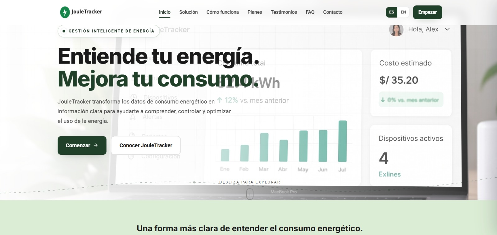

**Figura:** Sección principal de la Landing Page de JouleTracker con la propuesta de valor de la plataforma.

#### Beneficios de JouleTracker

En esta sección se presentan los principales beneficios que ofrece JouleTracker para el monitoreo y gestión del consumo energético de hogares y pequeños negocios.

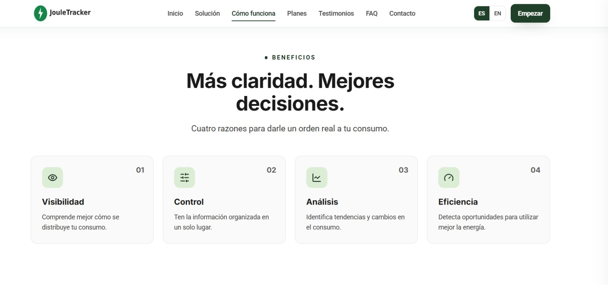

**Figura:** Visualización de los principales beneficios de JouleTracker.

#### Funcionamiento de JouleTracker

La siguiente evidencia muestra la sección destinada a explicar de manera sencilla cómo funciona JouleTracker y cómo la plataforma permite realizar el monitoreo del consumo energético.

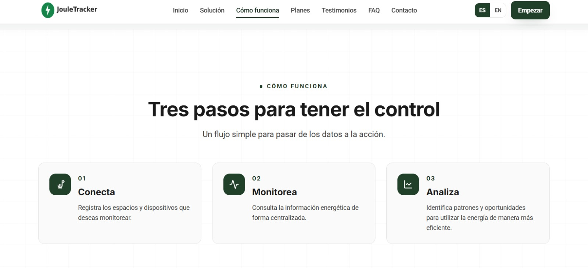

**Figura:** Explicación del funcionamiento de la plataforma JouleTracker.

#### Funcionalidades principales

En esta sección se muestran las funcionalidades principales de JouleTracker, orientadas al monitoreo del consumo energético, visualización de información y gestión de los datos obtenidos.

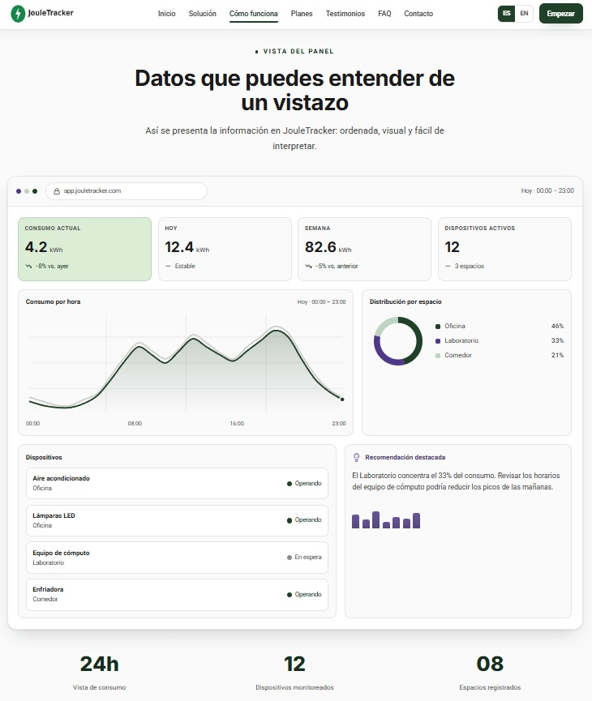

**Figura:** Visualización de las funcionalidades principales de JouleTracker.

#### Planes y costos de JouleTracker

La siguiente captura muestra la sección de planes de JouleTracker, donde se presentan las diferentes opciones disponibles para los usuarios. Cada plan cuenta con un precio mensual y características diferenciadas según las necesidades de monitoreo y análisis del consumo energético.

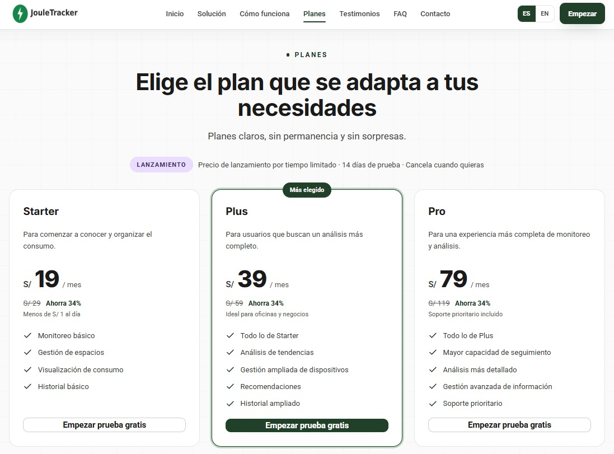

**Figura:** Visualización de los planes de suscripción y costos mensuales de JouleTracker.

#### Versión en inglés de la Landing Page

La siguiente captura evidencia la disponibilidad de la Landing Page de JouleTracker en idioma inglés, permitiendo que la información sobre la plataforma, sus beneficios y funcionalidades pueda ser presentada a usuarios que utilizan este idioma.

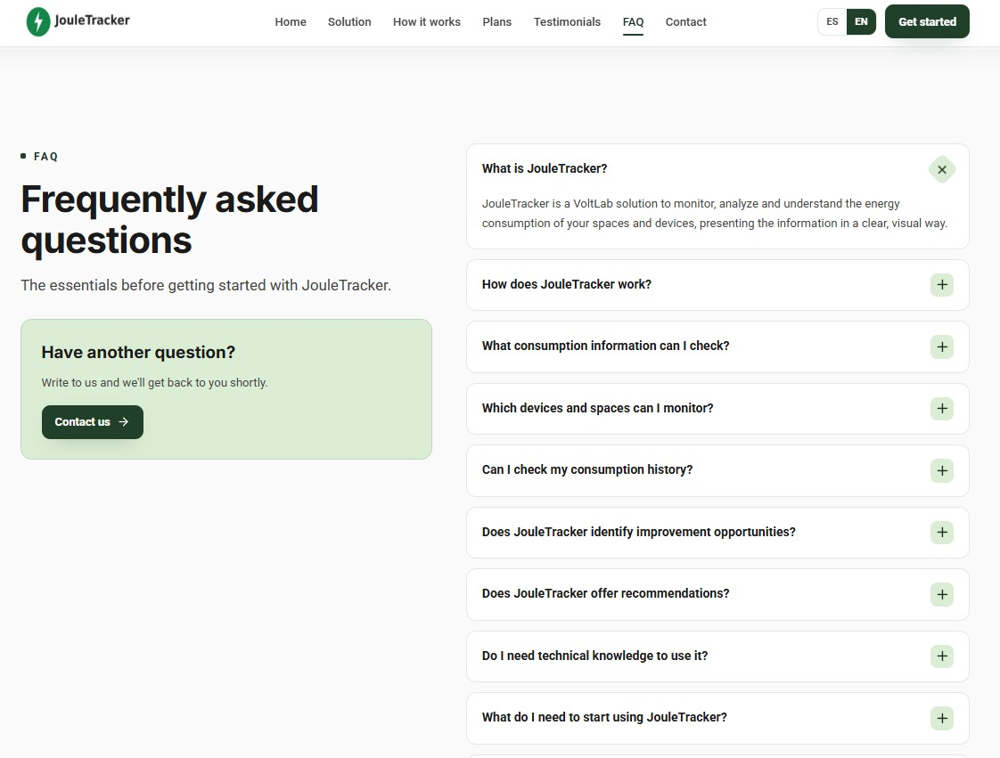

**Figura:** Visualización de la Landing Page de JouleTracker en idioma inglés.

#### Evidencia del despliegue

La Landing Page de JouleTracker fue desplegada para permitir su visualización y validación durante el Sprint Review.

**Enlace de la página desplegada:** [JouleTracker Landing Page](https://jouletracker.github.io/JouleTracker-LandingPage/)

**Enlace del video de ejecución:** [Video de ejecución](https://drive.google.com/file/d/1v6G61TiA350A7FiNq-jFrFq6u096fupr/view?usp=sharing)

### 5.2.1.6. Services Documentation Evidence for Sprint Review.

Durante el Sprint 1, el alcance del proyecto estuvo enfocado exclusivamente en el diseño, maquetación y despliegue de la Landing Page promocional. Al tratarse de un sitio web de contenido estático desarrollado con HTML5, CSS3 y JavaScript puro (Vanilla JS), la arquitectura actual no requiere interacción con bases de datos ni procesamiento del lado del servidor.

Por consiguiente, en esta iteración inicial no se han implementado controladores, repositorios ni servicios de aplicación, motivo por el cual no se genera documentación técnica de endpoints mediante Swagger u OpenAPI. La especificación técnica de los servicios web (Backend API) se documentará en el próximo sprint correspondiente al desarrollo del Core Domain.

### 5.2.1.7. Software Deployment Evidence for Sprint Review.
La evidencia del despliegue de la Landing Page durante el Sprint se mostrará a continuación, el despliegue se realizará en GitHub Pages.

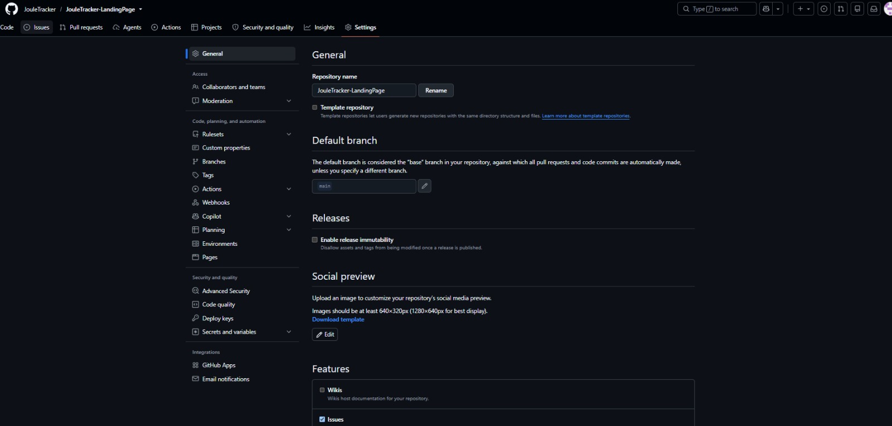

Revisamos que el repositorio esté en público:

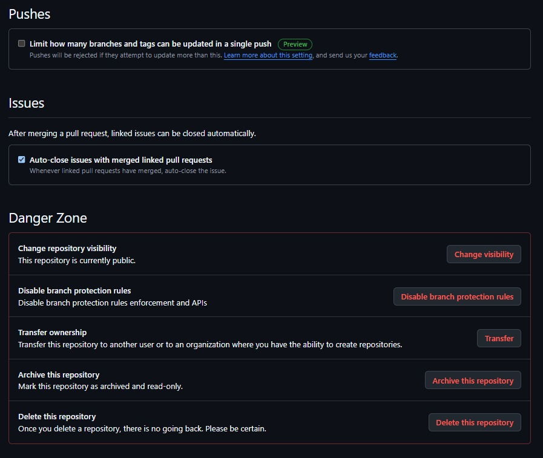


Nos dirigimos a la seccion de deploy, y selecionamos la rama main:

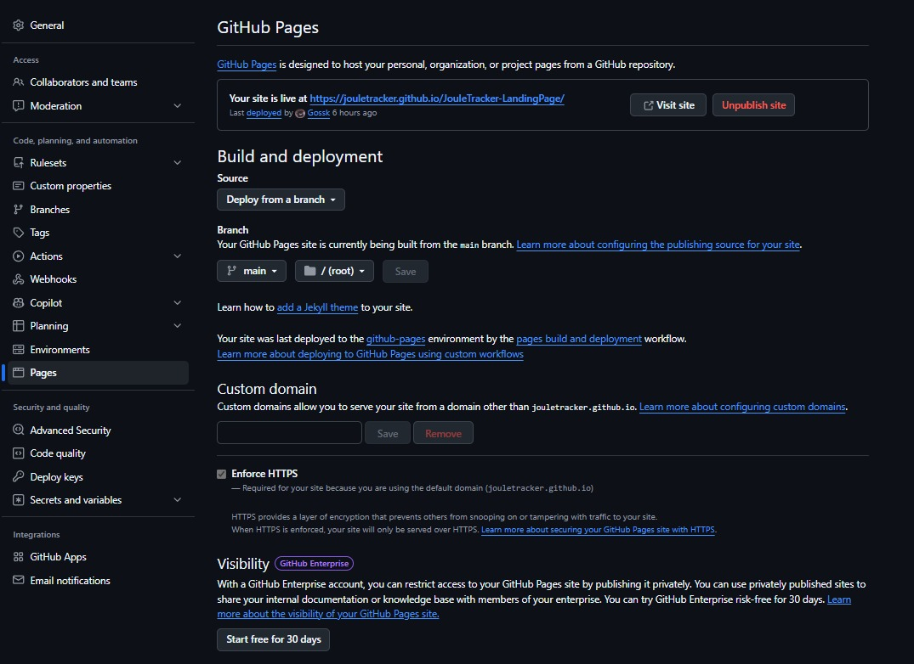


Luego de unos minutos, el deploy se realizara correctamente:

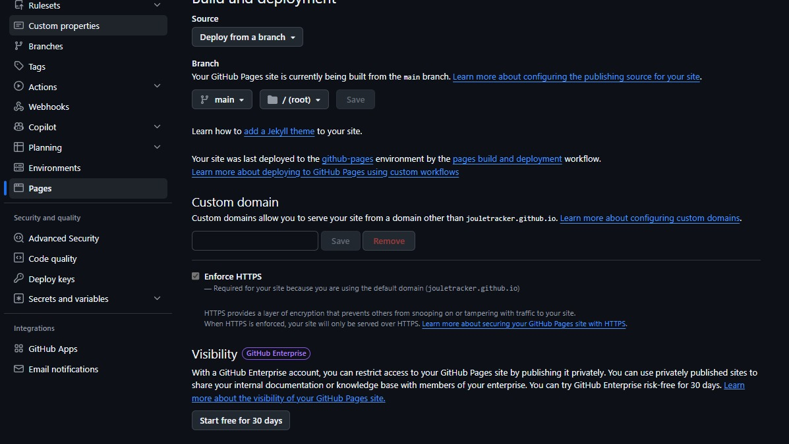

### 5.2.1.8. Team Collaboration Insights during Sprint.

Durante el Sprint 1, VoltLab mantuvo una participación activa en el desarrollo de JouleTracker, distribuyendo las responsabilidades entre los integrantes de acuerdo con las actividades asignadas.

Para evidenciar la colaboración del equipo se utilizaron las métricas proporcionadas por GitHub Insights, las cuales permiten visualizar la cantidad de commits realizados, la participación de los colaboradores y la evolución de las contribuciones dentro del repositorio.

Las siguientes capturas muestran la actividad registrada por los integrantes durante el desarrollo del proyecto.

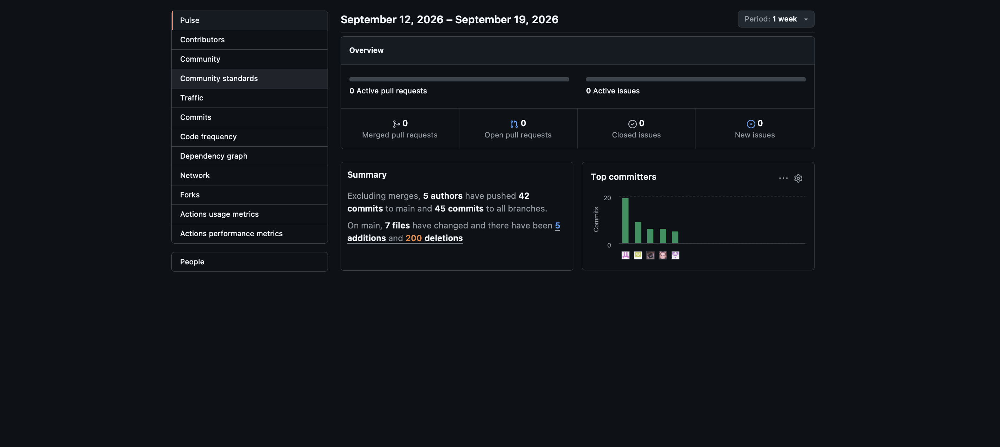

**Figura2:** Métricas generales de contribución del equipo obtenidas mediante GitHub Insights.


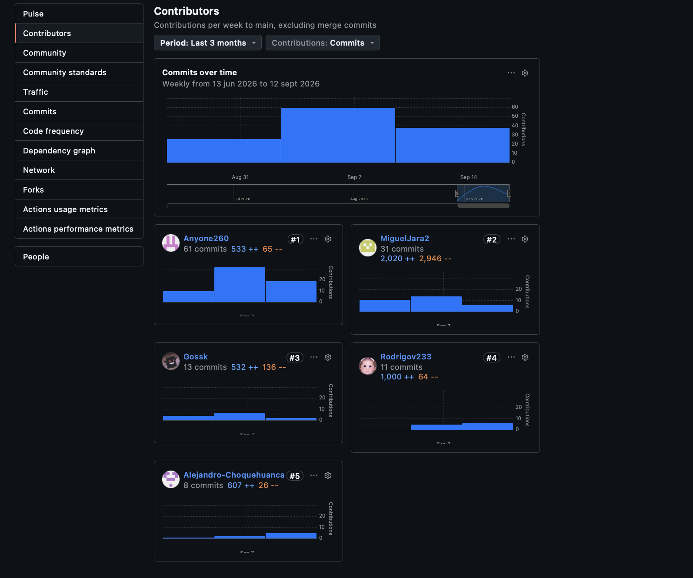

**Figura 2:** Detalle de la participación y commits realizados por los colaboradores del proyecto.

Estas métricas permiten evidenciar el trabajo colaborativo desarrollado durante el sprint y observar la participación de los diferentes integrantes en la evolución del proyecto JouleTracker.
## 5.3. Validation Interviews.
### 5.3.1. Diseño de Entrevistas.
### 5.3.2. Registro de Entrevistas.
### 5.3.3. Evaluaciones según heurísticas.
## 5.4. Video About-the-Product.


## Conclusiones y Recomendaciones.

# Conclusiones

El primer avance (AV1) del proyecto JouleTracker demuestra la consolidación exitosa de las bases estratégicas, arquitectónicas y metodológicas necesarias para la construcción de una plataforma SaaS IoT orientada a la eficiencia energética. A través de la aplicación del marco de trabajo Lean UX, se logró acotar el problema de negocio —la gestión reactiva de la facturación eléctrica— y se establecieron seis hipótesis de valor claramente alineadas con las necesidades de los dos segmentos objetivos: hogares urbanos y pequeñas empresas (MYPEs). Esta alineación garantiza que el desarrollo tecnológico esté justificado por un valor comercial y una necesidad real de los usuarios.

Desde la perspectiva arquitectónica y de diseño, el equipo VoltLab estructuró el sistema utilizando Domain-Driven Design (DDD), identificando seis Bounded Contexts que separan de manera cohesiva los subdominios principales (como Dashboard & Energy Analytics y Alerting & Optimization) de los dominios de soporte y genéricos. Esta abstracción fue plasmada eficazmente en los diagramas del modelo C4, trazando una hoja de ruta técnica clara que divide responsabilidades entre la Landing Page estática, la Single-Page Application (Angular) y la Backend API (Spring Boot/Java), lo cual previene el acoplamiento temprano del software.

A nivel de ejecución, el Sprint 1 culminó satisfactoriamente con la construcción y el despliegue de la Landing Page promocional. Al restringir el stack tecnológico a HTML5, CSS3 y JavaScript puro (Vanilla JS) y alojarlo en GitHub Pages, el equipo respetó el principio de separación de responsabilidades y las exigencias de la rúbrica para este hito. Además, la adopción formal de prácticas de gestión de configuración, como el uso del modelo de ramificación GitFlow y los Conventional Commits, evidencia madurez en el control de versiones y sienta un precedente de trabajo ordenado para la fase de programación concurrente que el equipo enfrentará en los próximos sprints.

# Recomendaciones

Para las siguientes iteraciones del proyecto, se recomienda priorizar la validación de la propuesta de valor mediante entrevistas formales utilizando la Landing Page ya desplegada. Recopilar métricas tempranas de interacción y retroalimentación directa de jefes de hogar y administradores de pequeños negocios permitirá al equipo ajustar el Product Backlog en Jira antes de invertir esfuerzo de desarrollo en los flujos más complejos de la aplicación web, mitigando el riesgo de construir funcionalidades que no resuelvan los dolores del usuario.

En el ámbito técnico, la transición hacia el Sprint 2 exigirá una coordinación rigurosa, ya que el equipo comenzará a codificar la Single-Page Application en Angular y los primeros controladores de la Backend API en Spring Boot. Se recomienda establecer contratos de API (mediante especificaciones como OpenAPI/Swagger) de manera anticipada. Esto permitirá que los desarrolladores del frontend puedan avanzar consumiendo datos simulados (mocks) mientras el equipo de backend finaliza la lógica de los servicios y la persistencia en la base de datos relacional, evitando cuellos de botella en la integración.

Finalmente, es fundamental mantener la rigurosidad en la documentación de la gestión de código fuente. A medida que el número de repositorios crezca (separando frontend y backend), el equipo debe velar por el cumplimiento estricto de GitFlow, evitando fusiones directas a la rama main sin la respectiva revisión de código (Pull Requests). Asimismo, se sugiere automatizar progresivamente el proceso de pruebas y despliegue (CI/CD) para los contenedores principales, lo que garantizará que JouleTracker mantenga un entorno de producción estable y demostrable en las futuras evaluaciones del curso.


